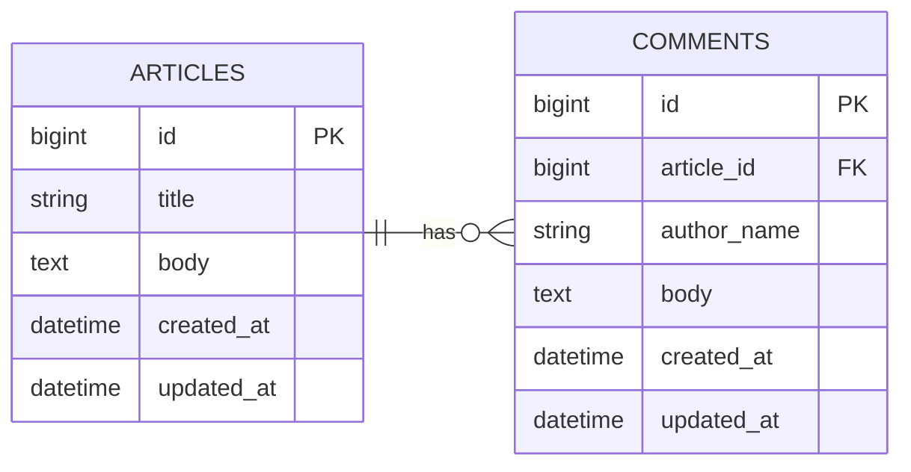

# 第2週：データベース設計（1）ER図の読み書き

## 今日のゴール

アプリで扱うデータを表に分け、ER図を見て「どのテーブルに何が入り、どうつながるか」を説明できるようになる。

---

## 前回のおさらい

前回は、scaffoldを使って `Article` のアプリを動かしました。

```bash
rails generate scaffold Article title:string body:text
```

このときRailsは、記事を保存するための `articles` テーブルを作っていました。

1つのテーブルだけでもアプリは動きます。ただし、アプリにコメント機能やカテゴリ機能を足そうとすると、1つのテーブルだけでは足りなくなります。

---

## なぜER図から始めるのか

画面やコードを書く前に、「何を保存するか」を決める必要があります。

たとえばブログアプリなら、最低でも次のようなことを考えます。

- 記事を保存したい
- コメントを保存したい
- どのコメントがどの記事についたものか知りたい

この部分が曖昧なままコードを書き始めると、後でテーブルもコードも崩れます。

だから今週は、コードを書く前に、データの設計を先に固めます。

---

## データベース設計の基本

データベースでは、データを表の形で管理します。

- `テーブル`：同じ種類のデータを入れる箱
- `カラム`：表の項目
- `レコード`：1件分のデータ

たとえば `articles` テーブルは、次のようなイメージです。

| id | title | body |
|---|---|---|
| 1 | はじめてのRails | scaffoldは便利 |
| 2 | MVCとは何か | Railsの基本構造 |

この表では：

- `articles` がテーブル名
- `id` `title` `body` がカラム
- 1行ごとが1件のレコード

---

## 主キー `id`

各レコードを区別するために、ふつうは `id` を使います。

`id` は、その行を特定するための番号です。同じテーブルの中で、同じ `id` は重複しません。

たとえば：

- `articles` テーブルの `id = 1` は「1番の記事」
- `articles` テーブルの `id = 2` は「2番の記事」

このように、1件を区別するための中心になるカラムを `主キー` と呼びます。

---

## 外部キー

別のテーブルとつなぐために使うのが `外部キー` です。

たとえば、コメント機能を考えます。

- 1つの記事に、複数のコメントがつく
- 各コメントは、どの記事についたかを覚えておく必要がある

このとき `comments` テーブルに `article_id` を持たせます。

| id | article_id | author_name | body |
|---|---|---|---|
| 1 | 1 | 田中 | わかりやすいです |
| 2 | 1 | 鈴木 | 続きも読みたいです |
| 3 | 2 | 佐藤 | MVCの説明が助かりました |

`article_id = 1` なら、「`articles` テーブルの `id = 1` の記事についたコメント」という意味です。

Railsでは、外部キーはふつう `関連先のテーブル名の単数形_id` の形で書きます。

- `article_id`
- `category_id`
- `user_id`

---

## ER図とは

ER図は、テーブル同士の関係を図で表したものです。

- どんなテーブルがあるか
- 各テーブルにどんなカラムがあるか
- テーブル同士がどうつながるか

を、一目でわかるようにします。

今日の題材である「記事とコメント」は、次のように表せます。



---

## このER図の読み方

この図から、次のことがわかります。

- `articles` と `comments` という2つのテーブルがある
- 1つの記事に、複数のコメントがつく
- 1つのコメントは、1つの記事に属する
- そのつながりを作るために、`comments` テーブルに `article_id` がある

大事なのは、`外部キーは「多い側」に置く` ことです。

今回なら：

- 記事は1件に対してコメントが複数つく
- だから `article_id` は `comments` 側に置く

---

## 今週から来週、再来週へ

今週は、ER図を読んで書くところまでやります。

- 今週：ER図で「何を保存するか」を整理する
- 来週：そのER図をもとに、マイグレーションを手で書く
- 再来週：モデルに `has_many` と `belongs_to` を書いてつなぐ

つまり、今週の設計が、そのまま次の2週間の土台になります。

ER図の書き方をもう少し別の説明でも見たい人は、次も参考になります。

- [若手プログラマー必読！５分で理解できるER図の書き方５ステップ](https://www.ntt.com/business/services/rink/knowledge/archive_58.html)

---

## まとめ

今日やったこと：

1. テーブル、カラム、レコードの役割を確認した
2. `id` が主キー、`article_id` が外部キーになることを知った
3. ER図でテーブル同士の関係を表せることを知った
4. 今週の設計が、来週のマイグレーションと再来週のアソシエーションにつながることを確認した

覚えておくこと：

- テーブルは「同じ種類のデータを入れる箱」
- 外部キーは、別のテーブルとつなぐためのカラム
- 1対多の関係では、外部キーは「多い側」に置く
