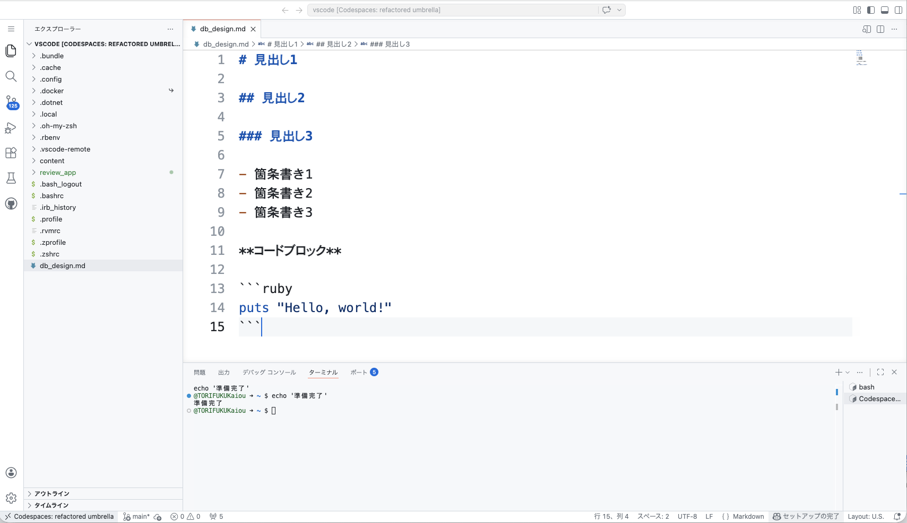
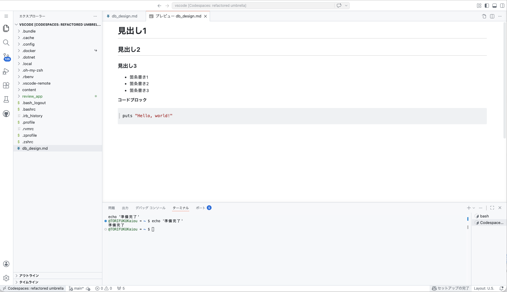
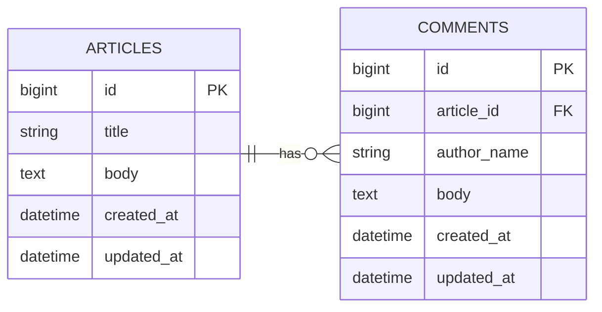
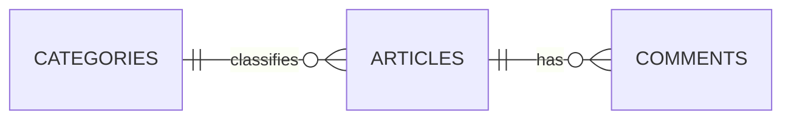
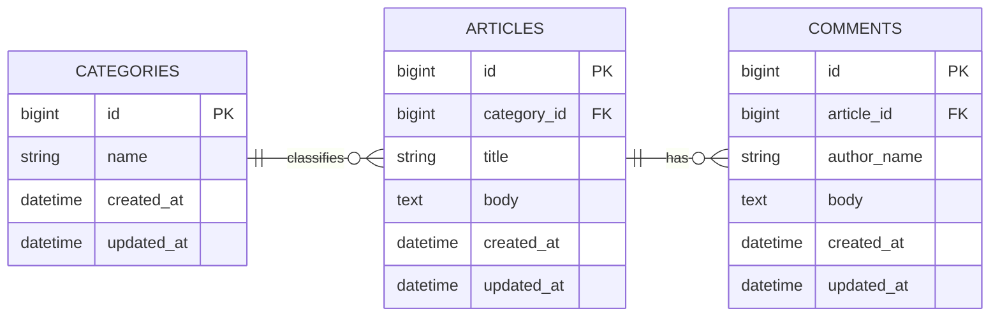

# 第2週：練習 ── ER図を読んで書く

## 今日のゴール

ER図を見てテーブルのつながりを読めるようになり、自分でも簡単なER図を書けるようになる。

---

## 準備

1. Codespacesを起動する
2. `db_design.md` というメモ用ファイルを作る
3. 紙やノートに図を書いてもよい。大事なのは、手を動かして整理すること

参考資料:

- [若手プログラマー必読！５分で理解できるER図の書き方５ステップ](https://www.ntt.com/business/services/rink/knowledge/archive_58.html)

---

## Markdown について

`db_design.md` はMarkdownで書きますが、最初に書き方を全部覚える必要はありません。使いながら慣れていけば十分です。

迷ったときは、必要なところだけこのチートシートを見てください。

- [Markdown記法 チートシート](https://qiita.com/Qiita/items/c686397e4a0f4f11683d)

今日は特に、次の3つが使えれば十分です。

- 見出し：`#` `##`
- 箇条書き：`-`
- コードブロック：````` ``` `````

編集画面:



Markdownを編集中に `Alt + Shift + V` を押すと、プレビューを表示できます。

プレビュー画面:



---

## 今日の目標（達成ライン）

- `必須（全員）`：1〜4 を終える（テーブルを読む、外部キーを考える、ER図を読む、ER図を書く）
- `推奨（余裕がある人）`：5 まで進む（自分の言葉で説明する）
- `発展（早く終わった人）`：[Stretch](stretch.md) に進む

orientation とこの練習は、全員が終える前提です。まずは `必須` を確実に終えましょう。

---

## 0. 参考資料を読む（5分）

練習に入る前に、以下の記事を5分間読んでください。ER図の全体像がつかめます。

- [若手プログラマー必読！５分で理解できるER図の書き方５ステップ](https://www.ntt.com/business/services/rink/knowledge/archive_58.html)

全部を覚える必要はありません。「ER図にはこういう要素があるんだな」という感覚をつかんでから、次の練習に進んでください。

ER図の記法にはIE記法やIDEF1X記法などがありますが、この授業ではIE記法（Information Engineering記法）を使います。Mermaidで書けるのもIE記法です。記事の中のIE記法の部分はよく読んでおいてください。練習中に迷ったら読み返してください。

---

## 1. `articles` テーブルを読み取る（15分）

先週の<ruby>scaffold<rt>スキャフォールド</rt></ruby>で、Railsは次のような `articles` テーブルを作っていました。

| カラム名 | 何が入るか |
|---|---|
| `id` | ？ |
| `title` | ？ |
| `body` | ？ |
| `created_at` | ？ |
| `updated_at` | ？ |

### やってみよう

以下を `db_design.md` にコピーして、`？` を自分の言葉で書き換えてみましょう。これがMarkdownでの表の書き方です。

```markdown
| カラム名 | 何が入るか |
|---|---|
| `id` | ？ |
| `title` | ？ |
| `body` | ？ |
| `created_at` | ？ |
| `updated_at` | ？ |
```

<details>
<summary>解答例</summary>

| カラム名 | 何が入るか |
|---|---|
| `id` | 記事を区別する番号 |
| `title` | 記事のタイトル |
| `body` | 記事の本文 |
| `created_at` | 作成日時 |
| `updated_at` | 更新日時 |

</details>

---

## 2. コメント機能に必要なテーブルを考える（25分）

次の要件を考えてください。

- 1つの記事に複数のコメントをつけられる
- 各コメントには、名前と本文がある
- どのコメントがどの記事についたか、あとからわかる必要がある

### やってみよう

次の3つを書いてみましょう。

1. 新しく必要なテーブル名
2. そのテーブルに必要なカラム
3. 記事とのつながりを作るために必要なカラム

ヒント：記事とコメントをつなぐには、`id` だけでは足りません。

<details>
<summary>解答例</summary>

新しく必要なテーブル名：`comments`

必要なカラム：

- `id`
- `article_id`
- `author_name`
- `body`
- `created_at`
- `updated_at`

記事とのつながりを作るカラム：`article_id`

</details>

---

## 3. ER図を読んで答える（20分）

次のER図を見て、質問に答えてください。



### 質問

1. テーブルはいくつあるか
2. コメントの本文は、どのテーブルのどのカラムに入るか
3. `article_id` は何のためにあるか
4. 1つの記事にコメントは何件つけられるか

<details>
<summary>解答例</summary>

1. 2つ（`articles` と `comments`）
2. `comments` テーブルの `body`
3. コメントがどの記事についたものかを表すため
4. 複数件つけられる

</details>

---

## 4. カテゴリを追加したER図を書く（40分）

今度は、記事にカテゴリをつけられるようにします。

### 要件

- 1つの記事は、1つのカテゴリに属する
- 1つのカテゴリには、複数の記事が属する
- カテゴリは `name` を持つ
- コメント機能はそのまま残す

### やってみよう

`db_design.md` または紙に、次の内容を含むER図を書いてみましょう。

- `categories` テーブル
- `articles` テーブル
- `comments` テーブル
- テーブル同士のつながり
- どこに外部キーが入るか

Mermaidで書くなら、次の形から始めると楽です。Mermaid対応の画面では図として表示されます。コードをそのまま見たいときは、その下の「コード版」を見てください。



コード版：

```text
erDiagram
    direction LR
    CATEGORIES ||--o{ ARTICLES : classifies
    ARTICLES ||--o{ COMMENTS : has
```

<details>
<summary>解答例</summary>

図として見る場合：



コードとして見る場合：

```text
erDiagram
    direction LR
    CATEGORIES ||--o{ ARTICLES : classifies
    ARTICLES ||--o{ COMMENTS : has

    CATEGORIES {
        bigint id PK
        string name
        datetime created_at
        datetime updated_at
    }

    ARTICLES {
        bigint id PK
        bigint category_id FK
        string title
        text body
        datetime created_at
        datetime updated_at
    }

    COMMENTS {
        bigint id PK
        bigint article_id FK
        string author_name
        text body
        datetime created_at
        datetime updated_at
    }
```

ポイント：

- `articles` は `categories` に属するので、`articles` 側に `category_id` を置く
- `comments` は `articles` に属するので、`comments` 側に `article_id` を置く

</details>

---

## 5. 自分の言葉で説明する（20分）

最後に、自分が書いたER図について次の2つを説明してみましょう。

1. なぜ `category_id` は `articles` テーブルにあるのか
2. なぜ `article_id` は `comments` テーブルにあるのか

隣の人に説明してもよいし、`db_design.md` に文章で書いても構いません。

説明するときのキーワード：

- 1対多
- 多い側
- どのデータがどこに属するか

<details>
<summary>説明例</summary>

`articles` と `categories` は、1つのカテゴリに複数の記事が入る関係です。だから外部キーの `category_id` は、複数ある側の `articles` テーブルに置きます。

`comments` と `articles` も、1つの記事に複数のコメントがつく関係です。だから外部キーの `article_id` は、複数ある側の `comments` テーブルに置きます。

</details>

---

## まとめ

今日やったこと：

1. テーブルのカラムが何を表すかを読んだ
2. コメント機能に必要なテーブルを考えた
3. ER図から、どのテーブルがどうつながるかを読んだ
4. カテゴリを追加したER図を書いた

来週は、このER図をもとにマイグレーションを手で書きます。
