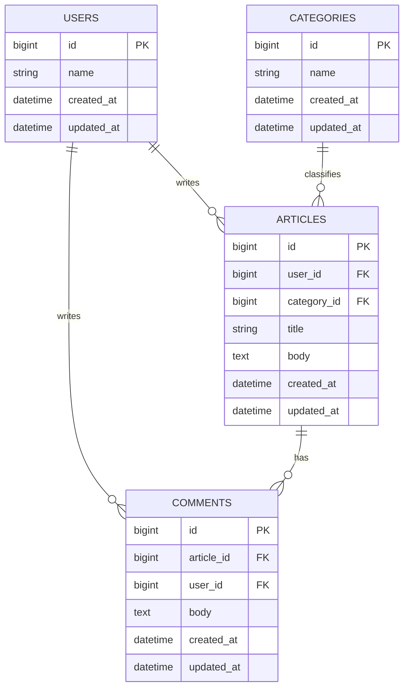
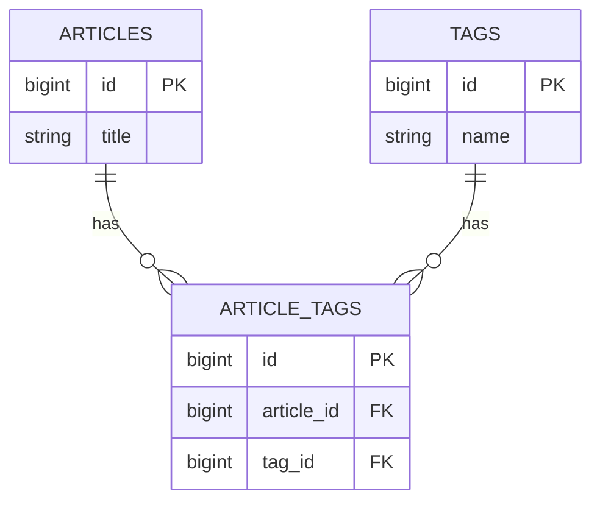

# 第2週：Stretch ── ER図を深くする

## 今日のゴール

基本のER図にテーブルや関係を追加し、少し複雑な設計も整理できるようになる。

---

## この課題について

この課題は、[練習](practice.md) を終えた人向けの発展課題です。時間内にすべて終わらなくても構いません。できるところまで進めてください。

> 🌾 `Teams投稿`  
> `19:30` になったら、その時点でどこまで進んだかを Teams に書いてください。

---

## 今日の目標（達成ライン）

- `推奨`：課題1〜2 に取り組む
- `発展`：課題3 まで進む
- `さらに余裕がある人`：課題4 まで進む

---

## 課題1：投稿者をテーブルに分ける

ここまでの練習では、コメントを書いた人の名前を `author_name` という文字列で保存していました。

今度は、投稿者を `users` テーブルとして独立させます。

### 要件

- ユーザーは複数の記事を書ける
- ユーザーは複数のコメントを書ける
- 記事は1人のユーザーが書く
- コメントも1人のユーザーが書く

### やってみよう

`users` テーブルを追加したER図を書いてください。

考えること：

- `users` テーブルに必要なカラムは何か
- `user_id` はどこに入るか
- いままでの `author_name` はどうするか

解答例

`author_name` は不要になります。名前を持つのは `users` テーブルだからです。

---

## 課題2：悪い設計を分割する

次のような1枚の表で記事とコメントを保存しようとすると、問題が出ます。

| article_title | article_body | comment_body | comment_author |
|---|---|---|---|
| Rails入門 | scaffoldは便利 | わかりやすい | 田中 |
| Rails入門 | scaffoldは便利 | 続きも読みたい | 鈴木 |

### やってみよう

この設計の問題を考えてください。

考える観点：

1. 同じデータが繰り返し入っていないか
2. 記事だけを保存したいときに困らないか
3. コメントが増えたときに扱いやすいか

そのうえで、どのテーブルに分けるべきか書いてみましょう。

解答例

問題点：

- `article_title` と `article_body` がコメントの数だけ重複する
- コメントがまだない記事を保存しにくい
- コメントが増えるほど同じ記事データを何度も持つことになる

分けるべきテーブル：

- `articles`
- `comments`

コメント側に `article_id` を置いてつなぐのがよい設計です。

---

## 課題3：タグ機能を考える

さらに発展です。記事にタグをつけられるようにします。

### 要件

- 1つの記事に複数のタグをつけられる
- 1つのタグは複数の記事で使える
- 例：`Rails` `DB設計` `入門`

### やってみよう

この関係をそのまま `articles` や `tags` だけで表せるか考えてみましょう。必要なら、新しいテーブルを追加してください。

解答例

記事とタグは、多対多の関係です。

- 1つの記事に複数タグ
- 1つのタグが複数記事に付く

そのため、つなぐための中間テーブルが必要です。

---

## 課題4：次週のマイグレーションを先取りする

第3週では、ER図をもとにマイグレーションを書きます。

次の2つに答えてください。

1. `categories` テーブルを作るなら、どんなカラムが必要か
2. `articles` テーブルに `category_id` を足すなら、どんなマイグレーションが必要になりそうか

コードを正確に書けなくても構いません。「何を追加する作業になるか」を言葉で説明できればOKです。

解答例

1. `categories` テーブルには、少なくとも `id` `name` `created_at` `updated_at` が必要
2. `articles` テーブルには、カテゴリとつなぐための `category_id` を追加するマイグレーションが必要

つまり、ER図で決めた内容が、そのまま次週のマイグレーションの材料になります。

