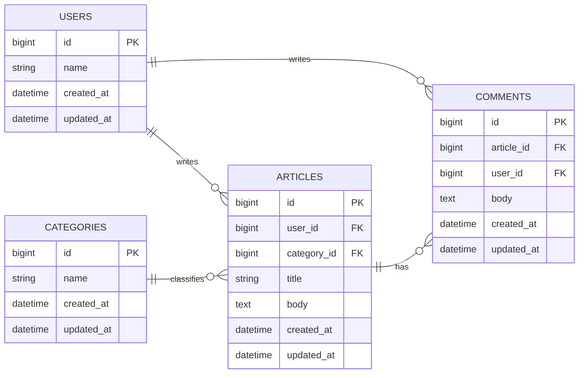
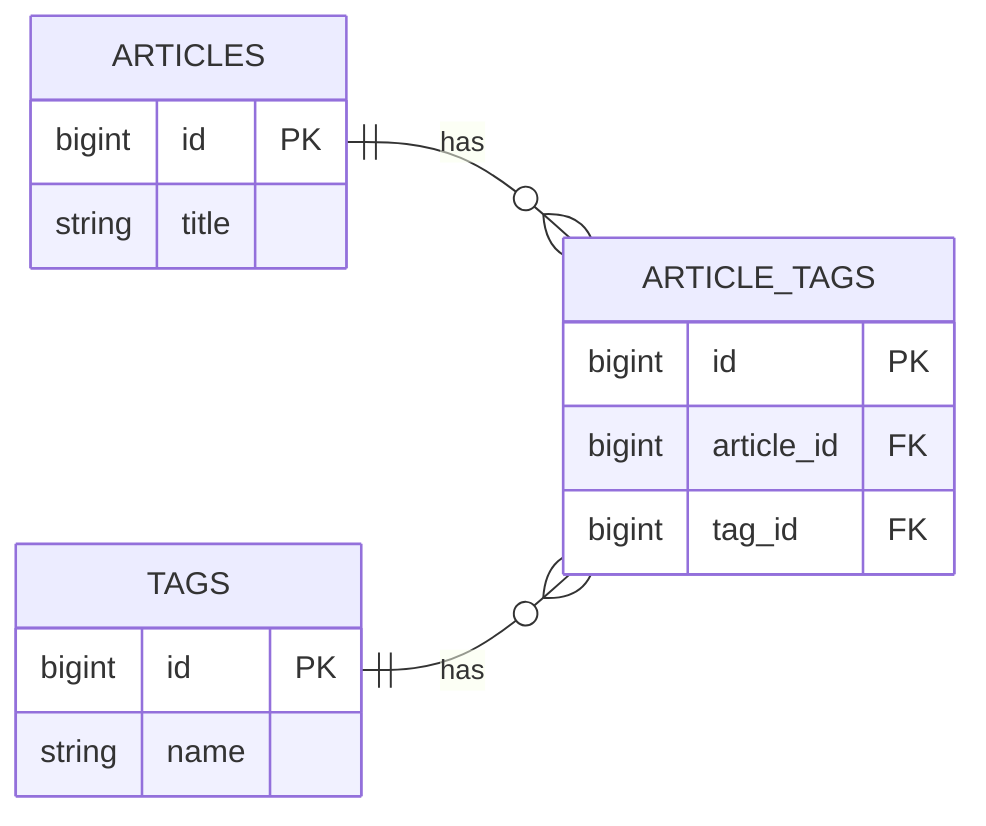
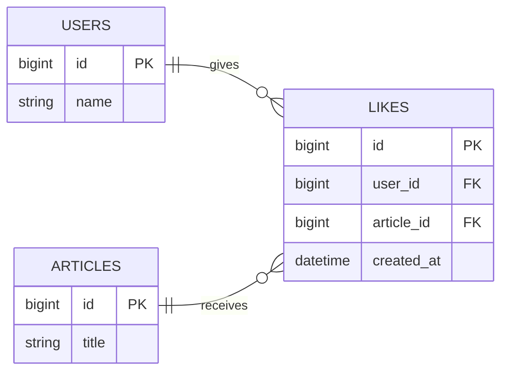
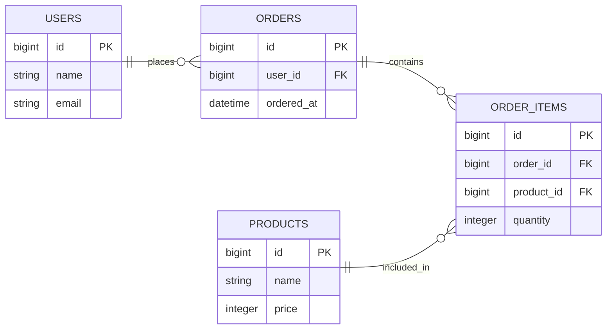
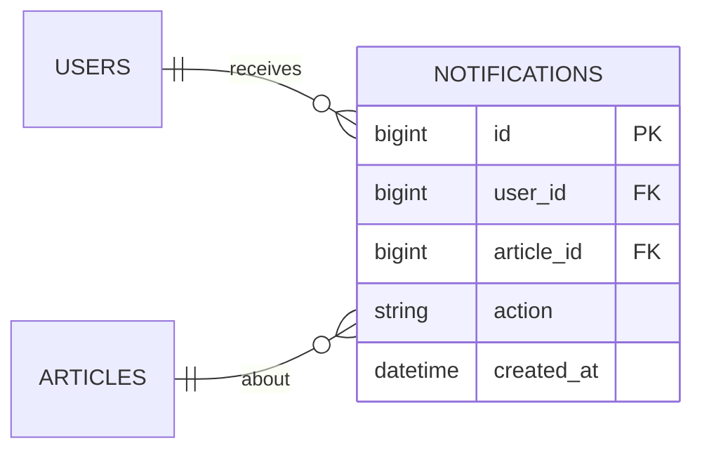
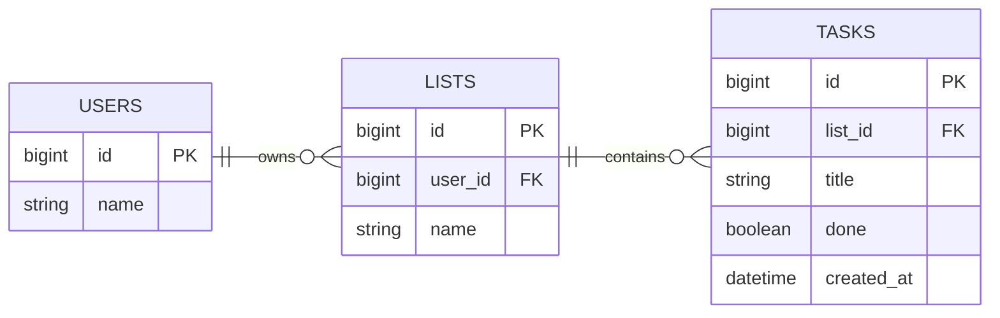
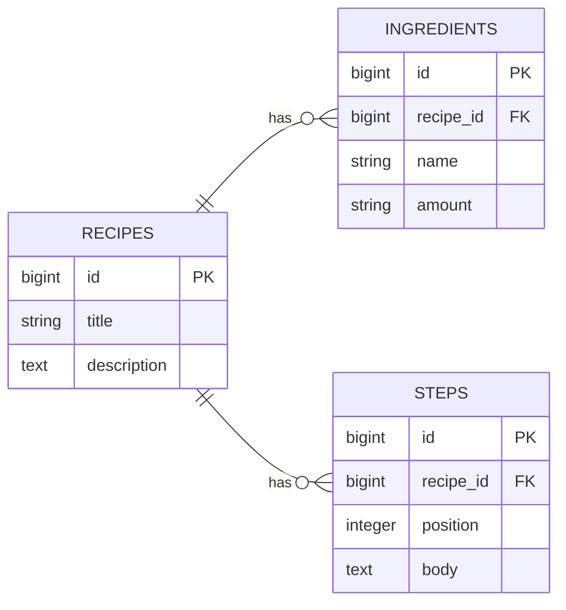
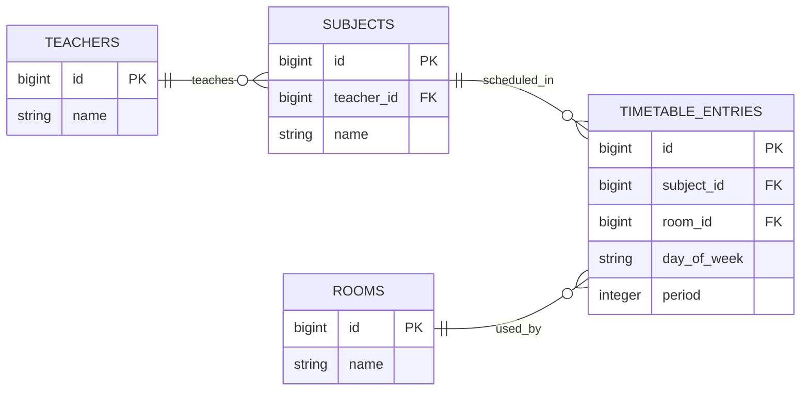

# 第2週：Stretch ── ER図を深くする

## 今日のゴール

基本のER図にテーブルや関係を追加し、少し複雑な設計も整理できるようになる。

---

## この課題について

この課題は、[練習](practice.md) を終えた人向けの発展課題です。時間内にすべて終わらなくても構いません。できるところまで進めてください。

> 🌾 `Teams投稿`  
> `19:30` になったら、その時点でどこまで進んだかを Teams に書いてください。

---

## 今日の目標（達成ライン）

- `推奨`：課題1〜2 に取り組む
- `発展`：課題3〜4 まで進む
- `さらに余裕がある人`：課題5〜10 に進む

---

## 課題1：投稿者をテーブルに分ける

ここまでの練習では、コメントを書いた人の名前を `author_name` という文字列で保存していました。

今度は、投稿者を `users` テーブルとして独立させます。

### 要件

- ユーザーは複数の記事を書ける
- ユーザーは複数のコメントを書ける
- 記事は1人のユーザーが書く
- コメントも1人のユーザーが書く

### やってみよう

`users` テーブルを追加したER図を書いてください。

考えること：

- `users` テーブルに必要なカラムは何か
- `user_id` はどこに入るか
- いままでの `author_name` はどうするか

<details>
<summary>解答例</summary>



`author_name` は不要になります。名前を持つのは `users` テーブルだからです。

コードとして見る場合：

```text
erDiagram
    direction LR
    USERS ||--o{ ARTICLES : writes
    USERS ||--o{ COMMENTS : writes
    CATEGORIES ||--o{ ARTICLES : classifies
    ARTICLES ||--o{ COMMENTS : has

    USERS {
        bigint id PK
        string name
        datetime created_at
        datetime updated_at
    }

    CATEGORIES {
        bigint id PK
        string name
        datetime created_at
        datetime updated_at
    }

    ARTICLES {
        bigint id PK
        bigint user_id FK
        bigint category_id FK
        string title
        text body
        datetime created_at
        datetime updated_at
    }

    COMMENTS {
        bigint id PK
        bigint article_id FK
        bigint user_id FK
        text body
        datetime created_at
        datetime updated_at
    }
```

</details>

---

## 課題2：悪い設計を分割する

次のような1枚の表で記事とコメントを保存しようとすると、問題が出ます。

| article_title | article_body | comment_body | comment_author |
|---|---|---|---|
| Rails入門 | scaffoldは便利 | わかりやすい | 田中 |
| Rails入門 | scaffoldは便利 | 続きも読みたい | 鈴木 |

### やってみよう

この設計の問題を考えてください。

考える観点：

1. 同じデータが繰り返し入っていないか
2. 記事だけを保存したいときに困らないか
3. コメントが増えたときに扱いやすいか

そのうえで、どのテーブルに分けるべきか書いてみましょう。

<details>
<summary>解答例</summary>

問題点：

- `article_title` と `article_body` がコメントの数だけ重複する
- コメントがまだない記事を保存しにくい
- コメントが増えるほど同じ記事データを何度も持つことになる

分けるべきテーブル：

- `articles`
- `comments`

コメント側に `article_id` を置いてつなぐのがよい設計です。

</details>

---

## 課題3：タグ機能を考える

さらに発展です。記事にタグをつけられるようにします。

### 要件

- 1つの記事に複数のタグをつけられる
- 1つのタグは複数の記事で使える
- 例：`Rails` `DB設計` `入門`

### やってみよう

この関係をそのまま `articles` や `tags` だけで表せるか考えてみましょう。必要なら、新しいテーブルを追加してください。

<details>
<summary>解答例</summary>

記事とタグは、多対多の関係です。

- 1つの記事に複数タグ
- 1つのタグが複数記事に付く

そのため、つなぐための中間テーブルが必要です。



コードとして見る場合：

```text
erDiagram
    direction LR
    ARTICLES ||--o{ ARTICLE_TAGS : has
    TAGS ||--o{ ARTICLE_TAGS : has

    ARTICLES {
        bigint id PK
        string title
    }

    TAGS {
        bigint id PK
        string name
    }

    ARTICLE_TAGS {
        bigint id PK
        bigint article_id FK
        bigint tag_id FK
    }
```

</details>

---

## 課題4：次週のマイグレーションを先取りする

第3週では、ER図をもとにマイグレーションを書きます。

次の2つに答えてください。

1. `categories` テーブルを作るなら、どんなカラムが必要か
2. `articles` テーブルに `category_id` を足すなら、どんなマイグレーションが必要になりそうか

コードを正確に書けなくても構いません。「何を追加する作業になるか」を言葉で説明できればOKです。

<details>
<summary>解答例</summary>

1. `categories` テーブルには、少なくとも `id` `name` `created_at` `updated_at` が必要
2. `articles` テーブルには、カテゴリとつなぐための `category_id` を追加するマイグレーションが必要

つまり、ER図で決めた内容が、そのまま次週のマイグレーションの材料になります。

</details>

---

## 課題5：「いいね」機能を設計する

ユーザーが記事に「いいね」できるようにします。

### 要件

- 1人のユーザーは複数の記事にいいねできる
- 1つの記事は複数のユーザーからいいねされる
- 同じユーザーが同じ記事に2回いいねはできない

### やってみよう

この関係を表すER図を書いてください。課題3のタグ機能と似た構造になるはずです。

<details>
<summary>解答例</summary>



ユーザーと記事は多対多の関係です。中間テーブル `likes` でつなぎます。

コードとして見る場合：

```text
erDiagram
    direction LR
    USERS ||--o{ LIKES : gives
    ARTICLES ||--o{ LIKES : receives

    USERS {
        bigint id PK
        string name
    }

    ARTICLES {
        bigint id PK
        string title
    }

    LIKES {
        bigint id PK
        bigint user_id FK
        bigint article_id FK
        datetime created_at
    }
```

</details>

---

## 課題6：カラムの型を考える

ER図にはカラムの型も書きます。Railsでよく使う型を確認しましょう。

| 型 | 意味 | 例 |
|---|---|---|
| `string` | 短い文字列 | 名前、タイトル |
| `text` | 長い文字列 | 本文、説明 |
| `integer` | 整数 | 数量、年齢 |
| `boolean` | 真偽値 | 公開/非公開 |
| `datetime` | 日時 | 作成日時 |

### やってみよう

次のカラムに、どの型が適切か考えて書いてください。

```markdown
| カラム | 型 |
|---|---|
| 記事のタイトル | ？ |
| 記事の本文 | ？ |
| ユーザーの年齢 | ？ |
| 記事が公開済みかどうか | ？ |
| コメントの投稿日時 | ？ |
```

<details>
<summary>解答例</summary>

| カラム | 型 |
|---|---|
| 記事のタイトル | `string` |
| 記事の本文 | `text` |
| ユーザーの年齢 | `integer` |
| 記事が公開済みかどうか | `boolean` |
| コメントの投稿日時 | `datetime` |

</details>

---

## 課題7：ER図を読んで要件を逆算する

次のER図を見て、「このアプリは何ができるか」を説明してください。



### やってみよう

次の質問に答えてください。

1. テーブルはいくつあるか
2. このアプリは何をするためのものか
3. `ORDER_ITEMS` はなぜ必要か
4. 1回の注文で複数の商品を買えるか

<details>
<summary>解答例</summary>

1. 4つ（`USERS`、`ORDERS`、`PRODUCTS`、`ORDER_ITEMS`）
2. ユーザーが商品を注文するECサイトのようなアプリ
3. 1回の注文に複数の商品が入る可能性があるため。注文と商品は多対多の関係で、`ORDER_ITEMS` が中間テーブル
4. 買える。`ORDER_ITEMS` に複数行入れればよい

</details>

---

## 課題8：下書き機能を設計する

記事に「公開」と「下書き」の状態を持たせたいとします。

### やってみよう

1. `articles` テーブルにどんなカラムを追加すればよいか
2. そのカラムの型は何か
3. 公開済みの記事だけを取り出すには、どんな条件で絞ればよいか

<details>
<summary>解答例</summary>

1. `published` カラムを追加する
2. 型は `boolean`
3. `published` が `true` の記事だけを取り出す

新しいテーブルは不要です。既存のテーブルにカラムを1つ足すだけで実現できます。

</details>

---

## 課題9：通知機能を設計する

ユーザーに通知を送る機能を考えます。

### 要件

- 「田中さんがあなたの記事にコメントしました」のような通知
- 通知には「誰が」「どの記事に」「何をしたか」の情報が必要
- 1人のユーザーに複数の通知が届く

### やってみよう

`notifications` テーブルを設計してください。どんなカラムが必要か、外部キーはいくつ必要かを考えてください。

<details>
<summary>解答例</summary>



- `user_id`：通知を受け取るユーザー
- `article_id`：対象の記事
- `action`：何が起きたか（例：`"commented"`）

外部キーが2つあるテーブルです。

コードとして見る場合：

```text
erDiagram
    direction LR
    USERS ||--o{ NOTIFICATIONS : receives
    ARTICLES ||--o{ NOTIFICATIONS : about

    NOTIFICATIONS {
        bigint id PK
        bigint user_id FK
        bigint article_id FK
        string action
        datetime created_at
    }
```

</details>

---

## 課題10：自由設計

好きなアプリを1つ選んで、そのER図を書いてみましょう。

アイデア例：

- TODOアプリ（ユーザー、リスト、タスク）
- レシピアプリ（レシピ、材料、手順）
- 時間割アプリ（曜日、時限、科目、教室）

正解はありません。「何を保存するか」「テーブル同士がどうつながるか」を自分で考えることが目的です。

<details>
<summary>解答例：TODOアプリ</summary>



コードとして見る場合：

```text
erDiagram
    direction LR
    USERS ||--o{ LISTS : owns
    LISTS ||--o{ TASKS : contains

    USERS {
        bigint id PK
        string name
    }

    LISTS {
        bigint id PK
        bigint user_id FK
        string name
    }

    TASKS {
        bigint id PK
        bigint list_id FK
        string title
        boolean done
        datetime created_at
    }
```

</details>

<details>
<summary>解答例：レシピアプリ</summary>



コードとして見る場合：

```text
erDiagram
    direction LR
    RECIPES ||--o{ INGREDIENTS : has
    RECIPES ||--o{ STEPS : has

    RECIPES {
        bigint id PK
        string title
        text description
    }

    INGREDIENTS {
        bigint id PK
        bigint recipe_id FK
        string name
        string amount
    }

    STEPS {
        bigint id PK
        bigint recipe_id FK
        integer position
        text body
    }
```

</details>

<details>
<summary>解答例：時間割アプリ</summary>



コードとして見る場合：

```text
erDiagram
    direction LR
    SUBJECTS ||--o{ TIMETABLE_ENTRIES : scheduled_in
    TEACHERS ||--o{ SUBJECTS : teaches
    ROOMS ||--o{ TIMETABLE_ENTRIES : used_by

    TEACHERS {
        bigint id PK
        string name
    }

    SUBJECTS {
        bigint id PK
        bigint teacher_id FK
        string name
    }

    ROOMS {
        bigint id PK
        string name
    }

    TIMETABLE_ENTRIES {
        bigint id PK
        bigint subject_id FK
        bigint room_id FK
        string day_of_week
        integer period
    }
```

</details>