# 第2週：Stretch ── ER図を深くする

## 今日のゴール

基本のER図にテーブルや関係を追加し、少し複雑な設計も整理できるようになる。後半では、設計をもとに Rails コマンドでテーブルを実際に作る。

---

## この課題について

この課題は、[練習](practice.md) を終えた人向けの発展課題です。時間内にすべて終わらなくても構いません。できるところまで進めてください。

- `まずは`：1〜10
- `余裕があれば`：11〜20
- `さらに余裕があれば`：21〜30
- `もっと先へ`：31〜

やればやるほど力がつきます。できるところまで進めましょう。

---

## 1〜10：ER図の読み書き基礎

### 問題1：テーブル名を答える

次のER図にはテーブルがいくつありますか？ テーブル名をすべて書いてください。


```mermaid
erDiagram
    direction LR
    ARTICLES ||--o{ COMMENTS : has
```

<details>
<summary>解答例</summary>

2つ。`ARTICLES` と `COMMENTS`。

</details>

---

### 問題2：外部キーを答える

次のER図で、外部キーはどのテーブルのどのカラムですか？

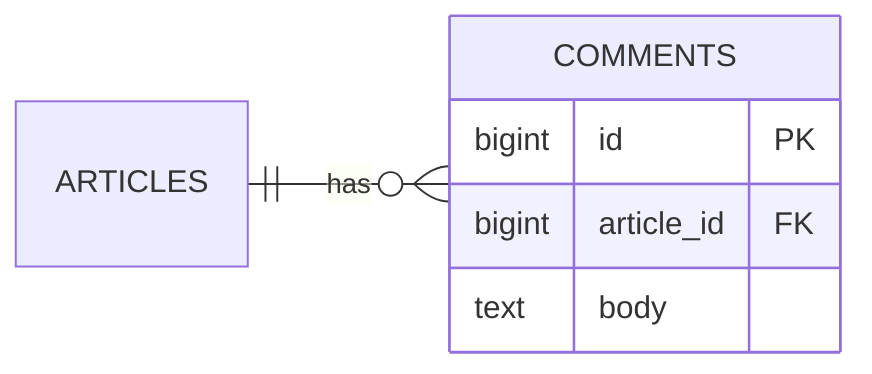
```mermaid
erDiagram
    direction LR
    ARTICLES ||--o{ COMMENTS : has

    COMMENTS {
        bigint id PK
        bigint article_id FK
        text body
    }
```

<details>
<summary>解答例</summary>

`COMMENTS` テーブルの `article_id`。

</details>

---

### 問題3：関係を日本語で書く

次のER図の関係を、日本語で説明してください。


```mermaid
erDiagram
    direction LR
    ARTICLES ||--o{ COMMENTS : has
```

特に、左から右へ読んだときの意味を書いてください。

<details>
<summary>解答例</summary>

1つの記事に、0個以上のコメントがつく。

</details>

---

### 問題4：逆方向から読む

問題3の関係を、コメント側から読むとどうなりますか？

<details>
<summary>解答例</summary>

1つのコメントは、必ず1つの記事に属する。

</details>

---

### 問題5：外部キーの位置を答える

記事（articles）とカテゴリ（categories）の関係で、1つのカテゴリに複数の記事が属するとします。外部キーはどちらのテーブルに置きますか？ 理由も書いてください。

<details>
<summary>解答例</summary>

`articles` テーブルに `category_id` を置く。

理由：1つのカテゴリに複数の記事が属するので、多い側の `articles` に置く。

</details>

---

### 問題6：ER図を書く（2テーブル）

問題5の関係を、Mermaid の ER図で書いてください。カラムは省略して構いません。

<details>
<summary>解答例</summary>

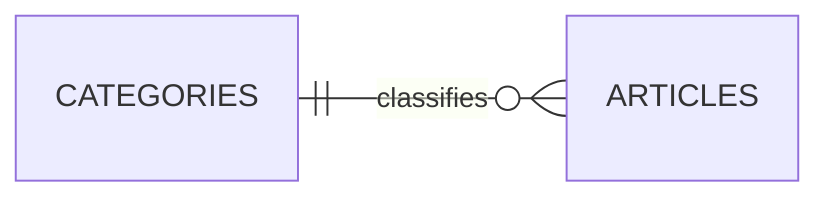
```mermaid
erDiagram
    direction LR
    CATEGORIES ||--o{ ARTICLES : classifies
```

コード：

~~~

```mermaid
erDiagram
    direction LR
    CATEGORIES ||--o{ ARTICLES : classifies
```
~~~

</details>

---

### 問題7：カラムを追加する

問題6の ER図に、`CATEGORIES` テーブルのカラム（`id`, `name`, `created_at`, `updated_at`）を追加してください。

<details>
<summary>解答例</summary>

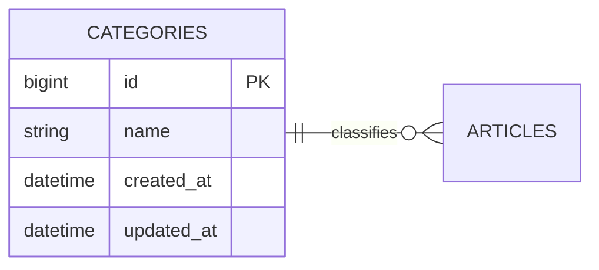
```mermaid
erDiagram
    direction LR
    CATEGORIES ||--o{ ARTICLES : classifies

    CATEGORIES {
        bigint id PK
        string name
        datetime created_at
        datetime updated_at
    }
```

コード：

~~~

```mermaid
erDiagram
    direction LR
    CATEGORIES ||--o{ ARTICLES : classifies

    CATEGORIES {
        bigint id PK
        string name
        datetime created_at
        datetime updated_at
    }
```
~~~

</details>

---

### 問題8：ARTICLES にもカラムを追加する

問題7に続けて、`ARTICLES` テーブルのカラム（`id`, `category_id`, `title`, `body`, `created_at`, `updated_at`）も追加してください。

<details>
<summary>解答例</summary>

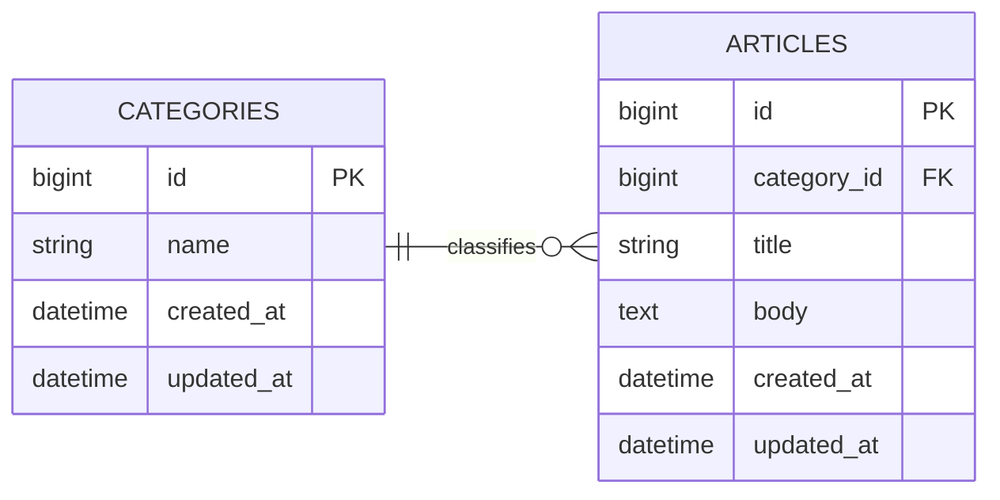
```mermaid
erDiagram
    direction LR
    CATEGORIES ||--o{ ARTICLES : classifies

    CATEGORIES {
        bigint id PK
        string name
        datetime created_at
        datetime updated_at
    }

    ARTICLES {
        bigint id PK
        bigint category_id FK
        string title
        text body
        datetime created_at
        datetime updated_at
    }
```

コード：

~~~

```mermaid
erDiagram
    direction LR
    CATEGORIES ||--o{ ARTICLES : classifies

    CATEGORIES {
        bigint id PK
        string name
        datetime created_at
        datetime updated_at
    }

    ARTICLES {
        bigint id PK
        bigint category_id FK
        string title
        text body
        datetime created_at
        datetime updated_at
    }
```
~~~

</details>

---

### 問題9：3テーブルのER図を書く

categories、articles、comments の3テーブルの ER図を書いてください。カラムも含めてください。

<details>
<summary>解答例</summary>

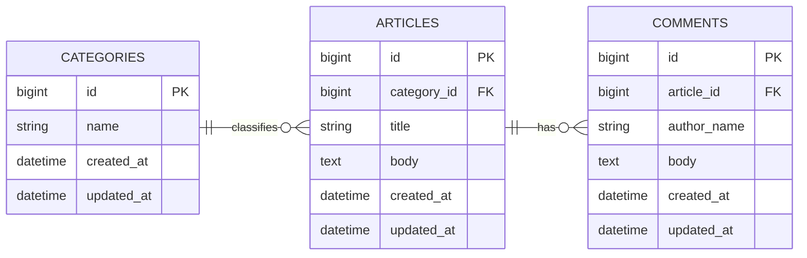
```mermaid
erDiagram
    direction LR
    CATEGORIES ||--o{ ARTICLES : classifies
    ARTICLES ||--o{ COMMENTS : has

    CATEGORIES {
        bigint id PK
        string name
        datetime created_at
        datetime updated_at
    }

    ARTICLES {
        bigint id PK
        bigint category_id FK
        string title
        text body
        datetime created_at
        datetime updated_at
    }

    COMMENTS {
        bigint id PK
        bigint article_id FK
        string author_name
        text body
        datetime created_at
        datetime updated_at
    }
```

コード：

~~~

```mermaid
erDiagram
    direction LR
    CATEGORIES ||--o{ ARTICLES : classifies
    ARTICLES ||--o{ COMMENTS : has

    CATEGORIES {
        bigint id PK
        string name
        datetime created_at
        datetime updated_at
    }

    ARTICLES {
        bigint id PK
        bigint category_id FK
        string title
        text body
        datetime created_at
        datetime updated_at
    }

    COMMENTS {
        bigint id PK
        bigint article_id FK
        string author_name
        text body
        datetime created_at
        datetime updated_at
    }
```
~~~

</details>

---

### 問題10：PK と FK を見分ける

次のカラム一覧から、PK と FK をそれぞれ答えてください。

```
COMMENTS テーブル：id, article_id, author_name, body, created_at, updated_at
```

<details>
<summary>解答例</summary>

- PK：`id`
- FK：`article_id`

</details>

---

## 11〜20：テーブル設計の応用

### 問題11：投稿者をテーブルに分ける

コメントの `author_name`（文字列）を、`users` テーブルとして独立させます。`users` テーブルに必要なカラムを書いてください。

<details>
<summary>解答例</summary>

- `id`
- `name`
- `created_at`
- `updated_at`

</details>

---

### 問題12：user_id の位置を決める

ユーザーが記事を書く関係で、`user_id` はどのテーブルに入りますか？

<details>
<summary>解答例</summary>

`articles` テーブル。1人のユーザーが複数の記事を書くので、多い側の `articles` に置く。

</details>

---

### 問題13：コメントにも user_id を入れる

ユーザーがコメントを書く関係で、`user_id` はどのテーブルに入りますか？

<details>
<summary>解答例</summary>

`comments` テーブル。1人のユーザーが複数のコメントを書くので、多い側の `comments` に置く。

</details>

---

### 問題14：4テーブルのER図を書く

users、categories、articles、comments の4テーブルの ER図を書いてください。

<details>
<summary>解答例</summary>

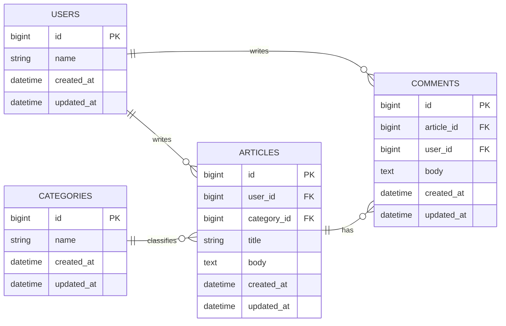
```mermaid
erDiagram
    direction LR
    USERS ||--o{ ARTICLES : writes
    USERS ||--o{ COMMENTS : writes
    CATEGORIES ||--o{ ARTICLES : classifies
    ARTICLES ||--o{ COMMENTS : has

    USERS {
        bigint id PK
        string name
        datetime created_at
        datetime updated_at
    }

    CATEGORIES {
        bigint id PK
        string name
        datetime created_at
        datetime updated_at
    }

    ARTICLES {
        bigint id PK
        bigint user_id FK
        bigint category_id FK
        string title
        text body
        datetime created_at
        datetime updated_at
    }

    COMMENTS {
        bigint id PK
        bigint article_id FK
        bigint user_id FK
        text body
        datetime created_at
        datetime updated_at
    }
```

`author_name` は不要になります。名前を持つのは `users` テーブルだからです。

コード：

~~~

```mermaid
erDiagram
    direction LR
    USERS ||--o{ ARTICLES : writes
    USERS ||--o{ COMMENTS : writes
    CATEGORIES ||--o{ ARTICLES : classifies
    ARTICLES ||--o{ COMMENTS : has

    USERS {
        bigint id PK
        string name
        datetime created_at
        datetime updated_at
    }

    CATEGORIES {
        bigint id PK
        string name
        datetime created_at
        datetime updated_at
    }

    ARTICLES {
        bigint id PK
        bigint user_id FK
        bigint category_id FK
        string title
        text body
        datetime created_at
        datetime updated_at
    }

    COMMENTS {
        bigint id PK
        bigint article_id FK
        bigint user_id FK
        text body
        datetime created_at
        datetime updated_at
    }
```
~~~

</details>

---

### 問題15：悪い設計を見抜く

次の1枚の表で記事とコメントを保存しようとしています。問題点を3つ書いてください。

| article_title | article_body | comment_body | comment_author |
|---|---|---|---|
| Rails入門 | scaffoldは便利 | わかりやすい | 田中 |
| Rails入門 | scaffoldは便利 | 続きも読みたい | 鈴木 |

<details>
<summary>解答例</summary>

1. `article_title` と `article_body` がコメントの数だけ重複する
2. コメントがまだない記事を保存しにくい
3. コメントが増えるほど同じ記事データを何度も持つことになる

</details>

---

### 問題16：悪い設計を分割する

問題15の表を、どのテーブルに分けるべきですか？ つなぐためのカラムも書いてください。

<details>
<summary>解答例</summary>

- `articles`（id, title, body）
- `comments`（id, article_id, author, body）

`comments` 側に `article_id` を置いてつなぐ。

</details>

---

### 問題17：カラムの型を選ぶ（1）

記事のタイトルに適切な型はどれですか？ `string` / `text` / `integer` / `boolean`

<details>
<summary>解答例</summary>

`string`。短い文字列にはstringを使う。

</details>

---

### 問題18：カラムの型を選ぶ（2）

記事の本文に適切な型はどれですか？

<details>
<summary>解答例</summary>

`text`。長い文字列にはtextを使う。

</details>

---

### 問題19：カラムの型を選ぶ（3）

「記事が公開済みかどうか」に適切な型はどれですか？

<details>
<summary>解答例</summary>

`boolean`。真偽値（true/false）にはbooleanを使う。

</details>

---

### 問題20：下書き機能を設計する

記事に「公開」と「下書き」の状態を持たせたいとします。`articles` テーブルにどんなカラムを追加すればよいですか？ 型も書いてください。

<details>
<summary>解答例</summary>

`published` カラムを追加する。型は `boolean`。

公開済みの記事だけを取り出すには、`published` が `true` の記事を絞ればよい。

</details>

---

## 21〜30：多対多と逆算

### 問題21：タグ機能の要件を整理する

記事にタグをつけられるようにします。次の要件を読んで、「1対多」か「多対多」かを答えてください。

- 1つの記事に複数のタグをつけられる
- 1つのタグは複数の記事で使える

<details>
<summary>解答例</summary>

多対多。

</details>

---

### 問題22：多対多に必要なものを答える

多対多の関係をテーブルで表すには、何が必要ですか？

<details>
<summary>解答例</summary>

中間テーブルが必要。

</details>

---

### 問題23：中間テーブルのカラムを書く

articles と tags をつなぐ中間テーブル `article_tags` に必要なカラムを書いてください。

<details>
<summary>解答例</summary>

- `id`
- `article_id`
- `tag_id`

</details>

---

### 問題24：タグ機能のER図を書く

articles、tags、article_tags の3テーブルの ER図を書いてください。

<details>
<summary>解答例</summary>

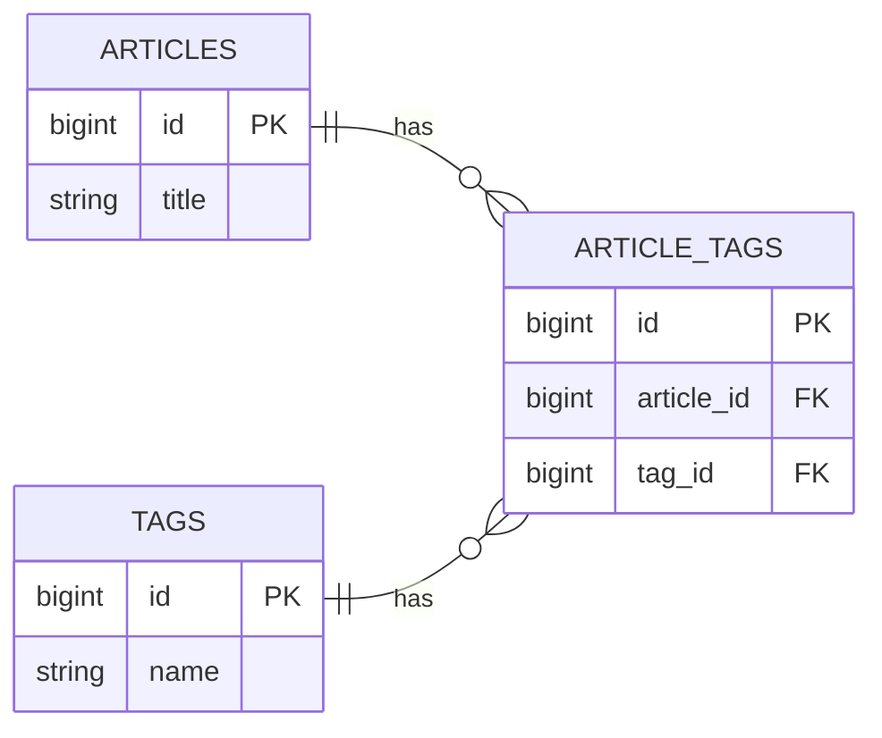
```mermaid
erDiagram
    direction LR
    ARTICLES ||--o{ ARTICLE_TAGS : has
    TAGS ||--o{ ARTICLE_TAGS : has

    ARTICLES {
        bigint id PK
        string title
    }

    TAGS {
        bigint id PK
        string name
    }

    ARTICLE_TAGS {
        bigint id PK
        bigint article_id FK
        bigint tag_id FK
    }
```

コード：

~~~

```mermaid
erDiagram
    direction LR
    ARTICLES ||--o{ ARTICLE_TAGS : has
    TAGS ||--o{ ARTICLE_TAGS : has

    ARTICLES {
        bigint id PK
        string title
    }

    TAGS {
        bigint id PK
        string name
    }

    ARTICLE_TAGS {
        bigint id PK
        bigint article_id FK
        bigint tag_id FK
    }
```
~~~

</details>

---

### 問題25：「いいね」機能の関係を答える

ユーザーが記事に「いいね」できる機能は、「1対多」か「多対多」か答えてください。

<details>
<summary>解答例</summary>

多対多。1人のユーザーが複数の記事にいいねでき、1つの記事が複数のユーザーからいいねされる。

</details>

---

### 問題26：「いいね」の中間テーブルを設計する

`likes` テーブルに必要なカラムを書いてください。

<details>
<summary>解答例</summary>

- `id`
- `user_id`
- `article_id`
- `created_at`

</details>

---

### 問題27：「いいね」のER図を書く

users、articles、likes の3テーブルの ER図を書いてください。

<details>
<summary>解答例</summary>

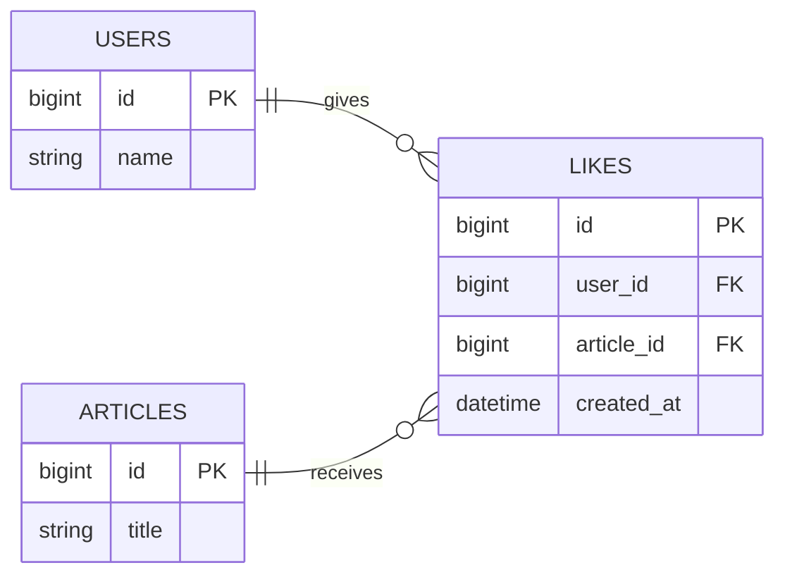
```mermaid
erDiagram
    direction LR
    USERS ||--o{ LIKES : gives
    ARTICLES ||--o{ LIKES : receives

    USERS {
        bigint id PK
        string name
    }

    ARTICLES {
        bigint id PK
        string title
    }

    LIKES {
        bigint id PK
        bigint user_id FK
        bigint article_id FK
        datetime created_at
    }
```

コード：

~~~

```mermaid
erDiagram
    direction LR
    USERS ||--o{ LIKES : gives
    ARTICLES ||--o{ LIKES : receives

    USERS {
        bigint id PK
        string name
    }

    ARTICLES {
        bigint id PK
        string title
    }

    LIKES {
        bigint id PK
        bigint user_id FK
        bigint article_id FK
        datetime created_at
    }
```
~~~

</details>

---

### 問題28：ER図から要件を逆算する（1）

次のER図を見て、テーブルはいくつあるか答えてください。

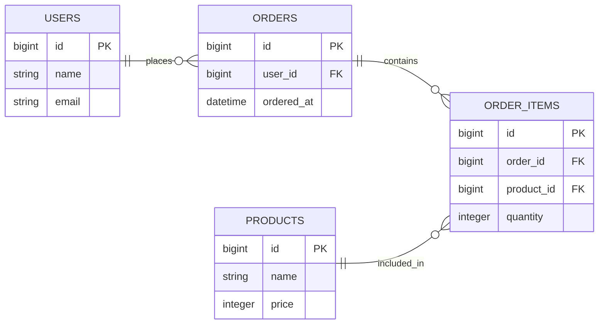
```mermaid
erDiagram
    direction LR
    USERS ||--o{ ORDERS : places
    ORDERS ||--o{ ORDER_ITEMS : contains
    PRODUCTS ||--o{ ORDER_ITEMS : included_in

    USERS {
        bigint id PK
        string name
        string email
    }

    ORDERS {
        bigint id PK
        bigint user_id FK
        datetime ordered_at
    }

    PRODUCTS {
        bigint id PK
        string name
        integer price
    }

    ORDER_ITEMS {
        bigint id PK
        bigint order_id FK
        bigint product_id FK
        integer quantity
    }
```

<details>
<summary>解答例</summary>

4つ。`USERS`、`ORDERS`、`PRODUCTS`、`ORDER_ITEMS`。

</details>

---

### 問題29：ER図から要件を逆算する（2）

問題28のER図は、何をするためのアプリですか？

<details>
<summary>解答例</summary>

ユーザーが商品を注文するECサイトのようなアプリ。

</details>

---

### 問題30：ER図から要件を逆算する（3）

問題28のER図で、`ORDER_ITEMS` はなぜ必要ですか？ なくても動きそうに見えますが、ないと何が困りますか？

<details>
<summary>解答例</summary>

1回の注文に複数の商品が入る可能性があるため。`ORDER_ITEMS` がないと、1回の注文に1つの商品しか入れられない。注文と商品は多対多の関係で、`ORDER_ITEMS` が中間テーブル。

</details>

---

## 31〜41：Rails コマンドで実際に作る

ここからは、ER図で設計したテーブルを Rails コマンドで実際に作ります。

第1週の `review_app` は人によって状態が違うので、新しいアプリを作り直します。

### 問題31：review_app2 を作る

ここからのコマンドは、新しくターミナルを開いて `/home/vscode` で実行してください。

現在いる場所は `pwd` コマンドで確認できます。

```bash
pwd
```

`/home/vscode` と表示されれば、そのまま進めます。

まず、Rails が使えるか確認します。

```bash
rails -v
```

`rails 8.x.x` や `rails 7.x.x` のように表示されたら、そのまま次へ進めます。

もし `command not found` などで Rails が使えない場合は、次を実行してください。

```bash
gem install rails --no-document
rails -v
```

`--no-document` は、説明書のような追加ファイルを入れずに Rails 本体だけをインストールする指定です。

ターミナルで以下を順番に実行してください。
💡 コマンドは一行ずつ実行しましょう。エラーが出たときのリカバリがしやすいです。

```bash
cd ~/
rails new review_app2
cd review_app2
rails generate scaffold Article title:string body:text
```

💡 `rails new review_app2` は2分程度かかります。終わるまで待ってください。  

`db/migrate/` に新しいファイルができているはずです。`xxxx_create_articles.rb` を開いて、中身を確認してください。

このマイグレーションで作られるテーブルは、ER図で表すと次の形です。マイグレーションファイルの中身とこのER図が対応していることが見えれば、設計と実装がつながってきます。

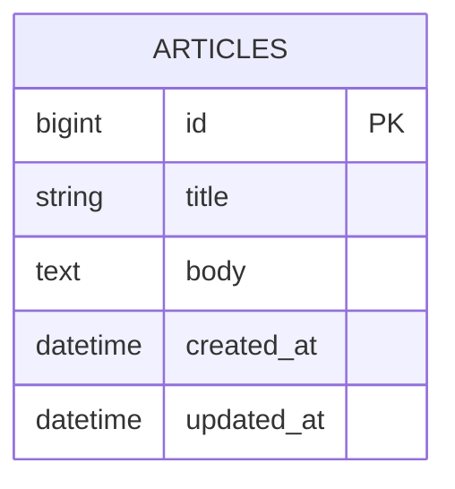
```mermaid
erDiagram
    ARTICLES {
        bigint id PK
        string title
        text body
        datetime created_at
        datetime updated_at
    }
```

確認できたら、マイグレーションを実行します。

```bash
rails db:migrate
```

<details>
<summary>確認ポイント</summary>

`rails console` で `Article.column_names` を実行し、`["id", "title", "body", "created_at", "updated_at"]` のように表示されれば成功。`exit` で抜けます。

</details>

---

### 問題32：categories テーブルを作る

次のコマンドを実行して、`categories` テーブルを作ってください。

```bash
rails generate model Category name:string
```

`db/migrate/` に新しいファイルができているはずです。`xxxx_create_categories.rb` を開いて、中身を確認してください。

このマイグレーションで作られるテーブルは、ER図で表すと次の形です。マイグレーションファイルの中身とこのER図が対応していることを確認してください。

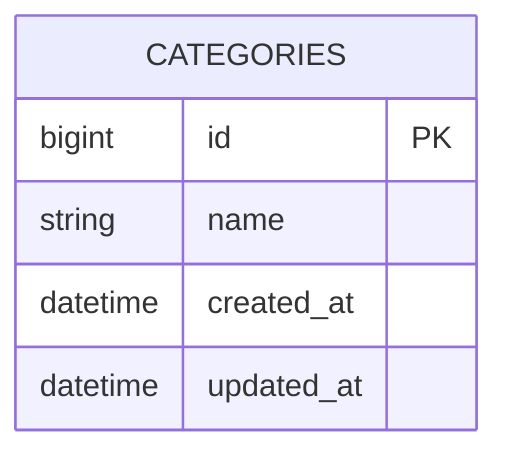
```mermaid
erDiagram
    CATEGORIES {
        bigint id PK
        string name
        datetime created_at
        datetime updated_at
    }
```

確認できたら、マイグレーションを実行します。

```bash
rails db:migrate
```

---

### 問題33：rails console で確認する

```bash
rails console
```

次のコードを実行して、`categories` テーブルが作られていることを確認してください。

```ruby
Category.column_names
```

確認できたら、`exit` と入力して `rails console` から抜けてください。

次の問題は、ターミナルで `rails generate ...` を実行します。`irb(main):` のような表示が出ている間は `rails console` の中です。

<details>
<summary>解答例</summary>

`["id", "name", "created_at", "updated_at"]` のように表示されれば成功。

</details>

---

### 問題34：articles に category_id を追加する

次のコマンドを実行して、`articles` テーブルに `category_id` を追加してください。

```bash
rails generate migration AddCategoryToArticles category:references
```

`db/migrate/` に新しいファイルができているはずです。`xxxx_add_category_to_articles.rb` を開いて、中身を確認してください。

このマイグレーションで `articles` テーブルに `category_id` が追加されます。ER図で表すと、`categories` と `articles` は次のようにつながります。

```mermaid
erDiagram
    direction LR
    CATEGORIES ||--o{ ARTICLES : classifies

    CATEGORIES {
        bigint id PK
        string name
        datetime created_at
        datetime updated_at
    }

    ARTICLES {
        bigint id PK
        bigint category_id FK
        string title
        text body
        datetime created_at
        datetime updated_at
    }
```

確認できたら、マイグレーションを実行します。

```bash
rails db:migrate
```

---

### 問題35：references と add_column の違いを読む

問題34では `category:references` を使いました。

生成されたマイグレーションファイルには、次のような内容が書かれています。

```ruby
add_reference :articles, :category, null: false, foreign_key: true
```

もし手で `category_id` だけを追加すると、次のような書き方になります。

```ruby
add_column :articles, :category_id, :bigint
```

この2つの違いを確認しましょう。

`references` を使うと、外部キーのカラム追加と同時に、データベースレベルの外部キー制約とインデックスも作られます。

外部キー制約は、`articles.category_id` に入る値が `categories.id` に存在することを、データベース側で守る仕組みです。

インデックスは、検索や結合を速くするための索引です。`add_reference` は、特に指定しなければインデックスも作ります。

`rails db:migrate` のあと、`db/schema.rb` も確認してください。`articles` テーブルに `category_id` と `index_articles_on_category_id` があり、最後の方に `add_foreign_key "articles", "categories"` があれば、マイグレーションの内容がデータベースの構造に反映されています。

<details>
<summary>解答例</summary>

- `add_column` は、カラムを追加するだけ
- `add_reference` は、`category_id` を追加する
- `add_reference` は、インデックスや外部キー制約も一緒に扱える
- Rails では、関連を表すとき `references` を使う方が自然
- `db/schema.rb` では、実際に作られたテーブル構造を確認できる

`category_id` というカラム名は同じでも、マイグレーションでは `references` の方が「これは categories テーブルへの参照です」と表しやすい書き方です。

ただし、既存の `Article` モデルに `belongs_to :category` が自動で追加されるわけではありません。

</details>

---

### 問題36：comments テーブルを references で作る

次のコマンドを実行して、`comments` テーブルを作ってください。`article_id` は `references` を使います。

```bash
rails generate model Comment article:references author_name:string body:text
```

`db/migrate/` に新しいファイルができているはずです。`xxxx_create_comments.rb` を開いて、中身を確認してください。

このマイグレーションで `comments` テーブルが作られ、`article_id` が追加されます。ER図で表すと、`articles` と `comments` は次のようにつながります。

```mermaid
erDiagram
    direction LR
    ARTICLES ||--o{ COMMENTS : has

    ARTICLES {
        bigint id PK
        bigint category_id FK
        string title
        text body
        datetime created_at
        datetime updated_at
    }

    COMMENTS {
        bigint id PK
        bigint article_id FK
        string author_name
        text body
        datetime created_at
        datetime updated_at
    }
```

確認できたら、マイグレーションを実行します。

```bash
rails db:migrate
```

<details>
<summary>確認ポイント</summary>

マイグレーションファイルに `t.references :article, null: false, foreign_key: true` があれば成功。

`db/schema.rb` も確認してください。`comments` テーブルに `article_id` と `index_comments_on_article_id` があり、最後の方に `add_foreign_key "comments", "articles"` があれば、マイグレーションの内容がデータベースの構造に反映されています。

</details>

---

### 問題37：モデルファイルを確認する

`app/models/comment.rb` を開いてください。`references` で作ると、何が自動で書かれていますか？

<details>
<summary>解答例</summary>

```ruby
class Comment < ApplicationRecord
  belongs_to :article
end
```

`belongs_to :article` が自動で書かれています。これは「コメントは1つの記事に属する」という関係を表します。

</details>

---

### 問題38：rails console でデータを作る

`rails console` で、カテゴリを1つ作ってください。

```ruby
Category.create(name: "Rails")
```

作ったあと、`Category.all` で確認してください。

<details>
<summary>確認ポイント</summary>

`Category.all` で、`name: "Rails"` のレコードが表示されれば成功。

</details>

---

### 問題39：カテゴリ付きの記事を作る

`rails console` で、カテゴリに紐づく記事を1つ作ってください。ここではまだ `Article` モデルに `belongs_to :category` を書いていないため、`category_id` を直接使います。

```ruby
category = Category.first || Category.create(name: "Rails")
article = Article.create(title: "はじめての記事", body: "本文です", category_id: category.id)

article.category_id
category.id == article.category_id
```

<details>
<summary>確認ポイント</summary>

`article.category_id` がカテゴリの `id` になり、`category.id == article.category_id` が `true` になれば成功。

</details>

---

### 問題40：コメントを作る

`rails console` で、記事に紐づくコメントを1つ作ってください。記事がまだない場合は、先に1件作ってからコメントを追加します。

```ruby
category = Category.first || Category.create(name: "Rails")
article = Article.first || Article.create(title: "はじめての記事", body: "本文です", category_id: category.id)
Comment.create(article: article, author_name: "田中", body: "わかりやすいです")
```

<details>
<summary>確認ポイント</summary>

`Comment.all` で、`article_id` が `article.id` になっているレコードが表示されれば成功。

</details>

---

### 問題41：ER図と実際のテーブルを見比べる

ここまでで作ったテーブルを `rails console` で確認してください。

```ruby
Category.column_names
Article.column_names
Comment.column_names
```

問題9で書いた ER図と見比べてください。ER図で設計したカラムが、実際のテーブルに反映されていますか？

<details>
<summary>確認ポイント</summary>

- `categories` に `name` がある
- `articles` に `category_id` がある
- `comments` に `article_id` がある

ここまでの3テーブルは、ER図で表すと次の形です。

```mermaid
erDiagram
    direction LR
    CATEGORIES ||--o{ ARTICLES : classifies
    ARTICLES ||--o{ COMMENTS : has

    CATEGORIES {
        bigint id PK
        string name
        datetime created_at
        datetime updated_at
    }

    ARTICLES {
        bigint id PK
        bigint category_id FK
        string title
        text body
        datetime created_at
        datetime updated_at
    }

    COMMENTS {
        bigint id PK
        bigint article_id FK
        string author_name
        text body
        datetime created_at
        datetime updated_at
    }
```

ER図で書いた設計が、そのままデータベースのテーブルになっています。「先に設計、次にコード」の流れを体験できました。

</details>

---

## 42〜51：プチECサイト バックエンドを作る

問題28〜30で読んだ EC サイトの ER図を、Rails のモデルとテーブルで実際に作ります。画面は作らず、`rails console` でバックエンド側のデータのつながりを確認します。

### 問題42：mini_shop を作る

```bash
cd ~/
rails new mini_shop
cd mini_shop
```

💡 2分程度かかります。終わるまで待ってください。

<details>
<summary>確認ポイント</summary>

`mini_shop` ディレクトリが作られ、中に `app/` `config/` `db/` などがあれば成功。

</details>

---

### 問題43：User モデルを作る

```bash
rails generate model User name:string email:string
rails db:migrate
```

<details>
<summary>確認ポイント</summary>

`rails console` で `User.column_names` を実行し、`"name"` と `"email"` が含まれていれば成功。

ここまでのER図：

```mermaid
erDiagram
    direction LR
    USERS {
        bigint id PK
        string name
        string email
    }
```

</details>

---

### 問題44：Product モデルを作る

```bash
rails generate model Product name:string price:integer
rails db:migrate
```

<details>
<summary>確認ポイント</summary>

`rails console` で `Product.column_names` を実行し、`"name"` と `"price"` が含まれていれば成功。

ここまでのER図：

```mermaid
erDiagram
    direction LR
    USERS {
        bigint id PK
        string name
        string email
    }

    PRODUCTS {
        bigint id PK
        string name
        integer price
    }
```

</details>

---

### 問題45：Order モデルを作る（references）

```bash
rails generate model Order user:references ordered_at:datetime
rails db:migrate
```

マイグレーションファイルを開いて、`t.references :user` の書かれ方を確認してください。

<details>
<summary>確認ポイント</summary>

- マイグレーションに `t.references :user, null: false, foreign_key: true` がある
- `app/models/order.rb` に `belongs_to :user` が自動で書かれている

ここまでのER図：

```mermaid
erDiagram
    direction LR
    USERS ||--o{ ORDERS : places

    USERS {
        bigint id PK
        string name
        string email
    }

    PRODUCTS {
        bigint id PK
        string name
        integer price
    }

    ORDERS {
        bigint id PK
        bigint user_id FK
        datetime ordered_at
    }
```

</details>

---

### 問題46：OrderItem モデルを作る（references 2つ）

```bash
rails generate model OrderItem order:references product:references quantity:integer
rails db:migrate
```

<details>
<summary>確認ポイント</summary>

- マイグレーションに `t.references :order` と `t.references :product` の両方がある
- `app/models/order_item.rb` に `belongs_to :order` と `belongs_to :product` が自動で書かれている

</details>

---

### 問題47：ER図とマイグレーションを見比べる

`db/migrate/` にある4つのマイグレーションファイルと `db/schema.rb` を開いて、問題28の ER図と見比べてください。

マイグレーションファイルでは、どのテーブルを作っているかを確認します。`db/schema.rb` では、実際に作られたカラム名を確認します。

```mermaid
erDiagram
    direction LR
    USERS ||--o{ ORDERS : places
    ORDERS ||--o{ ORDER_ITEMS : contains
    PRODUCTS ||--o{ ORDER_ITEMS : included_in

    USERS {
        bigint id PK
        string name
        string email
    }

    ORDERS {
        bigint id PK
        bigint user_id FK
        datetime ordered_at
    }

    PRODUCTS {
        bigint id PK
        string name
        integer price
    }

    ORDER_ITEMS {
        bigint id PK
        bigint order_id FK
        bigint product_id FK
        integer quantity
    }
```

- `users` に `name` と `email` があるか
- `products` に `name` と `price` があるか
- `orders` に `user_id` があるか
- `order_items` に `order_id` と `product_id` と `quantity` があるか

<details>
<summary>確認ポイント</summary>

ER図で設計した4テーブルが、そのままマイグレーションファイルになっています。

</details>

---

### 問題48：ユーザーと商品を作る

`rails console` で以下を実行してください。

```ruby
User.create(name: "田中", email: "tanaka@example.com")
User.create(name: "鈴木", email: "suzuki@example.com")

Product.create(name: "Rubyの本", price: 3000)
Product.create(name: "Railsの本", price: 3500)
Product.create(name: "SQLの本", price: 2800)
```

<details>
<summary>確認ポイント</summary>

`User.count` が 2、`Product.count` が 3 であれば成功。

</details>

---

### 問題49：注文を作る

田中さんが注文したデータを作ります。

```ruby
order = Order.create(user: User.find_by(name: "田中"), ordered_at: Time.now)
```

<details>
<summary>確認ポイント</summary>

`order.user.name` で `"田中"` が返ってくれば成功。

</details>

---

### 問題50：注文明細を作る

田中さんの注文に、「Rubyの本」を2冊、「Railsの本」を1冊追加します。別の `rails console` セッションで作業している場合に備えて、最初に注文を取り直します。まだ注文がなければ、その場で1件作ってください。

```ruby
user = User.find_by(name: "田中")
order = Order.find_by(user: user) || Order.create(user: user, ordered_at: Time.now)
OrderItem.create(order: order, product: Product.find_by(name: "Rubyの本"), quantity: 2)
OrderItem.create(order: order, product: Product.find_by(name: "Railsの本"), quantity: 1)
```

<details>
<summary>確認ポイント</summary>

```ruby
OrderItem.count
# => 2

OrderItem.first.product.name
# => "Rubyの本"

OrderItem.first.quantity
# => 2
```

</details>

---

### 問題51：注文の合計金額を計算する

田中さんの注文の合計金額を `rails console` で計算してみましょう。

```ruby
order = Order.first
total = 0

OrderItem.where(order: order).each do |item|
  total = total + item.product.price * item.quantity
end

puts "合計：#{total}円"
```

<details>
<summary>確認ポイント</summary>

`合計：9500円` と表示されれば成功。

- Rubyの本 3000円 × 2冊 = 6000円
- Railsの本 3500円 × 1冊 = 3500円
- 合計 = 9500円

ER図で設計したテーブルの関係を使って、注文 → 注文明細 → 商品とたどり、合計金額を計算できました。これがデータベース設計の力です。

### 別の書き方

Rubyには、集計に使える `sum` というメソッドもあります。

```ruby
order = Order.first

total = OrderItem.where(order: order).sum do |item|
  item.product.price * item.quantity
end

puts "合計：#{total}円"
```

ただし、最初は `each` で1件ずつたどる方が、テーブル同士の関係を理解しやすいです。

</details>
