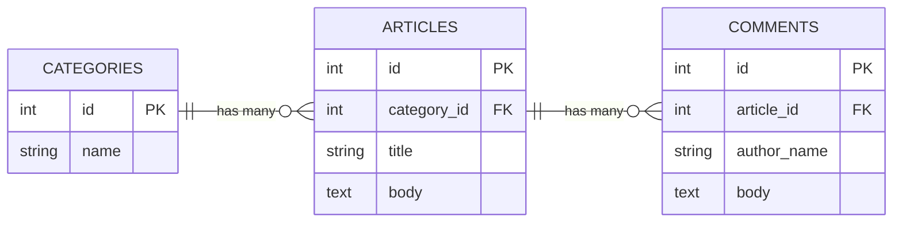
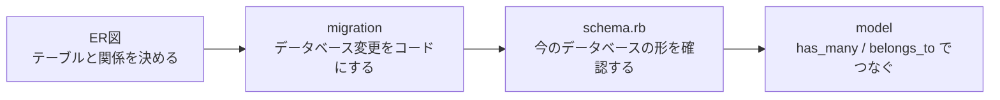
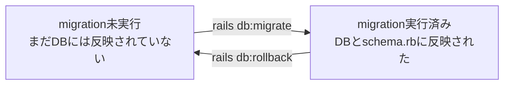
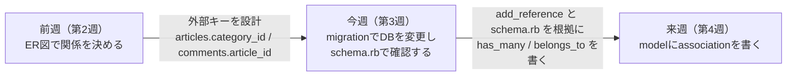

# 第3週：データベース設計（2）マイグレーション手書き

## 今日のゴール

ER図をもとにマイグレーションファイルを書き、テーブルの作成・変更・削除がどのように行われるかを説明できるようになる。

---

## 前回のおさらい

前回は、記事・カテゴリ・コメントの関係をER図で整理しました。

- `categories` テーブルがある
- `articles` テーブルがある
- `comments` テーブルがある
- `articles` には `category_id` が入る
- `comments` には `article_id` が入る

図で表すと、次の形です。



前回やったのは「何を保存するかを決める」作業でした。

今週やるのは、その設計を実際のデータベースの形にする作業です。

---

## マイグレーションとは

マイグレーションは、データベースの設計変更をコードで記録する仕組みです。

たとえば：

- 新しいテーブルを作る
- カラムを追加する
- カラムを削除する
- テーブル名やカラム名を変更する

こうした変更を、1つずつファイルとして残していきます。

今週と来週で扱う流れは、次のようにつながります。



---

## なぜ手で書くのか

<ruby>scaffold<rt>スキャフォールド</rt></ruby>は便利ですが、生成されたものをそのまま使っているだけでは、何が起きているのか見えません。

手でマイグレーションを書くと、次のことがわかるようになります。

- どのテーブルがいつ作られたか
- どのカラムがあとから追加されたか
- いまのデータベースが、どんな手順で今の形になったか

つまり、`今ある形` だけでなく、`どうやってその形になったか` を追えるようになります。

---

## マイグレーションファイルはどこにあるか

Railsでは、マイグレーションファイルは `db/migrate/` に入ります。

ファイル名は、だいたい次のようになります。

```text
20260416010101_create_categories.rb
20260416010500_add_category_to_articles.rb
```

先頭の長い数字は、作られた順番を表します。Railsはこの順番でマイグレーションを実行します。

※ ここには後で、`db/migrate/` フォルダとファイル名のスクリーンショットを追加します。

<!-- TODO: db/migrate フォルダの一覧と、タイムスタンプ付きファイル名が並んでいるスクリーンショットを追加する -->

---

## テーブルを作るマイグレーション

新しいテーブルを作るときは、`create_table` を使います。

たとえば `categories` テーブルなら、次のように書けます。

```ruby
class CreateCategories < ActiveRecord::Migration[8.1]
  def change
    create_table :categories do |t|
      t.string :name
      t.timestamps
    end
  end
end
```

このコードの意味は次のとおりです。

- `create_table :categories`：`categories` テーブルを作る
- `t.string :name`：`name` カラムを作る
- `t.timestamps`：`created_at` と `updated_at` を作る

---

## テーブルを変更するマイグレーション

すでにあるテーブルに普通のカラムを追加するときは、たとえば `add_column` を使います。

```ruby
class AddDescriptionToCategories < ActiveRecord::Migration[8.1]
  def change
    add_column :categories, :description, :text
  end
end
```

このコードは、`categories` テーブルに `description` という本文用のカラムを追加します。

一方で、外部キーを追加するときは、Railsでは `references` を使うのが自然です。

```ruby
class AddCategoryToArticles < ActiveRecord::Migration[8.1]
  def change
    add_reference :articles, :category, null: false, foreign_key: true
  end
end
```

このコードは、`articles` テーブルに `category_id` を追加します。

- `add_reference :articles, :category`：`articles` に `category_id` を追加する
- `null: false`：カテゴリが空の記事を作れないようにする
- `foreign_key: true`：`category_id` には、実際に `categories` に存在する `id` だけを入れられるようにする

`add_reference` は、検索や結合を速くするためのインデックスも作ります。外部キーのようにテーブル同士の関係を表すカラムは、`add_column` より `add_reference` を使う方が Rails の流儀に合っています。

---

## テーブルを削除・戻すこともできる

マイグレーションは、前に進めるだけではありません。必要なら戻すこともできます。

- `rails db:migrate`：まだ実行していないマイグレーションを進める
- `rails db:rollback`：直前のマイグレーションを1つ戻す

たとえば、書き間違えたマイグレーションを実行してしまっても、1つ戻して書き直すことができます。

この「進める」「戻す」ができるので、マイグレーションは設計変更の履歴として機能します。

流れで表すと、次のようになります。



---

## `schema.rb` は今の設計図

マイグレーションを実行すると、`db/schema.rb` が更新されます。

ここに書かれているのは、`今この瞬間のデータベースの形` です。

大事なのは次の違いです。

- `db/migrate/`：どう変えてきたかの履歴
- `db/schema.rb`：いま最終的にどうなっているか

両方を見ることで、過去から現在までを追えます。

---

## 今週から来週へ

今週は、ER図をマイグレーションに落とし込みます。



- 前週：ER図で、何を保存するか決めた
- 今週：マイグレーションで、データベースの形を作る
- 来週：モデルに `has_many` と `belongs_to` を書いて、Railsのコードとしてつなぐ

つまり：

- `category_id` が `articles` にある
- `article_id` が `comments` にある

という事実が、来週の association の根拠になります。

この2つの外部キーをER図で見ると、次の形です。


---

## まとめ

今日やったこと：

1. マイグレーションが設計変更の履歴であることを確認した
2. `create_table` で新しいテーブルを作れることを知った
3. `add_column` で普通のカラムを追加できることを知った
4. `add_reference` で外部キーを追加できることを知った
5. `db/migrate/` と `db/schema.rb` の役割の違いを確認した

> [!IMPORTANT]
> 

- マイグレーションは「データベースの変更をコードで残す仕組み」
- `db/migrate/` は変更の履歴
- `db/schema.rb` は今の完成形
- 普通のカラム追加は `add_column`
- 外部キーの追加は `add_reference`
- 今週のカラムが、来週の `has_many / belongs_to` につながる
