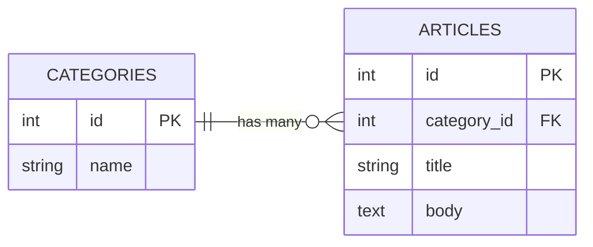
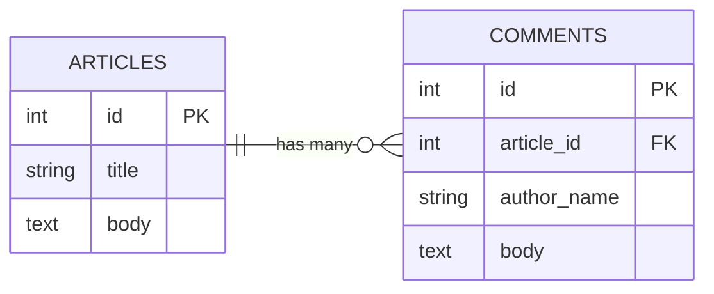

# 第3週：練習 ── マイグレーションを手で書く

## 今日のゴール

ER図を見ながら、自分の手でマイグレーションを書いてデータベースの形を作れるようになる。

---

## この練習について

早く終わらせることが目的ではありません。

コピペで進めても構いません。ただし、コピーした後に必ず `migration` と `schema.rb` を開いて、「何が変わったか」を確認してください。

この週で大事なのは、次を説明できる状態になることです。

- `migration` を書いたら、`schema.rb` にどう反映されたか
- ER図の外部キーが、`migration` では `references`（結果として `*_id` カラム）としてどう現れるか
- そのカラムが、どのテーブル同士をつないでいるか

手が止まっている時間は、考えている時間です。無駄ではありません。説明できないまま先に進むより、対応関係を1つずつ確認しながら進めましょう。

---

## 今日の目標（達成ライン）

- `必須（全員）`：1〜5 を終える（既存 migration を読む、categories を作る、articles と categories の関連を追加する、comments を作る、schema.rb と `rails console` で確認する）
- `発展（早く終わった人）`：[Stretch](stretch.md) に進む

orientation とこの練習は、全員が終える前提です。まずは `1〜5` の完了を確実に目指しましょう。

---

## 準備

この練習は、GitHub Codespaces 上で行います。

前回の続きは使わず、 **新しく Codespace を作って** 始めてください。  
生徒ごとに前回の状態が違うため、第3週用に `review_app3` という Rails アプリを新しく作ります。

1. GitHubにログインする
2. [このリポジトリ](https://github.com/TORIFUKUKaiou/rails-dojo-year2-content/)を開く（リンクを右クリックして、「リンクを新しいタブで開く」）
3. リポジトリの `Code` ボタン → `Codespaces` タブを開く
4. `Create a codespace on main(+)` をクリックする

    

    ---

    **緑のボタンがある場合**は、この手順でも構いません。`Create codespace on main` をクリックしてください。

    
    ---

5. ターミナルに `準備完了` と表示されたら、Codespaces の起動完了

💡 コマンドは一行ずつ実行しましょう。ひとつひとつ実行結果を確かめながら進むのが上達への近道です。

次に、Rails をインストールします。

```bash
gem install rails -v "~> 8.1.0" --no-document
rails -v
```

`rails 8.1.x` のように表示されたら、Rails が使える状態です。

続いて、第3週用の Rails アプリを作ります。

```bash
cd ~/
rails new review_app3
cd review_app3
```

`rails new review_app3` は、必要なファイルとライブラリを作るため時間がかかります。終わるまで待ってください。

次に、<ruby>scaffold<rt>スキャフォールド</rt></ruby> で `articles` を作ります。

```bash
rails generate scaffold Article title:string body:text
```

`db/migrate/` に `xxxx_create_articles.rb` のようなファイルができているはずです。まず開いて、中身を確認してください。

確認したら、マイグレーションを実行します。

```bash
rails db:migrate
```

ここまでできたら、`review_app3` の中にある `db/migrate/` と `db/schema.rb` を開ける状態にしてください。

画面左のファイル一覧で、`review_app3` → `db` → `migrate` を開くとマイグレーションファイルが見えます。`db/schema.rb` も同じ `db` の中にあります。

---

## 1. 既存のマイグレーションを読む

まずは、scaffoldが作った `articles` 用のマイグレーションを開いてください。

ファイル名は次のようになっているはずです。

```text
db/migrate/xxxxxx_create_articles.rb
```

中身はだいたいこうなっています。

`ActiveRecord::Migration[8.1]` の `8.1` は、Rails 8.1 系で作ったマイグレーションという意味です。この行は、生成されたまま使います。

```ruby
class CreateArticles < ActiveRecord::Migration[8.1]
  def change
    create_table :articles do |t|
      t.string :title
      t.text :body
      t.timestamps
    end
  end
end
```

### やってみよう

次の3つを自分の言葉で説明してみましょう。

1. `create_table :articles` は何をしているか
2. `t.string :title` は何をしているか
3. `t.timestamps` は何をしているか

自分なりの解答がまとまったら、「解答例」と比べてみましょう。

<details>
<summary>解答例</summary>

1. `articles` テーブルを作っている
2. `title` という文字列のカラムを作っている
3. `created_at` と `updated_at` を作っている

</details>

---

## 2. `categories` テーブルを手で作る

前回のER図では、カテゴリを管理する `categories` テーブルが必要でした。

まず、空のマイグレーションファイルを作ります。

```bash
rails generate migration CreateCategories
```

`db/migrate/` 内にできた空のファイルを開いて、次のように書いてください。

```ruby
class CreateCategories < ActiveRecord::Migration[8.1]
  def change
    create_table :categories do |t|
      t.string :name
      t.timestamps
    end
  end
end
```

書けたら、実行します。

```bash
rails db:migrate
```

### 確認ポイント

- `db/schema.rb` に `categories` テーブルが増えているか
- `name` `created_at` `updated_at` が入っているか

<details>
<summary>解答例</summary>

`db/schema.rb` に、次のような部分が追加されます。

```ruby
create_table "categories", force: :cascade do |t|
  t.string "name"
  t.datetime "created_at", null: false
  t.datetime "updated_at", null: false
end
```

</details>

---

## 3. `articles` に `category` の関連を追加する

次は、記事がどのカテゴリに属するかを表す外部キーを追加します。

まず、空のマイグレーションファイルを作ります。

```bash
rails generate migration AddCategoryToArticles
```

できたファイルに、次のように書いてください。

```ruby
class AddCategoryToArticles < ActiveRecord::Migration[8.1]
  def change
    add_reference :articles, :category, null: false, foreign_key: true
  end
end
```

`add_reference` は、Railsで関連を表すときの基本形です。

- `category_id` カラムが追加される
- `null: false` で空を防ぐ
- `foreign_key: true` で `categories.id` への参照制約が付く
- インデックスも自動で追加される

そのあと、実行します。

```bash
rails db:migrate
```

ER図・migration・schema.rb は次のように対応します。



### 確認ポイント

- `articles` テーブルに `category_id` が増えているか
- `db/schema.rb` の `articles` に `category_id` と `index_articles_on_category_id` があるか
- `db/schema.rb` の末尾に `add_foreign_key "articles", "categories"` があるか

<details>
<summary>解答例</summary>

`db/schema.rb` には、次のように反映されます。

カラムの並び順は環境によって少し違うことがあります。順番が違っても、`category_id`、`index_articles_on_category_id`、`add_foreign_key "articles", "categories"` があればOKです。

```ruby
create_table "articles", force: :cascade do |t|
  t.text "body"
  t.integer "category_id", null: false
  t.datetime "created_at", null: false
  t.string "title"
  t.datetime "updated_at", null: false
  t.index ["category_id"], name: "index_articles_on_category_id"
end

add_foreign_key "articles", "categories"
```

</details>

---

## 4. `comments` テーブルを手で作る

次は、コメントを保存する `comments` テーブルを作ります。

まず、空のマイグレーションファイルを作ります。

```bash
rails generate migration CreateComments
```

できたファイルに、次のように書いてください。

```ruby
class CreateComments < ActiveRecord::Migration[8.1]
  def change
    create_table :comments do |t|
      t.references :article, null: false, foreign_key: true
      t.string :author_name
      t.text :body
      t.timestamps
    end
  end
end
```

ER図・migration・schema.rb は次のように対応します。



そのあと、実行します。

```bash
rails db:migrate
```

### 確認ポイント

- `comments` テーブルができているか
- `article_id` `author_name` `body` が入っているか
- `db/schema.rb` の `comments` に `index_comments_on_article_id` があるか
- `db/schema.rb` の末尾に `add_foreign_key "comments", "articles"` があるか

<details>
<summary>解答例</summary>

`db/schema.rb` に、次のような部分が追加されます。

カラムの並び順は環境によって少し違うことがあります。順番が違っても、`article_id`、`index_comments_on_article_id`、`add_foreign_key "comments", "articles"` があればOKです。

```ruby
create_table "comments", force: :cascade do |t|
  t.integer "article_id", null: false
  t.string "author_name"
  t.text "body"
  t.datetime "created_at", null: false
  t.datetime "updated_at", null: false
  t.index ["article_id"], name: "index_comments_on_article_id"
end

add_foreign_key "comments", "articles"
```

</details>

---

## 5. `schema.rb` と `rails console` で確認する

最後に、いまのデータベースの形を確認します。

### `schema.rb` を見る

次の3つがあることを確認してください。

- `categories`
- `articles`
- `comments`

### `rails console` で見る

まず、ターミナルで Rails console を開きます。

```bash
rails console
```

`irb(main):001>` のような表示になったら、次の Ruby コードを入力します。

```ruby
Article.column_names
```

`Article` は scaffold でモデルが作られているので、そのまま確認できます。

確認が終わったら、次のように入力すると Rails console を終了できます。

```ruby
exit
```

一方で、いまの時点では `Category` と `Comment` のモデルファイルはまだ作っていません。なので、`categories` と `comments` の確認は `schema.rb` を中心に行ってください。

### やってみよう

それぞれの結果を見て、次の2つに答えてみましょう。

1. `articles` と `comments` は、どのカラムでつながるか
2. `articles` と `categories` は、どのカラムでつながるか

<details>
<summary>解答例</summary>

1. `comments.article_id`
2. `articles.category_id`

</details>

---

## まとめ

今日やったこと：

1. 既存の migration を読んだ
2. `categories` テーブルを手で作った
3. `articles` と `categories` の関連を追加した
4. `comments` テーブルを手で作った
5. `schema.rb` と `rails console` で結果を確認した

来週は、このカラムをもとに `has_many` と `belongs_to` を書きます。
