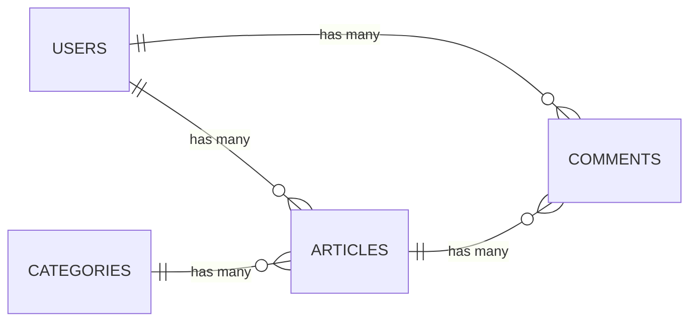

# 第3週：Stretch ── migration と schema.rb を読み切る40問

## 今日のゴール

`migration` を実行するだけでなく、`schema.rb` の変化・外部キー・インデックスまで説明できるようになる。

---

## この課題について

この課題は、[練習](practice.md) を終えた人向けです。  
全部終わらなくても構いません。進めるところまで進めてください。

この課題は、練習で作った `review_app3` の中で続けます。ターミナルが別の場所にいる場合は、先に次を実行してください。

```bash
cd ~/review_app3
```

---

## 今日の目標（目安）

- `推奨`：課題1〜10
- `発展`：課題11〜25
- `さらに余裕がある人`：課題26〜40

---

## 課題1：`db:rollback` を1回試す

次を実行してください。

```bash
rails db:rollback
rails db:migrate
```

### 確認ポイント

- `rollback` の直後に何が消えたか
- `migrate` の後に何が戻ったか

<details>
<summary>解答例</summary>

直前の migration が `CreateComments` なら、`rollback` 後は `comments` テーブルが消えます。  
その後 `rails db:migrate` で `comments` テーブルが再作成されます。

</details>

---

## 課題2：`db:rollback STEP=2` を試す

次を実行してください。

```bash
rails db:rollback STEP=2
rails db:migrate
```

### 確認ポイント

- 2本ぶん戻ること
- もう一度 `migrate` で元に戻ること

<details>
<summary>解答例</summary>

`STEP=2` は直前2本を取り消します。  
`rails db:migrate` を実行すると、その2本が再び適用されます。

</details>

---

## 課題3：`db:migrate:status` を読む

次を実行してください。

```bash
rails db:migrate:status
```

### やってみよう

`up` と `down` の意味を、1行で説明してください。

<details>
<summary>解答例</summary>

- `up`：その migration は適用済み  
- `down`：その migration は未適用

</details>

---

## 課題4：マイグレーションの順序を読む

`db/migrate/` のファイル名を見て、次を答えてください。

1. いちばん古いファイル名
2. いちばん新しいファイル名
3. Rails が実行順を判断する根拠

<details>
<summary>解答例</summary>

1. いちばん先頭のタイムスタンプを持つファイル  
2. いちばん後ろのタイムスタンプを持つファイル  
3. 先頭の14桁タイムスタンプ（`YYYYMMDDHHMMSS`）

</details>

---

## 課題5：`schema.rb` の `version` を確認する

`db/schema.rb` の先頭にある `version` を確認してください。

### やってみよう

- 最後に実行した migration と `version` が対応しているか確認する

<details>
<summary>解答例</summary>

`ActiveRecord::Schema[8.1].define(version: 2026xxxxxxxxxx)` の `version` は、  
最後に適用された migration のタイムスタンプと一致します。

</details>

---

## 課題6：`db/migrate` と `schema.rb` の役割を言語化する

次の2つを1行ずつで説明してください。

- `db/migrate/`
- `db/schema.rb`

<details>
<summary>解答例</summary>

- `db/migrate/`：データベース変更の履歴（変更手順）  
- `db/schema.rb`：現在のデータベース完成形

</details>

---

## 課題7：`categories` に `description` を追加する

次を実行してください。

```bash
rails generate migration AddDescriptionToCategories
```

生成されたファイルを次のように編集します。

```ruby
class AddDescriptionToCategories < ActiveRecord::Migration[8.1]
  def change
    add_column :categories, :description, :text
  end
end
```

その後、実行します。

```bash
rails db:migrate
```

<details>
<summary>解答例</summary>

`schema.rb` の `categories` テーブルに次が追加されます。

```ruby
t.text "description"
```

</details>

---

## 課題8：`users` テーブルを作る

次を実行してください。

```bash
rails generate migration CreateUsers
```

生成されたファイルを次のように編集します。

```ruby
class CreateUsers < ActiveRecord::Migration[8.1]
  def change
    create_table :users do |t|
      t.string :name, null: false
      t.timestamps
    end
  end
end
```

その後、実行します。

```bash
rails db:migrate
```

<details>
<summary>解答例</summary>

`schema.rb` に次のテーブルが追加されます。

```ruby
create_table "users", force: :cascade do |t|
  t.string "name", null: false
  t.datetime "created_at", null: false
  t.datetime "updated_at", null: false
end
```

</details>

---

## 課題9：`users` の反映を `schema.rb` で確認する

### 確認ポイント

- `users` テーブルがあるか
- `name` が `null: false` になっているか

<details>
<summary>解答例</summary>

`create_table "users"` が存在し、`t.string "name", null: false` になっていればOKです。

</details>

---

## 課題10：`articles` に `user` 参照を追加する

次を実行してください。

```bash
rails generate migration AddUserToArticles
```

生成されたファイルを次のように編集します。

```ruby
class AddUserToArticles < ActiveRecord::Migration[8.1]
  def change
    add_reference :articles, :user, null: false, foreign_key: true
  end
end
```

その後、実行します。

```bash
rails db:migrate
```

<details>
<summary>解答例</summary>

`add_reference` により次が追加されます。

- `articles.user_id`
- `index_articles_on_user_id`
- `add_foreign_key "articles", "users"`

</details>

---

## 課題11：`articles` 側の index / foreign key を確認する

`db/schema.rb` を見て、次を確認してください。

- `articles` に `user_id` がある
- `index_articles_on_user_id` がある
- `add_foreign_key "articles", "users"` がある

<details>
<summary>解答例</summary>

次の3つがあればOKです。

```ruby
t.integer "user_id", null: false
t.index ["user_id"], name: "index_articles_on_user_id"
add_foreign_key "articles", "users"
```

</details>

---

## 課題12：`comments` に `user` 参照を追加する

次を実行してください。

```bash
rails generate migration AddUserToComments
```

生成されたファイルを次のように編集します。

```ruby
class AddUserToComments < ActiveRecord::Migration[8.1]
  def change
    add_reference :comments, :user, null: false, foreign_key: true
  end
end
```

その後、実行します。

```bash
rails db:migrate
```

<details>
<summary>解答例</summary>

`comments` 側に `user_id` が追加され、  
index と外部キー制約も一緒に作成されます。

</details>

---

## 課題13：`comments` 側の index / foreign key を確認する

`db/schema.rb` を見て、次を確認してください。

- `comments` に `user_id` がある
- `index_comments_on_user_id` がある
- `add_foreign_key "comments", "users"` がある

<details>
<summary>解答例</summary>

次の3つがあればOKです。

```ruby
t.integer "user_id", null: false
t.index ["user_id"], name: "index_comments_on_user_id"
add_foreign_key "comments", "users"
```

</details>

---

## 課題14：いまの設計を ER 図で書く

次の4テーブルを含む ER 図を `db_design.md` に書いてください。

`db_design.md` がまだない場合は、先に作ります。

```bash
touch db_design.md
```

- `users`
- `categories`
- `articles`
- `comments`

<details>
<summary>解答例</summary>



</details>

---

## 課題15：`null: false` の意味を確認する

次の2つを説明してください。

- `null: false` があると何が防げるか
- ない場合に何が起こりうるか

<details>
<summary>解答例</summary>

- `null: false` あり：空値（NULL）の保存を防げる  
- `null: false` なし：必須項目が空のレコードが混ざる可能性がある

</details>

---

## 課題16：`foreign_key: true` の意味を確認する

次の2つを説明してください。

- `foreign_key: true` があると何が防げるか
- ない場合に何が起こりうるか

<details>
<summary>解答例</summary>

- `foreign_key: true` あり：存在しない親IDを防げる  
- `foreign_key: true` なし：参照先がない孤立データを保存できてしまう

</details>

---

## 課題17：`index` の意味を確認する

`db/schema.rb` に出てくる次の2行を例に、`index` の役割を説明してください。

- `index_articles_on_category_id`
- `index_comments_on_article_id`

<details>
<summary>解答例</summary>

`index` は検索・結合を速くするための仕組みです。  
外部キー列（`*_id`）に index があると、関連を使う処理が高速化されます。

</details>

---

## 課題18：`schema.rb` から外部キーを全部列挙する

`add_foreign_key` の行をすべて抜き出して、  
「どのテーブル → どのテーブル」の関係か書いてください。

<details>
<summary>解答例</summary>

例:

- `articles` → `categories`
- `comments` → `articles`
- `articles` → `users`
- `comments` → `users`

</details>

---

## 課題19：`schema.rb` から `*_id` カラムを全部列挙する

`category_id` `article_id` `user_id` など、外部キー候補をすべて書き出してください。

<details>
<summary>解答例</summary>

例:

- `articles.category_id`
- `articles.user_id`
- `comments.article_id`
- `comments.user_id`

</details>

---

## 課題20：外部キーと ER 図を突き合わせる

課題19で抜き出した `*_id` が、ER図のどの線に対応するかを書いてください。

<details>
<summary>解答例</summary>

- `articles.category_id` → `CATEGORIES ||--o{ ARTICLES`
- `comments.article_id` → `ARTICLES ||--o{ COMMENTS`
- `articles.user_id` → `USERS ||--o{ ARTICLES`
- `comments.user_id` → `USERS ||--o{ COMMENTS`

</details>

---

## 課題21：ミニECの要件を整理する

ここからは `review_app3` の中で、ミニECサイト用のテーブルを追加します。  
まず、次の要件を1行ずつ書いてください。

- `products`：商品
- `orders`：注文
- `order_items`：注文明細

<details>
<summary>解答例</summary>

- `products` は商品名・価格・在庫を持つ  
- `orders` は注文者・注文日時・状態を持つ  
- `order_items` は1注文の中の商品と数量を持つ

</details>

---

## 課題22：ミニECの ER 図を考える

`users` `products` `orders` `order_items` の関係を、文章または図で整理してください。

<details>
<summary>解答例</summary>

- `users` 1人に対して `orders` は複数  
- `orders` 1件に対して `order_items` は複数  
- `products` 1件に対して `order_items` は複数

</details>

---

## 課題23：`products` テーブルを手書きする

次を実行してください。

```bash
rails generate migration CreateProducts
```

生成されたファイルを次のように編集します。

```ruby
class CreateProducts < ActiveRecord::Migration[8.1]
  def change
    create_table :products do |t|
      t.string :name, null: false
      t.integer :price, null: false
      t.integer :stock, null: false, default: 0
      t.timestamps
    end
  end
end
```

その後、実行します。

```bash
rails db:migrate
```

<details>
<summary>解答例</summary>

`schema.rb` に `products` テーブルが作成され、`name` `price` `stock` が確認できます。

</details>

---

## 課題24：`orders` テーブルを手書きする

次を実行してください。

```bash
rails generate migration CreateOrders
```

生成されたファイルを次のように編集します。

```ruby
class CreateOrders < ActiveRecord::Migration[8.1]
  def change
    create_table :orders do |t|
      t.references :user, null: false, foreign_key: true
      t.datetime :ordered_at, null: false
      t.string :status, null: false, default: "pending"
      t.timestamps
    end
  end
end
```

その後、実行します。

```bash
rails db:migrate
```

<details>
<summary>解答例</summary>

`orders.user_id` と `index_orders_on_user_id`、`add_foreign_key "orders", "users"` が追加されます。

</details>

---

## 課題25：`order_items` テーブルを手書きする

次を実行してください。

```bash
rails generate migration CreateOrderItems
```

生成されたファイルを次のように編集します。

```ruby
class CreateOrderItems < ActiveRecord::Migration[8.1]
  def change
    create_table :order_items do |t|
      t.references :order, null: false, foreign_key: true
      t.references :product, null: false, foreign_key: true
      t.integer :quantity, null: false
      t.integer :unit_price, null: false
      t.timestamps
    end
  end
end
```

その後、実行します。

```bash
rails db:migrate
```

<details>
<summary>解答例</summary>

`order_items` に `order_id` と `product_id` が追加され、両方に index と外部キーが付きます。

</details>

---

## 課題26：EC追加分を `schema.rb` で読む

`schema.rb` を見て、次を確認してください。

- `products` `orders` `order_items` の3テーブルがある
- `orders.user_id` がある
- `order_items.order_id` と `order_items.product_id` がある

<details>
<summary>解答例</summary>

3テーブルが存在し、`*_id` には index と `add_foreign_key` が付いていればOKです。

</details>

---

## 課題27：`rails console` でサンプルデータを入れる

まず、モデルファイルがない場合は作成します。

```bash
rails generate model User --skip-migration
rails generate model Product --skip-migration
rails generate model Order --skip-migration
rails generate model OrderItem --skip-migration
```

次に `rails console` を開いて、以下を実行してください。

```bash
rails console
```

`review-app3(dev):001>` や `irb(main):001>` のような表示になったら、次の Ruby コードを入力します。

```ruby
user = User.first || User.create!(name: "Taro")
product = Product.first || Product.create!(name: "Book", price: 1500, stock: 10)
order = Order.create!(user_id: user.id, ordered_at: Time.current, status: "pending")
OrderItem.create!(order_id: order.id, product_id: product.id, quantity: 2, unit_price: product.price)
```

<details>
<summary>解答例</summary>

エラーなく作成できればOKです。  
`OrderItem.count` が増え、`order_items` に1件追加されます。

</details>

---

## 課題28：注文合計を計算する

課題27で開いた `rails console` の中で、注文1件の合計金額を計算してください。

Rails console を閉じている場合は、もう一度開きます。

```bash
rails console
```

<details>
<summary>解答例</summary>

```ruby
order = Order.last
total = 0
OrderItem.where(order_id: order.id).each do |item|
  total = total + item.unit_price * item.quantity
end
total
```

</details>

---

## 課題29：EC部分の association を先取りする

`User` `Product` `Order` `OrderItem` に、来週書くとしたら何を書くか整理してください。

<details>
<summary>解答例</summary>

```ruby
# user.rb
has_many :orders
```

```ruby
# product.rb
has_many :order_items
```

```ruby
# order.rb
belongs_to :user
has_many :order_items
```

```ruby
# order_item.rb
belongs_to :order
belongs_to :product
```

</details>

---

## 課題30：EC部分の学びを2行で書く

`db_design.md` に次の2行を書いてください。

1. `references` で何が自動作成されたか
2. `schema.rb` のどこを見れば関連が読めるか

<details>
<summary>解答例</summary>

1. `*_id` カラム、index、外部キー制約が自動作成される。  
2. `create_table` の `*_id` と `t.index`、末尾の `add_foreign_key` を見る。

</details>

---

## 読むだけ問題に進む前に

ここから先は、コードを読んで考える問題です。

課題31〜38では、新しいマイグレーションファイルを作らず、`rails db:migrate` も実行しません。問題文のコードを見て、`db_design.md` やノートに答えを書いてください。

## 課題31：間違い探し その1（`add_column` から `add_reference` へ）

次は関連を追加する migration としては改善の余地があります。

```ruby
class AddUserIdToArticles < ActiveRecord::Migration[8.1]
  def change
    add_column :articles, :user_id, :integer
  end
end
```

### やってみよう

`references` ベースで書き直してください。

<details>
<summary>解答例</summary>

```ruby
class AddUserToArticles < ActiveRecord::Migration[8.1]
  def change
    add_reference :articles, :user, null: false, foreign_key: true
  end
end
```

</details>

---

## 課題32：間違い探し その2（`t.integer :article_id`）

次は `comments` 作成 migration の一部です。

```ruby
create_table :comments do |t|
  t.integer :article_id
  t.string :author_name
  t.text :body
  t.timestamps
end
```

### やってみよう

`references` ベースで書き直してください。

<details>
<summary>解答例</summary>

```ruby
create_table :comments do |t|
  t.references :article, null: false, foreign_key: true
  t.string :author_name
  t.text :body
  t.timestamps
end
```

</details>

---

## 課題33：間違い探し その3（`null` 制約）

次の migration を見て、改善点を書いてください。

```ruby
class AddCategoryToArticles < ActiveRecord::Migration[8.1]
  def change
    add_reference :articles, :category
  end
end
```

<details>
<summary>解答例</summary>

`null` と外部キー制約を明示すると安全です。

```ruby
class AddCategoryToArticles < ActiveRecord::Migration[8.1]
  def change
    add_reference :articles, :category, null: false, foreign_key: true
  end
end
```

</details>

---

## 課題34：間違い探し その4（`foreign_key` 制約）

次の migration を見て、改善点を書いてください。

```ruby
class AddArticleToComments < ActiveRecord::Migration[8.1]
  def change
    add_reference :comments, :article, null: false
  end
end
```

<details>
<summary>解答例</summary>

`foreign_key: true` を追加します。

```ruby
class AddArticleToComments < ActiveRecord::Migration[8.1]
  def change
    add_reference :comments, :article, null: false, foreign_key: true
  end
end
```

</details>

---

## 課題35：migration ファイル名の順序クイズ

次のファイル名を、実行される順に並べ替えてください。

```text
20260417093000_add_user_to_articles.rb
20260417091500_create_users.rb
20260417094500_add_user_to_comments.rb
20260417090500_add_description_to_categories.rb
```

<details>
<summary>解答例</summary>

実行順:

1. `20260417090500_add_description_to_categories.rb`
2. `20260417091500_create_users.rb`
3. `20260417093000_add_user_to_articles.rb`
4. `20260417094500_add_user_to_comments.rb`

</details>

---

## 課題36：`remove_column` を読むだけ

次のコードを読んで、何が起こるか説明してください。実行は不要です。

```ruby
class RemoveDescriptionFromCategories < ActiveRecord::Migration[8.1]
  def change
    remove_column :categories, :description, :text
  end
end
```

<details>
<summary>解答例</summary>

`categories.description` カラムが削除されます。  
削除後は、そのカラムのデータも失われます。

</details>

---

## 課題37：`rename_column` を読むだけ

次のコードを読んで、何が起こるか説明してください。実行は不要です。

```ruby
class RenameAuthorNameToAuthorInComments < ActiveRecord::Migration[8.1]
  def change
    rename_column :comments, :author_name, :author
  end
end
```

<details>
<summary>解答例</summary>

`comments.author_name` が `comments.author` に改名されます。  
列名が変わるので、参照しているコード側の修正も必要です。

</details>

---

## 課題38：`change` で戻せる/戻せないを考える

次の2つは、どちらが `db:rollback` しやすいか考えてください。

1. `add_reference :articles, :user, null: false, foreign_key: true`
2. `execute "UPDATE articles SET title = 'x'"` のような生SQL

<details>
<summary>解答例</summary>

戻しやすいのは 1 です。  
Rails が `change` の内容を解釈しやすく、逆操作を推定できます。  
2 のような生SQLは、内容によっては自動で元に戻せません。

</details>

---

## 課題39：第4週の association を先取りする

今の外部キーをもとに、次のモデルに書く association を整理してください。

ここでは、まだモデルファイルを編集しません。来週書く内容を、`db_design.md` やノートに整理するだけでOKです。

- `User`
- `Category`
- `Article`
- `Comment`

### ヒント

- 例: `articles` に `category_id` があるなら、`Article` は `belongs_to :category`

<details>
<summary>解答例</summary>

```ruby
# app/models/user.rb
class User < ApplicationRecord
  has_many :articles
  has_many :comments
  has_many :orders
end
```

```ruby
# app/models/category.rb
class Category < ApplicationRecord
  has_many :articles
end
```

```ruby
# app/models/article.rb
class Article < ApplicationRecord
  belongs_to :category
  belongs_to :user
  has_many :comments
end
```

```ruby
# app/models/comment.rb
class Comment < ApplicationRecord
  belongs_to :article
  belongs_to :user
end
```

</details>

---

## 課題40：第4週への接続メモを書く

`db_design.md` に、次の2点を短く書いてください。

1. 今週わかったこと（migration と schema の対応）
2. 来週やること（model の `has_many` / `belongs_to`）

<details>
<summary>解答例</summary>

例:

1. migration の1行は schema.rb の1行に対応し、`references` は `*_id` と index / foreign key を生む。  
2. 来週は `category_id` `article_id` `user_id` `order_id` を根拠に、`belongs_to` と `has_many` をモデルに書く。

</details>

---

## まとめ

この Stretch では、次の流れを体験することが目的です。

1. migration を書く
2. 実行して `schema.rb` を確認する
3. 外部キー・インデックス・制約を読む
4. ER図と association に接続する
