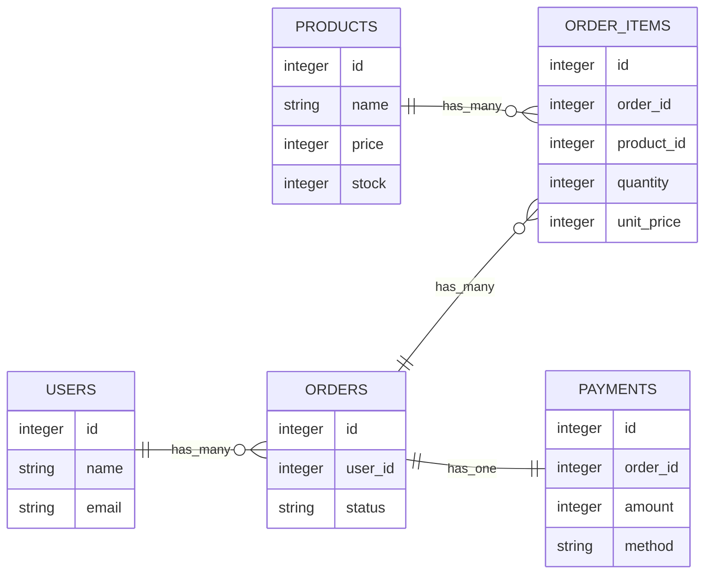

# 第4週：Stretch ── association を深くする

この課題は、[練習](practice.md) を終えた人向けの発展課題です。

まずは、ECサイトの注文まわりを題材にして、association を練習します。



---

## 準備：ECサイト用の Rails アプリを作る

ターミナルで次のコマンドを実行してください。
コマンドはまとめて貼り付けず、一行ずつ確かめながら入力しましょう。

```bash
cd ~
rails new shop_assoc_app
cd shop_assoc_app
```

次に、ECサイトで使うモデルを scaffold で作ります。

```bash
rails generate scaffold User name:string email:string
rails generate scaffold Product name:string price:integer stock:integer
rails generate scaffold Order user:references status:string
rails generate scaffold OrderItem order:references product:references quantity:integer unit_price:integer
rails generate scaffold Payment order:references amount:integer method:string
rails db:migrate
```

---

## 課題1：`schema.rb` でテーブルを確認する

`db/schema.rb` を開いて、次のテーブルがあることを確認してください。

- `users`
- `products`
- `orders`
- `order_items`
- `payments`

<details>
<summary>確認するところ</summary>

```ruby
create_table "users"
create_table "products"
create_table "orders"
create_table "order_items"
create_table "payments"
```

順番は違ってもOKです。

</details>

---

## 課題2：外部キーを確認する

`db/schema.rb` を見て、外部キーになっているカラムを探してください。

<details>
<summary>解答例</summary>

- `orders.user_id`
- `order_items.order_id`
- `order_items.product_id`
- `payments.order_id`

`add_foreign_key` も確認します。

```ruby
add_foreign_key "order_items", "orders"
add_foreign_key "order_items", "products"
add_foreign_key "orders", "users"
add_foreign_key "payments", "orders"
```

</details>

---

## 課題3：自動で作られた `belongs_to` を確認する

次のファイルを開いて、`belongs_to` が書かれていることを確認してください。

- `app/models/order.rb`
- `app/models/order_item.rb`
- `app/models/payment.rb`

<details>
<summary>解答例</summary>

```ruby
class Order < ApplicationRecord
  belongs_to :user
end
```

```ruby
class OrderItem < ApplicationRecord
  belongs_to :order
  belongs_to :product
end
```

```ruby
class Payment < ApplicationRecord
  belongs_to :order
end
```

</details>

---

## 課題4：`User` から `Order` をたどれるようにする

1人のユーザーは、複数の注文を持ちます。

`app/models/user.rb` に association を追加してください。

<details>
<summary>解答例</summary>

```ruby
class User < ApplicationRecord
  has_many :orders
end
```

</details>

---

## 課題5：`rails console` で `user.orders` を確認する

`rails console` を起動してください。

```bash
rails console
```

次の Ruby を実行して、`user.orders` が使えることを確認してください。

```ruby
user = User.create!(name: "田中", email: "tanaka@example.com")
order = Order.create!(user: user, status: "ordered")

user.orders
user.orders.count
```

<details>
<summary>確認すること</summary>

`user.orders.count` が `1` になればOKです。

</details>

---

## 課題6：`Order` から `OrderItem` をたどれるようにする

1つの注文には、複数の注文明細があります。

`app/models/order.rb` に association を追加してください。

モデルを変更したら、一度 `rails console` を終了して、もう一度起動してください。

```ruby
exit
```

```bash
rails console
```

<details>
<summary>解答例</summary>

```ruby
class Order < ApplicationRecord
  belongs_to :user
  has_many :order_items
end
```

</details>

---

## 課題7：`Product` から `OrderItem` をたどれるようにする

1つの商品は、複数の注文明細に使われます。

`app/models/product.rb` に association を追加してください。

モデルを変更したら、一度 `rails console` を終了して、もう一度起動してください。

```ruby
exit
```

```bash
rails console
```

<details>
<summary>解答例</summary>

```ruby
class Product < ApplicationRecord
  has_many :order_items
end
```

</details>

---

## 課題8：商品と注文明細を作る

`rails console` で、商品と注文明細を作ってください。

```ruby
user = User.first
order = user.orders.first

keyboard = Product.create!(name: "キーボード", price: 8000, stock: 10)
mouse = Product.create!(name: "マウス", price: 3000, stock: 20)

OrderItem.create!(order: order, product: keyboard, quantity: 1, unit_price: keyboard.price)
OrderItem.create!(order: order, product: mouse, quantity: 2, unit_price: mouse.price)
```

<details>
<summary>確認すること</summary>

```ruby
order.order_items.count
keyboard.order_items.count
mouse.order_items.count
```

`order.order_items.count` が `2` になればOKです。

</details>

---

## 課題9：注文合計をモデルのメソッドにする

注文合計は、画面やコンソールに毎回計算式を書くより、`Order` モデルのメソッドにする方が扱いやすくなります。

`order_items` の `quantity` と `unit_price` を使って、注文合計を返す `total_price` メソッドを作ってください。

<details>
<summary>解答例</summary>

`app/models/order.rb` を次のようにします。

```ruby
class Order < ApplicationRecord
  belongs_to :user
  has_many :order_items

  def total_price
    order_items.sum do |item|
      item.quantity * item.unit_price
    end
  end
end
```

モデルを変更したので、`rails console` を開き直します。

```ruby
exit
```

```bash
rails console
```

次の Ruby で確認します。

```ruby
order = Order.first
order.total_price
```

`14000` になればOKです。

</details>

---

## 課題10：`Order` から `Product` を直接たどれるようにする

今は、注文から商品を見るには `order.order_items` を経由する必要があります。

`has_many :through` を使って、`order.products` と書けるようにしてください。

<details>
<summary>解答例</summary>

```ruby
class Order < ApplicationRecord
  belongs_to :user
  has_many :order_items
  has_many :products, through: :order_items

  def total_price
    order_items.sum do |item|
      item.quantity * item.unit_price
    end
  end
end
```

</details>

---

## 課題11：`order.products` を確認する

モデルを変更したので、`rails console` を開き直してください。

```ruby
exit
```

```bash
rails console
```

次の Ruby を実行してください。

```ruby
order = Order.first
order.products
order.products.pluck(:name)
```

<details>
<summary>確認すること</summary>

```ruby
["キーボード", "マウス"]
```

のように表示されればOKです。

</details>

---

## 課題12：`Product` から `Order` を直接たどれるようにする

商品から、その商品を含む注文をたどれるようにしてください。

`app/models/product.rb` に `has_many :through` を追加します。

<details>
<summary>解答例</summary>

```ruby
class Product < ApplicationRecord
  has_many :order_items
  has_many :orders, through: :order_items
end
```

</details>

---

## 課題13：`product.orders` を確認する

`rails console` を開き直して、次の Ruby を実行してください。

```ruby
product = Product.find_by(name: "キーボード")
product.orders
product.orders.count
```

<details>
<summary>確認すること</summary>

`product.orders.count` が `1` になればOKです。

</details>

---

## 課題14：`Order` と `Payment` の関係を考える

今回の設計では、1つの注文に対して支払いは1つだけとします。

ここで、`has_one` という association を使います。

- `has_many` は、相手が複数あるときに使う
- `has_one` は、相手が1つだけあるときに使う
- `belongs_to` は、外部キーを持っている側に書く

今回、外部キーの `order_id` は `payments` テーブルにあります。
そのため、`Payment` 側は `belongs_to :order` になります。
一方で、`Order` から見ると支払いは1つだけなので、`has_one :payment` になります。

この場合、`Order` と `Payment` にはどの association を書けばよいでしょうか。

<details>
<summary>解答例</summary>

```ruby
class Order < ApplicationRecord
  belongs_to :user
  has_many :order_items
  has_many :products, through: :order_items
  has_one :payment

  def total_price
    order_items.sum do |item|
      item.quantity * item.unit_price
    end
  end
end
```

```ruby
class Payment < ApplicationRecord
  belongs_to :order
end
```

`payments` テーブルに `order_id` があるので、`Payment` 側は `belongs_to :order` です。
`Order` から見た支払いは1つだけなので、`Order` 側は `has_one :payment` です。

</details>

---

## 課題15：支払いデータを作る

モデルを変更したので、`rails console` を開き直してください。

```ruby
exit
```

```bash
rails console
```

`rails console` で、注文に支払いデータを追加してください。

```ruby
order = Order.first
Payment.create!(order: order, amount: 14000, method: "card")
```

<details>
<summary>確認すること</summary>

```ruby
order.payment
order.payment.amount
order.payment.method
```

`14000` と `"card"` が確認できればOKです。

</details>

---

## 課題16：`has_many` と `has_one` の違いを確認する

`Order` から見たとき、`order.order_items` と `order.payment` の戻り値は何が違うでしょうか。

`rails console` で確認してください。

```ruby
order = Order.first
order.order_items
order.payment
```

<details>
<summary>解答例</summary>

`order.order_items` は複数の注文明細を返します。

```ruby
order.order_items
```

`order.payment` は1つの支払いを返します。

```ruby
order.payment
```

複数なら `has_many`、1つだけなら `has_one` を使います。

</details>

---

## 課題17：注文を消したときの注文明細を考える

注文を削除したとき、その注文に属する注文明細も一緒に削除したいです。

`Order` の association を書き換えてください。

<details>
<summary>解答例</summary>

```ruby
class Order < ApplicationRecord
  belongs_to :user
  has_many :order_items, dependent: :destroy
  has_many :products, through: :order_items
  has_one :payment

  def total_price
    order_items.sum do |item|
      item.quantity * item.unit_price
    end
  end
end
```

`dependent: :destroy` を付けると、注文を削除したときに注文明細も削除されます。

</details>

---

## 課題18：注文を消したときの支払いを考える

注文を削除したとき、支払いデータも一緒に削除したいです。

`Order` の association をもう一度書き換えてください。

<details>
<summary>解答例</summary>

```ruby
class Order < ApplicationRecord
  belongs_to :user
  has_many :order_items, dependent: :destroy
  has_many :products, through: :order_items
  has_one :payment, dependent: :destroy

  def total_price
    order_items.sum do |item|
      item.quantity * item.unit_price
    end
  end
end
```

</details>

---

## 課題19：削除の動きを確認する

`rails console` を開き直して、注文を削除したときに注文明細と支払いも削除されるか確認してください。

```ruby
order = Order.first
order.order_items.count
order.payment

order.destroy

OrderItem.count
Payment.count
```

<details>
<summary>確認すること</summary>

今回作ったデータだけなら、最後は次のようになります。

```ruby
OrderItem.count
#=> 0

Payment.count
#=> 0
```

</details>

---

## 課題20：ECサイトの association を説明する

最後に、今回作った association を自分の言葉で説明してください。

次の4つを説明できればOKです。

- `User` と `Order`
- `Order` と `OrderItem`
- `Product` と `OrderItem`
- `Order` と `Payment`

<details>
<summary>解答例</summary>

```ruby
class User < ApplicationRecord
  has_many :orders
end
```

```ruby
class Order < ApplicationRecord
  belongs_to :user
  has_many :order_items, dependent: :destroy
  has_many :products, through: :order_items
  has_one :payment, dependent: :destroy

  def total_price
    order_items.sum do |item|
      item.quantity * item.unit_price
    end
  end
end
```

```ruby
class OrderItem < ApplicationRecord
  belongs_to :order
  belongs_to :product
end
```

```ruby
class Product < ApplicationRecord
  has_many :order_items
  has_many :orders, through: :order_items
end
```

```ruby
class Payment < ApplicationRecord
  belongs_to :order
end
```

- ユーザーは複数の注文を持つ
- 注文は1人のユーザーに属する
- 注文は複数の注文明細を持つ
- 商品は複数の注文明細に使われる
- 注文と商品は、注文明細を通してつながる
- 注文は1つの支払いを持つ

</details>
