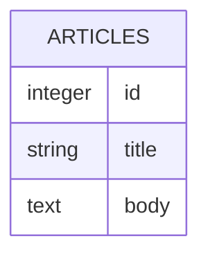
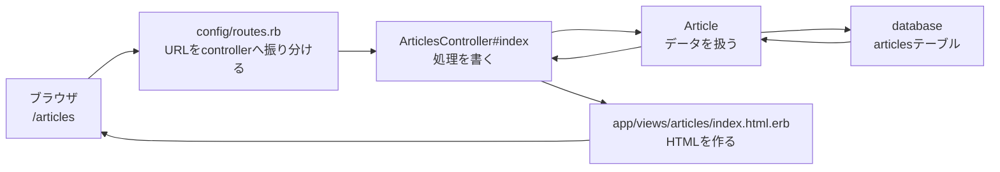
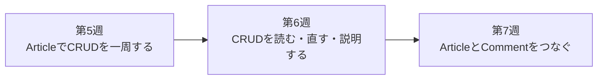

# 第5週：scaffoldなしCRUD（1）ArticleでCRUDを一周する

## 今日のゴール

<ruby>scaffold<rt>スキャフォールド</rt></ruby>を使わずに、`Article` のCRUDを一周します。

今日は、1つ1つの細かい書き方を完全に暗記する日ではありません。`routes`、`controller`、`view`、`model` がどのようにつながって、一覧・詳細・作成・編集・削除が動くのかを、全体の地図としてつかむ日です。

---

## 前回のおさらい

前回は、モデル同士のつながりをRailsのコードで表しました。

```ruby
class Category < ApplicationRecord
  has_many :articles
end
```

```ruby
class Article < ApplicationRecord
  belongs_to :category
  has_many :comments
end
```

```ruby
class Comment < ApplicationRecord
  belongs_to :article
end
```

第2週から第4週までは、データベースとモデルの関係を中心に扱いました。

- 第2週：ER図でテーブル同士の関係を考えた
- 第3週：migration でデータベースの形を作った
- 第4週：model に `has_many` / `belongs_to` を書いた

今週からは、そのデータをブラウザから操作できるようにします。

---

## CRUDとは

CRUDは、Webアプリでデータを扱うための4つの基本操作です。

| 操作 | 意味 | Railsで対応するアクション |
|---|---|---|
| Create | 作成する | `new`, `create` |
| Read | 読む | `index`, `show` |
| Update | 更新する | `edit`, `update` |
| Delete | 削除する | `destroy` |

Railsでは、1つのデータを扱う処理を、次の7つのアクションに分けて考えます。

| アクション | 役割 |
|---|---|
| `index` | 一覧を表示する |
| `show` | 1件の詳細を表示する |
| `new` | 新規作成フォームを表示する |
| `create` | フォームから送られた内容を保存する |
| `edit` | 編集フォームを表示する |
| `update` | フォームから送られた内容で更新する |
| `destroy` | データを削除する |

今日は、この7つを `Article` で一通り作ります。

---

## scaffoldなしで作る意味

`rails generate scaffold Article title:string body:text` を実行すると、CRUDに必要なファイルはまとめて作られます。

それは便利です。

しかし、scaffoldが作ったものを眺めているだけでは、次のことが見えにくくなります。

- URLとcontrollerの対応
- controllerがどのmodelを呼んでいるか
- controllerからviewへ何を渡しているか
- formから送られた値がどこで受け取られるか
- 保存に成功したときと失敗したときの流れ

だから今週は、scaffoldを使わずに小さくCRUDを一周します。

---

## 今週作るもの

今週は、`Article` だけを使います。



`Article` には、次の2つの入力項目があります。

| カラム | 意味 |
|---|---|
| `title` | 記事のタイトル |
| `body` | 記事の本文 |

今回は、`Category` や `Comment` はいったん使いません。
まずは `Article` だけでCRUDの流れを一周します。

`Article` と `Comment` の関係は、第7週で扱います。

---

## リクエストの流れ

Railsアプリでは、ブラウザからリクエストが来ると、だいたい次の順番で処理されます。



この流れは、`show`、`new`、`create`、`edit`、`update`、`destroy` でも基本は同じです。

まず `routes` が受け取り、`controller` が処理し、必要なら `model` を通してデータベースを使い、最後に `view` で画面を作ります。

---

## `resources :articles`

Railsでは、`config/routes.rb` に次のように書くと、CRUDに必要なルートがまとめて作られます。

```ruby
resources :articles
```

この1行から、たとえば次のようなルートが作られます。

| HTTPメソッド | パス | アクション | 役割 |
|---|---|---|---|
| GET | `/articles` | `index` | 一覧 |
| GET | `/articles/:id` | `show` | 詳細 |
| GET | `/articles/new` | `new` | 新規作成フォーム |
| POST | `/articles` | `create` | 作成 |
| GET | `/articles/:id/edit` | `edit` | 編集フォーム |
| PATCH | `/articles/:id` | `update` | 更新 |
| DELETE | `/articles/:id` | `destroy` | 削除 |

ここがCRUDの地図です。

URLを見たときに、どのcontrollerのどのアクションに行くのかを追えることが大事です。

---

## 画面を表示するアクションと、保存するアクション

CRUDのアクションは、大きく2種類に分けられます。

### 画面を表示するアクション

- `index`
- `show`
- `new`
- `edit`

これらは、主にHTMLを表示するためのアクションです。

たとえば `index` なら、記事一覧を取り出して、一覧画面を表示します。

```ruby
def index
  @articles = Article.all
end
```

### データを変更するアクション

- `create`
- `update`
- `destroy`

これらは、データベースの中身を変更するアクションです。

たとえば `create` なら、フォームから送られた値を使って、新しい記事を保存します。

```ruby
def create
  @article = Article.new(article_params)

  if @article.save
    redirect_to @article
  else
    render :new, status: :unprocessable_entity
  end
end
```

`create`、`update`、`destroy` は、データを変えるので特に慎重に読みます。

---

## `params` と Strong Parameters

フォームから送られた値は、controllerでは `params` から取り出します。

ただし、Railsでは何でも自由に保存できるようにはしません。
保存してよい項目を明示します。

```ruby
def article_params
  params.require(:article).permit(:title, :body)
end
```

このように、保存してよいカラムを指定する仕組みを Strong Parameters と呼びます。
`permit` は <ruby>permit<rt>パーミット</rt></ruby> と読み、「許可する」という意味です。

今回なら、保存してよいのは `title` と `body` です。

---

## `redirect_to` と `render`

controllerでは、処理のあとに次のどちらかを使って、次に表示する画面を決めます。

| 書き方 | 意味 |
|---|---|
| `redirect_to` | 別のURLへ移動する |
| `render` | 指定したviewを表示する |

たとえば、保存に成功したら詳細画面へ移動します。

```ruby
redirect_to @article
```

保存に失敗したら、入力画面をもう一度表示します。

```ruby
render :new, status: :unprocessable_entity
```

今週はまず動かすことを優先します。
第6週で、この `params`、`redirect_to`、`render` の流れをもう少し丁寧に読み直します。

---

## 今週から来週へ

今週は、scaffoldなしで `Article` のCRUDを一周します。



今日の目的は、すべてを完璧に覚えることではありません。

まず、CRUD全体の流れを1回通すことです。

来週は、今日作ったCRUDを読み直し、壊れたところを直しながら、`routes`、`controller`、`params`、`form`、`redirect_to`、`render` を説明できる状態に近づけます。

---

## まとめ

今日やること：

1. scaffoldなしで `Article` のCRUDを一周する
2. `resources :articles` から7つのアクションが作られることを確認する
3. `routes`、`controller`、`view`、`model` のつながりを見る
4. `params` と Strong Parameters の役割を知る
5. `redirect_to` と `render` の違いに触れる

> [!IMPORTANT]
> - CRUDは、作成・読み取り・更新・削除の基本操作
> - Railsでは `index` / `show` / `new` / `create` / `edit` / `update` / `destroy` の7つのアクションに分けてCRUDを扱う
> - `resources :articles` はCRUDのルートをまとめて作る
> - scaffoldなしで作ることで、Railsが何をしているか見えやすくなる
> - 今週は全体を一周し、第6週で細部を読み直す

[練習](practice.md) へ進みましょう。
