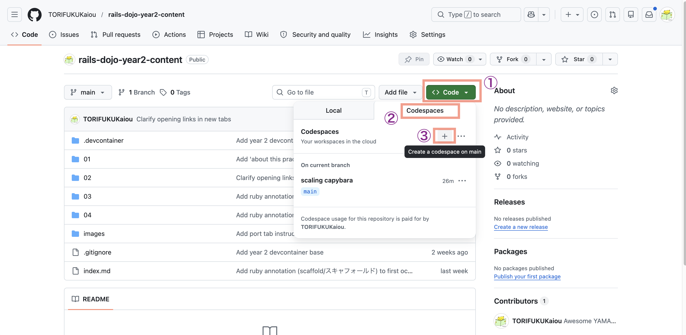

# 第5週：練習 ── ArticleでscaffoldなしCRUDを一周する

## 今日のゴール

<ruby>scaffold<rt>スキャフォールド</rt></ruby>を使わずに、`Article` の一覧・詳細・作成・編集・削除を一通り動かせるようになる。

今日は、きれいなコードに整理することよりも、CRUD全体を一度通すことを優先します。1つ書いたら、必ず `rails routes`、ブラウザ、画面表示のどれかで確認しながら進めます。

---

## この練習について

今日の練習では、コードを書いてすぐ確認するサイクルを何度も回します。

- route を書いたら `rails routes` で確認する
- controller を書いたら、ブラウザでアクセスする
- view を書いたら、画面に出るか確認する
- form を書いたら、保存・更新できるか確認する

一気に最後まで書いてから動かすと、エラーが出たときに原因を探しにくくなります。
小さく書いて、小さく確認しましょう。

---

## 準備

この練習は、GitHub Codespaces 上で行います。

前回の続きは使わず、 **新しく Codespace を作って** 始めてください。

生徒ごとに前回の状態が違うため、第5週用に `manual_crud_app` という Rails アプリを新しく作ります。

1. GitHubにログインする
2. [このリポジトリ](https://github.com/TORIFUKUKaiou/rails-dojo-year2-content/)を開く（リンクを右クリックして、「リンクを新しいタブで開く」）
3. リポジトリの `Code` ボタン → `Codespaces` タブを開く
4. `Create a codespace on main(+)` をクリックする

    

    ---

    **緑のボタンがある場合**は、この手順でも構いません。`Create codespace on main` をクリックしてください。

    
    ---

5. ターミナルに `準備完了` と表示されたら、Codespaces の起動完了

> [!TIP]
> **コマンドは一行ずつ実行しよう**
> ひとつひとつ実行結果を確かめながら進むのが、上達への近道です。エラーが起きても原因を見つけやすくなります。

次に、Rails をインストールします。

```bash
gem install rails -v "~> 8.1.0" --no-document
rails -v
```

`rails 8.1.x` のように表示されたら、Rails が使える状態です。

> [!NOTE]
> 環境によっては、`Required ruby-... is not installed.` のような表示が出ることがあります。
> そのあとに `Rails 8.1.x` と表示されていれば、この練習は続けて構いません。

続いて、第5週用の Rails アプリを作ります。

```bash
cd ~/
rails new manual_crud_app
cd manual_crud_app
```

`rails new manual_crud_app` は、必要なファイルとライブラリを作るため時間がかかります。終わるまで待ってください。

---

## 1. `Article` モデルを作る

今回は scaffold を使いません。
まずは、記事を保存するための `Article` モデルだけを作ります。

### 作る前に確認する

まだ `Article` モデルはありません。
ファイル一覧で、次のファイルが存在しないことを確認してください。

- `app/models/article.rb`
- `db/migrate/xxxx_create_articles.rb`

scaffoldではなく、これから自分で必要な部品を増やしていきます。

### 書く・実行する

```bash
rails generate model Article title:string body:text
rails db:migrate
```

### 実行した後に確認する

ここまで実行したら、次のファイルが作られたことを確認してください。

- `app/models/article.rb`
- `db/migrate/xxxx_create_articles.rb`
- `db/schema.rb`

`db/schema.rb` に `articles` テーブルがあり、`title` と `body` があればOKです。

<details>
<summary>確認する内容</summary>

`db/schema.rb` の `articles` は、だいたい次のような形です。

```ruby
create_table "articles", force: :cascade do |t|
  t.string "title"
  t.text "body"
  t.datetime "created_at", null: false
  t.datetime "updated_at", null: false
end
```

カラムの順番は環境によって少し違うことがあります。`title` と `body` があればOKです。

</details>

---

## 2. Codespacesで開くための設定を追加する

Codespaces で `rails server` を使うと、そのままでは `Blocked hosts` や `InvalidAuthenticityToken` で止まることがあります。開発用の設定ファイルを追加します。

### 書く前に確認する

ファイル一覧で、`config/initializers/codespaces.rb` がまだ存在しないことを確認してください。

### 書く

1. `config/initializers/codespaces.rb` を作る
2. 以下を書きます

```ruby
# GitHub Codespaces で開発するための緩和設定（開発用）
Rails.application.configure do
  config.hosts << /.*\.github\.dev/
  config.action_controller.forgery_protection_origin_check = false

  if defined?(WebConsole)
    config.web_console.permissions = '0.0.0.0/0'
  end
end
```

### 書いた後に確認する

`config/initializers/codespaces.rb` を開き、次の3つが入っていることを確認してください。

- `config.hosts`
- `forgery_protection_origin_check`
- `web_console.permissions`

---

## 3. CRUDのルートを作る

`config/routes.rb` を開いて、次のようにしてください。

### 書く前に確認する

まず、現在のルートを確認します。

```bash
rails routes -g article
```

まだ `resources :articles` を書いていないので、`articles#index` や `articles#show` は出てこないはずです。

次に、`config/routes.rb` を開き、`resources :articles` がまだないことを確認してください。

### 書く

```ruby
Rails.application.routes.draw do
  resources :articles
end
```

### 書いた後に確認する

書いたら、もう一度ターミナルで確認します。

```bash
rails routes -g article
```

次の7つのアクションが見えればOKです。

- `index`
- `show`
- `new`
- `create`
- `edit`
- `update`
- `destroy`

<details>
<summary>確認すること</summary>

`rails routes -g article` の結果には、次のような行が出ます。

```text
    articles GET    /articles(.:format)          articles#index
             POST   /articles(.:format)          articles#create
 new_article GET    /articles/new(.:format)      articles#new
edit_article GET    /articles/:id/edit(.:format) articles#edit
     article GET    /articles/:id(.:format)      articles#show
             PATCH  /articles/:id(.:format)      articles#update
             PUT    /articles/:id(.:format)      articles#update
             DELETE /articles/:id(.:format)      articles#destroy
```

環境によって空白の幅は少し違います。大事なのは、`index`、`show`、`new`、`create`、`edit`、`update`、`destroy` がそろっていることです。

</details>

---

## 4. controller と view のフォルダを用意する

scaffold を使っていないので、controller と view を自分で用意します。

### 作る前に確認する

ファイル一覧で、次の2つがまだ存在しないことを確認してください。

- `app/controllers/articles_controller.rb`
- `app/views/articles/`

### 作る

次のファイルを作ってください。

- `app/controllers/articles_controller.rb`

中身は、まず空に近い形で作ります。

```ruby
class ArticlesController < ApplicationController
end
```

次に、view を置くフォルダを作ります。

```bash
mkdir -p app/views/articles
```

### 作った後に確認する

次の2つが存在することを確認してください。

- `app/controllers/articles_controller.rb`
- `app/views/articles/`

この時点では、まだ `/articles` は正しく表示できません。controller と view の中身をこれから書いていきます。

ブラウザで `/articles` を開くと、`index` がない、またはテンプレートがないというエラーになります。エラーが出るのは正常です。

---

## 5. `index` を作る

まず、記事一覧を表示する `index` を作ります。

### 書く前に確認する

ブラウザで `/articles` を開いてください。

この時点では、まだ `index` アクションや `index.html.erb` を作っていないので、エラーになります。

確認すること：

- `/articles` というURLには到達している
- ただし、controller の action または view が足りない

エラー画面を見たら、次に進みます。

### 書く

`app/controllers/articles_controller.rb` を次のように変更してください。

```ruby
class ArticlesController < ApplicationController
  def index
    @articles = Article.all
  end
end
```

次に、`app/views/articles/index.html.erb` を作って、次のように書きます。

```erb
<h1>記事一覧</h1>

<p><%= link_to "新規作成", new_article_path %></p>

<% if @articles.empty? %>
  <p>記事はまだありません。</p>
<% else %>
  <% @articles.each do |article| %>
    <div>
      <h2><%= article.title %></h2>
      <p><%= article.body %></p>
      <p><%= link_to "詳細", article_path(article) %></p>
    </div>
  <% end %>
<% end %>
```

### 書いた後に確認する

ここでサーバーを起動します。

```bash
rails server
```

> [!IMPORTANT]
> `rails server` を実行したターミナルは、サーバー専用にします。
> サーバーが動いている間、そのターミナルには次のコマンドを入力できません。
> 以降の `rails console` や `rails routes` などは、別のターミナルを開いて実行してください。

サーバーを止めたいときは、`rails server` を動かしているターミナルで `Ctrl + C` を押します。
`config/initializers/codespaces.rb` などの設定ファイルを変更したときは、一度 `Ctrl + C` で止めて、もう一度 `rails server` を実行してください。

ポートタブの `3000` にカーソルをあて、`転送されたアドレス` で 🌐 アイコンを押すとブラウザでRailsアプリを開けます。


ブラウザで `/articles` を開いてください。

確認すること：

- `記事一覧` と表示される
- `記事はまだありません。` と表示される
- `新規作成` リンクが表示される

> [!IMPORTANT]
> ここで `uninitialized constant ArticlesController` や `Missing template` が出たら、controller のファイル名、クラス名、view のファイル名を確認してください。

---

## 6. 確認用の記事を作る

一覧画面に表示する記事を、`rails console` から作ります。

> [!IMPORTANT]
> `rails server` が動いているターミナルには入力しません。
> 必ず別のターミナルを開いて、そこで `rails console` を実行してください。

### 作る前に確認する

ブラウザで `/articles` を開き、次の表示になっていることを確認してください。

- `記事一覧`
- `記事はまだありません。`

まだ記事を作っていないので、この表示で正常です。

### 作る

`rails server` を動かしているターミナルはそのままにして、別のターミナルを開いてください。

```bash
rails console
```

Rails console が開いたら、次を入力します。

```ruby
Article.create!(title: "はじめての記事", body: "本文です")
Article.create!(title: "2つ目の記事", body: "もう1つの記事です")
exit
```

### 作った後に確認する

ブラウザで `/articles` を再読み込みしてください。

確認すること：

- `はじめての記事` が表示される
- `2つ目の記事` が表示される
- それぞれに `詳細` リンクが表示される

---

## 7. `show` を作る

次に、1件の記事を表示する `show` を作ります。

### 書く前に確認する

ブラウザで `/articles` を開き、記事の `詳細` リンクをクリックしてください。

この時点では、まだ `show` アクションや `show.html.erb` を作っていないので、エラーになります。

確認すること：

- `詳細` リンクのURLは `/articles/1` のような形になっている
- ただし、詳細画面を表示する処理がまだ足りない

エラー画面を見たら、次に進みます。

### 書く

`app/controllers/articles_controller.rb` に `show` を追加してください。

```ruby
class ArticlesController < ApplicationController
  def index
    @articles = Article.all
  end

  def show
    @article = Article.find(params[:id])
  end
end
```

次に、`app/views/articles/show.html.erb` を作って、次のように書きます。

```erb
<h1><%= @article.title %></h1>

<p><%= @article.body %></p>

<p><%= link_to "一覧に戻る", articles_path %></p>
```

### 書いた後に確認する

ブラウザで `/articles` を開き、記事の `詳細` リンクをクリックしてください。

確認すること：

- 詳細画面に移動する
- タイトルと本文が表示される
- `一覧に戻る` で一覧に戻れる

---

## 8. `new` を作る

次に、新規作成フォームを表示する `new` を作ります。

### 書く前に確認する

ブラウザで `/articles` を開き、`新規作成` リンクをクリックしてください。

この時点では、まだ `new` アクションや `new.html.erb` を作っていないので、エラーになります。

確認すること：

- `新規作成` リンクのURLは `/articles/new` になっている
- ただし、新規作成フォームを表示する処理がまだ足りない

エラー画面を見たら、次に進みます。

### 書く

`app/controllers/articles_controller.rb` に `new` を追加してください。

```ruby
class ArticlesController < ApplicationController
  def index
    @articles = Article.all
  end

  def show
    @article = Article.find(params[:id])
  end

  def new
    @article = Article.new
  end
end
```

次に、`app/views/articles/new.html.erb` を作って、次のように書きます。

```erb
<h1>記事を作成する</h1>

<%= form_with model: @article do |form| %>
  <div>
    <%= form.label :title, "タイトル" %><br>
    <%= form.text_field :title %>
  </div>

  <div>
    <%= form.label :body, "本文" %><br>
    <%= form.text_area :body %>
  </div>

  <div>
    <%= form.submit "作成する" %>
  </div>
<% end %>

<p><%= link_to "一覧に戻る", articles_path %></p>
```

### 書いた後に確認する

ブラウザで `/articles/new` を開いてください。

確認すること：

- タイトル入力欄がある
- 本文入力欄がある
- `作成する` ボタンがある

まだ保存はできません。保存するには、次の `create` が必要です。

---

## 9. `create` を作る

フォームから送られた内容を保存する `create` を作ります。

### 書く前に確認する

ブラウザで `/articles/new` を開き、タイトルと本文を入力して `作成する` を押してください。

この時点では、まだ `create` アクションを作っていないので、保存できずにエラーになります。

確認すること：

- フォーム画面は表示できている
- しかし、送信先の `create` がまだない

エラー画面を見たら、次に進みます。

### 書く

`app/controllers/articles_controller.rb` を次のように変更してください。

```ruby
class ArticlesController < ApplicationController
  def index
    @articles = Article.all
  end

  def show
    @article = Article.find(params[:id])
  end

  def new
    @article = Article.new
  end

  def create
    @article = Article.new(article_params)

    if @article.save
      redirect_to @article
    else
      render :new, status: :unprocessable_entity
    end
  end

  private

  def article_params
    params.require(:article).permit(:title, :body)
  end
end
```

`permit` は <ruby>permit<rt>パーミット</rt></ruby> と読み、「許可する」という意味です。
ここでは、保存してよい項目として `title` と `body` を許可しています。

### 書いた後に確認する

ブラウザで `/articles/new` を開き、記事を作成してください。

確認すること：

- `作成する` を押すと詳細画面に移動する
- 入力したタイトルと本文が表示される
- `/articles` に戻ると、作成した記事が一覧に出る

---

## 10. `edit` を作る

次に、編集フォームを表示する `edit` を作ります。

### 書く前に確認する

ブラウザで記事の詳細画面を開いてください。

この時点では、まだ詳細画面に `編集` リンクがありません。

確認すること：

- 詳細画面は表示できる
- しかし、編集画面へ移動するリンクがまだない

次に、URLを直接入力して `/articles/1/edit` のようなページを開いてください。
まだ `edit` アクションや `edit.html.erb` がないので、エラーになります。

エラー画面を見たら、次に進みます。

### 書く

`app/controllers/articles_controller.rb` に `edit` を追加してください。

```ruby
class ArticlesController < ApplicationController
  def index
    @articles = Article.all
  end

  def show
    @article = Article.find(params[:id])
  end

  def new
    @article = Article.new
  end

  def create
    @article = Article.new(article_params)

    if @article.save
      redirect_to @article
    else
      render :new, status: :unprocessable_entity
    end
  end

  def edit
    @article = Article.find(params[:id])
  end

  private

  def article_params
    params.require(:article).permit(:title, :body)
  end
end
```

`app/views/articles/edit.html.erb` を作って、次のように書きます。

```erb
<h1>記事を編集する</h1>

<%= form_with model: @article do |form| %>
  <div>
    <%= form.label :title, "タイトル" %><br>
    <%= form.text_field :title %>
  </div>

  <div>
    <%= form.label :body, "本文" %><br>
    <%= form.text_area :body %>
  </div>

  <div>
    <%= form.submit "更新する" %>
  </div>
<% end %>

<p><%= link_to "詳細に戻る", article_path(@article) %></p>
<p><%= link_to "一覧に戻る", articles_path %></p>
```

`app/views/articles/show.html.erb` に、編集リンクを追加してください。

```erb
<h1><%= @article.title %></h1>

<p><%= @article.body %></p>

<p><%= link_to "編集", edit_article_path(@article) %></p>
<p><%= link_to "一覧に戻る", articles_path %></p>
```

### 書いた後に確認する

ブラウザで記事の詳細画面を開き、`編集` をクリックしてください。

確認すること：

- 編集画面に移動する
- もとのタイトルと本文がフォームに入っている

まだ更新はできません。更新するには、次の `update` が必要です。

---

## 11. `update` を作る

フォームから送られた内容で記事を更新する `update` を作ります。

### 書く前に確認する

ブラウザで編集画面を開き、タイトルや本文を変更して `更新する` を押してください。

この時点では、まだ `update` アクションを作っていないので、更新できずにエラーになります。

確認すること：

- 編集フォームは表示できている
- しかし、送信先の `update` がまだない

エラー画面を見たら、次に進みます。

### 書く

`app/controllers/articles_controller.rb` を次のように変更してください。

```ruby
class ArticlesController < ApplicationController
  def index
    @articles = Article.all
  end

  def show
    @article = Article.find(params[:id])
  end

  def new
    @article = Article.new
  end

  def create
    @article = Article.new(article_params)

    if @article.save
      redirect_to @article
    else
      render :new, status: :unprocessable_entity
    end
  end

  def edit
    @article = Article.find(params[:id])
  end

  def update
    @article = Article.find(params[:id])

    if @article.update(article_params)
      redirect_to @article
    else
      render :edit, status: :unprocessable_entity
    end
  end

  private

  def article_params
    params.require(:article).permit(:title, :body)
  end
end
```

### 書いた後に確認する

ブラウザで編集画面を開き、タイトルや本文を変更して `更新する` を押してください。

確認すること：

- 詳細画面に移動する
- 変更したタイトルと本文が表示される
- 一覧画面でも変更後の内容になっている

---

## 12. `destroy` を作る

最後に、記事を削除する `destroy` を作ります。

### 書く前に確認する

ブラウザで記事の詳細画面を開いてください。

この時点では、まだ削除ボタンがありません。

確認すること：

- 詳細画面は表示できる
- しかし、記事を削除する入口がまだない

次に進みます。

### 書く

`app/controllers/articles_controller.rb` を次のように変更してください。

```ruby
class ArticlesController < ApplicationController
  def index
    @articles = Article.all
  end

  def show
    @article = Article.find(params[:id])
  end

  def new
    @article = Article.new
  end

  def create
    @article = Article.new(article_params)

    if @article.save
      redirect_to @article
    else
      render :new, status: :unprocessable_entity
    end
  end

  def edit
    @article = Article.find(params[:id])
  end

  def update
    @article = Article.find(params[:id])

    if @article.update(article_params)
      redirect_to @article
    else
      render :edit, status: :unprocessable_entity
    end
  end

  def destroy
    @article = Article.find(params[:id])
    @article.destroy

    redirect_to articles_path
  end

  private

  def article_params
    params.require(:article).permit(:title, :body)
  end
end
```

`app/views/articles/show.html.erb` に、削除ボタンを追加してください。

```erb
<h1><%= @article.title %></h1>

<p><%= @article.body %></p>

<p><%= link_to "編集", edit_article_path(@article) %></p>

<%= button_to "削除", article_path(@article), method: :delete %>

<p><%= link_to "一覧に戻る", articles_path %></p>
```

### 書いた後に確認する

ブラウザで記事の詳細画面を開き、`削除` を押してください。

確認すること：

- 一覧画面に移動する
- 削除した記事が一覧から消える

> [!IMPORTANT]
> `button_to` はフォームを作ってリクエストを送ります。削除のようにデータを変更する操作では、リンクではなくボタンを使うと考えてください。

---

## 13. CRUD全体を確認する

最後に、ブラウザで次の操作を順番に確認してください。

1. `/articles` で一覧を見る
2. `新規作成` から記事を作る
3. 作成後、詳細画面に移動する
4. `編集` から記事を更新する
5. 更新後、詳細画面に移動する
6. `削除` で記事を削除する
7. 一覧画面から記事が消えていることを確認する

ここまでできたら、`Article` のCRUDを一周できています。

---

## 14. どのファイルが何をしたか確認する

今日作ったファイルと役割を確認します。

| ファイル | 役割 |
|---|---|
| `config/routes.rb` | URLをcontrollerのアクションに振り分ける |
| `app/controllers/articles_controller.rb` | `Article` を取り出す、保存する、更新する、削除する |
| `app/models/article.rb` | `articles` テーブルと対応するモデル |
| `app/views/articles/index.html.erb` | 一覧画面 |
| `app/views/articles/show.html.erb` | 詳細画面 |
| `app/views/articles/new.html.erb` | 新規作成フォーム |
| `app/views/articles/edit.html.erb` | 編集フォーム |

次の問いに答えてみましょう。

1. `/articles` にアクセスしたとき、どのcontrollerアクションが動くか
2. `/articles/new` にアクセスしたとき、どのcontrollerアクションが動くか
3. 作成フォームの送信先は、どのcontrollerアクションか
4. 編集フォームの送信先は、どのcontrollerアクションか
5. 削除ボタンを押したとき、どのcontrollerアクションが動くか

<details>
<summary>解答例</summary>

1. `ArticlesController#index`
2. `ArticlesController#new`
3. `ArticlesController#create`
4. `ArticlesController#update`
5. `ArticlesController#destroy`

</details>

---

## まとめ

今日やったこと：

1. scaffoldを使わずに `Article` モデルを作った
2. `resources :articles` でCRUDのルートを作った
3. `index` / `show` / `new` / `create` / `edit` / `update` / `destroy` を書いた
4. フォームから送られた値を `article_params` で受け取った
5. ブラウザで一覧・詳細・作成・編集・削除を確認した

次週は、今日作ったCRUDを読み直し、壊れたところを直しながら、`routes`、`controller`、`params`、`form`、`redirect_to`、`render` を説明できる状態に近づけます。
