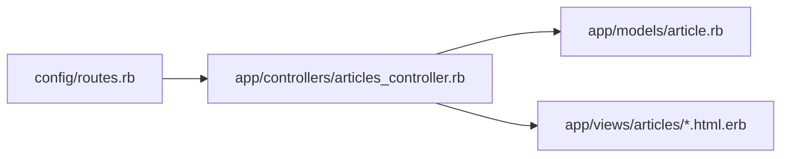
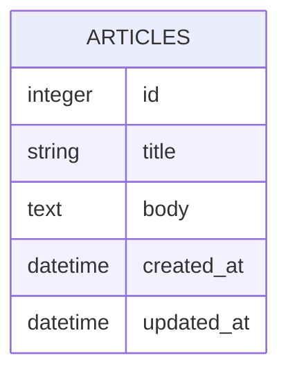
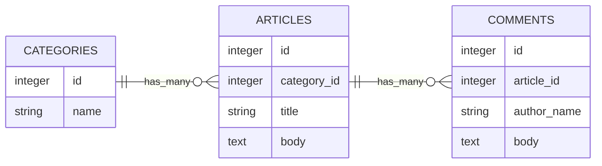

# 第5週：Stretch ── Article CRUDを少しずつ改造する

この課題は、[練習](practice.md) を終えた人向けの発展課題です。

Practice で作った `manual_crud_app` をそのまま使います。
新しい Rails アプリは作りません。

> [!IMPORTANT]
> この Stretch は、作ったCRUDを読み直しながら小さく改造する練習です。
> 1つ変更したら、必ずブラウザで確認してください。
> エラーが出たら、直前に変更したファイルを見直しましょう。

> [!IMPORTANT]
> この Stretch には、orientation や Practice でまだ詳しく扱っていない内容も含まれています。
> たとえば、`order`、`truncate`、`strftime` などです。
> まずは自分でコードを読み、実行結果を確認しながら考えてください。
> そのうえで、Google検索をしたり、生成AIに「Rails の truncate とは？」のように相談したりしながら、解答にたどり着く練習もしてみましょう。

解答例では、次の順番で示します。

1. 対象ファイル
2. 変更前
3. 変更後
4. この時点での正解全体

まずは「変更前」と「変更後」を見比べて、どこが変わったのかを確認してください。
迷ったときは「この時点での正解全体」を見て、ファイル全体の形を確認してください。

今回使う主なファイルは次の4つです。



今は `Article` だけを使います。



---

## 準備

Practice で作ったアプリに移動してください。

```bash
cd ~/manual_crud_app
```

Practice の最後に `rails server` を起動したままなら、そのままで構いません。
サーバーが起動していない場合は、次のコマンドで起動してください。

```bash
rails server
```

> [!IMPORTANT]
> `rails server` を実行したターミナルは、サーバー専用にします。
> 以降の `rails console` や `rails routes` などは、別のターミナルで実行してください。

ブラウザで `/articles` を開き、一覧画面が表示されることを確認してください。

---

## 課題1：今のCRUDを確認する

まず、Practice で作ったCRUDが動くことを確認します。

ブラウザで次の操作をしてください。

1. `/articles` を開く
2. `新規作成` から記事を1件作る
3. 詳細画面でタイトルと本文を確認する
4. `編集` からタイトルを変更する
5. 詳細画面で変更後のタイトルを確認する
6. `削除` で記事を削除する

<details>
<summary>確認すること</summary>

- 一覧画面を表示できる
- 新規作成できる
- 詳細画面を表示できる
- 編集できる
- 削除できる

ここでエラーが出る場合は、Stretch に進む前に Practice の完成形を見直してください。

</details>

---

## 課題2：一覧を新しい記事から表示する

今の一覧は、作成された順に表示されています。
新しい記事が上に来るように変更してください。

> [!TIP]
> `order` は、データを並び替えて取り出すためのメソッドです。
> `created_at: :desc` は「作成日時の新しい順」という意味です。

<details>
<summary>解答例</summary>

対象ファイル：

```text
app/controllers/articles_controller.rb
```

変更前：

```ruby
def index
  @articles = Article.all
end
```

変更後：

```ruby
def index
  @articles = Article.order(created_at: :desc)
end
```

この時点での正解全体：

```ruby
class ArticlesController < ApplicationController
  def index
    @articles = Article.order(created_at: :desc)
  end

  def show
    @article = Article.find(params[:id])
  end

  def new
    @article = Article.new
  end

  def create
    @article = Article.new(article_params)

    if @article.save
      redirect_to @article
    else
      render :new, status: :unprocessable_entity
    end
  end

  def edit
    @article = Article.find(params[:id])
  end

  def update
    @article = Article.find(params[:id])

    if @article.update(article_params)
      redirect_to @article
    else
      render :edit, status: :unprocessable_entity
    end
  end

  def destroy
    @article = Article.find(params[:id])
    @article.destroy

    redirect_to articles_path
  end

  private

  def article_params
    params.require(:article).permit(:title, :body)
  end
end
```

ブラウザで `/articles` を再読み込みし、新しく作った記事ほど上に表示されることを確認してください。

</details>

---

## 課題3：一覧に記事数を表示する

一覧画面に、記事の件数を表示してください。

例：

```text
記事数：3件
```

<details>
<summary>解答例</summary>

対象ファイル：

```text
app/views/articles/index.html.erb
```

変更前：

```erb
<h1>記事一覧</h1>

<p><%= link_to "新規作成", new_article_path %></p>
```

変更後：

```erb
<h1>記事一覧</h1>

<p>記事数：<%= @articles.count %>件</p>

<p><%= link_to "新規作成", new_article_path %></p>
```

この時点での正解全体：

```erb
<h1>記事一覧</h1>

<p>記事数：<%= @articles.count %>件</p>

<p><%= link_to "新規作成", new_article_path %></p>

<% if @articles.empty? %>
  <p>記事はまだありません。</p>
<% else %>
  <% @articles.each do |article| %>
    <div>
      <h2><%= article.title %></h2>
      <p><%= article.body %></p>
      <p><%= link_to "詳細", article_path(article) %></p>
    </div>
  <% end %>
<% end %>
```

`@articles.count` は、`@articles` に入っている記事の数を返します。

</details>

---

## 課題4：一覧の本文を短く表示する

一覧画面では、本文を全部表示せず、省略記号を含めて最大30文字になるように表示してください。

> [!TIP]
> `truncate` は、長い文字列を短く表示するための Rails の helper です。
> `length: 30` と書くと、省略記号を含めて最大30文字になるように表示します。

<details>
<summary>解答例</summary>

対象ファイル：

```text
app/views/articles/index.html.erb
```

変更前：

```erb
<p><%= article.body %></p>
```

変更後：

```erb
<p><%= truncate(article.body, length: 30) %></p>
```

この時点での正解全体：

```erb
<h1>記事一覧</h1>

<p>記事数：<%= @articles.count %>件</p>

<p><%= link_to "新規作成", new_article_path %></p>

<% if @articles.empty? %>
  <p>記事はまだありません。</p>
<% else %>
  <% @articles.each do |article| %>
    <div>
      <h2><%= article.title %></h2>
      <p><%= truncate(article.body, length: 30) %></p>
      <p><%= link_to "詳細", article_path(article) %></p>
    </div>
  <% end %>
<% end %>
```

`truncate` は、長い文字列を途中で省略して表示するための Rails の helper です。

</details>

---

## 課題5：詳細画面にIDを表示する

詳細画面に、記事のIDを表示してください。

例：

```text
ID：1
```

<details>
<summary>解答例</summary>

対象ファイル：

```text
app/views/articles/show.html.erb
```

変更前：

```erb
<h1><%= @article.title %></h1>

<p><%= @article.body %></p>
```

変更後：

```erb
<h1><%= @article.title %></h1>

<p>ID：<%= @article.id %></p>

<p><%= @article.body %></p>
```

この時点での正解全体：

```erb
<h1><%= @article.title %></h1>

<p>ID：<%= @article.id %></p>

<p><%= @article.body %></p>

<p><%= link_to "編集", edit_article_path(@article) %></p>

<%= button_to "削除", article_path(@article), method: :delete %>

<p><%= link_to "一覧に戻る", articles_path %></p>
```

`@article.id` は、データベースに保存された記事の番号です。

</details>

---

## 課題6：詳細画面に作成日時を表示する

詳細画面に、記事を作成した日時を表示してください。

> [!TIP]
> `strftime` は、日時の表示形式を整えるためのメソッドです。
> `%Y-%m-%d %H:%M` は、`2026-05-18 13:45` のような形で表示する指定です。

<details>
<summary>解答例</summary>

対象ファイル：

```text
app/views/articles/show.html.erb
```

変更前：

```erb
<p><%= @article.body %></p>
```

変更後：

```erb
<p><%= @article.body %></p>

<p>作成日時：<%= @article.created_at.strftime("%Y-%m-%d %H:%M") %></p>
```

この時点での正解全体：

```erb
<h1><%= @article.title %></h1>

<p>ID：<%= @article.id %></p>

<p><%= @article.body %></p>

<p>作成日時：<%= @article.created_at.strftime("%Y-%m-%d %H:%M") %></p>

<p><%= link_to "編集", edit_article_path(@article) %></p>

<%= button_to "削除", article_path(@article), method: :delete %>

<p><%= link_to "一覧に戻る", articles_path %></p>
```

`created_at` には、データを作成した日時が入っています。
`strftime` は、日時の表示形式を整えるためのメソッドです。

</details>

---

## 課題7：詳細画面に更新日時を表示する

詳細画面に、記事を最後に更新した日時を表示してください。

<details>
<summary>解答例</summary>

対象ファイル：

```text
app/views/articles/show.html.erb
```

変更前：

```erb
<p>作成日時：<%= @article.created_at.strftime("%Y-%m-%d %H:%M") %></p>
```

変更後：

```erb
<p>作成日時：<%= @article.created_at.strftime("%Y-%m-%d %H:%M") %></p>
<p>更新日時：<%= @article.updated_at.strftime("%Y-%m-%d %H:%M") %></p>
```

この時点での正解全体：

```erb
<h1><%= @article.title %></h1>

<p>ID：<%= @article.id %></p>

<p><%= @article.body %></p>

<p>作成日時：<%= @article.created_at.strftime("%Y-%m-%d %H:%M") %></p>
<p>更新日時：<%= @article.updated_at.strftime("%Y-%m-%d %H:%M") %></p>

<p><%= link_to "編集", edit_article_path(@article) %></p>

<%= button_to "削除", article_path(@article), method: :delete %>

<p><%= link_to "一覧に戻る", articles_path %></p>
```

記事を編集して保存すると、`updated_at` が変わります。
編集前後で表示が変わるか確認してください。

</details>

---

## 課題8：一覧から直接編集画面へ移動する

今は、一覧から詳細画面へ移動し、そこから編集画面へ移動しています。
一覧画面にも `編集` リンクを追加してください。

<details>
<summary>解答例</summary>

対象ファイル：

```text
app/views/articles/index.html.erb
```

変更前：

```erb
<p><%= link_to "詳細", article_path(article) %></p>
```

変更後：

```erb
<p><%= link_to "詳細", article_path(article) %></p>
<p><%= link_to "編集", edit_article_path(article) %></p>
```

この時点での正解全体：

```erb
<h1>記事一覧</h1>

<p>記事数：<%= @articles.count %>件</p>

<p><%= link_to "新規作成", new_article_path %></p>

<% if @articles.empty? %>
  <p>記事はまだありません。</p>
<% else %>
  <% @articles.each do |article| %>
    <div>
      <h2><%= article.title %></h2>
      <p><%= truncate(article.body, length: 30) %></p>
      <p><%= link_to "詳細", article_path(article) %></p>
      <p><%= link_to "編集", edit_article_path(article) %></p>
    </div>
  <% end %>
<% end %>
```

ブラウザで `/articles` を開き、一覧から編集画面へ移動できることを確認してください。

</details>

---

## 課題9：一覧から削除できるようにする

一覧画面にも `削除` ボタンを追加してください。

<details>
<summary>解答例</summary>

対象ファイル：

```text
app/views/articles/index.html.erb
```

変更前：

```erb
<p><%= link_to "編集", edit_article_path(article) %></p>
```

変更後：

```erb
<p><%= link_to "編集", edit_article_path(article) %></p>
<%= button_to "削除", article_path(article), method: :delete %>
```

この時点での正解全体：

```erb
<h1>記事一覧</h1>

<p>記事数：<%= @articles.count %>件</p>

<p><%= link_to "新規作成", new_article_path %></p>

<% if @articles.empty? %>
  <p>記事はまだありません。</p>
<% else %>
  <% @articles.each do |article| %>
    <div>
      <h2><%= article.title %></h2>
      <p><%= truncate(article.body, length: 30) %></p>
      <p><%= link_to "詳細", article_path(article) %></p>
      <p><%= link_to "編集", edit_article_path(article) %></p>
      <%= button_to "削除", article_path(article), method: :delete %>
    </div>
  <% end %>
<% end %>
```

削除ボタンを押すと、`destroy` アクションが動きます。
削除後に一覧画面へ戻り、削除した記事が消えていることを確認してください。

</details>

---

## 課題10：`article_params` の役割を確認する

`article_params` は、フォームから送られてきた値のうち、保存してよい項目を決めています。

一度だけ実験します。
`app/controllers/articles_controller.rb` の `article_params` から `:body` を外してください。

<details>
<summary>解答例</summary>

対象ファイル：

```text
app/controllers/articles_controller.rb
```

変更前：

```ruby
def article_params
  params.require(:article).permit(:title, :body)
end
```

変更後：

```ruby
def article_params
  params.require(:article).permit(:title)
end
```

この時点での正解全体：

```ruby
class ArticlesController < ApplicationController
  def index
    @articles = Article.order(created_at: :desc)
  end

  def show
    @article = Article.find(params[:id])
  end

  def new
    @article = Article.new
  end

  def create
    @article = Article.new(article_params)

    if @article.save
      redirect_to @article
    else
      render :new, status: :unprocessable_entity
    end
  end

  def edit
    @article = Article.find(params[:id])
  end

  def update
    @article = Article.find(params[:id])

    if @article.update(article_params)
      redirect_to @article
    else
      render :edit, status: :unprocessable_entity
    end
  end

  def destroy
    @article = Article.find(params[:id])
    @article.destroy

    redirect_to articles_path
  end

  private

  def article_params
    params.require(:article).permit(:title)
  end
end
```

この状態で、ブラウザから新しい記事を作ってください。

確認すること：

- タイトルは保存される
- 本文は保存されない

確認できたら、必ず元に戻してください。

戻した後の正解全体：

```ruby
class ArticlesController < ApplicationController
  def index
    @articles = Article.order(created_at: :desc)
  end

  def show
    @article = Article.find(params[:id])
  end

  def new
    @article = Article.new
  end

  def create
    @article = Article.new(article_params)

    if @article.save
      redirect_to @article
    else
      render :new, status: :unprocessable_entity
    end
  end

  def edit
    @article = Article.find(params[:id])
  end

  def update
    @article = Article.find(params[:id])

    if @article.update(article_params)
      redirect_to @article
    else
      render :edit, status: :unprocessable_entity
    end
  end

  def destroy
    @article = Article.find(params[:id])
    @article.destroy

    redirect_to articles_path
  end

  private

  def article_params
    params.require(:article).permit(:title, :body)
  end
end
```

`permit` に書いていない項目は、フォームから送られてきても保存されません。

</details>

---

## 課題11：`Category` モデルを作る

記事にカテゴリを付けられるようにします。
まず、カテゴリを保存する `Category` モデルを作ってください。

```bash
rails generate model Category name:string
rails db:migrate
```

<details>
<summary>解答例</summary>

対象ファイル：

```text
app/models/category.rb
```

この時点での正解全体：

```ruby
class Category < ApplicationRecord
end
```

確認すること：

- `app/models/category.rb` ができている
- `db/schema.rb` に `categories` テーブルがある
- `categories` テーブルに `name` カラムがある

</details>

---

## 課題12：`Article` に `category_id` を追加する

`articles` テーブルに、どのカテゴリに属するかを保存する `category_id` を追加します。

```bash
rails generate migration AddCategoryToArticles category:references
```

生成された migration ファイルを開いてください。
ファイル名は環境によって違います。

```text
db/migrate/xxxx_add_category_to_articles.rb
```

既存の記事には、まだカテゴリがありません。
そのため、今回は `null: true` にして、カテゴリなしの記事も許可します。

<details>
<summary>解答例</summary>

対象ファイル：

```text
db/migrate/xxxx_add_category_to_articles.rb
```

変更前：

```ruby
add_reference :articles, :category, null: false, foreign_key: true
```

変更後：

```ruby
add_reference :articles, :category, null: true, foreign_key: true
```

この時点での正解全体：

```ruby
class AddCategoryToArticles < ActiveRecord::Migration[8.1]
  def change
    add_reference :articles, :category, null: true, foreign_key: true
  end
end
```

書けたら migration を実行します。

```bash
rails db:migrate
```

確認すること：

- `db/schema.rb` の `articles` テーブルに `category_id` がある
- `index_articles_on_category_id` がある
- `add_foreign_key "articles", "categories"` がある

</details>

---

## 課題13：model に association を書く

`Article` と `Category` の関係を書きます。

1つのカテゴリには、複数の記事があります。
1つの記事は、1つのカテゴリに属します。

<details>
<summary>解答例</summary>

対象ファイル：

```text
app/models/category.rb
```

変更前：

```ruby
class Category < ApplicationRecord
end
```

変更後：

```ruby
class Category < ApplicationRecord
  has_many :articles
end
```

この時点での正解全体：

```ruby
class Category < ApplicationRecord
  has_many :articles
end
```

対象ファイル：

```text
app/models/article.rb
```

変更前：

```ruby
class Article < ApplicationRecord
end
```

変更後：

```ruby
class Article < ApplicationRecord
  belongs_to :category, optional: true
end
```

この時点での正解全体：

```ruby
class Article < ApplicationRecord
  belongs_to :category, optional: true
end
```

> [!TIP]
> `optional: true` は、カテゴリがまだ入っていない記事も許可するために付けています。
> 今回は既存の記事がある状態で途中からカテゴリを追加するため、この形にします。

</details>

---

## 課題14：console でカテゴリと記事を結びつける

`rails console` でカテゴリを作り、既存の記事にカテゴリを設定します。

`rails server` が動いているターミナルとは別のターミナルで実行してください。

```bash
rails console
```

<details>
<summary>解答例</summary>

Rails console で次を実行します。

```ruby
news = Category.create!(name: "お知らせ")
diary = Category.create!(name: "日記")

article = Article.first
article.update!(category: news)

Article.first.category.name
```

最後に `"お知らせ"` と表示されればOKです。

確認できたら、console を終了します。

```ruby
exit
```

</details>

---

## 課題15：一覧画面にカテゴリ名を表示する

一覧画面に、記事のカテゴリ名を表示してください。

カテゴリがない記事は、`未設定` と表示します。

<details>
<summary>解答例</summary>

対象ファイル：

```text
app/views/articles/index.html.erb
```

変更前：

```erb
<h2><%= article.title %></h2>
<p><%= truncate(article.body, length: 30) %></p>
```

変更後：

```erb
<h2><%= article.title %></h2>
<p>カテゴリ：<%= article.category&.name || "未設定" %></p>
<p><%= truncate(article.body, length: 30) %></p>
```

この時点での正解全体：

```erb
<h1>記事一覧</h1>

<p>記事数：<%= @articles.count %>件</p>

<p><%= link_to "新規作成", new_article_path %></p>

<% if @articles.empty? %>
  <p>記事はまだありません。</p>
<% else %>
  <% @articles.each do |article| %>
    <div>
      <h2><%= article.title %></h2>
      <p>カテゴリ：<%= article.category&.name || "未設定" %></p>
      <p><%= truncate(article.body, length: 30) %></p>
      <p><%= link_to "詳細", article_path(article) %></p>
      <p><%= link_to "編集", edit_article_path(article) %></p>
      <%= button_to "削除", article_path(article), method: :delete %>
    </div>
  <% end %>
<% end %>
```

> [!TIP]
> `&.` は safe navigation operator と呼ばれる書き方です。
> `article.category` がある場合は、そのまま `.name` を呼び出します。
> `article.category` が `nil` の場合は、エラーにせず `nil` を返します。
> そのため、カテゴリがない記事でも画面が止まりません。
> 最後の `|| "未設定"` は、左側が `nil` のときに `"未設定"` を表示するための書き方です。

</details>

---

## 課題16：詳細画面にカテゴリ名を表示する

詳細画面にも、記事のカテゴリ名を表示してください。

カテゴリがない記事は、`未設定` と表示します。

<details>
<summary>解答例</summary>

対象ファイル：

```text
app/views/articles/show.html.erb
```

変更前：

```erb
<p>ID：<%= @article.id %></p>

<p><%= @article.body %></p>
```

変更後：

```erb
<p>ID：<%= @article.id %></p>
<p>カテゴリ：<%= @article.category&.name || "未設定" %></p>

<p><%= @article.body %></p>
```

この時点での正解全体：

```erb
<h1><%= @article.title %></h1>

<p>ID：<%= @article.id %></p>
<p>カテゴリ：<%= @article.category&.name || "未設定" %></p>

<p><%= @article.body %></p>

<p>作成日時：<%= @article.created_at.strftime("%Y-%m-%d %H:%M") %></p>
<p>更新日時：<%= @article.updated_at.strftime("%Y-%m-%d %H:%M") %></p>

<p><%= link_to "編集", edit_article_path(@article) %></p>

<%= button_to "削除", article_path(@article), method: :delete %>

<p><%= link_to "一覧に戻る", articles_path %></p>
```

> [!TIP]
> `@article.category&.name || "未設定"` も、課題15と同じ考え方です。
> カテゴリがある記事はカテゴリ名を表示し、カテゴリがない記事は `"未設定"` と表示します。

</details>

---

## 課題17：新規作成フォームでカテゴリを選べるようにする

記事を作るときに、カテゴリを選べるようにします。

まず、controller の `new` でカテゴリ一覧を用意します。
次に、`new.html.erb` にカテゴリ選択欄を追加します。

<details>
<summary>解答例</summary>

対象ファイル：

```text
app/controllers/articles_controller.rb
```

変更前：

```ruby
def new
  @article = Article.new
end
```

変更後：

```ruby
def new
  @article = Article.new
  @categories = Category.order(:name)
end
```

この時点での正解全体：

```ruby
class ArticlesController < ApplicationController
  def index
    @articles = Article.order(created_at: :desc)
  end

  def show
    @article = Article.find(params[:id])
  end

  def new
    @article = Article.new
    @categories = Category.order(:name)
  end

  def create
    @article = Article.new(article_params)

    if @article.save
      redirect_to @article
    else
      render :new, status: :unprocessable_entity
    end
  end

  def edit
    @article = Article.find(params[:id])
  end

  def update
    @article = Article.find(params[:id])

    if @article.update(article_params)
      redirect_to @article
    else
      render :edit, status: :unprocessable_entity
    end
  end

  def destroy
    @article = Article.find(params[:id])
    @article.destroy

    redirect_to articles_path
  end

  private

  def article_params
    params.require(:article).permit(:title, :body)
  end
end
```

対象ファイル：

```text
app/views/articles/new.html.erb
```

変更前：

```erb
<div>
  <%= form.label :body, "本文" %><br>
  <%= form.text_area :body %>
</div>
```

変更後：

```erb
<div>
  <%= form.label :body, "本文" %><br>
  <%= form.text_area :body %>
</div>

<div>
  <%= form.label :category_id, "カテゴリ" %><br>
  <%= form.collection_select :category_id, @categories, :id, :name, include_blank: "選択してください" %>
</div>
```

この時点での正解全体：

```erb
<h1>記事を作成する</h1>

<%= form_with model: @article do |form| %>
  <div>
    <%= form.label :title, "タイトル" %><br>
    <%= form.text_field :title %>
  </div>

  <div>
    <%= form.label :body, "本文" %><br>
    <%= form.text_area :body %>
  </div>

  <div>
    <%= form.label :category_id, "カテゴリ" %><br>
    <%= form.collection_select :category_id, @categories, :id, :name, include_blank: "選択してください" %>
  </div>

  <div>
    <%= form.submit "作成する" %>
  </div>
<% end %>

<p><%= link_to "一覧に戻る", articles_path %></p>
```

ブラウザで `/articles/new` を開き、カテゴリの選択欄が表示されることを確認してください。

</details>

---

## 課題18：作成時にカテゴリを保存できるようにする

フォームにカテゴリ選択欄を追加しても、`article_params` で許可しなければ保存されません。

`category_id` を保存できるようにしてください。

<details>
<summary>解答例</summary>

対象ファイル：

```text
app/controllers/articles_controller.rb
```

変更前：

```ruby
def article_params
  params.require(:article).permit(:title, :body)
end
```

変更後：

```ruby
def article_params
  params.require(:article).permit(:title, :body, :category_id)
end
```

この時点での正解全体：

```ruby
class ArticlesController < ApplicationController
  def index
    @articles = Article.order(created_at: :desc)
  end

  def show
    @article = Article.find(params[:id])
  end

  def new
    @article = Article.new
    @categories = Category.order(:name)
  end

  def create
    @article = Article.new(article_params)

    if @article.save
      redirect_to @article
    else
      render :new, status: :unprocessable_entity
    end
  end

  def edit
    @article = Article.find(params[:id])
  end

  def update
    @article = Article.find(params[:id])

    if @article.update(article_params)
      redirect_to @article
    else
      render :edit, status: :unprocessable_entity
    end
  end

  def destroy
    @article = Article.find(params[:id])
    @article.destroy

    redirect_to articles_path
  end

  private

  def article_params
    params.require(:article).permit(:title, :body, :category_id)
  end
end
```

ブラウザでカテゴリ付きの記事を作成してください。
作成後の詳細画面で、カテゴリ名が表示されればOKです。

</details>

---

## 課題19：編集フォームでカテゴリを変更できるようにする

編集画面でも、カテゴリを選べるようにします。

まず、controller の `edit` でカテゴリ一覧を用意します。
次に、`edit.html.erb` にカテゴリ選択欄を追加します。

<details>
<summary>解答例</summary>

対象ファイル：

```text
app/controllers/articles_controller.rb
```

変更前：

```ruby
def edit
  @article = Article.find(params[:id])
end
```

変更後：

```ruby
def edit
  @article = Article.find(params[:id])
  @categories = Category.order(:name)
end
```

この時点での正解全体：

```ruby
class ArticlesController < ApplicationController
  def index
    @articles = Article.order(created_at: :desc)
  end

  def show
    @article = Article.find(params[:id])
  end

  def new
    @article = Article.new
    @categories = Category.order(:name)
  end

  def create
    @article = Article.new(article_params)

    if @article.save
      redirect_to @article
    else
      render :new, status: :unprocessable_entity
    end
  end

  def edit
    @article = Article.find(params[:id])
    @categories = Category.order(:name)
  end

  def update
    @article = Article.find(params[:id])

    if @article.update(article_params)
      redirect_to @article
    else
      render :edit, status: :unprocessable_entity
    end
  end

  def destroy
    @article = Article.find(params[:id])
    @article.destroy

    redirect_to articles_path
  end

  private

  def article_params
    params.require(:article).permit(:title, :body, :category_id)
  end
end
```

対象ファイル：

```text
app/views/articles/edit.html.erb
```

変更前：

```erb
<div>
  <%= form.label :body, "本文" %><br>
  <%= form.text_area :body %>
</div>
```

変更後：

```erb
<div>
  <%= form.label :body, "本文" %><br>
  <%= form.text_area :body %>
</div>

<div>
  <%= form.label :category_id, "カテゴリ" %><br>
  <%= form.collection_select :category_id, @categories, :id, :name, include_blank: "選択してください" %>
</div>
```

この時点での正解全体：

```erb
<h1>記事を編集する</h1>

<%= form_with model: @article do |form| %>
  <div>
    <%= form.label :title, "タイトル" %><br>
    <%= form.text_field :title %>
  </div>

  <div>
    <%= form.label :body, "本文" %><br>
    <%= form.text_area :body %>
  </div>

  <div>
    <%= form.label :category_id, "カテゴリ" %><br>
    <%= form.collection_select :category_id, @categories, :id, :name, include_blank: "選択してください" %>
  </div>

  <div>
    <%= form.submit "更新する" %>
  </div>
<% end %>

<p><%= link_to "詳細に戻る", article_path(@article) %></p>
<p><%= link_to "一覧に戻る", articles_path %></p>
```

ブラウザで編集画面を開き、カテゴリの選択欄が表示されることを確認してください。

</details>

---

## 課題20：カテゴリ変更を保存できることを確認する

最後に、編集画面でカテゴリを変更し、その変更が保存されることを確認します。

ブラウザで次の操作をしてください。

1. 記事の編集画面を開く
2. カテゴリを別のものに変更する
3. `更新する` を押す
4. 詳細画面でカテゴリ名が変わっていることを確認する
5. 一覧画面でもカテゴリ名が変わっていることを確認する

<details>
<summary>確認すること</summary>

- 編集画面にカテゴリ選択欄がある
- `更新する` を押すと詳細画面に戻る
- 詳細画面のカテゴリ名が変わる
- 一覧画面のカテゴリ名も変わる

ここまでできれば、Article CRUDにCategoryを追加できています。

</details>

---

## 課題21：`Comment` モデルを作る

記事にコメントを付けられるようにします。
まず、コメントを保存する `Comment` モデルを作ってください。

```bash
rails generate model Comment article:references author_name:string body:text
rails db:migrate
```

<details>
<summary>解答例</summary>

対象ファイル：

```text
app/models/comment.rb
```

この時点での正解全体：

```ruby
class Comment < ApplicationRecord
  belongs_to :article
end
```

確認すること：

- `app/models/comment.rb` ができている
- `db/schema.rb` に `comments` テーブルがある
- `comments` テーブルに `article_id`、`author_name`、`body` がある
- `add_foreign_key "comments", "articles"` がある

</details>

---

## 課題22：`Article` と `Comment` の association を書く

1つの記事には、複数のコメントがあります。
1つのコメントは、1つの記事に属します。

`Comment` 側の `belongs_to :article` は、model生成時に自動で作られています。
ここでは、`Article` 側に `has_many :comments` を追加します。

<details>
<summary>解答例</summary>

対象ファイル：

```text
app/models/article.rb
```

変更前：

```ruby
class Article < ApplicationRecord
  belongs_to :category, optional: true
end
```

変更後：

```ruby
class Article < ApplicationRecord
  belongs_to :category, optional: true
  has_many :comments
end
```

この時点での正解全体：

```ruby
class Article < ApplicationRecord
  belongs_to :category, optional: true
  has_many :comments
end
```

対象ファイル：

```text
app/models/comment.rb
```

この時点での正解全体：

```ruby
class Comment < ApplicationRecord
  belongs_to :article
end
```

</details>

---

## 課題23：console で記事にコメントを作る

`rails console` で、記事にコメントを作ります。

`rails server` が動いているターミナルとは別のターミナルで実行してください。

```bash
rails console
```

<details>
<summary>解答例</summary>

Rails console で次を実行します。

```ruby
article = Article.first
article.comments.create!(author_name: "田中", body: "最初のコメントです")
article.comments.create!(author_name: "佐藤", body: "2つ目のコメントです")

article.comments.count
```

最後に `2` と表示されればOKです。

確認できたら、console を終了します。

```ruby
exit
```

</details>

---

## 課題24：記事詳細画面にコメント一覧を表示する

記事詳細画面に、その記事についたコメントを表示してください。

<details>
<summary>解答例</summary>

対象ファイル：

```text
app/views/articles/show.html.erb
```

変更前：

```erb
<p>更新日時：<%= @article.updated_at.strftime("%Y-%m-%d %H:%M") %></p>

<p><%= link_to "編集", edit_article_path(@article) %></p>
```

変更後：

```erb
<p>更新日時：<%= @article.updated_at.strftime("%Y-%m-%d %H:%M") %></p>

<h2>コメント</h2>

<% @article.comments.each do |comment| %>
  <div>
    <p><%= comment.author_name %></p>
    <p><%= comment.body %></p>
  </div>
<% end %>

<p><%= link_to "編集", edit_article_path(@article) %></p>
```

この時点での正解全体：

```erb
<h1><%= @article.title %></h1>

<p>ID：<%= @article.id %></p>
<p>カテゴリ：<%= @article.category&.name || "未設定" %></p>

<p><%= @article.body %></p>

<p>作成日時：<%= @article.created_at.strftime("%Y-%m-%d %H:%M") %></p>
<p>更新日時：<%= @article.updated_at.strftime("%Y-%m-%d %H:%M") %></p>

<h2>コメント</h2>

<% @article.comments.each do |comment| %>
  <div>
    <p><%= comment.author_name %></p>
    <p><%= comment.body %></p>
  </div>
<% end %>

<p><%= link_to "編集", edit_article_path(@article) %></p>

<%= button_to "削除", article_path(@article), method: :delete %>

<p><%= link_to "一覧に戻る", articles_path %></p>
```

ブラウザで記事詳細画面を開き、console で作ったコメントが表示されることを確認してください。

</details>

---

## 課題25：記事詳細画面にコメント数を表示する

コメント一覧の上に、コメント数を表示してください。

例：

```text
コメント数：2件
```

<details>
<summary>解答例</summary>

対象ファイル：

```text
app/views/articles/show.html.erb
```

変更前：

```erb
<h2>コメント</h2>

<% @article.comments.each do |comment| %>
```

変更後：

```erb
<h2>コメント</h2>

<p>コメント数：<%= @article.comments.count %>件</p>

<% @article.comments.each do |comment| %>
```

この時点での正解全体：

```erb
<h1><%= @article.title %></h1>

<p>ID：<%= @article.id %></p>
<p>カテゴリ：<%= @article.category&.name || "未設定" %></p>

<p><%= @article.body %></p>

<p>作成日時：<%= @article.created_at.strftime("%Y-%m-%d %H:%M") %></p>
<p>更新日時：<%= @article.updated_at.strftime("%Y-%m-%d %H:%M") %></p>

<h2>コメント</h2>

<p>コメント数：<%= @article.comments.count %>件</p>

<% @article.comments.each do |comment| %>
  <div>
    <p><%= comment.author_name %></p>
    <p><%= comment.body %></p>
  </div>
<% end %>

<p><%= link_to "編集", edit_article_path(@article) %></p>

<%= button_to "削除", article_path(@article), method: :delete %>

<p><%= link_to "一覧に戻る", articles_path %></p>
```

</details>

---

## 課題26：コメント投稿用のルートを追加する

記事詳細画面からコメントを投稿できるようにします。
まず、`comments#create` に向かうルートを追加します。

<details>
<summary>解答例</summary>

対象ファイル：

```text
config/routes.rb
```

変更前：

```ruby
Rails.application.routes.draw do
  resources :articles
end
```

変更後：

```ruby
Rails.application.routes.draw do
  resources :articles do
    resources :comments, only: [:create]
  end
end
```

この時点での正解全体：

```ruby
Rails.application.routes.draw do
  resources :articles do
    resources :comments, only: [:create]
  end
end
```

確認します。

```bash
rails routes -g comment
```

次のようなルートが出ればOKです。

```text
article_comments POST /articles/:article_id/comments(.:format) comments#create
```

> [!TIP]
> `/articles/:article_id/comments` は、「どの記事に対するコメントか」をURLに含めた形です。
> `:article_id` には、記事のIDが入ります。

</details>

---

## 課題27：`CommentsController#create` を作る

コメントを保存する `CommentsController#create` を作ります。

<details>
<summary>解答例</summary>

対象ファイル：

```text
app/controllers/comments_controller.rb
```

この時点での正解全体：

```ruby
class CommentsController < ApplicationController
  def create
    @article = Article.find(params[:article_id])
    @article.comments.create!(comment_params)

    redirect_to article_path(@article)
  end

  private

  def comment_params
    params.require(:comment).permit(:author_name, :body)
  end
end
```

> [!TIP]
> `params[:article_id]` は、`/articles/:article_id/comments` の `:article_id` に入った値です。
> どの記事にコメントするのかを、この値で探しています。

</details>

---

## 課題28：記事詳細画面にコメント投稿フォームを追加する

記事詳細画面から、コメントを投稿できるようにします。

<details>
<summary>解答例</summary>

対象ファイル：

```text
app/views/articles/show.html.erb
```

変更前：

```erb
<% @article.comments.each do |comment| %>
  <div>
    <p><%= comment.author_name %></p>
    <p><%= comment.body %></p>
  </div>
<% end %>

<p><%= link_to "編集", edit_article_path(@article) %></p>
```

変更後：

```erb
<% @article.comments.each do |comment| %>
  <div>
    <p><%= comment.author_name %></p>
    <p><%= comment.body %></p>
  </div>
<% end %>

<h2>コメントを投稿する</h2>

<%= form_with model: [@article, Comment.new] do |form| %>
  <div>
    <%= form.label :author_name, "名前" %><br>
    <%= form.text_field :author_name %>
  </div>

  <div>
    <%= form.label :body, "コメント" %><br>
    <%= form.text_area :body %>
  </div>

  <div>
    <%= form.submit "投稿する" %>
  </div>
<% end %>

<p><%= link_to "編集", edit_article_path(@article) %></p>
```

この時点での正解全体：

```erb
<h1><%= @article.title %></h1>

<p>ID：<%= @article.id %></p>
<p>カテゴリ：<%= @article.category&.name || "未設定" %></p>

<p><%= @article.body %></p>

<p>作成日時：<%= @article.created_at.strftime("%Y-%m-%d %H:%M") %></p>
<p>更新日時：<%= @article.updated_at.strftime("%Y-%m-%d %H:%M") %></p>

<h2>コメント</h2>

<p>コメント数：<%= @article.comments.count %>件</p>

<% @article.comments.each do |comment| %>
  <div>
    <p><%= comment.author_name %></p>
    <p><%= comment.body %></p>
  </div>
<% end %>

<h2>コメントを投稿する</h2>

<%= form_with model: [@article, Comment.new] do |form| %>
  <div>
    <%= form.label :author_name, "名前" %><br>
    <%= form.text_field :author_name %>
  </div>

  <div>
    <%= form.label :body, "コメント" %><br>
    <%= form.text_area :body %>
  </div>

  <div>
    <%= form.submit "投稿する" %>
  </div>
<% end %>

<p><%= link_to "編集", edit_article_path(@article) %></p>

<%= button_to "削除", article_path(@article), method: :delete %>

<p><%= link_to "一覧に戻る", articles_path %></p>
```

> [!TIP]
> `form_with model: [@article, Comment.new]` と書くと、`/articles/:article_id/comments` に送信するフォームになります。
> 記事にぶら下がるコメントを作るための書き方です。

</details>

---

## 課題29：コメントを投稿する

ブラウザで記事詳細画面を開き、コメントを投稿してください。

確認すること：

- `名前` と `コメント` を入力できる
- `投稿する` を押すと、同じ記事詳細画面に戻る
- 投稿したコメントがコメント一覧に表示される
- コメント数が増える

<details>
<summary>確認すること</summary>

ここまでできれば、記事詳細画面からコメントを追加できています。

もし `No route matches` が出た場合は、`config/routes.rb` を確認してください。
もし `uninitialized constant CommentsController` が出た場合は、`app/controllers/comments_controller.rb` のファイル名とクラス名を確認してください。

</details>

---

## 課題30：ここまでの関係を確認する

ここまでで、`Article`、`Category`、`Comment` の3つのmodelが出てきました。
最後に、関係を整理します。



<details>
<summary>確認すること</summary>

- `Category` は複数の `Article` を持つ
- `Article` は1つの `Category` に属する
- `Article` は複数の `Comment` を持つ
- `Comment` は1つの `Article` に属する
- カテゴリは `rails console` で作成している
- コメントは記事詳細画面から作成している

ここまでできれば、Article CRUDにCategoryとCommentを追加できています。

</details>

---

## 課題31：空のコメントを投稿したときの動きを観察する

記事詳細画面を開き、`名前` と `コメント` を空のまま `投稿する` を押してください。

確認すること：

- エラーになるか
- 記事詳細画面に戻るか
- 空のコメントが表示されるか
- コメント数が増えるか

<details>
<summary>確認すること</summary>

今のコードでは、空のコメントも保存されます。

これは、まだ「空の値を保存しない」というルールを書いていないためです。
このような入力チェックは validation と呼ばれます。

第5週では validation を深く扱いません。
ここでは「今のままだと空のコメントも保存される」と観察できればOKです。

</details>

---

## 課題32：コメントに作成日時を表示する

コメント一覧に、コメントの作成日時を表示してください。

表示例：

```text
2026-05-19 14:30
```

<details>
<summary>解答例</summary>

対象ファイル：

```text
app/views/articles/show.html.erb
```

変更前：

```erb
<% @article.comments.each do |comment| %>
  <div>
    <p><%= comment.author_name %></p>
    <p><%= comment.body %></p>
  </div>
<% end %>
```

変更後：

```erb
<% @article.comments.each do |comment| %>
  <div>
    <p><%= comment.author_name %></p>
    <p><%= comment.body %></p>
    <p><%= comment.created_at.strftime("%Y-%m-%d %H:%M") %></p>
  </div>
<% end %>
```

この時点での正解全体：

```erb
<h1><%= @article.title %></h1>

<p>ID：<%= @article.id %></p>
<p>カテゴリ：<%= @article.category&.name || "未設定" %></p>

<p><%= @article.body %></p>

<p>作成日時：<%= @article.created_at.strftime("%Y-%m-%d %H:%M") %></p>
<p>更新日時：<%= @article.updated_at.strftime("%Y-%m-%d %H:%M") %></p>

<h2>コメント</h2>

<p>コメント数：<%= @article.comments.count %>件</p>

<% @article.comments.each do |comment| %>
  <div>
    <p><%= comment.author_name %></p>
    <p><%= comment.body %></p>
    <p><%= comment.created_at.strftime("%Y-%m-%d %H:%M") %></p>
  </div>
<% end %>

<h2>コメントを投稿する</h2>

<%= form_with model: [@article, Comment.new] do |form| %>
  <div>
    <%= form.label :author_name, "名前" %><br>
    <%= form.text_field :author_name %>
  </div>

  <div>
    <%= form.label :body, "コメント" %><br>
    <%= form.text_area :body %>
  </div>

  <div>
    <%= form.submit "投稿する" %>
  </div>
<% end %>

<p><%= link_to "編集", edit_article_path(@article) %></p>

<%= button_to "削除", article_path(@article), method: :delete %>

<p><%= link_to "一覧に戻る", articles_path %></p>
```

</details>

---

## 課題33：コメントを新しい順に表示する

コメント一覧を、新しく投稿されたコメントから表示してください。

<details>
<summary>解答例</summary>

対象ファイル：

```text
app/views/articles/show.html.erb
```

変更前：

```erb
<% @article.comments.each do |comment| %>
```

変更後：

```erb
<% @article.comments.order(created_at: :desc).each do |comment| %>
```

この時点での正解全体：

```erb
<h1><%= @article.title %></h1>

<p>ID：<%= @article.id %></p>
<p>カテゴリ：<%= @article.category&.name || "未設定" %></p>

<p><%= @article.body %></p>

<p>作成日時：<%= @article.created_at.strftime("%Y-%m-%d %H:%M") %></p>
<p>更新日時：<%= @article.updated_at.strftime("%Y-%m-%d %H:%M") %></p>

<h2>コメント</h2>

<p>コメント数：<%= @article.comments.count %>件</p>

<% @article.comments.order(created_at: :desc).each do |comment| %>
  <div>
    <p><%= comment.author_name %></p>
    <p><%= comment.body %></p>
    <p><%= comment.created_at.strftime("%Y-%m-%d %H:%M") %></p>
  </div>
<% end %>

<h2>コメントを投稿する</h2>

<%= form_with model: [@article, Comment.new] do |form| %>
  <div>
    <%= form.label :author_name, "名前" %><br>
    <%= form.text_field :author_name %>
  </div>

  <div>
    <%= form.label :body, "コメント" %><br>
    <%= form.text_area :body %>
  </div>

  <div>
    <%= form.submit "投稿する" %>
  </div>
<% end %>

<p><%= link_to "編集", edit_article_path(@article) %></p>

<%= button_to "削除", article_path(@article), method: :delete %>

<p><%= link_to "一覧に戻る", articles_path %></p>
```

ブラウザで記事詳細画面を開き、新しいコメントが上に表示されることを確認してください。

</details>

---

## 課題34：コメント削除用のルートを追加する

コメントを削除できるように、nested route に `destroy` を追加してください。

<details>
<summary>解答例</summary>

対象ファイル：

```text
config/routes.rb
```

変更前：

```ruby
Rails.application.routes.draw do
  resources :articles do
    resources :comments, only: [:create]
  end
end
```

変更後：

```ruby
Rails.application.routes.draw do
  resources :articles do
    resources :comments, only: [:create, :destroy]
  end
end
```

この時点での正解全体：

```ruby
Rails.application.routes.draw do
  resources :articles do
    resources :comments, only: [:create, :destroy]
  end
end
```

確認コマンド：

```bash
rails routes -g comment
```

次のようなルートがあればOKです。

```text
article_comments POST   /articles/:article_id/comments(.:format)     comments#create
 article_comment DELETE /articles/:article_id/comments/:id(.:format) comments#destroy
```

</details>

---

## 課題35：`CommentsController#destroy` を作る

コメントを削除するための `destroy` action を追加してください。

削除したあとは、元の記事詳細画面へ戻るようにします。

<details>
<summary>解答例</summary>

対象ファイル：

```text
app/controllers/comments_controller.rb
```

変更前：

```ruby
class CommentsController < ApplicationController
  def create
    @article = Article.find(params[:article_id])
    @article.comments.create!(comment_params)

    redirect_to article_path(@article)
  end

  private

  def comment_params
    params.require(:comment).permit(:author_name, :body)
  end
end
```

変更後：

```ruby
class CommentsController < ApplicationController
  def create
    @article = Article.find(params[:article_id])
    @article.comments.create!(comment_params)

    redirect_to article_path(@article)
  end

  def destroy
    @article = Article.find(params[:article_id])
    @comment = @article.comments.find(params[:id])
    @comment.destroy

    redirect_to article_path(@article)
  end

  private

  def comment_params
    params.require(:comment).permit(:author_name, :body)
  end
end
```

この時点での正解全体：

```ruby
class CommentsController < ApplicationController
  def create
    @article = Article.find(params[:article_id])
    @article.comments.create!(comment_params)

    redirect_to article_path(@article)
  end

  def destroy
    @article = Article.find(params[:article_id])
    @comment = @article.comments.find(params[:id])
    @comment.destroy

    redirect_to article_path(@article)
  end

  private

  def comment_params
    params.require(:comment).permit(:author_name, :body)
  end
end
```

`@article.comments.find(params[:id])` と書くと、「その記事に属しているコメント」から探します。
別の記事のコメントを間違って削除しにくくするための書き方です。

</details>

---

## 課題36：記事詳細画面にコメント削除ボタンを追加する

各コメントの下に、コメント削除ボタンを表示してください。

<details>
<summary>解答例</summary>

対象ファイル：

```text
app/views/articles/show.html.erb
```

変更前：

```erb
<% @article.comments.order(created_at: :desc).each do |comment| %>
  <div>
    <p><%= comment.author_name %></p>
    <p><%= comment.body %></p>
    <p><%= comment.created_at.strftime("%Y-%m-%d %H:%M") %></p>
  </div>
<% end %>
```

変更後：

```erb
<% @article.comments.order(created_at: :desc).each do |comment| %>
  <div>
    <p><%= comment.author_name %></p>
    <p><%= comment.body %></p>
    <p><%= comment.created_at.strftime("%Y-%m-%d %H:%M") %></p>
    <%= button_to "コメント削除", article_comment_path(@article, comment), method: :delete %>
  </div>
<% end %>
```

この時点での正解全体：

```erb
<h1><%= @article.title %></h1>

<p>ID：<%= @article.id %></p>
<p>カテゴリ：<%= @article.category&.name || "未設定" %></p>

<p><%= @article.body %></p>

<p>作成日時：<%= @article.created_at.strftime("%Y-%m-%d %H:%M") %></p>
<p>更新日時：<%= @article.updated_at.strftime("%Y-%m-%d %H:%M") %></p>

<h2>コメント</h2>

<p>コメント数：<%= @article.comments.count %>件</p>

<% @article.comments.order(created_at: :desc).each do |comment| %>
  <div>
    <p><%= comment.author_name %></p>
    <p><%= comment.body %></p>
    <p><%= comment.created_at.strftime("%Y-%m-%d %H:%M") %></p>
    <%= button_to "コメント削除", article_comment_path(@article, comment), method: :delete %>
  </div>
<% end %>

<h2>コメントを投稿する</h2>

<%= form_with model: [@article, Comment.new] do |form| %>
  <div>
    <%= form.label :author_name, "名前" %><br>
    <%= form.text_field :author_name %>
  </div>

  <div>
    <%= form.label :body, "コメント" %><br>
    <%= form.text_area :body %>
  </div>

  <div>
    <%= form.submit "投稿する" %>
  </div>
<% end %>

<p><%= link_to "編集", edit_article_path(@article) %></p>

<%= button_to "削除", article_path(@article), method: :delete %>

<p><%= link_to "一覧に戻る", articles_path %></p>
```

`article_comment_path(@article, comment)` は、どの記事の、どのコメントを削除するかを表しています。

</details>

---

## 課題37：コメント削除後、記事詳細画面へ戻ることを確認する

ブラウザで記事詳細画面を開き、コメントを1つ削除してください。

確認すること：

- `コメント削除` ボタンを押せる
- 削除後、同じ記事詳細画面へ戻る
- 削除したコメントが表示されなくなる
- コメント数が減る

<details>
<summary>確認すること</summary>

ここまでできれば、コメントの削除ができています。

もし `No route matches` が出た場合は、`config/routes.rb` を確認してください。
もし `The action 'destroy' could not be found` が出た場合は、`CommentsController` に `destroy` action があるか確認してください。

</details>

---

## 課題38：記事を削除したとき、コメントがどうなるかを観察する

コメントがついている記事を削除してください。

確認すること：

- 記事削除ボタンを押す
- エラーになるか
- 一覧画面へ戻るか
- コメントが残るか

<details>
<summary>確認すること</summary>

今の状態では、コメントがついている記事を削除するとエラーになります。

理由は、`comments` テーブルの `article_id` が `articles` テーブルの `id` を参照しているからです。
コメントが記事を参照しているのに、先に記事だけ消そうとすると、データベース側で止められます。

これは悪いエラーではありません。
「関連するデータをどう扱うか」をまだRailsに教えていない、ということです。

</details>

---

## 課題39：`dependent: :destroy` を追加する

記事を削除したとき、その記事のコメントも一緒に削除されるようにしてください。

<details>
<summary>解答例</summary>

対象ファイル：

```text
app/models/article.rb
```

変更前：

```ruby
class Article < ApplicationRecord
  belongs_to :category, optional: true
  has_many :comments
end
```

変更後：

```ruby
class Article < ApplicationRecord
  belongs_to :category, optional: true
  has_many :comments, dependent: :destroy
end
```

この時点での正解全体：

```ruby
class Article < ApplicationRecord
  belongs_to :category, optional: true
  has_many :comments, dependent: :destroy
end
```

`dependent: :destroy` は、親のデータを削除したとき、関連する子のデータも削除する指定です。

今回の場合は、記事を削除すると、その記事についているコメントも削除されます。
コメントだけが残って、どの記事のコメントかわからなくなる状態を防げます。

</details>

---

## 課題40：記事削除時にコメントも削除されることを確認する

コメントがついている記事を削除してください。

確認すること：

- 記事削除ボタンを押す
- エラーにならず、記事一覧画面へ戻る
- 削除した記事が一覧から消える
- 削除した記事についていたコメントも削除される

<details>
<summary>確認すること</summary>

ブラウザで記事を削除できればOKです。

より詳しく確認したい場合は、削除前に `rails console` で記事IDとコメント数を確認してから削除します。

次の `1` は、削除する記事のIDに置き換えてください。

```ruby
article_id = 1
article = Article.find(article_id)
article.comments.count
```

記事を削除したあと、同じ `article_id` のコメントが残っていないことを確認します。

```ruby
Comment.where(article_id: article_id).count
```

`0` と表示されれば、その記事のコメントも削除されています。

ここまでできれば、Article CRUDにCategoryとCommentを追加し、関連データの削除まで確認できています。

</details>

---

## 課題41：Article のCRUDルートを整理する

考察問題です。
この課題では、コマンドを実行しません。
ノートやメモ用ファイルに、自分の言葉で整理してください。

`Article` のCRUDで使ったURL、HTTPメソッド、controller actionを書き出してください。

<details>
<summary>解答例</summary>

```text
GET    /articles          articles#index
GET    /articles/:id      articles#show
GET    /articles/new      articles#new
POST   /articles          articles#create
GET    /articles/:id/edit articles#edit
PATCH  /articles/:id      articles#update
DELETE /articles/:id      articles#destroy
```

URLだけでなく、HTTPメソッドも一緒に見ることが大切です。
同じ `/articles/:id` でも、`GET` なら詳細表示、`PATCH` なら更新、`DELETE` なら削除になります。

</details>

---

## 課題42：Comment のルートを整理する

考察問題です。
この課題では、コマンドを実行しません。
ノートやメモ用ファイルに、自分の言葉で整理してください。

`Comment` で使ったURL、HTTPメソッド、controller actionを書き出してください。

<details>
<summary>解答例</summary>

```text
POST   /articles/:article_id/comments     comments#create
DELETE /articles/:article_id/comments/:id comments#destroy
```

コメントは、記事にぶら下がるデータとして作りました。
そのため、URLの中に `article_id` が入っています。

`comments#create` では、どの記事にコメントを追加するのかを `params[:article_id]` で受け取ります。
`comments#destroy` でも、どの記事のどのコメントを削除するのかをURLから受け取ります。

</details>

---

## 課題43：`/articles` にアクセスしたときの流れを説明する

考察問題です。
この課題では、コマンドを実行しません。
ノートやメモ用ファイルに、自分の言葉で整理してください。

ブラウザで `/articles` にアクセスしたとき、どのファイルがどの順番で関係するか説明してください。

<details>
<summary>解答例</summary>

```text
1. ブラウザで /articles にアクセスする
2. config/routes.rb が articles#index へ振り分ける
3. ArticlesController#index が動く
4. @articles = Article.all などで記事を取得する
5. app/views/articles/index.html.erb が表示される
6. ブラウザに記事一覧が表示される
```

Railsでは、URLを見てcontroller actionが決まり、そのactionで用意した変数をviewで表示します。

</details>

---

## 課題44：`/articles/:id` にアクセスしたときの流れを説明する

考察問題です。
この課題では、コマンドを実行しません。
ノートやメモ用ファイルに、自分の言葉で整理してください。

ブラウザで記事詳細画面を開いたとき、どのファイルがどの順番で関係するか説明してください。

<details>
<summary>解答例</summary>

```text
1. ブラウザで /articles/1 のようなURLにアクセスする
2. config/routes.rb が articles#show へ振り分ける
3. params[:id] に記事IDが入る
4. ArticlesController#show が動く
5. @article = Article.find(params[:id]) で記事を1件取得する
6. app/views/articles/show.html.erb が表示される
7. ブラウザに記事詳細、カテゴリ名、コメント一覧が表示される
```

`params[:id]` は、URLの `:id` に入った値です。
`/articles/1` なら `params[:id]` は `1` になります。

</details>

---

## 課題45：記事作成フォーム送信時の流れを説明する

考察問題です。
この課題では、コマンドを実行しません。
ノートやメモ用ファイルに、自分の言葉で整理してください。

記事作成フォームで `作成する` を押したとき、どの処理が動くか説明してください。

<details>
<summary>解答例</summary>

```text
1. app/views/articles/new.html.erb のフォームに入力する
2. 作成するボタンを押す
3. POST /articles が送信される
4. config/routes.rb が articles#create へ振り分ける
5. ArticlesController#create が動く
6. article_params で保存してよい値だけ取り出す
7. Article.new(article_params) で記事を作る
8. @article.save でデータベースに保存する
9. 保存できたら redirect_to @article で詳細画面へ移動する
```

フォームから送られた値をそのまま全部保存するのではなく、`article_params` を通して保存する値を決めています。

</details>

---

## 課題46：コメント投稿フォーム送信時の流れを説明する

考察問題です。
この課題では、コマンドを実行しません。
ノートやメモ用ファイルに、自分の言葉で整理してください。

コメント投稿フォームで `投稿する` を押したとき、どの処理が動くか説明してください。

<details>
<summary>解答例</summary>

```text
1. app/views/articles/show.html.erb のコメントフォームに入力する
2. 投稿するボタンを押す
3. POST /articles/:article_id/comments が送信される
4. config/routes.rb が comments#create へ振り分ける
5. CommentsController#create が動く
6. Article.find(params[:article_id]) で記事を取得する
7. comment_params で保存してよい値だけ取り出す
8. @article.comments.create!(comment_params) で記事にコメントを追加する
9. redirect_to article_path(@article) で記事詳細画面へ戻る
```

記事作成と違い、コメント投稿では `params[:article_id]` が重要です。
どの記事にコメントするのかをURLから受け取っています。

</details>

---

## 課題47：`article_params` と `comment_params` の違いを説明する

考察問題です。
この課題では、コマンドを実行しません。
ノートやメモ用ファイルに、自分の言葉で整理してください。

`article_params` と `comment_params` は、どちらも strong parameters です。
何が違うのか説明してください。

<details>
<summary>解答例</summary>

`article_params` は、記事を作成・更新するときに使います。

```ruby
params.require(:article).permit(:title, :body, :category_id)
```

`comment_params` は、コメントを作成するときに使います。

```ruby
params.require(:comment).permit(:author_name, :body)
```

違いは、受け取るデータの名前と、保存を許可するカラムです。

`article_params` は `article` の値を受け取り、`title`、`body`、`category_id` を許可します。
`comment_params` は `comment` の値を受け取り、`author_name`、`body` を許可します。

</details>

---

## 課題48：`belongs_to` と `has_many` の違いを説明する

考察問題です。
この課題では、コマンドを実行しません。
ノートやメモ用ファイルに、自分の言葉で整理してください。

今回のアプリで使った `belongs_to` と `has_many` を例にして、違いを説明してください。

<details>
<summary>解答例</summary>

```ruby
class Article < ApplicationRecord
  belongs_to :category, optional: true
  has_many :comments, dependent: :destroy
end
```

```ruby
class Category < ApplicationRecord
  has_many :articles
end
```

```ruby
class Comment < ApplicationRecord
  belongs_to :article
end
```

`belongs_to` は、「1つの相手に属する」という関係です。
`Article` は1つの `Category` に属します。
`Comment` は1つの `Article` に属します。

`has_many` は、「複数の相手を持つ」という関係です。
`Category` は複数の `Article` を持ちます。
`Article` は複数の `Comment` を持ちます。

</details>

---

## 課題49：`dependent: :destroy` が必要な理由を説明する

考察問題です。
この課題では、コマンドを実行しません。
ノートやメモ用ファイルに、自分の言葉で整理してください。

なぜ `has_many :comments, dependent: :destroy` が必要だったのか説明してください。

<details>
<summary>解答例</summary>

記事を削除したとき、その記事についているコメントをどうするかをRailsに教えるためです。

`dependent: :destroy` がないと、コメントが記事を参照したまま残ります。
その状態で記事だけを削除しようとすると、外部キー制約によりエラーになります。

```ruby
has_many :comments, dependent: :destroy
```

このように書くと、記事を削除するときに、その記事のコメントも先に削除されます。
そのため、どの記事にも属さないコメントが残ることを防げます。

</details>

---

## 課題50：今日作ったアプリのER図を書く

考察問題です。
この課題では、コマンドを実行しません。
ノートやメモ用ファイルに、自分の言葉で整理してください。

`Article`、`Category`、`Comment` の関係をMermaidで書いてください。

<details>
<summary>解答例</summary>


`categories` と `articles` は1対多です。
`articles` と `comments` も1対多です。

ここまで整理できれば、CRUD、controller、view、model、association、nested route のつながりを一通り確認できています。

</details>
