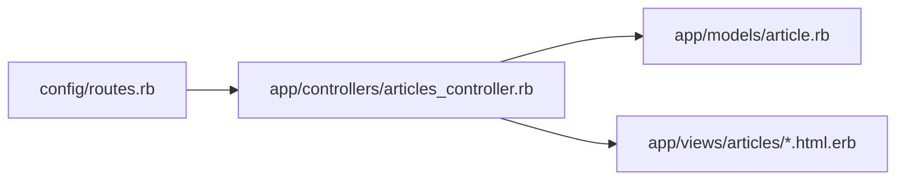
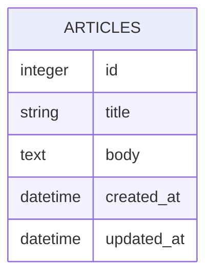

# 第5週：Stretch ── Article CRUDを少しずつ改造する

この課題は、[練習](practice.md) を終えた人向けの発展課題です。

Practice で作った `manual_crud_app` をそのまま使います。
新しい Rails アプリは作りません。

> [!IMPORTANT]
> この Stretch は、作ったCRUDを読み直しながら小さく改造する練習です。
> 1つ変更したら、必ずブラウザで確認してください。
> エラーが出たら、直前に変更したファイルを見直しましょう。

> [!IMPORTANT]
> この Stretch には、orientation や Practice でまだ詳しく扱っていない内容も含まれています。
> たとえば、`order`、`truncate`、`strftime`、`created_at`、`updated_at` などです。
> まずは自分でコードを読み、実行結果を確認しながら考えてください。
> そのうえで、Google検索をしたり、生成AIに「Rails の truncate とは？」のように相談したりしながら、解答にたどり着く練習もしてみましょう。

解答例では、次の順番で示します。

1. 対象ファイル
2. 変更前
3. 変更後
4. この時点での正解全体

まずは「変更前」と「変更後」を見比べて、どこが変わったのかを確認してください。
迷ったときは「この時点での正解全体」を見て、ファイル全体の形を確認してください。

今回使う主なファイルは次の4つです。



今は `Article` だけを使います。



---

## 準備

Practice で作ったアプリに移動してください。

```bash
cd ~/manual_crud_app
```

Practice の最後に `rails server` を起動したままなら、そのままで構いません。
サーバーが起動していない場合は、次のコマンドで起動してください。

```bash
rails server
```

> [!IMPORTANT]
> `rails server` を実行したターミナルは、サーバー専用にします。
> 以降の `rails console` や `rails routes` などは、別のターミナルで実行してください。

ブラウザで `/articles` を開き、一覧画面が表示されることを確認してください。

---

## 課題1：今のCRUDを確認する

まず、Practice で作ったCRUDが動くことを確認します。

ブラウザで次の操作をしてください。

1. `/articles` を開く
2. `新規作成` から記事を1件作る
3. 詳細画面でタイトルと本文を確認する
4. `編集` からタイトルを変更する
5. 詳細画面で変更後のタイトルを確認する
6. `削除` で記事を削除する

<details>
<summary>確認すること</summary>

- 一覧画面を表示できる
- 新規作成できる
- 詳細画面を表示できる
- 編集できる
- 削除できる

ここでエラーが出る場合は、Stretch に進む前に Practice の完成形を見直してください。

</details>

---

## 課題2：一覧を新しい記事から表示する

今の一覧は、作成された順に表示されています。
新しい記事が上に来るように変更してください。

<details>
<summary>解答例</summary>

対象ファイル：

```text
app/controllers/articles_controller.rb
```

変更前：

```ruby
def index
  @articles = Article.all
end
```

変更後：

```ruby
def index
  @articles = Article.order(created_at: :desc)
end
```

この時点での正解全体：

```ruby
class ArticlesController < ApplicationController
  def index
    @articles = Article.order(created_at: :desc)
  end

  def show
    @article = Article.find(params[:id])
  end

  def new
    @article = Article.new
  end

  def create
    @article = Article.new(article_params)

    if @article.save
      redirect_to @article
    else
      render :new, status: :unprocessable_entity
    end
  end

  def edit
    @article = Article.find(params[:id])
  end

  def update
    @article = Article.find(params[:id])

    if @article.update(article_params)
      redirect_to @article
    else
      render :edit, status: :unprocessable_entity
    end
  end

  def destroy
    @article = Article.find(params[:id])
    @article.destroy

    redirect_to articles_path
  end

  private

  def article_params
    params.require(:article).permit(:title, :body)
  end
end
```

ブラウザで `/articles` を再読み込みし、新しく作った記事ほど上に表示されることを確認してください。

</details>

---

## 課題3：一覧に記事数を表示する

一覧画面に、記事の件数を表示してください。

例：

```text
記事数：3件
```

<details>
<summary>解答例</summary>

対象ファイル：

```text
app/views/articles/index.html.erb
```

変更前：

```erb
<h1>記事一覧</h1>

<p><%= link_to "新規作成", new_article_path %></p>
```

変更後：

```erb
<h1>記事一覧</h1>

<p>記事数：<%= @articles.count %>件</p>

<p><%= link_to "新規作成", new_article_path %></p>
```

この時点での正解全体：

```erb
<h1>記事一覧</h1>

<p>記事数：<%= @articles.count %>件</p>

<p><%= link_to "新規作成", new_article_path %></p>

<% if @articles.empty? %>
  <p>記事はまだありません。</p>
<% else %>
  <% @articles.each do |article| %>
    <div>
      <h2><%= article.title %></h2>
      <p><%= article.body %></p>
      <p><%= link_to "詳細", article_path(article) %></p>
    </div>
  <% end %>
<% end %>
```

`@articles.count` は、`@articles` に入っている記事の数を返します。

</details>

---

## 課題4：一覧の本文を短く表示する

一覧画面では、本文を全部表示せず、先頭から30文字くらいで短く表示してください。

<details>
<summary>解答例</summary>

対象ファイル：

```text
app/views/articles/index.html.erb
```

変更前：

```erb
<p><%= article.body %></p>
```

変更後：

```erb
<p><%= truncate(article.body, length: 30) %></p>
```

この時点での正解全体：

```erb
<h1>記事一覧</h1>

<p>記事数：<%= @articles.count %>件</p>

<p><%= link_to "新規作成", new_article_path %></p>

<% if @articles.empty? %>
  <p>記事はまだありません。</p>
<% else %>
  <% @articles.each do |article| %>
    <div>
      <h2><%= article.title %></h2>
      <p><%= truncate(article.body, length: 30) %></p>
      <p><%= link_to "詳細", article_path(article) %></p>
    </div>
  <% end %>
<% end %>
```

`truncate` は、長い文字列を途中で省略して表示するための Rails の helper です。

</details>

---

## 課題5：詳細画面にIDを表示する

詳細画面に、記事のIDを表示してください。

例：

```text
ID：1
```

<details>
<summary>解答例</summary>

対象ファイル：

```text
app/views/articles/show.html.erb
```

変更前：

```erb
<h1><%= @article.title %></h1>

<p><%= @article.body %></p>
```

変更後：

```erb
<h1><%= @article.title %></h1>

<p>ID：<%= @article.id %></p>

<p><%= @article.body %></p>
```

この時点での正解全体：

```erb
<h1><%= @article.title %></h1>

<p>ID：<%= @article.id %></p>

<p><%= @article.body %></p>

<p><%= link_to "編集", edit_article_path(@article) %></p>

<%= button_to "削除", article_path(@article), method: :delete %>

<p><%= link_to "一覧に戻る", articles_path %></p>
```

`@article.id` は、データベースに保存された記事の番号です。

</details>

---

## 課題6：詳細画面に作成日時を表示する

詳細画面に、記事を作成した日時を表示してください。

<details>
<summary>解答例</summary>

対象ファイル：

```text
app/views/articles/show.html.erb
```

変更前：

```erb
<p><%= @article.body %></p>
```

変更後：

```erb
<p><%= @article.body %></p>

<p>作成日時：<%= @article.created_at.strftime("%Y-%m-%d %H:%M") %></p>
```

この時点での正解全体：

```erb
<h1><%= @article.title %></h1>

<p>ID：<%= @article.id %></p>

<p><%= @article.body %></p>

<p>作成日時：<%= @article.created_at.strftime("%Y-%m-%d %H:%M") %></p>

<p><%= link_to "編集", edit_article_path(@article) %></p>

<%= button_to "削除", article_path(@article), method: :delete %>

<p><%= link_to "一覧に戻る", articles_path %></p>
```

`created_at` には、データを作成した日時が入っています。
`strftime` は、日時の表示形式を整えるためのメソッドです。

</details>

---

## 課題7：詳細画面に更新日時を表示する

詳細画面に、記事を最後に更新した日時を表示してください。

<details>
<summary>解答例</summary>

対象ファイル：

```text
app/views/articles/show.html.erb
```

変更前：

```erb
<p>作成日時：<%= @article.created_at.strftime("%Y-%m-%d %H:%M") %></p>
```

変更後：

```erb
<p>作成日時：<%= @article.created_at.strftime("%Y-%m-%d %H:%M") %></p>
<p>更新日時：<%= @article.updated_at.strftime("%Y-%m-%d %H:%M") %></p>
```

この時点での正解全体：

```erb
<h1><%= @article.title %></h1>

<p>ID：<%= @article.id %></p>

<p><%= @article.body %></p>

<p>作成日時：<%= @article.created_at.strftime("%Y-%m-%d %H:%M") %></p>
<p>更新日時：<%= @article.updated_at.strftime("%Y-%m-%d %H:%M") %></p>

<p><%= link_to "編集", edit_article_path(@article) %></p>

<%= button_to "削除", article_path(@article), method: :delete %>

<p><%= link_to "一覧に戻る", articles_path %></p>
```

記事を編集して保存すると、`updated_at` が変わります。
編集前後で表示が変わるか確認してください。

</details>

---

## 課題8：一覧から直接編集画面へ移動する

今は、一覧から詳細画面へ移動し、そこから編集画面へ移動しています。
一覧画面にも `編集` リンクを追加してください。

<details>
<summary>解答例</summary>

対象ファイル：

```text
app/views/articles/index.html.erb
```

変更前：

```erb
<p><%= link_to "詳細", article_path(article) %></p>
```

変更後：

```erb
<p><%= link_to "詳細", article_path(article) %></p>
<p><%= link_to "編集", edit_article_path(article) %></p>
```

この時点での正解全体：

```erb
<h1>記事一覧</h1>

<p>記事数：<%= @articles.count %>件</p>

<p><%= link_to "新規作成", new_article_path %></p>

<% if @articles.empty? %>
  <p>記事はまだありません。</p>
<% else %>
  <% @articles.each do |article| %>
    <div>
      <h2><%= article.title %></h2>
      <p><%= truncate(article.body, length: 30) %></p>
      <p><%= link_to "詳細", article_path(article) %></p>
      <p><%= link_to "編集", edit_article_path(article) %></p>
    </div>
  <% end %>
<% end %>
```

ブラウザで `/articles` を開き、一覧から編集画面へ移動できることを確認してください。

</details>

---

## 課題9：一覧から削除できるようにする

一覧画面にも `削除` ボタンを追加してください。

<details>
<summary>解答例</summary>

対象ファイル：

```text
app/views/articles/index.html.erb
```

変更前：

```erb
<p><%= link_to "編集", edit_article_path(article) %></p>
```

変更後：

```erb
<p><%= link_to "編集", edit_article_path(article) %></p>
<%= button_to "削除", article_path(article), method: :delete %>
```

この時点での正解全体：

```erb
<h1>記事一覧</h1>

<p>記事数：<%= @articles.count %>件</p>

<p><%= link_to "新規作成", new_article_path %></p>

<% if @articles.empty? %>
  <p>記事はまだありません。</p>
<% else %>
  <% @articles.each do |article| %>
    <div>
      <h2><%= article.title %></h2>
      <p><%= truncate(article.body, length: 30) %></p>
      <p><%= link_to "詳細", article_path(article) %></p>
      <p><%= link_to "編集", edit_article_path(article) %></p>
      <%= button_to "削除", article_path(article), method: :delete %>
    </div>
  <% end %>
<% end %>
```

削除ボタンを押すと、`destroy` アクションが動きます。
削除後に一覧画面へ戻り、削除した記事が消えていることを確認してください。

</details>

---

## 課題10：`article_params` の役割を確認する

`article_params` は、フォームから送られてきた値のうち、保存してよい項目を決めています。

一度だけ実験します。
`app/controllers/articles_controller.rb` の `article_params` から `:body` を外してください。

<details>
<summary>解答例</summary>

対象ファイル：

```text
app/controllers/articles_controller.rb
```

変更前：

```ruby
def article_params
  params.require(:article).permit(:title, :body)
end
```

変更後：

```ruby
def article_params
  params.require(:article).permit(:title)
end
```

この時点での正解全体：

```ruby
class ArticlesController < ApplicationController
  def index
    @articles = Article.order(created_at: :desc)
  end

  def show
    @article = Article.find(params[:id])
  end

  def new
    @article = Article.new
  end

  def create
    @article = Article.new(article_params)

    if @article.save
      redirect_to @article
    else
      render :new, status: :unprocessable_entity
    end
  end

  def edit
    @article = Article.find(params[:id])
  end

  def update
    @article = Article.find(params[:id])

    if @article.update(article_params)
      redirect_to @article
    else
      render :edit, status: :unprocessable_entity
    end
  end

  def destroy
    @article = Article.find(params[:id])
    @article.destroy

    redirect_to articles_path
  end

  private

  def article_params
    params.require(:article).permit(:title)
  end
end
```

この状態で、ブラウザから新しい記事を作ってください。

確認すること：

- タイトルは保存される
- 本文は保存されない

確認できたら、必ず元に戻してください。

戻した後の正解全体：

```ruby
class ArticlesController < ApplicationController
  def index
    @articles = Article.order(created_at: :desc)
  end

  def show
    @article = Article.find(params[:id])
  end

  def new
    @article = Article.new
  end

  def create
    @article = Article.new(article_params)

    if @article.save
      redirect_to @article
    else
      render :new, status: :unprocessable_entity
    end
  end

  def edit
    @article = Article.find(params[:id])
  end

  def update
    @article = Article.find(params[:id])

    if @article.update(article_params)
      redirect_to @article
    else
      render :edit, status: :unprocessable_entity
    end
  end

  def destroy
    @article = Article.find(params[:id])
    @article.destroy

    redirect_to articles_path
  end

  private

  def article_params
    params.require(:article).permit(:title, :body)
  end
end
```

`permit` に書いていない項目は、フォームから送られてきても保存されません。

</details>
