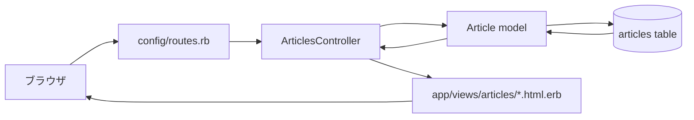
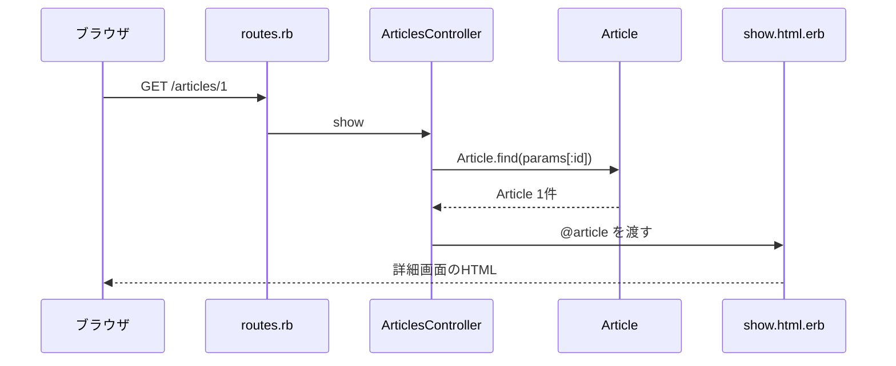

# 第6週：scaffoldなしCRUD（2）CRUDを読み、壊れた状態を直して説明する

## 今日のゴール

前回作った `Article` のCRUDと同じ構成のアプリを、もう一度読み直します。

今週は、新しい機能をたくさん増やす回ではありません。
CRUDのコードを見ながら、「どのURLが、どのcontroller actionに進み、どのviewを表示するのか」を説明できるようにします。

また、あらかじめ壊れているCRUDアプリを使って、エラー画面を読み、原因を探し、直す練習をします。

---

## 前回のおさらい

前回は、<ruby>scaffold<rt>スキャフォールド</rt></ruby>を使わずに `Article` のCRUDを一周しました。



作った主なファイルは次の通りです。

| ファイル | 役割 |
|---|---|
| `config/routes.rb` | URLをcontroller actionへ振り分ける |
| `app/controllers/articles_controller.rb` | 処理の流れを書く |
| `app/models/article.rb` | `articles` テーブルに対応するmodel |
| `app/views/articles/index.html.erb` | 一覧画面 |
| `app/views/articles/show.html.erb` | 詳細画面 |
| `app/views/articles/new.html.erb` | 新規作成フォーム |
| `app/views/articles/edit.html.erb` | 編集フォーム |

CRUDは、次の7つのactionで考えました。

| action | 役割 |
|---|---|
| `index` | 一覧を表示する |
| `show` | 1件の詳細を表示する |
| `new` | 新規作成フォームを表示する |
| `create` | フォームの内容を保存する |
| `edit` | 編集フォームを表示する |
| `update` | フォームの内容で更新する |
| `destroy` | 削除する |

---

## 今週やること

今週は、CRUDを次の3つの観点で見直します。

1. 読む
2. 壊れている状態を確認する
3. 直して説明する

動くコードをただ写すだけでは、Railsの流れはなかなか身につきません。

壊れた状態から直していくと、

- どのファイルが関係していたのか
- どのactionが呼ばれていたのか
- どの変数がviewに渡っていたのか
- どのparamsが必要だったのか

が見えやすくなります。

> [!IMPORTANT]
> 今週の目的は、きれいな機能を増やすことではありません。
> 「なぜ動くのか」「なぜ壊れているのか」「どこを直せばよいのか」を説明できるようにすることです。

---

## CRUDを読む順番

RailsのCRUDを読むときは、いきなりcontrollerから読まない方がよいです。

まず、ブラウザからどのURLにアクセスしているかを見ます。

次に、次の順番で追います。

```text
URL
↓
routes
↓
controller action
↓
model
↓
view
↓
ブラウザに表示されるHTML
```

たとえば `/articles/1` を読むなら、次のように追います。



この流れを、`index`、`show`、`new`、`create`、`edit`、`update`、`destroy` で説明できるようにします。

---

## `rails routes` を読む

URLとcontroller actionの対応は、`rails routes` で確認できます。

```bash
rails routes -g article
```

たとえば、次のような行が出ます。

```text
articles      GET    /articles(.:format)          articles#index
article       GET    /articles/:id(.:format)      articles#show
new_article   GET    /articles/new(.:format)      articles#new
edit_article  GET    /articles/:id/edit(.:format) articles#edit
```

ここで見るべきものは、主に3つです。

| 見る場所 | 例 | 意味 |
|---|---|---|
| HTTPメソッド | `GET` | どんな種類のリクエストか |
| パス | `/articles/:id` | どのURLか |
| controller action | `articles#show` | どの処理に進むか |

`:id` は、URLの中に入る値です。

`/articles/1` なら、`params[:id]` は `"1"` になります。

---

## 画面表示のactionを読む

画面を表示するactionは、主に次の4つです。

- `index`
- `show`
- `new`
- `edit`

たとえば `show` は、1件の記事を探して、詳細画面に渡します。

```ruby
def show
  @article = Article.find(params[:id])
end
```

このとき大事なのは、`@article` です。

controllerで `@article` に入れた値は、viewで使えます。

```erb
<h1><%= @article.title %></h1>
<p><%= @article.body %></p>
```

つまり、`show` を読むときは次のように考えます。

```text
URLに id がある
↓
params[:id] で id を受け取る
↓
Article.find(params[:id]) で1件探す
↓
@article に入れる
↓
show.html.erb で @article を表示する
```

---

## データを変更するactionを読む

データを変更するactionは、主に次の3つです。

- `create`
- `update`
- `destroy`

この3つは、データベースの中身を変えるので特に慎重に読みます。

たとえば `create` は、新しい記事を作ります。

```ruby
def create
  @article = Article.new(article_params)

  if @article.save
    redirect_to @article
  else
    render :new, status: :unprocessable_entity
  end
end
```

読むポイントは次の4つです。

| 行 | 見ること |
|---|---|
| `Article.new(article_params)` | フォームから送られた値で新しい記事を作る |
| `@article.save` | データベースに保存する |
| `redirect_to @article` | 保存できたら詳細画面へ移動する |
| `render :new` | 保存できなければ新規作成画面をもう一度表示する |

---

## `params` を読む

フォームから送られた値は、`params` に入ります。

ただし、Railsでは送られてきた値を何でも保存するわけではありません。
保存してよい値を、controllerの中で指定します。

```ruby
def article_params
  params.require(:article).permit(:title, :body)
end
```

`article_params` は、次のように読めます。

```text
params の中から article を取り出す
↓
title と body だけ保存を許可する
```

`permit` は <ruby>permit<rt>パーミット</rt></ruby> と読み、「許可する」という意味です。

---

## `redirect_to` と `render` を読む

controller actionの最後では、次に何を表示するかを決めます。

よく使うのが `redirect_to` と `render` です。

| 書き方 | 意味 |
|---|---|
| `redirect_to` | 別のURLへ移動する |
| `render` | 指定したviewをその場で表示する |

保存に成功したときは、URLを移動します。

```ruby
redirect_to @article
```

保存に失敗したときは、同じ画面をもう一度表示します。

```ruby
render :new, status: :unprocessable_entity
```

`render` は、別のURLへ移動しているわけではありません。
そのactionの中で、指定したviewを表示しています。

ここを混同すると、エラーを読みにくくなります。

---

## 壊れたアプリを直す意味

今週の練習では、あらかじめいくつかの場所が壊れているデバッグ用アプリを使います。

これは、失敗させることが目的ではありません。
エラー画面から、Railsがどこで困っているのかを読む練習です。

たとえば、次のような壊れている状態があります。

| 壊れている状態 | 起きそうなエラー | 見る場所 |
|---|---|---|
| routeが足りない | `No route matches` | `config/routes.rb` |
| action名が合っていない | actionが見つからない | controller |
| viewファイル名が合っていない | templateが見つからない | `app/views/` |
| `@article` が用意されていない | `nil` に対するエラー | controller / view |
| `:body` がpermitされていない | 本文が保存されない | `article_params` |
| `params[:id]` の使い方が間違っている | 記事が見つからない | controller |

エラーは怖いものではありません。
エラーは、Railsが「ここで困っている」と教えてくれている情報です。

---

## エラー画面を読む順番

エラー画面が出たら、次の順番で読みます。

1. エラー名を見る
2. エラーメッセージを見る
3. ファイル名と行番号を見る
4. 今アクセスしたURLを見る
5. どのactionが動いていたか考える

たとえば、`No route matches` が出たら、まず `routes.rb` を疑います。

`Missing template` が出たら、viewファイル名や置き場所を疑います。

`undefined method` が出たら、変数の中身が想定と違う可能性があります。

> [!TIP]
> エラー画面を見たら、すぐにコードを適当に直さないでください。
> まず「Railsはどのファイルの何行目で困っているのか」を探しましょう。

---

## 説明できる状態とは

今日の最後には、次のような説明ができることを目指します。

### 例：記事詳細画面

```text
ブラウザで /articles/1 にアクセスする。
routes.rb が articles#show に振り分ける。
ArticlesController の show action が動く。
params[:id] には 1 が入っている。
Article.find(params[:id]) で記事を1件取得する。
取得した記事を @article に入れる。
show.html.erb で @article.title と @article.body を表示する。
```

### 例：記事作成

```text
new画面のフォームから title と body を送信する。
POST /articles が送られる。
routes.rb が articles#create に振り分ける。
create action で Article.new(article_params) を実行する。
article_params は title と body だけを許可する。
保存に成功したら redirect_to @article で詳細画面へ移動する。
保存に失敗したら render :new で新規作成画面をもう一度表示する。
```

このように、URL、routes、controller、model、view、paramsをつなげて説明します。

---

## まとめ

今日やること：

1. 前回作った `Article` CRUDと同じ構成のアプリを読み直す
2. `rails routes` でURLとactionの対応を確認する
3. `params[:id]` と `article_params` の役割を説明する
4. `redirect_to` と `render` の違いを説明する
5. 壊れた状態を確認して、エラーを読み、直す

> [!IMPORTANT]
> - CRUDは、作ったあとに読めることが大事
> - URLから `routes`、`controller`、`model`、`view` の順に追う
> - エラーは、Railsが困っている場所を教えてくれる
> - 直せるようになるには、まず説明できるようになることが必要

[練習](practice.md) へ進みましょう。
