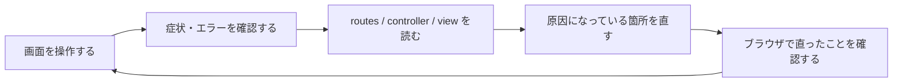
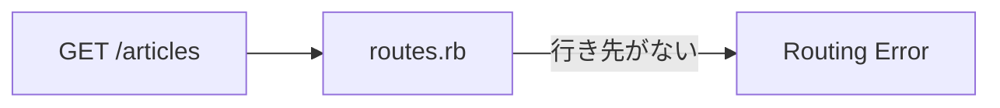
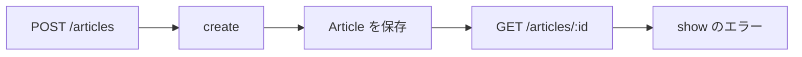
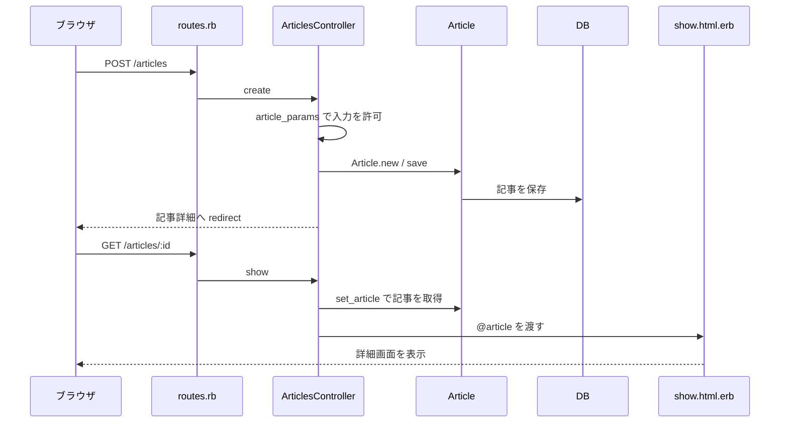

# 第6週：練習 ── 壊れた Article CRUD を復旧する

## この練習について

第5週では、`Article` の CRUD を自分で書いて作りました。

今週は逆方向から学びます。すでに見た目まで完成している技術記事共有アプリ **CodeShelf** を開き、壊れている箇所をエラーや画面の動きから探して直します。



> [!IMPORTANT]
> このアプリは、演習のために最初から一部が壊れています。
> エラーが表示されても失敗ではありません。エラーを確認してから、指定された箇所だけを直してください。
> `app/assets/stylesheets/` の中は見た目の完成部分です。今回は変更しません。

> [!IMPORTANT]
> 今回の解答例は、壊れている箇所を特定するために `変更前` と `変更後` を示します。
> 解答例を先にまとめてコピーせず、まず自分で症状とファイルを確認し、修正後に見比べてください。
> 後の課題で確認する故障を、先に直してしまわないことが大切です。

## 準備：Codespace を開く

今回は、教材のリポジトリではなく、演習用アプリのリポジトリから Codespace を起動します。

1. GitHub にログインします。
2. [TORIFUKUKaiou/rails-dojo-crud-debug](https://github.com/TORIFUKUKaiou/rails-dojo-crud-debug) を開きます。
3. `Code` → `Codespaces` → `Create codespace on main` をクリックします。
4. VS Code の画面が表示され、ターミナルが操作できるまで待ちます。

> [!CAUTION]
> 必ず `main` から Codespace を作ってください。
> この練習では、用意された壊れた状態を、自分でエラーを読みながら直していきます。

> [!IMPORTANT]
> ターミナルは Rails アプリの場所である `/home/vscode/app` から始まります。
> この演習では、`cd` で別の場所へ移動せず、そのまま作業してください。
> 誤って移動し、`rails: command not found` と表示された場合は、そのターミナルを閉じ、新しいターミナルを開いて作業を再開してください。

ターミナルで、作業場所を確認します。

```bash
pwd
ls
```

`app`、`config`、`db`、`Gemfile` などが表示されれば、Rails アプリの場所にいます。

表示されない場合は、ターミナルを閉じて新しいターミナルを開き、もう一度 `pwd` と `ls` を実行してください。それでも表示されない場合は、先生に確認してください。

## 進め方

- サーバーを動かすターミナルと、確認コマンドを入力するターミナルを分けて使います。
- 課題では、最初に必ず「壊れている状態」をブラウザまたはターミナルで確認します。
- 自分で原因を考えて修正し、動作を確認したあとで解答例を開きます。
- 指示のないファイルは変更しません。とくに CSS、migration、`schema.rb` は変更しません。
- データベースを削除したり、`rails new` や `scaffold` を実行したりしません。

---

## 課題1：アプリのファイルを確認する

Rails アプリの場所で、次のファイルをエクスプローラーから開けることを確認してください。

- `config/routes.rb`
- `app/controllers/articles_controller.rb`
- `app/views/articles/index.html.erb`
- `db/schema.rb`

`db/schema.rb` を開き、`articles` テーブルに `title` と `body` があることを確認してください。

<details>
<summary>解答例</summary>

`db/schema.rb` の中に、次のような `articles` テーブルがあります。日時カラムの順番などは異なっていても構いません。

```ruby
create_table "articles", force: :cascade do |t|
  t.string "title"
  t.text "body"
  t.datetime "created_at", null: false
  t.datetime "updated_at", null: false
end
```

この時点ではファイルを修正しません。

</details>

---

## 課題2：Rails とデータベースの準備を確認する

ターミナルで次を実行してください。

```bash
bin/rails -v
bin/rails db:prepare
bin/rails db:migrate:status
bin/rails routes -g article
```

`db:migrate:status` で `CreateArticles` が `up` になっていることを確認します。

一方、`bin/rails routes -g article` には、記事一覧や新規作成に使うルートが表示されません。ここが最初の手がかりです。

<details>
<summary>解答例</summary>

`articles` テーブルは準備されていますが、記事の CRUD に必要な route がありません。

この時点では、まだ修正しません。次の課題でブラウザから症状を確認します。

</details>

---

## 課題3：サーバーを起動して最初のエラーを確認する

現在のターミナルでサーバーを起動します。

```bash
bin/rails server
```

> [!IMPORTANT]
> サーバーを起動したターミナルは、そのまま動かしておきます。
> これ以降にコマンドを実行するときは、画面上部の `+` から新しいターミナルを開いてください。

`Open in Browser` または `ポート` タブからアプリを開き、URL の末尾を `/articles` にしてアクセスしてください。

表示されたエラー画面で、次を探してください。

- `No route matches [GET] "/articles"` に相当するメッセージ
- リクエストした URL が `/articles` であること

<details>
<summary>解答例</summary>

ブラウザから `GET /articles` を送っても、`routes.rb` に行き先が用意されていないため、controller に到達する前に止まっています。



</details>

---

## 課題4：記事の route を復旧する

`config/routes.rb` を開き、記事の CRUD に必要な route を有効にしてください。

修正後、新しいターミナルで次を実行します。

```bash
bin/rails routes -g article
```

`index`、`show`、`new`、`create`、`edit`、`update`、`destroy` に対応する route が表示されることを確認してください。

その後、ブラウザで `/articles` を再読み込みします。今度は別のエラーに進めれば、route の修正は成功です。

<details>
<summary>解答例</summary>

対象ファイル：`config/routes.rb`

変更前：

```ruby
# resources :articles
```

変更後：

```ruby
resources :articles
```

`resources :articles` は、記事の一覧、詳細、作成、編集、削除に必要な route をまとめて用意します。

</details>

---

## 課題5：一覧画面の controller エラーを読む

`/articles` を再読み込みしたときに表示されるエラーを確認してください。

次を読み取ります。

- エラーに出てくる定数名
- エラーが発生した controller のファイル名
- `index` アクションで一覧を取得しようとしていること

まだ修正はしません。エラー画面と `app/controllers/articles_controller.rb` を見比べて、原因になりそうな行を探してください。

<details>
<summary>解答例</summary>

`ArticlesController#index` は記事の一覧を取得する場所です。

エラーには `ArticlesController::Articles` や `Articles` に相当する名前が表示されます。モデルのファイルは `app/models/article.rb` であり、モデル名は単数形の `Article` です。

</details>

---

## 課題6：`index` が記事モデルを読めるように直す

課題5で見つけた controller の一行を修正してください。

修正後、ブラウザで `/articles` を再読み込みします。まだ完成画面ではなく、view の別のエラーに進むことを確認してください。

<details>
<summary>解答例</summary>

対象ファイル：`app/controllers/articles_controller.rb`

変更前：

```ruby
@articles = Articles.all
```

変更後：

```ruby
@articles = Article.all
```

`Article` は1件の記事を表すモデルです。`Article.all` で記事の一覧を取得します。

</details>

---

## 課題7：一覧 view のエラーを読む

新しく表示されたエラー画面で、`app/views/articles/index.html.erb` が示されていることを確認してください。

画面の `ARTICLES ONLINE` の数字を出す部分では、記事の件数を表示しようとしています。エラーを読んで、メソッド名のどこがおかしいか考えてください。

<details>
<summary>解答例</summary>

記事の一覧が `@articles` に入るところまでは到達しました。

今度は view が `@articles` の件数を調べようとして、存在しない `counts` メソッドを呼び出しています。件数を調べるメソッドは `count` です。

</details>

---

## 課題8：記事件数の表示を直す

`app/views/articles/index.html.erb` の件数表示を修正してください。

修正後、`/articles` を再読み込みします。星が動く CodeShelf の画面と「まだ記事はありません」という表示が見えれば成功です。

<details>
<summary>解答例</summary>

対象ファイル：`app/views/articles/index.html.erb`

変更前：

```erb
<strong><%= @articles.counts.to_s.rjust(2, "0") %></strong>
```

変更後：

```erb
<strong><%= @articles.count.to_s.rjust(2, "0") %></strong>
```

現在は記事が0件なので、画面の件数は `00` と表示されます。

</details>

---

## 課題9：「記事を書く」リンクの行き先を直す

一覧画面で、次のリンクをクリックしてください。

- ヘッダーの「記事を書く」
- 「新しい記事を投稿」
- 「投稿する」
- 「最初の記事を書く」

どれを押しても新規作成画面には進まず、一覧画面のままになってしまいます。

`app/views/layouts/application.html.erb` と `app/views/articles/index.html.erb` を開き、記事を書くためのリンクの行き先を修正してください。

> [!NOTE]
> 「記事を探す」や「記事を読む」は、一覧を表示するためのリンクです。そこは変更しません。

<details>
<summary>解答例</summary>

対象ファイル：`app/views/layouts/application.html.erb`

変更前：

```erb
<%= link_to "記事を書く", articles_path, class: "button button-primary" %>
```

変更後：

```erb
<%= link_to "記事を書く", new_article_path, class: "button button-primary" %>
```

対象ファイル：`app/views/articles/index.html.erb`

次の3箇所を同じように修正します。

変更前：

```erb
<%= link_to "新しい記事を投稿", articles_path, class: "button button-primary button-large" %>
<%= link_to "投稿する", articles_path, class: "button button-outline" %>
<%= link_to "最初の記事を書く", articles_path, class: "button button-primary" %>
```

変更後：

```erb
<%= link_to "新しい記事を投稿", new_article_path, class: "button button-primary button-large" %>
<%= link_to "投稿する", new_article_path, class: "button button-outline" %>
<%= link_to "最初の記事を書く", new_article_path, class: "button button-primary" %>
```

`articles_path` は一覧への URL、`new_article_path` は新しい記事を書く画面への URL です。

</details>

---

## 課題10：新規作成画面へ進んだ結果を確認する

修正した「最初の記事を書く」をクリックしてください。

URL が `/articles/new` になったあと、画面が正常には表示されずエラーになります。

エラー画面を読み、次を確認してください。

- `new` アクションから新規作成画面を表示しようとしていること
- form に渡す記事が正しく用意できていないこと

<details>
<summary>解答例</summary>

route とリンクは正しくなり、`ArticlesController#new` まで処理が進みました。

新規作成フォームは、まだ保存されていない新しい `Article` を受け取る必要があります。しかし、現在の `new` ではその準備が正しくありません。

</details>

---

## 課題11：新規記事を用意する `new` を直す

`app/controllers/articles_controller.rb` の `new` アクションを修正してください。

修正後、`/articles/new` を再読み込みします。今度は form に関する別のエラーに進むことを確認してください。

<details>
<summary>解答例</summary>

対象ファイル：`app/controllers/articles_controller.rb`

変更前：

```ruby
def new
  @article = Article.first
end
```

変更後：

```ruby
def new
  @article = Article.new
end
```

`Article.first` はすでに保存されている先頭の記事を探します。今回はまだ記事が0件なので、フォームに使える新しい記事を用意できません。

`Article.new` は、これから入力して保存するための記事を新しく作ります。

</details>

---

## 課題12：form のエラーを読む

`/articles/new` のエラー画面で、`app/views/articles/_form.html.erb` が示されていることを確認してください。

`new.html.erb` から form を呼び出すときは `article: @article` を渡しています。それに対して、form 側が受け取ろうとしている名前を確認してください。

<details>
<summary>解答例</summary>

`new.html.erb` には次の呼び出しがあります。

```erb
<%= render "form", article: @article %>
```

したがって、`_form.html.erb` の中では `article` という名前で受け取る必要があります。現在は存在しない `entry` を使おうとしています。

</details>

---

## 課題13：form に渡す変数名を直す

`app/views/articles/_form.html.erb` の先頭行を修正してください。

修正後、新規作成画面にタイトルと本文の入力欄、および「記事を公開する」ボタンが表示されることを確認してください。

<details>
<summary>解答例</summary>

対象ファイル：`app/views/articles/_form.html.erb`

変更前：

```erb
<%= form_with(model: entry) do |form| %>
```

変更後：

```erb
<%= form_with(model: article) do |form| %>
```

partial に渡された名前と、partial の中で使う名前を一致させます。

</details>

---

## 課題14：フォーム送信の行き先を routes で確認する

まだ記事は投稿しません。

新しいターミナルで次を実行してください。

```bash
bin/rails routes -g article
```

新規作成画面の form を送信すると、どの HTTP メソッド、URL、controller action に向かうかを確認してください。

<details>
<summary>解答例</summary>

記事を新規作成する送信先は、次の route です。

```text
POST  /articles(.:format)  articles#create
```

フォームの「記事を公開する」を押すと、`ArticlesController#create` に入力内容が届きます。

</details>

---

## 課題15：投稿して `create` のエラーを確認する

新規作成フォームに、確認用として次を入力してください。

タイトル：

```text
確認用の記事
```

本文：

```text
投稿できるか確認しています。
```

「記事を公開する」をクリックし、表示されたエラーを確認してください。

`app/controllers/articles_controller.rb` の `create` アクションで、入力内容を受け取るメソッド名に注目します。

<details>
<summary>解答例</summary>

`create` は、新しい記事を作るために入力内容を受け取ろうとしています。

ところが、呼び出している `artcle_params` は綴りが誤っており、定義されている `article_params` に到達できません。まだ記事は保存されていません。

</details>

---

## 課題16：`create` のメソッド名を直す

`create` の一行を修正してください。

> [!IMPORTANT]
> 修正後、まだ「記事を公開する」はクリックしません。
> 次の課題で、本文が保存される設定になっているかを先に確認します。

<details>
<summary>解答例</summary>

対象ファイル：`app/controllers/articles_controller.rb`

変更前：

```ruby
@article = Article.new(artcle_params)
```

変更後：

```ruby
@article = Article.new(article_params)
```

メソッド名の綴りを、下部で定義されている `article_params` と一致させます。

</details>

---

## 課題17：保存を許可する項目を確認して直す

`app/controllers/articles_controller.rb` の下部にある `article_params` を確認してください。

現在のまま投稿すると、タイトルは届いても本文が保存されません。本文も保存できるように修正してください。

> [!NOTE]
> 第5週では `params.require(:article).permit(:title, :body)` を書きました。
> このアプリは Rails 8.1 の scaffold で作成したため、`params.expect(article: [ :title, :body ])` という書き方になっています。
> どちらも、保存を許可する項目を指定するための処理です。今回は scaffold が生成した `expect` の書き方を復旧します。

<details>
<summary>解答例</summary>

対象ファイル：`app/controllers/articles_controller.rb`

変更前：

```ruby
def article_params
  params.expect(article: [ :title ])
end
```

変更後：

```ruby
def article_params
  params.expect(article: [ :title, :body ])
end
```

`:body` を許可することで、入力した本文もモデルへ渡して保存できます。

</details>

---

## 課題18：CodeShelf に最初の記事を投稿する

新規作成画面を再読み込みし、次の記事を入力して投稿してください。

タイトル：

```text
Rails のルーティングを宇宙地図として読む
```

本文：

```text
URL が届くと、routes.rb が行き先を決めます。

controller が記事を探し、view がブラウザへ表示を返します。処理の流れを追うと、Rails の世界が少しずつ見えてきます。
```

投稿後、詳細画面へ移動しようとしますが、まだエラーになります。

> [!IMPORTANT]
> ここで記事の保存は成功しています。
> エラーが出ても同じ記事をもう一度投稿せず、次の課題で詳細表示を直してください。

<details>
<summary>解答例</summary>

`create` は記事を保存し、保存した記事の詳細 URL に移動します。



記事は保存されましたが、`show` で表示に使う `@article` が用意されていません。

</details>

---

## 課題19：詳細表示に必要な記事の取得を直す

エラー画面と `app/controllers/articles_controller.rb` の先頭にある `before_action` を見比べてください。

`show` でも `set_article` が動くように修正します。

修正後、現在の詳細ページを再読み込みし、投稿したタイトルと本文が表示されることを確認してください。

<details>
<summary>解答例</summary>

対象ファイル：`app/controllers/articles_controller.rb`

変更前：

```ruby
before_action :set_article, only: %i[ update destroy ]
```

変更後：

```ruby
before_action :set_article, only: %i[ show update destroy ]
```

`show` を追加すると、詳細画面を表示する前に URL の `id` に対応する記事を探し、`@article` に入れます。

</details>

---

## 課題20：一覧と詳細を確認する

次の操作を行い、表示を確認してください。

1. 詳細画面で、投稿したタイトルと本文が表示されていることを確認する
2. 「一覧へ戻る」をクリックする
3. 一覧に記事カードが1件表示され、件数が `01` になっていることを確認する
4. 記事カードから詳細へ戻る

この課題ではファイルを修正しません。

<details>
<summary>解答例</summary>

ここまでで、次の読み取りの流れが復旧しています。


</details>

---

## 課題21：編集画面のエラーを確認する

詳細画面で「編集する」をクリックしてください。

編集画面へ進む URL にはなりますが、画面の表示でエラーになります。`show` のときと同様に、編集対象の記事が用意されているかを確認してください。

<details>
<summary>解答例</summary>

`edit` も、どの記事を編集するのかを `@article` に入れてから form を表示する必要があります。

現在の `before_action` には `show`、`update`、`destroy` はありますが、`edit` がありません。

</details>

---

## 課題22：編集前にも記事を取得できるように直す

`before_action` に `edit` を追加してください。

修正後、編集画面に現在のタイトルと本文が入力済みの状態で表示されることを確認してください。

<details>
<summary>解答例</summary>

対象ファイル：`app/controllers/articles_controller.rb`

変更前：

```ruby
before_action :set_article, only: %i[ show update destroy ]
```

変更後：

```ruby
before_action :set_article, only: %i[ show edit update destroy ]
```

`edit` は編集フォームを表示し、`update` はフォームから送信された内容を保存します。

</details>

---

## 課題23：本文だけを更新して、保存結果を確認する

編集画面で、本文の末尾に次の一文を追加してください。

```text

追いかける順番が分かれば、エラーは修正の手がかりになります。
```

「記事を更新する」をクリックします。

一覧画面へ戻りますが、記事を開いて本文を確認すると、追加した文が保存されていません。`update` アクションが更新している項目を確認してください。

<details>
<summary>解答例</summary>

現在の `update` は、タイトルだけを更新しています。本文を編集しても、`:body` を更新処理へ渡していないため保存されません。

この課題では症状を確認するところまでです。次の課題で修正します。

</details>

---

## 課題24：タイトルと本文を更新できるように直す

`update` アクションで、フォームから許可された入力内容全体を使って更新するように修正してください。

修正後、もう一度編集画面で課題23の一文を本文末尾に追加し、「記事を更新する」をクリックします。

一覧に戻ったあと、詳細画面を開き、本文が更新されていることを確認してください。

<details>
<summary>解答例</summary>

対象ファイル：`app/controllers/articles_controller.rb`

変更前：

```ruby
if @article.update(title: article_params[:title])
```

変更後：

```ruby
if @article.update(article_params)
```

`article_params` には `:title` と `:body` が許可されているので、どちらも更新できます。

</details>

---

## 課題25：更新後の移動先を直す

記事を更新できるようになりましたが、更新後は一覧へ戻っています。

更新した内容をすぐに確認できるように、更新成功後の移動先を記事詳細に戻してください。

修正後、タイトルを次のように変更して更新します。

```text
Rails のルーティングを宇宙地図として読む（更新版）
```

更新後に詳細画面が表示され、変更したタイトルが見えることを確認してください。

<details>
<summary>解答例</summary>

対象ファイル：`app/controllers/articles_controller.rb`

変更前：

```ruby
format.html { redirect_to articles_path, notice: "記事を更新しました。最新の内容を発信しています。", status: :see_other }
```

変更後：

```ruby
format.html { redirect_to @article, notice: "記事を更新しました。最新の内容を発信しています。", status: :see_other }
```

`@article` を指定すると、更新した記事自身の詳細ページへ移動します。

</details>

---

## 課題26：削除操作の症状を確認する

詳細画面の「削除する」をクリックし、確認ダイアログで削除を実行してください。

一覧画面へ戻りますが、削除したはずの記事が一覧に残っています。削除処理が本当に実行されているか、`destroy` アクションを確認してください。

<details>
<summary>解答例</summary>

現在の `destroy` は一覧画面へ戻る処理は行っていますが、記事そのものを削除する処理が抜けています。

見た目で画面が移動しても、データが変更されたとは限りません。削除では、一覧から本当に消えたかまで確認します。

</details>

---

## 課題27：記事を削除できるように直す

`destroy` アクションで、対象の記事を削除する処理を復旧してください。

修正後、残っている記事の詳細画面からもう一度「削除する」を実行してください。

<details>
<summary>解答例</summary>

対象ファイル：`app/controllers/articles_controller.rb`

変更前：

```ruby
def destroy
  respond_to do |format|
```

変更後：

```ruby
def destroy
  @article.destroy!

  respond_to do |format|
```

`set_article` で取得した `@article` に対して `destroy!` を実行すると、その記事が削除されます。

</details>

---

## 課題28：0件の一覧に戻ったことを確認する

削除後の一覧画面で、次を確認してください。

- `ARTICLES ONLINE` の件数が `00` になっている
- 「まだ記事はありません」が表示されている
- 「最初の記事を書く」から新規作成画面へ進める

この課題ではファイルを修正しません。

<details>
<summary>解答例</summary>

記事が削除されたため、一覧が空の状態に戻ります。

作成した記事が一覧に現れ、削除した記事が一覧から消えるところまで確認して、CRUD の `Create` と `Delete` が本当に動いていると判断できます。

</details>

---

## 課題29：CRUD の一連の動きを通して確認する

復旧したアプリで、次の一連の操作を行ってください。

1. 記事を新規作成する
2. 一覧に表示されることを確認する
3. 詳細画面を開く
4. 本文を編集して更新する
5. 更新後の本文を確認する
6. 記事を削除する
7. 一覧が0件に戻ることを確認する

作成する記事：

タイトル：

```text
復旧完了：CodeShelf からの信号
```

本文：

```text
一覧、詳細、作成、編集、削除の流れを確認できました。
```

編集時に本文へ追加する文：

```text

エラーを読んで、原因を探して、直すことができました。
```

<details>
<summary>解答例</summary>

次の操作がすべてできれば、`Article` の CRUD は復旧しています。

| 操作 | Rails の処理 | 確認すること |
|---|---|---|
| 新規作成 | `new` → `create` | 一覧に新しい記事が現れる |
| 詳細表示 | `show` | タイトルと本文が表示される |
| 編集 | `edit` → `update` | 変更した本文が保存される |
| 削除 | `destroy` | 一覧から記事が消える |

</details>

---

## 課題30：投稿処理の流れを説明する（考察問題・実行しない）

> [!IMPORTANT]
> この課題は考察問題です。Rails のファイルを追加で修正したり、コマンドを実行したりしません。
> ノートまたは自分で作った `debug_report.md` に答えを書いてください。

次の問いに答えてください。

1. 新規作成フォームで「記事を公開する」を押してから、記事詳細画面が表示されるまでに、`routes.rb`、controller、model、view はどの順番で関わりますか。
2. 今回、エラーを一度にすべて直すのではなく、一つ直して次の症状を確認したのはなぜですか。
3. 見た目は一覧画面へ戻っても、削除が成功したとは限らなかったのはなぜですか。

<details>
<summary>解答例</summary>

1. 投稿処理の流れは次のようになります。



2. 一つ直して再読み込みすると、その修正で処理がどこまで進んだのか分かります。次のエラーが表示された場合も、原因を探す範囲を絞れます。

3. 削除後の移動処理だけが動いていて、データを消す `@article.destroy!` が抜けていたからです。画面の移動だけで判断せず、一覧やデータの状態を確認する必要があります。

</details>

---

サーバーを停止するときは、サーバーを起動しているターミナルで `Ctrl + C` を押してください。
