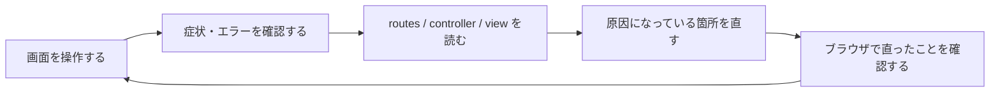

# 第6週：Stretch ── 壊れた Article CRUD を復旧する

この課題は、[練習](practice.md) を終えたチーム向けの発展課題です。

## この練習について

第5週では、`Article` の CRUD を自分で書いて作りました。

今週は逆方向から学びます。すでに見た目まで完成している技術記事共有アプリ **CodeShelf** を開き、壊れている箇所をエラーや画面の動きから探して直します。



> [!IMPORTANT]
> このアプリは、演習のために最初から一部が壊れています。
> エラーが表示されても失敗ではありません。エラーを確認してから、指定された箇所だけを直してください。
> `app/assets/stylesheets/` の中は見た目の完成部分です。今回は変更しません。

> [!NOTE]
> practice と同じでは？　と思った方は鋭いです。題材は同じです。ただし、このページに解答例はありません。まず自力で解決してください。
> 復旧できたあとに確認したい場合は、[Practice](practice.md) の解答例と比較してください。

## 準備：Codespace を開く

今回は、教材のリポジトリではなく、演習用アプリのリポジトリから Codespace を起動します。

1. GitHub にログインします。
2. [TORIFUKUKaiou/rails-dojo-crud-debug](https://github.com/TORIFUKUKaiou/rails-dojo-crud-debug) を開きます。（リンクを右クリックして、「リンクを新しいタブで開く」）
3. `Create a codespace on main(+)` をクリックする

    

    ---

    **緑のボタンがある場合**は、この手順でも構いません。`Create codespace on main` をクリックしてください。

    
    ---

4. VS Code の画面が表示され、ターミナルが操作できるまで待ちます。（5分程度）

5. ターミナルに `準備完了` と表示されたら、Codespaces の起動完了

> [!CAUTION]
> 必ず `main` から Codespace を作ってください。
> この練習では、用意された壊れた状態を、自分でエラーを読みながら直していきます。

> [!IMPORTANT]
> ターミナルは Rails アプリの場所である `/home/vscode/app` から始まります。
> この演習では、`cd` で別の場所へ移動せず、そのまま作業してください。

ターミナルで、作業場所を確認します。

```bash
pwd
ls
```

`app`、`config`、`db`、`Gemfile` などが表示されれば、Rails アプリの場所にいます。

表示されない場合は、ターミナルを閉じて新しいターミナルを開き、もう一度 `pwd` と `ls` を実行してください。それでも表示されない場合は、先生に確認してください。

## 進め方

- サーバーを動かすターミナルと、確認コマンドを入力するターミナルを分けて使います。
- 課題では、最初に必ず「壊れている状態」をブラウザまたはターミナルで確認します。
- 自分で原因を考えて修正し、動作を確認したあとで [Practice](practice.md) の解答例と比較します。
  - ドライバ（実際に操作する人）とナビゲータ（全体を見ながら、次に何を確認・修正するかを考える人）を交代しながら、原因と確認結果を話し合いながら進めましょう。
- 指示のないファイルは変更しません。とくに CSS、migration、`schema.rb` は変更しません。
- データベースを削除したり、`rails new` や `scaffold` を実行したりしません。

---

## 課題1：アプリのファイルを確認する

Rails アプリの場所で、次のファイルをエクスプローラーから開けることを確認してください。

- `config/routes.rb`
- `app/controllers/articles_controller.rb`
- `app/views/articles/index.html.erb`
- `db/schema.rb`

`db/schema.rb` を開き、`articles` テーブルに `title` と `body` があることを確認してください。


---

## 課題2：Rails とデータベースの準備を確認する

ターミナルで次を実行してください。

> [!TIP]
> **コマンドは一行ずつ実行しよう**
> ひとつひとつ実行結果を確かめながら進むのが、上達への近道です。エラーが起きても原因を見つけやすくなります。

> [!NOTE]
> 1回目の `bin/rails db:migrate:status` は、データベースを準備する前の状態を確認するためのコマンドです。migration が適用済みになっていない表示や、データベースがまだないことを示す表示になっても、そのまま次へ進んでください。
> `bin/rails db:prepare` は、データベースを作成し、必要な migration を反映して、アプリがデータを保存できる状態に準備するコマンドです。

```bash
bin/rails -v
bin/rails db:migrate:status
bin/rails db:prepare
bin/rails db:migrate:status
bin/rails routes -g article
```

2回目の `bin/rails db:migrate:status` で `Create articles` が `up` になっていることを確認します。

一方、`bin/rails routes -g article` には、記事一覧や新規作成に使うルートが表示されません。ここが最初の手がかりです。


---

## 課題3：サーバーを起動して最初のエラーを確認する

現在のターミナルでサーバーを起動します。

```bash
bin/rails server
```

> [!IMPORTANT]
> サーバーを起動したターミナルは、そのまま動かしておきます。
> これ以降にコマンドを実行するときは、画面上部の `+` から新しいターミナルを開いてください。

ポートタブの `Application(3000)` にカーソルをあて、`転送されたアドレス` で 🌐 アイコンを押すとブラウザでRailsアプリを開けます。


`/articles` にアクセスしてみてください。

表示されたエラー画面で、次を探してください。

- `No route matches [GET] "/articles"` に相当するメッセージ
- リクエストした URL が `/articles` であること


---

## 課題4：記事の route を復旧する

`config/routes.rb` を開き、記事の CRUD に必要な route を有効にしてください。

修正後、新しいターミナルで次を実行します。
どのように修正すればよいか分からない場合は、前回の「[第5週：scaffoldなしCRUD（1）ArticleでCRUDを一周する](https://github.com/TORIFUKUKaiou/rails-dojo-year2-content/blob/main/05/orientation.md#resources-articles)」を参照しましょう。

```bash
bin/rails routes -g article
```

`index`、`show`、`new`、`create`、`edit`、`update`、`destroy` に対応する route が表示されることを確認してください。

その後、ブラウザで `/articles` を再読み込みします。今度は別のエラーに進めれば、route の修正は成功です。


---

## 課題5：一覧画面の controller エラーを読む

`/articles` を再読み込みしたときに表示されるエラーを確認してください。

次を読み取ります。

- エラーに出てくる定数名
- エラーが発生した controller のファイル名
- `index` アクションで一覧を取得しようとしていること

まだ修正はしません。エラー画面と `app/controllers/articles_controller.rb` を見比べて、原因になりそうな行を探してください。


---

## 課題6：`index` が記事モデルを読めるように直す

課題5で見つけた controller の一行を修正してください。

修正後、ブラウザで `/articles` を再読み込みします。まだ完成画面ではなく、view の別のエラーに進むことを確認してください。


---

## 課題7：一覧 view のエラーを読む

新しく表示されたエラー画面で、`app/views/articles/index.html.erb` が示されていることを確認してください。

画面の `ARTICLES ONLINE` の数字を出す部分では、記事の件数を表示しようとしています。エラーを読んで、メソッド名のどこがおかしいか考えてください。


---

## 課題8：記事件数の表示を直す

`app/views/articles/index.html.erb` の件数表示を修正してください。

修正後、`/articles` を再読み込みします。星が動く CodeShelf の画面と「まだ記事はありません」という表示が見えれば成功です。


---

## 課題9：「記事を書く」リンクの行き先を直す

一覧画面で、次のリンクをクリックしてください。

- ヘッダーの「記事を書く」
- 「新しい記事を投稿」
- 「投稿する」
- 「最初の記事を書く」

どれを押しても新規作成画面には進まず、一覧画面のままになってしまいます。

`app/views/layouts/application.html.erb` と `app/views/articles/index.html.erb` を開き、記事を書くためのリンクの行き先を修正してください。

> [!NOTE]
> 「記事を探す」や「記事を読む」は、一覧を表示するためのリンクです。そこは変更しません。
> `bin/rails routes -g article` の出力結果を改めてよく確認してみましょう。

修正後、`/articles` を再読み込みし、「最初の記事を書く」をクリックしてください。今度は新規作成画面へ進もうとして、新しいエラーが表示されることを確認します。修正ができていたら次へ進んでください。


---

## 課題10：新規作成画面へ進んだ結果を確認する

課題9で表示された `/articles/new` のエラー画面を読んでください。

エラー画面を読み、次を確認してください。

- `new` アクションから新規作成画面を表示しようとしていること
- `Couldn't find Article` に相当するメッセージが表示されていること
- form に渡す新しい記事がまだ用意できていないこと


---

## 課題11：新規記事を用意する `new` を直す

`app/controllers/articles_controller.rb` の `new` アクションを修正してください。

修正後、`/articles/new` を再読み込みします。今度は form に関する別のエラーに進むことを確認してください。


---

## 課題12：form のエラーを読む

`/articles/new` のエラー画面で、`app/views/articles/_form.html.erb` が示されていることを確認してください。

`new.html.erb` から form を呼び出すときは `article: @article` を渡しています。それに対して、form 側が受け取ろうとしている名前を確認してください。


---

## 課題13：form に渡す変数名を直す

`app/views/articles/_form.html.erb` の先頭行を修正してください。

修正後、新規作成画面にタイトルと本文の入力欄、および「記事を公開する」ボタンが表示されることを確認してください。


---

## 課題14：フォーム送信の行き先を routes で確認する

まだ記事は投稿しません。

新しいターミナルで次を実行してください。

```bash
bin/rails routes -g article
```

新規作成画面の form を送信すると、どの HTTP メソッド、URL、controller action に向かうかを確認してください。


---

## 課題15：投稿して `create` のエラーを確認する

新規作成フォームに、確認用として次を入力してください。

タイトル：

```text
確認用の記事
```

本文：

```text
投稿できるか確認しています。
```

「記事を公開する」をクリックし、表示されたエラーを確認してください。

`app/controllers/articles_controller.rb` の `create` アクションで、入力内容を受け取るメソッド名に注目します。


---

## 課題16：`create` のメソッド名を直す

`create` の一行を修正してください。

> [!IMPORTANT]
> 修正後、まだ「記事を公開する」はクリックしません。
> 次の課題で、本文が保存される設定になっているかを先に確認します。


---

## 課題17：保存を許可する項目を確認して直す

`app/controllers/articles_controller.rb` の下部にある `article_params` を確認してください。

現在のまま投稿すると、フォームから送信したタイトルと本文は Rails に届きますが、`article_params` ではタイトルだけが保存に使われ、本文は保存されません。本文も保存できるように修正してください。修正できたら、次へ進んでください。記事の投稿は、次の課題で行います。


---

## 課題18：CodeShelf に最初の記事を投稿する

新規作成画面を再読み込みし、次の記事を入力して投稿してください。

タイトル：

```text
Rails のルーティングを宇宙地図として読む
```

本文：

```text
URL が届くと、routes.rb が行き先を決めます。

controller が記事を探し、view がブラウザへ表示を返します。処理の流れを追うと、Rails の世界が少しずつ見えてきます。
```

投稿後、詳細画面へ移動しようとしますが、まだエラーになります。

> [!IMPORTANT]
> ここで記事の保存は成功しています。
> エラーが出ても同じ記事をもう一度投稿せず、次の課題で詳細表示を直してください。
> エラー画面の URL が `/articles/new` のままでも、詳細画面を表示しようとした途中で起きたエラーです。


---

## 課題19：詳細表示に必要な記事の取得を直す

エラー画面と `app/controllers/articles_controller.rb` の先頭にある `before_action` を見比べてください。

`show` でも `set_article` が動くように修正します。

修正後、ブラウザの URL の末尾を `/articles` にして一覧画面を開いてください。投稿したタイトルの記事カードをクリックし、詳細画面に投稿したタイトルと本文が表示されることを確認してください。


---

## 課題20：一覧と詳細を確認する

次の操作を行い、表示を確認してください。

1. 現在開いている詳細画面で、投稿したタイトルと本文が表示されていることを確認する
2. 「一覧へ戻る」をクリックする
3. 一覧に投稿した記事カードが表示され、`ARTICLES ONLINE` の件数が作成した記事数と一致していることを確認する
4. 投稿した記事カードの「記事を読む →」から詳細へ戻る

この課題ではファイルを修正しません。


---

## 課題21：編集画面のエラーを確認する

詳細画面で「編集する」をクリックしてください。

編集画面へ進む URL にはなりますが、画面の表示でエラーになります。`show` のときと同様に、編集対象の記事が用意されているかを確認してください。


---

## 課題22：編集前にも記事を取得できるように直す

`before_action` に `edit` を追加してください。

修正後、編集画面に現在のタイトルと本文が入力済みの状態で表示されることを確認してください。


---

## 課題23：本文だけを更新して、保存結果を確認する

編集画面で、本文の末尾に次の一文を追加してください。

```text

追いかける順番が分かれば、エラーは修正の手がかりになります。
```

「記事を更新する」をクリックします。

一覧画面へ戻りますが、記事を開いて本文を確認すると、追加した文が保存されていません。`update` アクションが更新している項目を確認してください。


---

## 課題24：タイトルと本文を更新できるように直す

`update` アクションで、フォームから許可された入力内容全体を使って更新するように修正してください。

修正後、もう一度編集画面で課題23の一文を本文末尾に追加し、「記事を更新する」をクリックします。

一覧に戻ったあと、詳細画面を開き、本文が更新されていることを確認してください。


---

## 課題25：更新後の移動先を直す

記事を更新できるようになりましたが、更新後は一覧へ戻っています。

更新した内容をすぐに確認できるように、更新成功後の移動先を記事詳細に戻してください。

修正後、タイトルを次のように変更して更新します。

```text
Rails のルーティングを宇宙地図として読む（更新版）
```

更新後に詳細画面が表示され、変更したタイトルが見えることを確認してください。


---

## 課題26：削除操作の症状を確認する

詳細画面の「削除する」をクリックし、確認ダイアログで削除を実行してください。

一覧画面へ戻りますが、削除したはずの記事が一覧に残っています。削除処理が本当に実行されているか、`destroy` アクションを確認してください。


---

## 課題27：記事を削除できるように直す

`destroy` アクションで、対象の記事を削除する処理を復旧してください。

修正後、残っている記事の詳細画面からもう一度「削除する」を実行してください。


---

## 課題28：0件の一覧に戻ったことを確認する

削除後の一覧画面で、次を確認してください。

- `ARTICLES ONLINE` の件数が、削除した分だけ減っている
- 削除した記事が一覧から消えている

> [!IMPORTANT]
> 課題18で指定した記事以外にも記事を作成していて、一覧に記事が残っている場合は、残っている記事も詳細画面から削除してください。
> `ARTICLES ONLINE` が `00` になり、「まだ記事はありません」と表示された状態で、次の課題へ進みます。

一覧が0件になったら、「最初の記事を書く」から新規作成画面へ進めることを確認してください。

この課題ではファイルを修正しません。


---

## 課題29：CRUD の一連の動きを通して確認する

復旧したアプリで、次の一連の操作を行ってください。

1. 記事を新規作成する
2. 一覧に表示されることを確認する
3. 詳細画面を開く
4. 本文を編集して更新する
5. 更新後の本文を確認する
6. 記事を削除する
7. 一覧が0件に戻ることを確認する

作成する記事：

タイトル：

```text
復旧完了：CodeShelf からの信号
```

本文：

```text
一覧、詳細、作成、編集、削除の流れを確認できました。
```

編集時に本文へ追加する文：

```text

エラーを読んで、原因を探して、直すことができました。
私はRailsをマスターしたという自信が確信に変わりました。
```


---

## 課題30：投稿処理の流れを説明する（考察問題・実行しない）

> [!IMPORTANT]
> この課題は考察問題です。Rails のファイルを追加で修正したり、コマンドを実行したりしません。
> ノートまたは自分で作った `debug_report.md` に答えを書いてください。

次の問いに答えてください。

1. 新規作成フォームで「記事を公開する」を押してから、記事詳細画面が表示されるまでに、`routes.rb`、`controller`、`model`、`view` はどの順番で関わりますか。
2. 今回、エラーを一度にすべて直すのではなく、一つ直して次の症状を確認したのはなぜでしょうか。
3. 見た目は一覧画面へ戻っても、削除が成功したとは限らなかったのはなぜですか。


---

サーバーを停止するときは、サーバーを起動しているターミナルで `Ctrl + C` を押してください。
