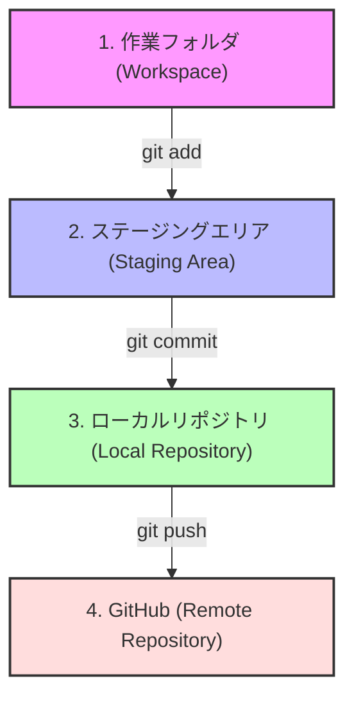

# 第7週：Git基礎 status / diff / add / commit / log / push

## 今日のゴール

今日は、ファイルの変更を記録し、GitHubへ送る一連の流れを学びます。

今日のゴールは次の4つです。

- <ruby>Git<rt>ギット</rt></ruby> と <ruby>GitHub<rt>ギットハブ</rt></ruby> の役割を説明できる
- 変更を確認して <ruby>commit<rt>コミット</rt></ruby> する流れを説明できる
- commit 履歴を確認できる
- commit した内容を GitHub へ <ruby>push<rt>プッシュ</rt></ruby> する意味を説明できる

---

## 前回までのおさらい

第5週と第6週では、Railsを使って次のことを学びました。

- scaffoldを使わずに CRUD（一覧・詳細・新規作成・更新・削除）を1から作った
- あらかじめ壊れているCRUDアプリのエラー画面を読み、ペアプログラミングで復旧した

これまでは「コードを書くこと」「デバッグすること」を中心に進めてきました。

しかし、実際の開発やこれからの授業では、次のような疑問や課題が生まれます。

- 「昨日まで動いていたコードに戻したいけれど、どこを変えたか分からなくなった」
- 「作った課題をどうやって先生に提出したり、チームメンバーと共有したりすればいいのか」

そこで今週は、書いたコードや修正したコードを記録し、提出・共有するための道具である **Git** と **GitHub** を学びます。

---

## Why Git?（なぜGitが必要なのか）

ファイルを編集していて、次のような経験はありませんか？

- 「上書き保存したけれど、やっぱり3時間前の状態に戻したい」
- 「ファイルをコピーして `index_backup.html` や `index_完成版_最終.html` のように名前をつけて管理していたら、どれが最新か分からなくなった」

これらは、個人開発でもチーム開発でもよく起こる問題です。

<ruby>Git<rt>ギット</rt></ruby> は、このような問題を解決するための**バージョン管理システム（構成管理ツール）**です。

Gitを使うと、ファイルの「変更履歴」を細かく記録できます。

- 過去の任意の時点のコードに戻すことができる
- いつ、誰が、どのファイルの、どこを、なぜ変更したのかを記録できる

> [!IMPORTANT]
> Gitは単なる「保存ボタン」ではありません。
> 「意味のある変更の記録」にメッセージをつけて、あとから見返せる形で残しておくための道具です。

---

## Why GitHub?（なぜGitHubが必要なのか）

Gitで記録した履歴は、通常はあなたの手元（PCやCodespacesの中）だけに保存されます。

しかし、手元だけにあると次のときに困ります。

- PCが壊れたり、Codespacesが削除されたりしたときにデータが消えてしまう
- 先生に課題を見せたり、チームメンバーと一緒に開発したりすることができない

<ruby>GitHub<rt>ギットハブ</rt></ruby> は、Gitで記録した履歴をインターネット上に置いておけるWebサービスです。

GitHubを使う理由は主に次の4つです。

- **バックアップ**: インターネット上にコードが保存されるため、PCが壊れても安心です
- **提出と共有**: 先生やチームメンバーに自分の成果を簡単に見せられます
- **チーム開発**: 後期で取り組む「チーム共同での開発」や、変更をレビューし合う <ruby>Pull Request<rt>プルリクエスト</rt></ruby> がスムーズに行えます
- **Codespacesの土台**: Codespacesは、GitHub上にあるコード（リポジトリ）をもとにして、あなた専用の開発環境を作ります

---

## Git と GitHub の違い

名前が似ているため混同しやすいですが、役割は全く違います。表で整理してみましょう。

| 道具 | 役割 | たとえるなら？ | 動く場所 |
|---|---|---|---|
| **Git** | ファイルの変更履歴を記録するツール | 作業の記録ノート | 自分のPCやCodespacesの中（ローカル） |
| **GitHub** | Gitで記録したコードをネット上で共有・保管するWebサービス | 記録ノートを置く共有スペース | インターネット上（リモート） |

> [!NOTE]
> 「Gitは履歴を記録する道具」「GitHubはそれをみんなで見られるように置くWebサービス」と覚えましょう。

---

## 変更が記録されるまでの流れ

Gitで変更を記録し、GitHubへ送るまでには、いくつかのステップがあります。

コードを変更していきなりGitHubへ送るわけではありません。Gitでは、次の4つの場所を経由して変更が進んでいきます。



各場所の役割は次の通りです。

| 場所 | 状態と説明 |
|---|---|
| **1. 作業フォルダ** | あなたが今、Codespacesのエディタでファイルを書き換えている場所です。まだGitには何も記録されていません。 |
| **2. ステージングエリア** | 次の commit に**含める変更を選んで置く**場所です。「インデックス」とも呼ばれます。 |
| **3. ローカルリポジトリ** | あなたのCodespacesの中に、変更履歴が正式に**記録された**場所です。 |
| **4. GitHub（リモート）** | インターネット上に履歴が送られ、バックアップや共有が完了した場所です。 |

> [!IMPORTANT]
> - `git add` で記録したい変更を**「選ぶ」**
> - `git commit` で手元に**「記録する」**
> - `git push` でGitHubへ**「送る」**
>
> この3つのステップを順番に行うことで、初めてGitHubにあなたのコードが届きます。

---

## 今週扱う基本コマンド

Codespacesのターミナルを使って、実際に変更を記録し、GitHubへ送るコマンドを学びます。
今回は次のコマンドを順番に使っていきます。

### 1. `git status`（状態を見る）

<ruby>status<rt>ステータス</rt></ruby> は「状態」という意味です。
今、作業フォルダやステージングエリアがどんな状態かを確認します。

```bash
git status
```

変更したファイルがある場合、ターミナルに赤色や緑色でファイル名が表示されます。
「どのファイルを変更したっけ？」「今、addしたんだっけ？」と迷ったら、**まず `git status` を打つ習慣をつけましょう。**

### 2. `git diff`（差分を見る）

<ruby>diff<rt>ディフ</rt></ruby> は「差分（違い）」という意味です。
ファイルの中身の「どこを変更したか」を行単位で詳しく確認します。

```bash
git diff
```

- `-`（赤色）で表示される行：変更前にあった（削除された）行
- `+`（緑色）で表示される行：新しく追加された行

> [!TIP]
> commit（記録）する前に、自分の意図した変更だけが入っているかを `git diff` で確認することは、とても重要な習慣です。

### 3. `git add`（commit に含める変更を選ぶ）

変更したファイルを、ステージングエリア（commit する準備場所）に乗せます。

```bash
git add README.md
```

上記のように、基本的には `git add ファイル名` と指定して実行します。
これによって、「このファイルの変更を次の commit に含めるぞ」と指定したことになります。

> [!NOTE]
> フォルダ内のすべての変更をまとめて登録する `git add .` という便利な書き方もありますが、意図しない一時ファイルや不要な変更まで巻き込んでしまうことがあります。
> 初めのうちは、自分が何を変更したかを意識するために、ファイル名を指定して登録することを推奨します。

### 4. `git commit -m`（ローカルリポジトリに記録する）

ステージングエリアに置いた変更を、ローカルリポジトリに履歴（commit）として正式に記録します。

```bash
git commit -m "READMEに自己紹介を追加"
```

`-m` は <ruby>message<rt>メッセージ</rt></ruby> の頭文字です。後ろのダブルクォーテーション `""` の中に、**「今回どんな変更をしたか」**が他の人（や未来の自分）に伝わる短い説明を書きます。

> [!WARNING]
> `-m` をつけずに `git commit` だけを実行すると、ターミナル上で見慣れないテキストエディタ（`vi` など）が起動してしまい、操作に困ることがあります。
> 必ず `-m "メッセージ"` をつけて実行するようにしましょう。

### 5. `git log`（commit 履歴を見る）

これまでに記録した commit の履歴を一覧で確認します。

```bash
git log
```

誰が・いつ・どんなメッセージで commit したかが上から新しい順に表示されます。
また、1行でシンプルに見たい場合は次のコマンドも便利です。

```bash
git log --oneline
```

> [!IMPORTANT]
> **`git log` 画面からの戻り方**
> `git log` を実行すると、ターミナルが履歴表示モードになり、入力ができなくなることがあります。
> その画面から元のターミナルに戻るには、**キーボードの `q`** を押してください。

### 6. `git push origin main`（GitHubへ送る）

手元のローカルリポジトリに記録した commit 履歴を、GitHub（リモートリポジトリ）へ送ります。

```bash
git push origin main
```

- <ruby>origin<rt>オリジン</rt></ruby>: 送信先であるGitHubのリポジトリの場所を指す名前です。
- <ruby>main<rt>メイン</rt></ruby>: コードを保存するメインの枝（ブランチ）の名前です。

手元で `git commit` をしただけでは、まだGitHubには変更が届いていません。
**最後に `git push` を行うことで、初めてGitHub上にコードが送られ、バックアップや提出が完了します。**

---

## `git init` とは？（新しくGit管理を始める）

Gitの教科書などで最初によく出てくるコマンドに `git init` があります。

```bash
git init
```

これは、「今いるフォルダで、新しくGitでの履歴記録を開始する」というコマンドです。

> [!NOTE]
> 今回の演習やCodespacesを使った授業では、すでに最初からGitで管理されているリポジトリを使うことがほとんどです。
> そのため、**今回の授業では `git init` を実行しません。**
> 「まだGitで管理されていないフォルダで、新しくGitを始めるときに使うコマンドなんだな」と知っておくだけで十分です。

---

## 次回（第8週）の予告

今回は、メインの履歴（`main` ブランチ）に直接変更を記録して送る流れを学びます。

しかし、実際の開発や後期のチーム開発では、みんなが同じ場所を同時に書き換えると、コードが混ざって壊れてしまいます。
そのため、来週の第8週では、履歴を一時的に枝分かれさせて別々に作業する <ruby>branch<rt>ブランチ</rt></ruby> や、それを合流させる <ruby>merge<rt>マージ</rt></ruby>、そしてGitHub上でコードをレビューし合う <ruby>Pull Request<rt>プルリクエスト</rt></ruby> の基本について学びます。

---

## まとめ

今日学ぶコマンドと役割を整理しておきましょう。

| コマンド | 役割 | 実行するタイミング |
|---|---|---|
| `git status` | どのファイルが変更されたか、状態を確認する | 迷ったら、いつでも何度でも |
| `git diff` | 具体的にどこを書き換えたか、差分を確認する | `git add` する前 |
| `git add <ファイル名>` | 記録したい変更ファイルを選ぶ | 変更を確認したあと |
| `git commit -m "メッセージ"` | 選択した変更をメッセージ付きで記録する | addで選択し終わったあと |
| `git log` | これまでの commit 履歴を見る | commitが成功したか確認したいとき（戻るには `q`） |
| `git push origin main` | 手元のcommit履歴をGitHubへ送る | commitが終わって、GitHubに送りたいとき |

それでは、実際にCodespacesを動かして、変更をGitHubに送ってみましょう。

[練習](practice.md) へ進みましょう。
