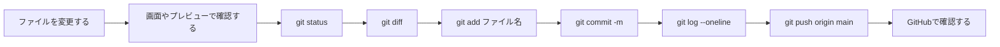

# 第7週：練習 ── 変更を commit して GitHub へ push する

## この練習について

今回は、Rails アプリ **CodeShelf** を使って、Git の基本操作を繰り返し練習します。

目的は、小さな変更をして、確認して、Git に記録し、GitHub へ送る流れを身につけることです。



> [!IMPORTANT]
> この練習では、`git commit` を行う際は、必ず `git commit -m "メッセージ"` の形で実行します。

> [!IMPORTANT]
> 第8週で branch を扱います。
> 今回は branch を作らず、`main` に直接 commit して push します。

---

## 準備：自分用リポジトリを作る

今回は、教材用リポジトリをそのまま編集しません。
自分の GitHub アカウントにコピーしたリポジトリで作業します。

## 課題1：GitHub にログインする

ブラウザで GitHub にログインしてください。

ログインできたら、右上に自分のアイコンが表示されます。

## 課題2：ベースリポジトリを開く

次のリポジトリを開いてください。

[TORIFUKUKaiou/rails-dojo-git-practice](https://github.com/TORIFUKUKaiou/rails-dojo-git-practice)

このリポジトリは、第7週 Git 練習用の Rails アプリです。

## 課題3：自分用リポジトリを作る

GitHub の画面で、`Use this template` > `Create a new repository` から自分用のリポジトリを作ってください。

リポジトリ名は、次のようにします。

```text
rails-dojo-git-practice-自分の名前
```

例：

```text
rails-dojo-git-practice-yamada
```

> [!NOTE]
> `Use this template` が表示されていない場合は、先生に確認してください。
> この練習では、先生が用意したベースリポジトリを自分用にコピーしてから作業します。

## 課題4：自分用リポジトリを開く

作成した自分用リポジトリを開いてください。

URL の中に、自分の GitHub ユーザー名と、課題3で作ったリポジトリ名が入っていることを確認します。

```text
https://github.com/自分のユーザー名/rails-dojo-git-practice-自分の名前
```

> [!IMPORTANT]
> ここから先は、必ず自分用リポジトリで作業してください。
> `TORIFUKUKaiou/rails-dojo-git-practice` の画面で Codespace を作らないように注意してください。

## 課題5：Codespace を作る

自分用リポジトリで、`Code` → `Codespaces` → `Create codespace on main` をクリックします。


VS Code の画面が開き、ターミナルに `準備完了` と表示されるまで待ちます。

5分ほどかかる場合があります。

## 課題6：作業場所を確認する

Codespaces のターミナルで、次を実行してください。

```bash
pwd
```

`pwd` の結果が次のようになっていれば、Rails アプリの場所にいます。

```text
/home/vscode/app
```

Codespaces のターミナルで、次を実行してください。

```bash
ls -1
```

`ls` の結果に、次のようなファイルやフォルダが表示されることを確認します。

```text
app
config
db
Gemfile
README.md
```

## 課題7：最初の Git 状態を確認する

次を実行してください。

```bash
git status
```

次のような意味の表示になれば成功です。

```text
nothing to commit, working tree clean
```

これは、まだ何も変更していない状態です。

---

## README を変更して push する

最初は Rails のコードではなく、Markdown ファイルを変更します。

## 課題8：`README.md` を開く

VS Code の左側のファイル一覧から、`README.md` を開いてください。

## 課題9：今日の目標を書く

`README.md` の最後に、次のような見出しと本文を追加してください。

```markdown
## 今日のGit練習

- 今日の目標：変更をcommitしてGitHubへpushする
```

保存できたら次へ進みます。
※ 今回のCodespaceの設定では、自動保存されます。

## 課題10：変更されたファイルを確認する

ターミナルで次を実行してください。

```bash
git status
```

`README.md` が変更されたファイルとして表示されることを確認します。

表示は環境によって少し違いますが、次のような意味の行を探します。

```text
modified: README.md
```

## 課題11：変更内容を見る

次を実行してください。

```bash
git diff
```

自分が追加した行が `+` 付きで表示されることを確認します。

```diff
+## 今日のGit練習
+- 今日の目標：変更をcommitしてGitHubへpushする
```

> [!IMPORTANT]
> `git diff` は、commit する前に「何を変更したのか」を確認するためのコマンドです。
> いきなり add や commit をせず、先に差分を見ます。

> [!TIP]
> **`git diff` 画面からの戻り方**
> `git diff` を実行すると、ターミナルが差分表示モードになり、次のコマンド入力ができなくなる場合があります。
> その画面から元のターミナルに戻るには、**キーボードの `q`** を押してください。

## 課題12：`README.md` を commit に含める

次を実行してください。

```bash
git add README.md
```

このコマンドは、「`README.md` の変更を次の commit に含める」と指定しています。

## 課題13：add できたことを確認する

次を実行してください。

```bash
git status
```

`README.md` が commit 予定に入っていることを確認します。

次のような意味の表示になれば成功です。

```text
Changes to be committed:
  (use "git restore --staged <file>..." to unstage)
        modified:   README.md
```

## 課題14：commit する

次を実行してください。

```bash
git commit -m "READMEに今日の目標を追加"
```

次のような表示が出れば、commit できています。

```text
[main xxxxxxx] READMEに今日の目標を追加
```

> [!CAUTION]
> この授業では、必ず `git commit -m "メッセージ"` の形で実行してください。

## 課題15：commit 履歴を見る

次を実行してください。

```bash
git log --oneline
```

一番上に、今作った commit メッセージが表示されることを確認します。

```text
xxxxxxx (HEAD -> main) READMEに今日の目標を追加
```

## 課題16：GitHub へ push する

次を実行してください。

```bash
git push origin main
```

エラーが出ずに終われば、GitHub へ送信できています。

## 課題17：GitHub で README を確認する

自分用リポジトリの GitHub 画面を開き、ページを再読み込みしてください。

`README.md` に、課題9で追加した内容が表示されていれば成功です。

## 課題18：GitHub で commit を確認する

GitHub の画面で、`Commits` または commit メッセージを開きます。 （`/commits/main/`）

`READMEに今日の目標を追加` という commit が見えることを確認してください。

---

## Rails アプリを起動する

ここからは Rails アプリの画面を確認しながら、同じ Git の流れを繰り返します。

## 課題19：データベースを準備する

Codespaces のターミナルで、次を実行してください。

```bash
bin/rails db:prepare
```

エラーが出ずに終われば成功です。

すでに準備済みの場合は、何も表示されずに終わることがあります。

## 課題20：Rails サーバーを起動する

次を実行してください。

```bash
bin/rails server
```

次のような表示が出れば、サーバーが起動しています。

```text
Listening on http://127.0.0.1:3000
```

> [!IMPORTANT]
> サーバーを起動したターミナルは、そのまま動かしておきます。
> これ以降に Git コマンドを実行するときは、画面上部の `+` から新しいターミナルを開いてください。

## 課題21：Rails アプリをブラウザで開く

ポートタブの `Application(3000)` にカーソルをあて、`転送されたアドレス` の 🌐 アイコンをクリックします。


CodeShelf の記事一覧画面が表示されれば成功です。

## 課題22：`/articles` も開く

ブラウザのURLの最後を `/articles` にして開いてください。

同じ記事一覧画面が表示されれば成功です。

---

## 記事を1件登録する

このあと記事カードの表示を変更します。
そのため、まず画面から記事を1件登録します。

## 課題23：新規作成画面を開く

画面の「新しい記事を投稿」または「記事を書く」をクリックしてください。

新規作成フォームが表示されれば成功です。

## 課題24：記事を入力する

次の内容で記事を入力してください。

```text
タイトル：
Git の練習を始めました

本文：
README を変更して commit し、GitHub に push しました。
次は Rails の画面を少し変更して、同じ流れをもう一度練習します。
```

## 課題25：記事を公開する

「記事を公開する」をクリックしてください。

記事の詳細画面が表示され、次のような通知が出れば成功です。

```text
記事を公開しました。新しい知識の信号が届いています。
```

## 課題26：記事一覧へ戻る

「一覧へ戻る」をクリックしてください。

一覧画面に、登録した記事カードが表示されることを確認します。

## 課題27：記事登録後の Git 状態を確認する

新しいターミナルを開き、次を実行してください。

```bash
git status
```

次のような意味の表示になれば成功です。

```text
nothing to commit, working tree clean
```

> [!NOTE]
> ブラウザから登録した記事データは、データベースの中に保存されています。
> 今回はデータベースの中身を Git の commit 対象にはしません。
> Git が追跡しているファイルには変更がないため、作業ツリーが clean だと言っています。

---

## 記事一覧ページの文言を変更して push する

ここから、Rails の view ファイルを変更します。

## 課題28：対象ファイルを開く

Codespaceで、次のファイルを開いてください。

```text
app/views/articles/index.html.erb
```

## 課題29：説明文を探す

ファイルの中から、次の行を探してください。

```erb
<p class="hero-lead">Ruby と Rails の知識を記事にして発信する、技術記事共有スペース。</p>
```

## 課題30：説明文を変更する

次のように変更してください。

```erb
<p class="hero-lead">Git の練習で変更を記録しながら、Rails の記事を育てるスペース。</p>
```

保存できたら次へ進みます。
※ 今回のCodespaceの設定では、自動保存されます。

## 課題31：ブラウザで確認する

ブラウザで記事一覧画面を再読み込みしてください。

画面上部の説明文が変わっていれば成功です。

## 課題32：変更されたファイルを確認する

ターミナルで次を実行してください。

```bash
git status
```

次のファイルが変更されていることを確認します。

```text
app/views/articles/index.html.erb
```

## 課題33：変更内容を見る

次を実行してください。

```bash
git diff
```

変更前の説明文が `-`、変更後の説明文が `+` で表示されることを確認します。

```diff
   <div class="hero-copy">
     <p class="eyebrow">CODE TRANSMISSION NETWORK</p>
     <h1>CodeShelf</h1>
-    <p class="hero-lead">Ruby と Rails の知識を記事にして発信する、技術記事共有スペース。</p>
+    <p class="hero-lead">Git の練習で変更を記録しながら、Rails の記事を育てるスペース。</p>
     <div class="hero-actions">
```

> [!TIP]
> 差分表示から戻れない場合は、`q` を押してください。

## 課題34：変更を add する

次を実行してください。

```bash
git add app/views/articles/index.html.erb
```

## 課題35：add できたことを確認する

次を実行してください。

```bash
git status
```

`app/views/articles/index.html.erb` が commit 予定に入っていれば成功です。

## 課題36：commit する

次を実行してください。

```bash
git commit -m "記事一覧ページの文言を変更"
```

## 課題37：履歴を見る

次を実行してください。

```bash
git log --oneline
```

一番上に、今作った commit が表示されることを確認します。

## 課題38：GitHub へ push する

次を実行してください。

```bash
git push origin main
```

## 課題39：GitHub で view ファイルを確認する

GitHub の自分用リポジトリで、次のファイルを開いてください。

```text
app/views/articles/index.html.erb
```

課題30で変更した説明文が GitHub 上にも反映されていれば成功です。

---

## 記事カードの表示を変更して push する

次は、記事カードを表示している partial view を変更します。

## 課題40：対象ファイルを開く

Codespaceで、次のファイルを開いてください。

```text
app/views/articles/_article.html.erb
```

## 課題41：記事カードのラベルを探す

次の行を探してください。

```erb
<span class="article-tag">ARTICLE</span>
```

## 課題42：記事カードのラベルを変更する

次のように変更してください。

```erb
<span class="article-tag">GIT LOG</span>
```

## 課題43：リンク文言を探す

同じファイルの中から、次の表示を探してください。

```erb
記事を読む
```

## 課題44：リンク文言を変更する

次のように変更してください。

```erb
記録を読む
```

保存できたら次へ進みます。
※ 今回のCodespaceの設定では、自動保存されます。

## 課題45：ブラウザで確認する

記事一覧画面を再読み込みしてください。

記事カードのラベルが `GIT LOG` に変わり、リンク文言が「記録を読む」に変わっていれば成功です。

## 課題46：変更状態を見る

次を実行してください。

```bash
git status
git diff
```

`app/views/articles/_article.html.erb` の変更内容が表示されることを確認します。

> [!TIP]
> 差分表示から戻れない場合は、`q` を押してください。

## 課題47：add して commit する

次を一行ずつ実行してください。

```bash
git add app/views/articles/_article.html.erb
git status
git commit -m "記事カードの表示を変更"
```

## 課題48：履歴を確認して push する

次を一行ずつ実行してください。

```bash
git log --oneline
git push origin main
```

## 課題49：GitHub で commit が増えたことを確認する

GitHub の `Commits` を開き、次の commit が増えていることを確認してください。

```text
記事カードの表示を変更
```

---

## CSS を変更して push する

次は、画面の見た目を少し変えます。

CSS の細かい意味をすべて理解する必要はありません。
今回は、変更したファイルを確認して commit することが目的です。

## 課題50：CSS ファイルを開く

Codespaceで、次のファイルを開いてください。

```text
app/assets/stylesheets/application.css
```

## 課題51：色の変数を探す

ファイルの上の方にある `:root` の中から、次の行を探してください。

```css
--cyan: #27def2;
```

## 課題52：色を変更する

次のように変更してください。

```css
--cyan: #8ff25a;
```

保存できたら次へ進みます。
※ 今回のCodespaceの設定では、自動保存されます。

## 課題53：ブラウザで確認する

記事一覧画面を再読み込みしてください。

ロゴの枠線や一部の文字色が変わっていれば成功です。

## 課題54：変更内容を見る

次を一行ずつ実行してください。

```bash
git status
git diff
```

`application.css` の変更が表示されることを確認します。

> [!TIP]
> 差分表示から戻れない場合は、`q` を押してください。

## 課題55：CSS の変更を commit する

次を一行ずつ実行してください。

```bash
git add app/assets/stylesheets/application.css
git status
git commit -m "CodeShelfの色を変更"
```

## 課題56：履歴を確認して push する

次を一行ずつ実行してください。

```bash
git log --oneline
git push origin main
```

---

## 2つのファイルを1つの commit にまとめる

ここまでは、1つのファイルを変更して1つの commit にしてきました。

次は、2つのファイルを変更して、1つの意味のある commit にまとめます。

## 課題57：一覧画面に見出しを追加する

Codespaceで、次のファイルを開いてください。

```text
app/views/articles/index.html.erb
```

`<section class="articles-section" id="articles">` のすぐ下に、次の行を追加してください。

```erb
  <p class="focus-label">今日の注目記事</p>
```

インデントは、前後の行に合わせます。

変更後:

```erb
<section class="articles-section" id="articles">
  <p class="focus-label">今日の注目記事</p>
```

## 課題58：見出しの見た目を追加する

Codespaceで、次のファイルを開いてください。

```text
app/assets/stylesheets/application.css
```

ファイルの一番下に、次の CSS を追加してください。

```css
.focus-label {
  margin: 0 0 18px;
  color: var(--yellow);
  font-weight: 800;
}
```

## 課題59：ブラウザで確認する

記事一覧画面を再読み込みしてください。

「今日の注目記事」という文字が、記事一覧の上に表示されていれば成功です。

## 課題60：2つのファイルが変更されていることを確認する

次を実行してください。

```bash
git status
```

次の2つのファイルが変更されていることを確認します。

```text
        modified:   app/assets/stylesheets/application.css
        modified:   app/views/articles/index.html.erb
```

## 課題61：2つのファイルの差分を見る

次を実行してください。

```bash
git diff
```

view の変更と CSS の変更が、両方表示されることを確認します。

> [!TIP]
> 差分表示から戻れない場合は、`q` を押してください。

## 課題62：片方だけ add する

まず、view ファイルだけ add します。

```bash
git add app/views/articles/index.html.erb
```

## 課題63：add 済みと未 add が分かれることを確認する

次を実行してください。

```bash
git status
```

次の2種類が表示されることを確認します。

- commit 予定に入ったファイル (Changes to be committed)
- まだ commit 予定に入っていないファイル (Changes not staged for commit)

ここで、`git add` は「変更を選ぶ」操作だと確認できます。

## 課題64：もう一方も add する

CSS ファイルも add します。

```bash
git add app/assets/stylesheets/application.css
```

## 課題65：2つとも commit 予定に入ったことを確認する

次を実行してください。

```bash
git status
```

2つのファイルが commit 予定に入っていれば成功です。

## 課題66：2つのファイルを1つの commit にする

次を実行してください。

```bash
git commit -m "注目記事の表示を追加"
```

## 課題67：push する

次を一行ずつ実行してください。

```bash
git log --oneline
git push origin main
```

## 課題68：GitHub で commit の中身を見る

GitHub の `Commits` から、次の commit を開いてください。

```text
注目記事の表示を追加
```

この commit の中に、次の2つのファイルが含まれていることを確認します。

```text
app/views/articles/index.html.erb
app/assets/stylesheets/application.css
```

1つの commit には、意味がまとまっていれば複数のファイルを含めることができます。

---

## 今日の履歴を確認する

## 課題69：GitHub の commit 一覧を見る

GitHub の自分用リポジトリで、`Commits` を開いてください。

今日作った commit が上から新しい順に並んでいることを確認します。

例：

```text
注目記事の表示を追加
CodeShelfの色を変更
記事カードの表示を変更
記事一覧ページの文言を変更
READMEに今日の目標を追加
```

## 課題70：最新 commit の URL をコピーする

一番上の commit を開き、ブラウザのURLをコピーしてください。

この URL は、「自分がどの変更をしたか」を先生やチームメンバーに見せるために使えます。

例: https://github.com/yamauchi-haw/rails-dojo-git-practice-yamauchi/commit/xxxxxxxxxxxxxxxxxxxxxxxxxxxxxxxxxxxxxxxx

## 課題71：リポジトリのURLをメモする

自分用リポジトリのURLをメモしてください。

```text
https://github.com/自分のユーザー名/rails-dojo-git-practice-自分の名前
```

例: https://github.com/yamauchi-haw/rails-dojo-git-practice-yamauchi

課題70と課題71のURLをTeamsに報告してください。

## 課題72：最後の状態を確認する

Codespaces のターミナルで次を実行してください。

```bash
git status
```

次のような意味の表示になれば、今日の作業はきれいに終わっています。

```text
nothing to commit, working tree clean
```

もし変更が残っている場合は、どのファイルが残っているかを確認してください。

---

## まとめ問題

## 課題73：`git add` と `git commit` の違いを説明する（考察問題・実行しない）

> [!IMPORTANT]
> この課題は考察問題です。ファイルを変更したり、コマンドを実行したりしません。
> ノートまたは先生が指定した場所に答えを書いてください。

次の2つの違いを、自分の言葉で説明してください。

```bash
git add ファイル名
git commit -m "メッセージ"
```

<details>
<summary>解答例</summary>

`git add ファイル名` は、次の commit に含める変更を選ぶコマンドです。

`git commit -m "メッセージ"` は、add で選んだ変更を、メッセージ付きでローカルリポジトリに記録するコマンドです。

つまり、`add` は「選ぶ」、`commit` は「記録する」操作です。

</details>

## 課題74：`commit` と `push` の違いを説明する（考察問題・実行しない）

> [!IMPORTANT]
> この課題は考察問題です。ファイルを変更したり、コマンドを実行したりしません。
> ノートまたは先生が指定した場所に答えを書いてください。

次の2つの違いを、自分の言葉で説明してください。

- commit したが、まだ push していない状態
- push まで終わった状態

<details>
<summary>解答例</summary>

commit しただけの状態では、変更は Codespace の中のローカルリポジトリに記録されています。
しかし、まだ GitHub には届いていません。

push まで終わった状態では、ローカルリポジトリに記録した commit が GitHub に送られています。
GitHub の画面で commit や変更内容を確認できるようになります。

</details>

## 課題75：GitHub 上で見えるものを整理する（考察問題・実行しない）

> [!IMPORTANT]
> この課題は考察問題です。ファイルを変更したり、コマンドを実行したりしません。
> ノートまたは先生が指定した場所に答えを書いてください。

今日の作業で、GitHub 上で確認できたものを3つ書いてください。

例：

- README の変更
- commit の一覧
- commit の中の差分

<details>
<summary>解答例</summary>

例：

- `README.md` に追加した今日の目標
- `app/views/articles/index.html.erb` の変更
- commit の一覧
- commit メッセージ
- commit の中で、どの行が追加・変更されたか

GitHub 上では、push された commit と、その commit に含まれるファイル変更を確認できます。

</details>

## 課題76：commit メッセージを見直す（考察問題・実行しない）

> [!IMPORTANT]
> この課題は考察問題です。ファイルを変更したり、コマンドを実行したりしません。
> ノートまたは先生が指定した場所に答えを書いてください。

今日作った commit メッセージの中から、分かりやすいと思うものを1つ選んでください。

そのメッセージを見れば、どんな変更をしたか分かるかを説明してください。

<details>
<summary>解答例</summary>

例：

```text
記事一覧ページの文言を変更
```

このメッセージは、記事一覧ページに表示される文章を変更したことが分かります。
あとから履歴を見たときに、どの画面に関係する変更だったのかを思い出しやすいです。

反対に、次のようなメッセージだけでは内容が分かりにくいです。

```text
修正
```

何を修正したのかが分からないため、あとから見返しにくくなります。

</details>

---

## 今日の終わりに確認すること

最後に、次を確認してください。

- GitHub に自分用リポジトリがある
- GitHub に今日の commit が push されている
- Codespaces の `git status` が clean になっている
- 自分用リポジトリのURLを提出できる

おつかれさまでした。

さらに力をつけるため、[Stretch](stretch.md) へ進みましょう。
