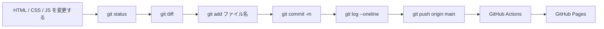

# 第7週：Stretch ── push した変更を GitHub Pages に公開する

この課題は、[練習](practice.md) を終えた方向けの発展課題です。

## この練習について

Practice では、Rails アプリを変更して commit し、GitHub に push しました。

この Stretch では、静的サイトを変更して push します。
push すると GitHub Actions が動き、GitHub Pages の公開ページも更新されます。



> [!IMPORTANT]
> 第8週で branch を扱います。
> 今回は branch を作らず、`main` に直接 commit して push します。

> [!IMPORTANT]
> この課題では、GitHub Actions や GitHub Pages の細かい仕組みを深く説明しません。
> まずは「push した変更が公開ページに反映される」流れを体験します。

---

## 準備：自分用リポジトリを作る

今回は、GitHub Pages 用の小さなサイトを使います。
Rails アプリではありません。

## 課題1：ベースリポジトリを開く

次のリポジトリを開いてください。

[TORIFUKUKaiou/rails-dojo-git-pages-playground](https://github.com/TORIFUKUKaiou/rails-dojo-git-pages-playground)

このリポジトリは、GitHub Pages 公開を試すための静的サイトです。

## 課題2：自分用リポジトリを作る

GitHub の画面で、`Use this template` から自分用のリポジトリを作ってください。

リポジトリ名は、次のようにします。

```text
rails-dojo-git-pages-playground-自分の名前
```

例：

```text
rails-dojo-git-pages-playground-yamada
```

`Visibility` は `Public` にします。

> [!NOTE]
> `Use this template` が表示されていない場合は、先生に確認してください。
> この練習では、先生が用意したベースリポジトリを自分用にコピーしてから作業します。

## 課題3：自分用リポジトリを開く

作成した自分用リポジトリを開いてください。

URL の中に、自分の GitHub ユーザー名と、課題2で作ったリポジトリ名が入っていることを確認します。

```text
https://github.com/自分のユーザー名/rails-dojo-git-pages-playground-自分の名前
```

> [!IMPORTANT]
> ここから先は、必ず自分用リポジトリで作業してください。
> `TORIFUKUKaiou/rails-dojo-git-pages-playground` の画面で Codespace を作らないように注意してください。

## 課題4：GitHub Pages の Source を確認する

自分用リポジトリで、次を開いてください。

```text
Settings → Pages
```

`Build and deployment` の `Source` が `GitHub Actions` になっていることを確認します。

`Deploy from a branch` になっている場合は、`GitHub Actions` に変更してください。

> [!IMPORTANT]
> このリポジトリは `.github/workflows/pages.yml` で公開します。
> そのため、Pages の Source は `GitHub Actions` にします。

## 課題5：Codespace を作る

自分用リポジトリで、`Code` → `Codespaces` → `Create codespace on main` をクリックします。


VS Code の画面が開き、ターミナルを操作できるまで待ちます。

## 課題6：作業場所とファイルを確認する

Codespaces のターミナルで、次を実行してください。

```bash
pwd
ls
```

`ls` の結果に、次のファイルが表示されることを確認します。

```text
README.md
index.html
script.js
style.css
```

## 課題7：最初の Git 状態を確認する

次を実行してください。

```bash
git status
```

次のような意味の表示になれば成功です。

```text
nothing to commit, working tree clean
```

---

## ローカルプレビューを開く

公開ページに push する前に、Codespaces 内で見た目を確認します。

## 課題8：プレビュー用サーバーを起動する

ターミナルで次を実行してください。

```bash
python3 -m http.server 8000
```

次のような表示になれば起動しています。

```text
Serving HTTP on 0.0.0.0 port 8000
```

> [!IMPORTANT]
> このターミナルは、そのまま動かしておきます。
> Git コマンドを実行するときは、画面上部の `+` から新しいターミナルを開いてください。

## 課題9：ブラウザでプレビューを開く

Codespaces の `PORTS` タブを開きます。

`8000` の行に表示される地球アイコン、またはブラウザで開くボタンを押してください。

`Git Signal Board` というページが表示されれば成功です。

## 課題10：新しいターミナルを開く

画面上部の `+` から新しいターミナルを開いてください。

新しいターミナルで、次を実行します。

```bash
git status
```

`nothing to commit, working tree clean` の意味の表示になれば、Git コマンドを実行する準備ができています。

---

## 1回目：HTML の文字を変更して push する

まずは `index.html` を変更します。

## 課題11：`index.html` を開く

VS Code の左側のファイル一覧から、`index.html` を開いてください。

## 課題12：見出しを変更する

次の行を探します。

```html
<h1>Git Signal Board</h1>
```

自分の名前が入るように変更してください。

例：

```html
<h1>Git Signal Board - 山田</h1>
```

`山田` の部分は、自分の名前に変えてください。

## 課題13：プレビューを再読み込みする

課題9で開いたプレビュー画面を再読み込みしてください。

見出しに自分の名前が表示されれば成功です。

## 課題14：変更されたファイルを確認する

Git コマンド用のターミナルで、次を実行してください。

```bash
git status
```

`index.html` が変更されたファイルとして表示されることを確認します。

```text
modified: index.html
```

## 課題15：変更内容を見る

次を実行してください。

```bash
git diff
```

`<h1>` の行が変更されていることを確認します。

## 課題16：`index.html` を commit に含める

次を実行してください。

```bash
git add index.html
```

## 課題17：commit する

次を実行してください。

```bash
git commit -m "トップページの見出しを変更"
```

## 課題18：commit 履歴を見る

次を実行してください。

```bash
git log --oneline
```

一番上に、今作った commit メッセージが表示されることを確認します。

```text
トップページの見出しを変更
```

`git log` の画面から戻るには、キーボードの `q` を押します。

## 課題19：GitHub に push する

次を実行してください。

```bash
git push origin main
```

push が成功すると、自分用リポジトリの GitHub 上にも commit が送られます。

## 課題20：Actions の実行を確認する

GitHub の自分用リポジトリを開き、`Actions` タブを開いてください。

`Deploy Git Signal Board` という workflow が動いていることを確認します。

黄色い丸は実行中です。
緑のチェックになれば成功です。

> [!IMPORTANT]
> push 直後に公開ページが変わらなくても失敗とは限りません。
> GitHub Actions が完了するまで待ってから確認します。

## 課題21：GitHub Pages の公開ページを開く

`Settings` → `Pages` を開きます。

公開 URL が表示されていれば、その URL を開いてください。

URL は次のような形になります。

```text
https://自分のユーザー名.github.io/rails-dojo-git-pages-playground-自分の名前/
```

公開ページの見出しに、自分の名前が表示されれば成功です。

---

## 2回目：CSS の色を変更して push する

次は `style.css` を変更します。

## 課題22：`style.css` を開く

VS Code の左側のファイル一覧から、`style.css` を開いてください。

## 課題23：ボタンの色を変更する

次の行を探します。

```css
--signal: #24c27a;
```

好きな色に変更してください。

例：

```css
--signal: #ff6b35;
```

## 課題24：プレビューを再読み込みする

プレビュー画面を再読み込みしてください。

`Signal` ボタンの色が変わっていれば成功です。

## 課題25：変更内容を確認する

次を実行してください。

```bash
git status
git diff
```

`style.css` の色が変更されていることを確認します。

## 課題26：CSS の変更を commit する

次を順番に実行してください。

```bash
git add style.css
git commit -m "Signalボタンの色を変更"
git log --oneline
```

一番上に、今作った commit メッセージが表示されることを確認します。

`git log` の画面から戻るには、キーボードの `q` を押します。

## 課題27：CSS の変更を push する

次を実行してください。

```bash
git push origin main
```

## 課題28：Actions と Pages を確認する

GitHub の `Actions` タブを開きます。

新しい `Deploy Git Signal Board` が緑のチェックになるまで待ちます。

その後、GitHub Pages の公開ページを再読み込みしてください。

公開ページのボタンの色が変わっていれば成功です。

---

## 3回目：JavaScript のカードを追加して push する

次は `script.js` を変更します。

## 課題29：`script.js` を開く

VS Code の左側のファイル一覧から、`script.js` を開いてください。

## 課題30：カードの配列を確認する

`signalCards` の中に、次のようなデータが並んでいることを確認します。

```javascript
const signalCards = [
  {
    title: "README を更新",
```

この配列の中身が、ページに表示されるカードになります。

## 課題31：カードを1つ追加する

`signalCards` の最後に、カードを1つ追加します。

変更前：

```javascript
  {
    title: "表示カードを追加",
    tag: "script",
    detail: "JavaScript の配列に新しい項目を追加しました。",
    level: "next"
  }
];
```

変更後：

```javascript
  {
    title: "表示カードを追加",
    tag: "script",
    detail: "JavaScript の配列に新しい項目を追加しました。",
    level: "next"
  },
  {
    title: "公開ページを更新",
    tag: "pages",
    detail: "push 後に GitHub Pages の表示が変わることを確認しました。",
    level: "live"
  }
];
```

## 課題32：プレビューを再読み込みする

プレビュー画面を再読み込みしてください。

カードが4枚に増えていれば成功です。

## 課題33：変更内容を確認する

次を実行してください。

```bash
git status
git diff
```

`script.js` に追加したカードが表示されることを確認します。

## 課題34：JavaScript の変更を commit する

次を順番に実行してください。

```bash
git add script.js
git commit -m "公開ページのカードを追加"
git log --oneline
```

一番上に、今作った commit メッセージが表示されることを確認します。

`git log` の画面から戻るには、キーボードの `q` を押します。

## 課題35：JavaScript の変更を push する

次を実行してください。

```bash
git push origin main
```

## 課題36：公開ページのカードを確認する

GitHub の `Actions` タブで、workflow が緑のチェックになるまで待ちます。

その後、GitHub Pages の公開ページを再読み込みしてください。

カードが4枚に増えていれば成功です。

---

## 4回目：2ファイルの変更を1つの commit にまとめる

最後に、`index.html` と `style.css` の2ファイルを変更して、1つの commit にまとめます。

## 課題37：`index.html` の表示を変更する

`index.html` を開き、次の行を探します。

```html
<h2 id="status-heading">main branch is live</h2>
```

次のように変更してください。

```html
<h2 id="status-heading">push history is live</h2>
```

## 課題38：`style.css` の表示を変更する

`style.css` を開き、次の行を探します。

```css
border-left: 8px solid var(--rose);
```

次のように変更してください。

```css
border-left: 8px solid var(--cyan);
```

## 課題39：2ファイルが変更されたことを確認する

次を実行してください。

```bash
git status
```

`index.html` と `style.css` の2つが変更されたファイルとして表示されることを確認します。

## 課題40：差分を見る

次を実行してください。

```bash
git diff
```

2ファイル分の差分が表示されることを確認します。

## 課題41：片方だけ add する

まず、`index.html` だけを add します。

```bash
git add index.html
```

その後、次を実行してください。

```bash
git status
```

`index.html` は commit 予定、`style.css` はまだ commit 予定ではない状態になっていることを確認します。

## 課題42：もう一方も add する

次を実行してください。

```bash
git add style.css
git status
```

`index.html` と `style.css` の両方が commit 予定になっていることを確認します。

## 課題43：2ファイルを1つの commit にする

次を実行してください。

```bash
git commit -m "公開ページの表示を調整"
git log --oneline
```

一番上に、今作った commit メッセージが表示されることを確認します。

`git log` の画面から戻るには、キーボードの `q` を押します。

## 課題44：2ファイルの変更を push する

次を実行してください。

```bash
git push origin main
```

## 課題45：GitHub の commit 詳細を見る

GitHub の自分用リポジトリで、`Commits` を開きます。

`公開ページの表示を調整` の commit を開いてください。

`index.html` と `style.css` の2ファイルが含まれていれば成功です。

## 課題46：公開ページを確認する

GitHub の `Actions` タブで、workflow が緑のチェックになるまで待ちます。

その後、GitHub Pages の公開ページを再読み込みしてください。

`push history is live` と表示され、下の枠線の色が変わっていれば成功です。

---

## うまくいかないときに確認すること

## 課題47：Actions の状態を確認する

GitHub の `Actions` タブを開いてください。

`Deploy Git Signal Board` の状態を確認します。

- 黄色い丸：実行中です。少し待ちます。
- 緑のチェック：成功です。Pages を再読み込みします。
- 赤いバツ：失敗です。先生に確認してください。

## 課題48：Pages の Source を確認する

GitHub の `Settings` → `Pages` を開いてください。

`Source` が `GitHub Actions` になっていることを確認します。

`Deploy from a branch` になっている場合は、`GitHub Actions` に変更してください。

## 課題49：URL を確認する

公開ページの URL が、自分のリポジトリ名になっていることを確認してください。

```text
https://自分のユーザー名.github.io/rails-dojo-git-pages-playground-自分の名前/
```

先生のベースリポジトリの URL を見ていないか確認します。

---

## 課題50：プレビュー用サーバーを停止する

`python3 -m http.server 8000` を実行しているターミナルを開いてください。

キーボードで `Ctrl + C` を押します。

サーバーが止まれば、この Stretch は完了です。
