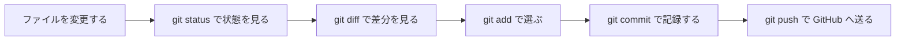
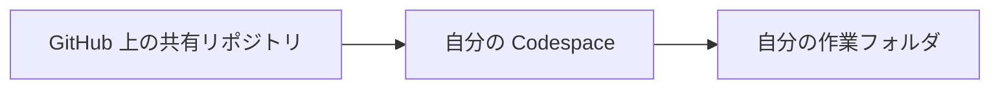
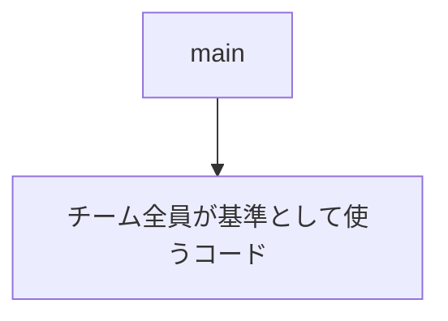
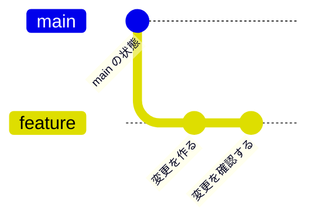
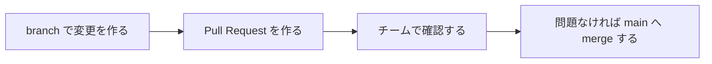
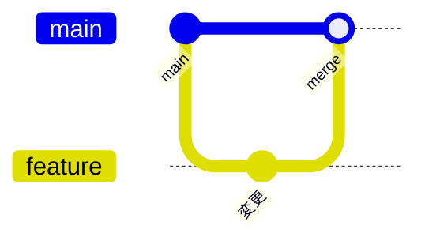
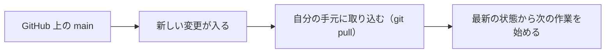
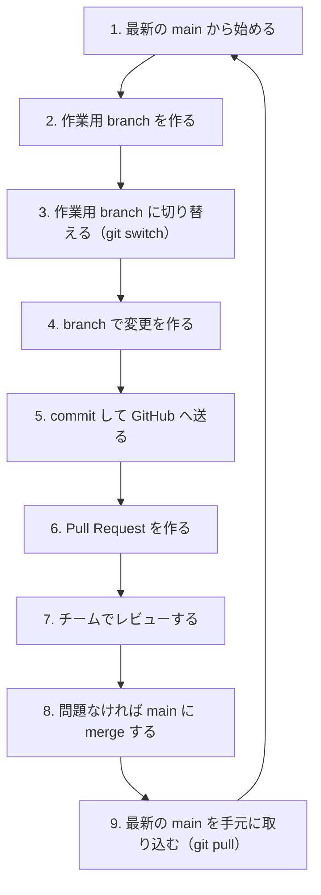
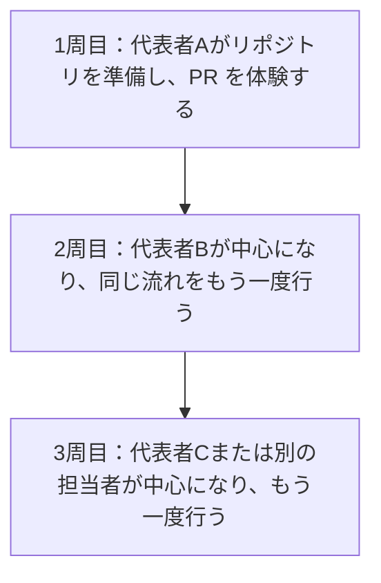

# 第8週：GitHub Flow 入門（branch / PR / merge）

## 今日のゴール

今日は、チームでコードを変更するときの基本的な流れである **GitHub Flow** を学びます。

今日のゴールは次の4つです。

- <ruby>branch<rt>ブランチ</rt></ruby> を作って作業する理由を説明できる
- <ruby>Pull Request<rt>プルリクエスト</rt></ruby> が何のためにあるか説明できる
- レビューと merge の役割を説明できる
- チームで同じリポジトリを扱うときの基本的な流れをイメージできる

---

## 前回のおさらい

前回は、1人で小さな変更を行い、GitHubへ送る流れを練習しました。

主に使った流れは次の通りです。



この流れは、1人で作業するときの基本です。

ただし、チーム開発では、全員が `main` に直接変更を push すると困ることがあります。

- まだ確認していないコードが、すぐに全員の基準になる
- 誰が何を変更したのか、確認する前に混ざってしまう
- 間違いが入ったときに、どの変更が原因か追いにくくなる
- チームメンバーが変更内容を読む機会がなくなる

そこで、チーム開発では「いきなり `main` に入れない」ための流れを使います。

---

## clone は GitHub のリポジトリを手元に持ってくること

前回は、自分用リポジトリの Codespace を直接開いて作業しました。

今回の演習では、グループで使う共有リポジトリを、自分の Codespace の中に持ってきて作業します。

このときに使う考え方が <ruby>clone<rt>クローン</rt></ruby> です。

clone は、GitHub 上にあるリポジトリを、自分の作業場所にコピーしてくることです。



clone すると、ファイルだけでなく、Git の履歴や branch の情報も一緒に手元へ来ます。

つまり、clone したあとに、自分の Codespace の中で変更を作り、commit し、GitHub へ送ることができます。

| 場所 | 役割 |
|---|---|
| GitHub 上のリポジトリ | チームで共有する元の場所 |
| 自分の Codespace | 自分が作業する場所 |
| clone したフォルダ | GitHub から持ってきた作業対象 |

> [!NOTE]
> clone は「GitHub の画面を開くこと」ではありません。
> GitHub 上のリポジトリを、自分が編集できる作業フォルダとして手元に持ってくることです。

---

## main はチームの基準になる場所

Git のリポジトリには、通常 `main` という branch があります。

`main` は、チームにとって **今の基準になるコード** です。



たとえば、チームで Rails アプリを作っている場合、`main` は次のような場所です。

- みんなが最新の状態として取り込む場所
- 動いている状態を保ちたい場所
- 新しい作業を始めるときの出発点になる場所

そのため、`main` に直接変更を入れ続けると、チーム全員に影響が出ます。

> [!IMPORTANT]
> `main` は「とりあえず何でも置く場所」ではありません。
> チームで確認した変更を合流させる、基準の場所として扱います。

---

## branch は作業用の分かれ道

<ruby>branch<rt>ブランチ</rt></ruby> は、Git の履歴を一時的に分けるためのものです。

`main` から branch を作ると、`main` を直接変えずに作業できます。
作業する branch を切り替えるときは、`git switch` を使います。



branch を使うと、次のような作業ができます。

- `main` を壊さずに新しい変更を試せる
- 1つの作業を、1つの branch として分けて管理できる
- 変更が終わってから、チームで確認できる

branch は、「別の場所で勝手に作るコピー」ではありません。
同じリポジトリの中で、作業の流れを分けるための仕組みです。

---

## 1つの branch には、1つの作業を入れる

branch は、作業のまとまりを分けるために使います。

たとえば、次のように分けると、あとから確認しやすくなります。

| branch の例 | 作業内容 |
|---|---|
| `add-member-profile` | メンバー紹介を追加する |
| `update-app-title` | アプリ名の表示を変更する |
| `add-about-page` | Aboutページを追加する |

反対に、1つの branch にいろいろな作業を混ぜると、確認しにくくなります。

- メンバー紹介を追加する
- ボタンの色を変える
- 不要なファイルを消す
- Rails の設定も変える

このような変更が1つの branch に混ざると、レビューする人は「何を確認すればよいのか」が分かりにくくなります。

> [!TIP]
> branch は「今回の作業の箱」と考えると分かりやすいです。
> 1つの箱には、1つの目的の変更を入れます。

---

## Pull Request は「確認してから入れてください」という相談

branch で作った変更は、すぐに `main` へ入れるのではありません。

GitHub では、branch の変更を `main` に入れる前に、<ruby>Pull Request<rt>プルリクエスト</rt></ruby> を作ります。

Pull Request は、短く **PR** と呼ばれることが多いです。

PR は、次のような意味を持ちます。

> この branch で変更を作りました。
> 内容を確認して、問題なければ `main` に入れてください。

PR は、単なる提出ボタンではありません。
チームで変更内容を確認し、会話するための場所です。

PR では、主に次のことを確認します。

- 何を変更したのか
- なぜ変更したのか
- どのファイルが変わったのか
- 画面や動作に問題がないか
- 他の人の作業に影響しないか



---

## レビューは責めるためではなく、よくするための確認

レビューは、PR の変更内容をチームメンバーが確認することです。

レビューの目的は、間違い探しをして責めることではありません。
チームでコードを安全に育てることです。

レビューでは、たとえば次のような視点で確認します。

- 変更内容が PR の目的と合っているか
- 不要な変更が混ざっていないか
- 表示や動作が意図した通りか
- ファイル名や文章が分かりやすいか
- 次に作業する人が読んでも理解できるか

レビューコメントは、相手を否定するためのものではありません。
「この変更をよりよくするにはどうすればよいか」をチームで相談するためのものです。

> [!NOTE]
> 後期のチーム開発では、PR とレビューを使って作業を進めます。
> 今回は、その基本の流れを前期のうちに体験します。

---

## merge は確認済みの変更を main に合流させること

<ruby>merge<rt>マージ</rt></ruby> は、branch の変更を別の branch に合流させることです。

今回の GitHub Flow では、PR で確認した変更を `main` に合流させます。



merge されると、branch で作った変更が `main` に入ります。

つまり、merge の後は、その変更がチーム全員の基準になります。

> [!IMPORTANT]
> merge は「作業が終わったから押すボタン」ではありません。
> PR で確認した変更を、チームの基準である `main` に入れる操作です。

---

## merge したあとは、全員が最新の main を取り込む

PR が merge されると、GitHub 上の `main` が新しくなります。

しかし、自分の Codespace の中にある `main` は、自動では更新されません。

そのため、チーム開発では次の考え方が大切です。

- GitHub 上の `main` が更新される
- 自分の手元の `main` は、まだ古い場合がある
- 次の作業を始める前に、最新の `main` を取り込む（`git pull`）



これを忘れると、古い状態から作業を始めてしまいます。

```mermaid
gitGraph LR:
  commit id: "共通の main"

  branch "member-a: feature-a"
  checkout main
  branch "member-b: main"

  checkout "member-a: feature-a"
  commit id: "Aさんの変更"

  checkout main
  merge "member-a: feature-a" id: "feature-a のPRをmerge" tag: "Pull Request"

  checkout "member-b: main"
  merge main id: "Bさんが git pull"
```

チーム開発では、「自分の作業を送る」だけでなく、「他の人の変更を受け取る」ことも必要です。

---

## GitHub Flow の全体像

ここまでの流れをまとめると、GitHub Flow は次のようになります。



前回学んだ `status`、`diff`、`add`、`commit`、`push` は、この流れの中でも使います。

今回新しく加わるのは、次の考え方です。

| 新しく学ぶもの | 役割 |
|---|---|
| branch | `main` から分けた作業場所 |
| PR | 変更を `main` に入れる前に確認する場所 |
| レビュー | チームで変更内容を読むこと |
| merge | 確認済みの変更を `main` に合流させること |
| pull | GitHub 上の最新の `main` を手元に取り込むこと |

---

## ここまでに学習した Git コマンド

第7週と第8週で、Git と GitHub の作業に関係するコマンドが増えてきました。

ここでは、何をするためのコマンドなのかを整理します。

| 今回 | コマンド | 役割 |
|---|---|---|
|| `git init` | 今いるフォルダで、新しく Git 管理を始める |
|🆕| `git clone` | GitHub 上のリポジトリを、自分の作業場所に持ってくる |
|🆕| `git branch` | branch の一覧を見たり、branch を作ったりする |
|🆕| `git switch` | 作業する branch を切り替える。新しい branch を作って切り替えることもできる |
|| `git status` | 今の変更状態を確認する |
|| `git diff` | ファイルの変更内容を確認する |
|| `git add` | 次の commit に含める変更を選ぶ |
|| `git commit` | 選んだ変更を、ローカルリポジトリに記録する |
|| `git log` | これまでの commit 履歴を見る |
|| `git push` | 手元の commit を GitHub へ送る |
|🆕| `git pull` | GitHub 上の最新の変更を手元に取り込む |

> [!NOTE]
> `git init` は、まだ Git 管理されていないフォルダで使うコマンドです。
> 今回の授業では、すでに用意されたリポジトリを使うため、基本的には `git init` を実行しません。

---

## 今回の演習の進め方

この後の演習では、2〜3人のグループで同じリポジトリを使います。

1回だけではなく、代表者を変えながら PR 作成を3周行います。



3周する理由は、操作を覚えるためだけではありません。

- 代表者だけが分かる状態を避ける
- branch、PR、レビュー、merge の流れを何度も見る
- 役割が変わっても、同じ流れで作業できるようにする
- 後期のチーム開発で使う流れを、前期のうちに体験しておく

---

## 今日のまとめ

今日の考え方を整理します。

| 用語 | 意味 |
|---|---|
| `main` | チームの基準になる branch |
| branch | `main` を直接変えずに作業するための分かれ道 |
| Pull Request | 変更を `main` に入れる前に、チームで確認する場所 |
| レビュー | PR の内容を読み、必要に応じてコメントすること |
| merge | 確認済みの変更を `main` に合流させること |
| pull | GitHub 上の最新の変更を手元に取り込むこと |

GitHub Flow は、特別な上級者向けの作業ではありません。
チームで安全に開発するための基本の流れです。

この後の演習では、グループでこの流れを3周します。
まずは、1つずつ順番に進めながら、branch、PR、レビュー、merge の役割を確認していきましょう。

[練習](practice.md) へ進みましょう。
