# 第8週：練習 ── チームで Pull Request を使って開発する

## この練習について

今回は、2〜3人のグループで1つの GitHub リポジトリを共有し、チームでコードを変更する流れ（**GitHub Flow**）を体験します。

目的は、チームで作業を分担し、お互いのコードを確認（レビュー）して合流（マージ）させる一連の流れを身につけることです。

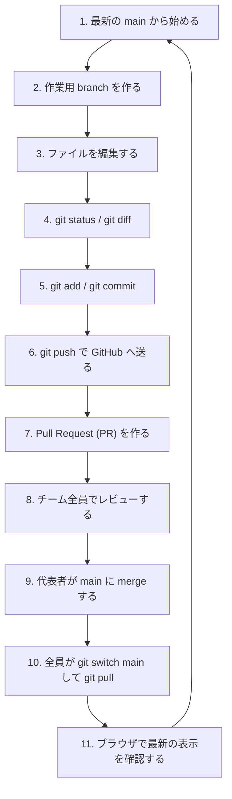

> [!IMPORTANT]
> - この演習は、2〜3名ずつのグループで行います。
> - まず「準備フェーズ」を全員で進めてから、課題①〜④を **順番に（直列で）** 進めます。
> - コンフリクト（衝突）を防ぐため、1人の変更がマージされ、全員が手元に `pull` し終わるまで、次の人は作業を開始しないでください。

---

## 準備フェーズ：共同開発の準備をする

まずは、チームで使う共有リポジトリを作成し、全員が作業できる環境を整えます。

## 準備1：チームの代表者を決める

グループ内で、今回の「1周目の代表者」を1名決めてください。

- 代表者：リポジトリを作成し、メンバーを招待する人
- メンバー：代表者のリポジトリに参加して開発する人

※ 1周目が終わったら、代表者を交代して2周目、3周目を行います。まずは最初の代表者を決めてください。

## 準備2：【代表者】テンプレートからリポジトリを作る

**代表者のみ**が実行する課題です。

1. ブラウザで次のリポジトリ（第7週で使ったテンプレート）を開きます。
   [TORIFUKUKaiou/rails-dojo-git-practice](https://github.com/TORIFUKUKaiou/rails-dojo-git-practice)
2. 画面右上にある `Use this template` > `Create a new repository` をクリックします。
3. リポジトリの設定を次のように入力して作成します。
   - **Repository name**: `rails-dojo-git-practice-team-XX` (XXの部分はチーム番号や自分たちの名前などにしてください)
   - **Public / Private**: 必ず **Public** を選択してください。
4. リポジトリが作成されたら、そのページのURLを、Teamsや口頭などでグループのメンバー全員に伝えてください。

## 準備3：【代表者】メンバーをコラボレータ（共同開発者）に招待する

**代表者のみ**が実行する課題です。

代表者のリポジトリに、メンバーがコードを書き込めるように権限を与えます。

1. 代表者は、自分が作成したリポジトリのページを開きます。
2. 画面上部にある `Settings`（歯車アイコン）タブをクリックします。
3. 左側のメニューから `Collaborators` をクリックします。
4. `Add people` ボタンをクリックします。

   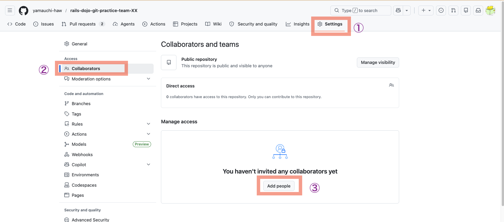

5. メンバーの GitHub ユーザー名（または登録メールアドレス）を入力して検索し、追加します。

## 準備4：【メンバー】招待を承諾する

**メンバー（代表者以外）のみ**が実行する課題です。

1. 代表者から教えてもらったリポジトリのURLの末尾に `/invitations` をつけたURLをブラウザで開きます。
   - 例: `https://github.com/代表者のユーザー名/rails-dojo-git-practice-team-XX/invitations`
   - もしくは、GitHub画面の右上にあるベルマーク（通知）を開きます。

   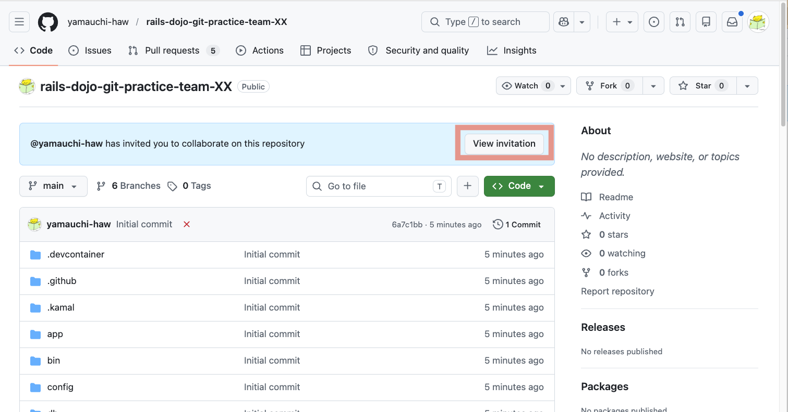

2. 画面に表示される **`Accept invitation`**（招待を承諾する）ボタンをクリックします。

   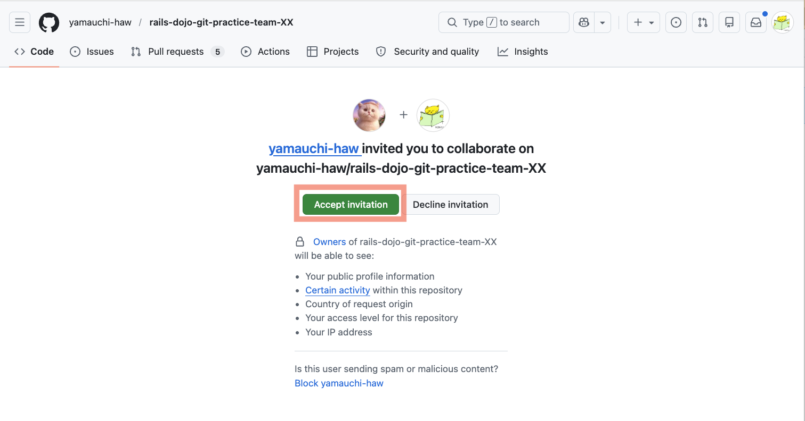

> [!IMPORTANT]
> 招待を承諾しないと、あとでコードを push する際にエラーになります。必ず全員が承諾したことを確認してください。

## 準備5：【全員】Codespace を起動する

**グループの全員（代表者もメンバーも）** が実行する課題です。

1. **代表者が作成したリポジトリ**の GitHub 画面を開きます。
   - URLの中に、**代表者のユーザー名**が含まれていることを確認してください。
2. 画面右上にある緑色の `Code` ボタンをクリックし、`Codespaces` タブを選択します。
3. **`Create codespace on main`** をクリックします。
   
4. VS Code の画面が開き、ターミナルに「準備完了」と表示されるまで待ちます（初回起動には数分かかります）。
5. ターミナルに「準備完了」と表示され、自動的な環境構築（`bundle install` など）が終わったことを確認します。

## 準備6：【全員】Rails アプリを起動する

1. 起動した Codespace のターミナルで、次のコマンドを実行してデータベースを準備します。
   ```bash
   bin/rails db:prepare
   ```
2. 続いて、次のコマンドを実行して Rails サーバーを起動します。
   ```bash
   bin/rails server
   ```
3. ポートタブの `Application(3000)` にカーソルをあて、🌐（ブラウザで開く）アイコンをクリックして、技術記事共有スペース **CodeShelf** の一覧画面が表示されることを確認します。

   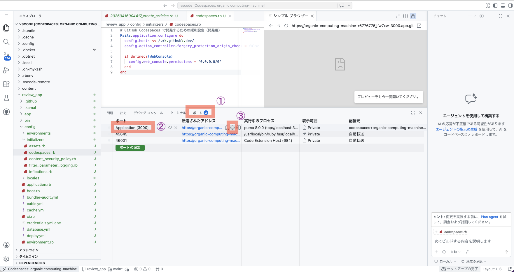

> [!IMPORTANT]
> サーバーを起動したターミナルは、そのまま動かしておきます。
> これ以降に Git コマンドを実行するときは、**画面下部の `+` ボタンから「新しいターミナル」を開いて作業してください。**

---

## 演習フェーズ：順番に Pull Request を作成・マージする

準備が整いました。ここからは**課題①、課題②、課題③の順番に**、一つずつ作業を進めます。

---

## 課題①：【担当A】ヘッダーロゴと README の変更

担当A（代表者またはメンバーの1人目）が作業を行います。**担当A以外の人（B, C）は、Aの作業を監視し、自分が思っていることと違うことをしようとしていたら質問をしたり、正しい手順をアドバイスしてください。**

### Step 1：トピックブランチを作成する
1. 新しいターミナルを開きます。
2. 現在 `main` ブランチにいることを確認するため、次を実行します。
   ```bash
   git branch
   ```
   `* main` と表示されていればOKです。
3. 作業用のトピックブランチ `add-team-logo` を作成し、同時に切り替えます。
   ```bash
   git switch -c add-team-logo
   ```
4. 切り替わったことを確認するため、もう一度実行します。
   ```bash
   git branch
   ```
   `* add-team-logo` と表示されていれば成功です。

### Step 2：ファイルを編集する（複数ファイルの編集）
次の2つのファイルを書き換えます。

* **ファイル1：`app/views/layouts/application.html.erb`**
  - 37行目付近にある次の記述を探します。
    ```erb
    <strong>CodeShelf</strong>
    ```
  - ロゴの隣に自分たちのチーム名が表示されるように変更します。
    ```erb
    <strong>CodeShelf (チーム名)</strong>
    ```
    ※ `(チーム名)` の部分は自分たちのグループ名や「Team-A」などに書き換えてください。

* **ファイル2：`README.md`**
  - ファイルの最後に、次の見出しと文章を追記します。
    ```markdown
    ## チーム共同開発の記録
    
    - 課題①：ヘッダーロゴを変更し、READMEを更新しました（担当A）
    ```

ファイルを保存します。（Codespaceの設定で自動保存されるようになっています）

### Step 3：変更状態と差分を確認する
1. どのファイルが変更されたか確認します。
   ```bash
   git status
   ```
   `application.html.erb` と `README.md` が赤文字で表示されていることを確認します。
2. 具体的な変更内容を確認します。
   ```bash
   git diff
   ```
   自分が変更した箇所の行の頭に `+` がついていることを確認します。
   ※ 差分表示画面から戻るには、キーボードの **`q`** を押してください。

### Step 4：2つのファイルをまとめて add して commit する
1. 2つのファイルをスペースで区切って指定し、1つのコマンドで add します。
   ```bash
   git add app/views/layouts/application.html.erb README.md
   ```
2. ステージングエリアに正しく登録されたか確認します。
   ```bash
   git status
   ```
   2つのファイルが緑文字（Changes to be committed）になっていることを確認します。
3. 変更を記録（commit）します。
   ```bash
   git commit -m "ヘッダーのロゴにチーム名を追加しREADMEを更新"
   ```
4. コミット履歴を確認します。
   ```bash
   git log --oneline
   ```
   一番上に今作成したコミットが表示されていることを確認します。

### Step 5：GitHub へ push する
手元のコミットを GitHub に送信します。
```bash
git push origin add-team-logo
```
※ 送信するブランチは `main` ではなく、自分が作ったトピックブランチ名 `add-team-logo` です。

### Step 6：Pull Request (PR) を作成する
1. GitHub上にあるリポジトリのページを開きます。
2. `Compare & pull request` という黄色のバーが表示されているので、それをクリックします。

   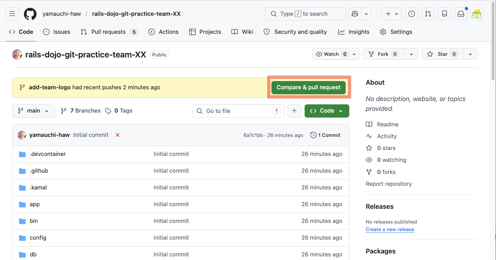

   （表示されていない場合は、`Pull requests` タブを開き、`New pull request` をクリックし、`compare:` で `add-team-logo` ブランチを選択します）
3. タイトルに「**ヘッダーロゴにチーム名を追加**」と入力します。（デフォルトで入力されているものを編集します）
4. `Create pull request` をクリックして、PR を作成します。

   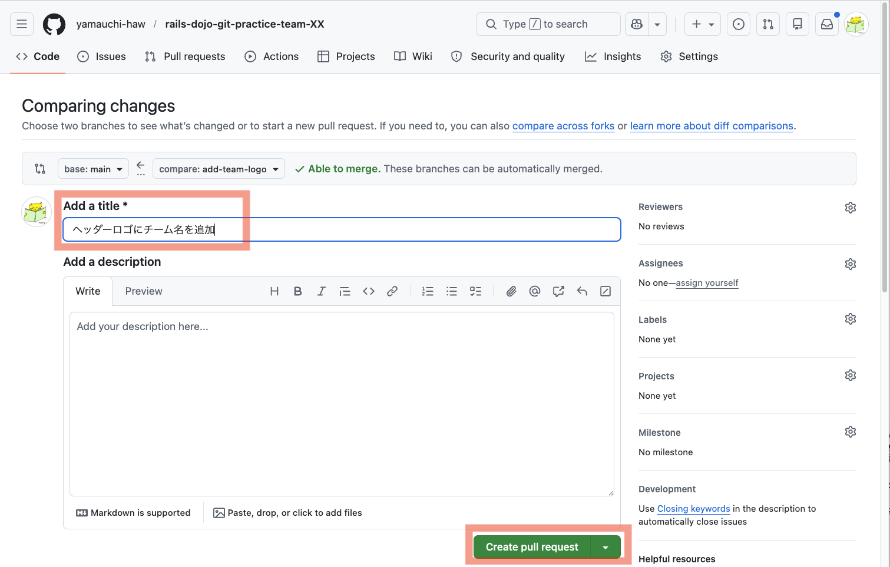

### Step 7：全員でレビューし、マージする
1. **グループ全員（B, Cも含む）** でGitHubのPR画面を開きます。
   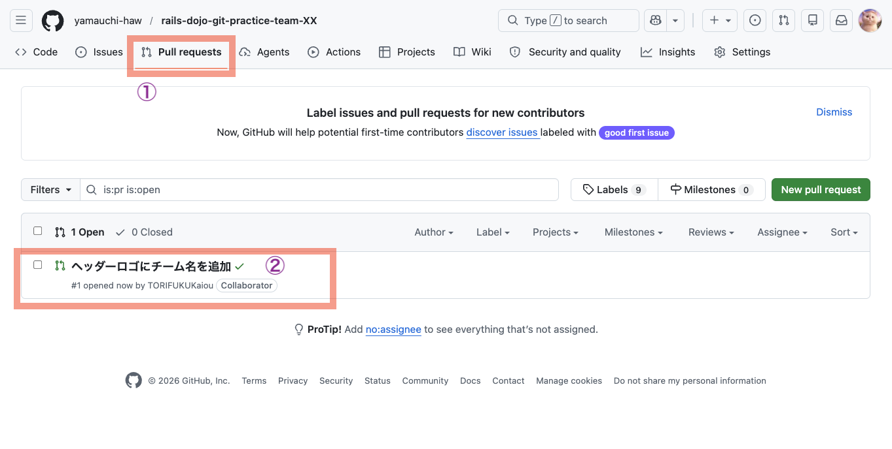
2. `Files changed` タブをクリックし、担当Aがどのような変更を行ったか（差分）を目で確認します。
   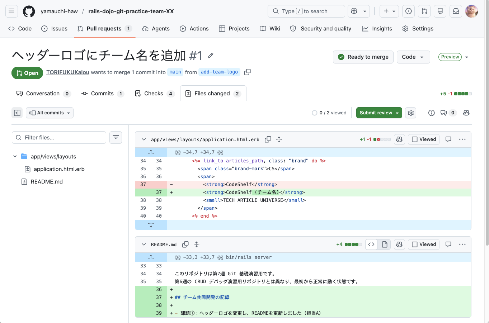
3. 表示に問題がなければ、誰かがコメント欄に「確認しました！」「LGTM（Look Goods To Me）」などと入力してコメントします。
   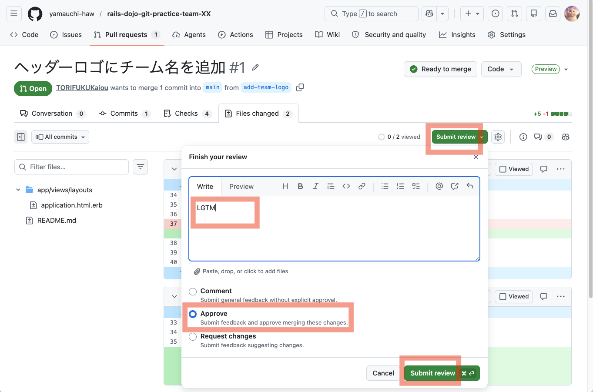
4. レビューが完了したら、**代表者**がPRのConversation画面で **`Merge pull request`** > **`Confirm merge`** をクリックしてマージします。
   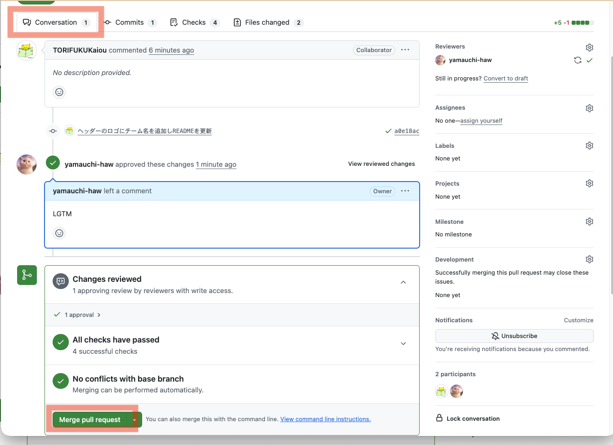
5. PRのステータスが **`Merged`**（紫色）になったことを確認します。
   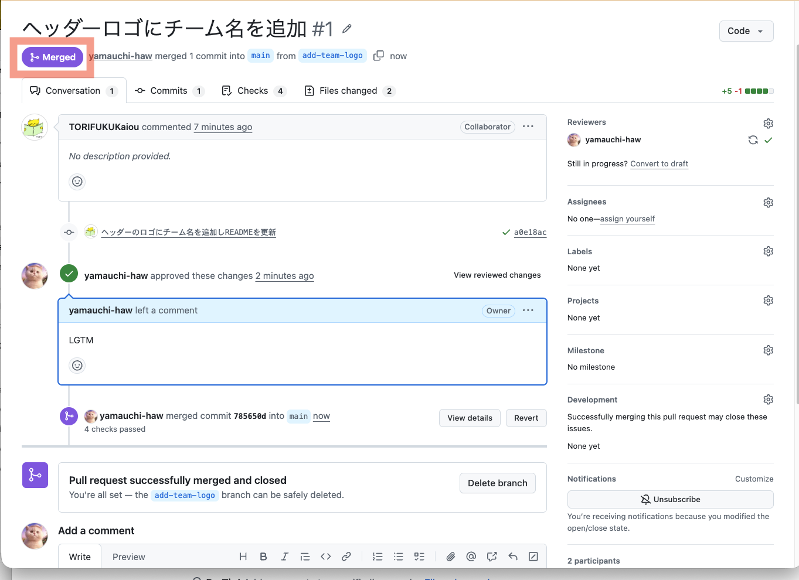

### Step 8：【全員】手元の環境を最新にする（同期）
マージされた最新のコードを手元に取り込みます。**A, B, C 全員が自分の Codespace で実行してください。**

1. ターミナルで、作業用ブランチから `main` ブランチに戻ります。
   ```bash
   git switch main
   ```
2. GitHub 上の最新の変更を手元に取り込みます。
   ```bash
   git pull
   ```
   `README.md` や `application.html.erb` が更新された履歴が表示されれば成功です。
3. **全員**が、自分のブラウザで CodeShelf アプリのプレビュー画面を再読み込みします。
   ロゴの隣にチーム名が表示されていることを確認してください。

---

## 課題②：【担当B】新着記事の見出しと README の変更

担当B（グループの2人目）が作業を行います。**担当B以外の人（A, C）は、Bの作業を監視し、自分が思っていることと違うことをしようとしていたら質問をしたり、正しい手順をアドバイスしてください。**

### Step 1：トピックブランチを作成する
1. `git branch` を実行し、現在 `main` にいることを確認します。
   ```bash
   git branch
   ```
2. 作業用のトピックブランチ `update-section-title` を作成し、切り替えます。
   ```bash
   git switch -c update-section-title
   ```

### Step 2：ファイルを編集する（複数ファイルの編集）
次の2つのファイルを書き換えます。

* **ファイル1：`app/views/articles/index.html.erb`**
  - 25行目付近にある次の記述を探します。
    ```erb
    <h2>新着記事</h2>
    ```
  - 見出しにチーム名が含まれるように変更します。
    ```erb
    <h2>（チーム名）の新着記事</h2>
    ```
    ※ `（チーム名）` の部分は課題①で決めたチーム名にしてください。

* **ファイル2：`README.md`**
  - ファイルの最後に、次の文章を追記します。
    ```markdown
    - 課題②：新着記事の見出しを変更し、READMEを更新しました（担当B）
    ```

ファイルを保存します。（Codespaceの設定で自動保存されるようになっています）

### Step 3：変更状態と差分を確認する
1. 状態を確認します。
   ```bash
   git status
   ```
   `index.html.erb` と `README.md` が赤文字であることを確認します。
2. 差分を確認します。
   ```bash
   git diff
   ```
   ※ 確認が終わったら `q` を押して戻ります。

### Step 4：2つのファイルを add して commit する
1. 2つのファイルをスペース区切りで指定し、add します。
   ```bash
   git add app/views/articles/index.html.erb README.md
   ```
2. ステージングエリアの状態を確認します。
   ```bash
   git status
   ```
3. 変更を記録（commit）します。
   ```bash
   git commit -m "新着記事の見出しを変更しREADMEを更新"
   ```
4. 履歴を確認します。
   ```bash
   git log --oneline
   ```

### Step 5：GitHub へ push する
```bash
git push origin update-section-title
```

### Step 6：Pull Request (PR) を作成する
1. GitHubを開き、`Compare & pull request` ボタンから PR を作成します。
2. タイトルに「**新着記事の見出しを変更**」と入力し、`Create pull request` をクリックします。

### Step 7：全員でレビューし、マージする
1. **全員**でGitHubのPR画面を開き、`Files changed` で差分を確認し、コメントを書き込みます。
2. レビュー後、**代表者**が **`Merge pull request`** > **`Confirm merge`** をクリックしてマージします。

### Step 8：【全員】手元の環境を最新にする（同期）
**A, B, C 全員が自分の Codespace で実行してください。**

1. `main` ブランチに戻ります。
   ```bash
   git switch main
   ```
2. 最新の変更を取り込みます。
   ```bash
   git pull
   ```
3. **全員**が、自分のブラウザでプレビュー画面を再読み込みします。
   一覧画面の見出しが「（チーム名）の新着記事」に変わっていることを確認してください。

---

## 課題③：【担当C】投稿フォームと README の変更

担当C（グループの3人目。2人グループの場合は担当Aがもう一度行います）が作業を行います。**担当C以外の人（A, B）は、Cの作業を監視し、自分が思っていることと違うことをしようとしていたら質問をしたり、正しい手順をアドバイスしてください。**

### Step 1：トピックブランチを作成する
1. `git branch` で `main` にいることを確認します。
2. 作業用のトピックブランチ `customize-post-form` を作成し、切り替えます。
   ```bash
   git switch -c customize-post-form
   ```

### Step 2：ファイルを編集する（複数ファイルの編集）
次の2つのファイルを書き換えます。

* **ファイル1：`app/views/articles/_form.html.erb`**
  - 25行目付近にある、新規投稿ボタンの次の記述を探します。
    ```erb
    <%= form.submit article.persisted? ? "記事を更新する" : "記事を公開する", class: "button button-primary button-large" %>
    ```
  - 新しく投稿するときのボタンの文言（「記事を公開する」）を「**知識を送信する**」に変更します。
    ```erb
    <%= form.submit article.persisted? ? "記事を更新する" : "知識を送信する", class: "button button-primary button-large" %>
    ```

* **ファイル2：`README.md`**
  - ファイルの最後に、次の文章を追記します。
    ```markdown
    - 課題③：投稿フォームのボタン文言を変更し、READMEを更新しました（担当C）
    ```

ファイルを保存します。（Codespaceの設定で自動保存されるようになっています）

### Step 3：変更状態と差分を確認する
1. 状態を確認します。
   ```bash
   git status
   ```
   `_form.html.erb` と `README.md` が赤文字であることを確認します。
2. 差分を確認します。
   ```bash
   git diff
   ```
   ※ 確認が終わったら `q` を押して戻ります。

### Step 4：2つのファイルを add して commit する
1. 2つのファイルをスペース区切りで指定し、add します。
   ```bash
   git add app/views/articles/_form.html.erb README.md
   ```
2. ステージングエリアの状態を確認します。
   ```bash
   git status
   ```
3. コミットします。
   ```bash
   git commit -m "新規投稿ボタンの文言を「知識を送信する」に変更しREADMEを更新"
   ```
4. 履歴を確認します。
   ```bash
   git log --oneline
   ```

### Step 5：GitHub へ push する
```bash
git push origin customize-post-form
```

### Step 6：Pull Request (PR) を作成する
1. GitHubを開き、`Compare & pull request` ボタンから PR を作成します。
2. タイトルに「**新規投稿フォームのボタン文言を変更**」と入力し、`Create pull request` をクリックします。

### Step 7：全員でレビューし、マージする
1. **全員**でGitHubのPR画面を開き、`Files changed` で差分を確認し、コメントを書き込みます。
2. レビュー後、**代表者**が **`Merge pull request`** > **`Confirm merge`** をクリックしてマージします。

### Step 8：【全員】手元の環境を最新にする（同期）
**A, B, C 全員が自分の Codespace で実行してください。**

1. `main` ブランチに戻ります。
   ```bash
   git switch main
   ```
2. 最新の変更を取り込みます。
   ```bash
   git pull
   ```
3. **全員**が、自分のブラウザでプレビュー画面を再読み込みします。
   右上の「記事を書く」（または「投稿する」）ボタンから新規作成フォームを開き、一番下のボタンが「**知識を送信する**」に変わっていることを確認してください。

---

## 課題④：コラボレータ権限の確認

GitHub でリポジトリを変更するためには「書き込み権限（コラボレータ招待）」が必要です。
権限を外すとどうなるかを実際に試し、権限の重要性を理解しましょう。

## Step 1：【代表者】メンバーのコラボレータ権限を一時的に外す

**代表者のみ**が実行する課題です。

1. 代表者はリポジトリの `Settings` > `Collaborators` を開きます。
2. メンバーのうち1名（例：担当B）の右側にある `Remove`（削除）ボタンをクリックし、コラボレータから削除します。

## Step 2：【権限を外されたメンバー】トピックブランチを作成し、変更して push する

**コラボレータから一時的に削除されたメンバー（例：担当B）のみ**が実行する課題です。

1. 自分の Codespace のターミナルで、テスト用のブランチを作成します。
   ```bash
   git switch -c test-permission
   ```
2. `README.md` を開き、最後に次の1行を追記して保存します。
   ```markdown
   - 課題④：権限の確認テスト中
   ```
3. 変更を add して commit します。
   ```bash
   git add README.md
   git commit -m "テスト用の書き込み"
   ```
4. コミットを GitHub へ push してみます。
   ```bash
   git push origin test-permission
   ```
5. ターミナルに表示されるエラーを確認します。
   次のようなエラーが表示されて、**push が拒否されれば成功です。**
   ```text
   remote: Permission to 代表者のユーザー名/リポジトリ名.git denied to 自分のユーザー名.
   fatal: unable to access 'https://github.com/代表者のユーザー名/リポジトリ名.git/': The requested URL returned error: 403
   ```

> [!IMPORTANT]
> 403エラーは「権限がありません（Forbidden）」を意味します。
> コラボレータから削除されたため、GitHub上のリポジトリに新しい変更を送ることができなくなりました。

## Step 3：【代表者】メンバーを再びコラボレータに招待する

**代表者のみ**が実行する課題です。

1. 代表者は再びリポジトリの `Settings` > `Collaborators` > `Add people` を開きます。
2. 先ほど削除したメンバーをもう一度コラボレータとして招待します。

## Step 4：【メンバー】再び招待を承諾し、push する

**コラボレータに再招待されたメンバー（例：担当B）のみ**が実行する課題です。

1. 課題4と同様に、ブラウザで `/invitations` のURLを開くか、GitHubの通知ベルから招待を **Accept（承諾）** します。
2. 承諾できたら、Codespace のターミナルに戻り、もう一度同じ push コマンドを実行します。
   ```bash
   git push origin test-permission
   ```
3. エラーが出ずに `Everything up-to-date` または送信成功のメッセージが表示されれば、**正常に push できるようになったことを確認できました。**

> [!NOTE]
> 動作確認のためのテストコミットなので、この `test-permission` ブランチは PR を作成したりマージしたりする必要はありません。
> 確認が終わったら、`git switch main` で `main` に戻っておきましょう。

---

## 2周目、3周目の進め方

ここまでの流れで、全員が GitHub Flow（ブランチ、PR、レビュー、マージ、プル）の一連の流れを体験しました。

しかし、これだけでは「自分がリポジトリを作成してメンバーを管理する（代表者の役割）」を体験していない人がいます。

そこで、グループ内で代表者を交代し、**最初から（課題1から）もう一度演習を行ってください。**

- **2周目**：代表者をメンバーBに変更して、BのGitHubアカウントでリポジトリを作成し、AとCを招待して課題①〜④を実行します。
- **3周目**：代表者をメンバーCに変更して、CのGitHubアカウントでリポジトリを作成し、AとBを招待して課題①〜④を実行します。

全員が「代表者」としてリポジトリを管理する操作を経験することで、後期のチーム開発で誰がどの役割になってもスムーズにGitを操作できるようになります。

---

## まとめ問題

## 課題⑤：`git switch -c` と `git switch` の違いを説明する（考察問題・実行しない）

> [!IMPORTANT]
> この課題は考察問題です。ファイルを変更したり、コマンドを実行したりしません。
> ノートまたは指定された場所に答えを書いてください。

次の2つの違いを、自分の言葉で説明してください。

- `git switch -c new-branch`
- `git switch main`

<details>
<summary>解答例</summary>

`-c` オプションがついた `git switch -c ブランチ名` は、**新しくブランチを作成して、そのブランチに切り替える** コマンドです。

`-c` がついていない `git switch ブランチ名` は、**すでに存在するブランチに切り替える** コマンドです。

したがって、新しく作業を始めるときは `-c` をつけ、すでに作ってあるブランチに戻る（`main` など）ときは `-c` をつけずに実行します。

</details>

## 課題⑥：なぜマージの後に `git pull` を行うのか説明する（考察問題・実行しない）

> [!IMPORTANT]
> この課題は考察問題です。ファイルを変更したり、コマンドを実行したりしません。
> ノートまたは指定された場所に答えを書いてください。

他の人が作成した Pull Request が GitHub 上で `main` にマージされたあと、なぜ自分たちの Codespace で `git pull` を実行する必要があるのか、その理由を説明してください。

<details>
<summary>解答例</summary>

GitHub上（リモート）でPRがマージされて `main` が最新化されても、各自の Codespace（ローカル）にある `main` は自動的に更新されないためです。

手元のコードが古いまま次の作業を始めると、古いコードを基準に変更を作ってしまい、後でコンフリクト（衝突）を引き起こす原因になります。
そのため、他の人の変更がマージされたら、すぐに `git pull` を実行して、手元のコードを常に最新状態にする必要があります。

</details>

## 今日の終わりに確認すること

最後に、次を確認してください。

- チームの全員が、代表者としてリポジトリを作成し、メンバーを招待・管理した経験がある
- ブランチの作成、push、PR作成、レビュー、マージ、pull の一連の流れを繰り返し練習した
- コラボレータ権限がないと push できず、権限があると push できる挙動を体験した
- Codespaces の `git status` が clean になっている

おつかれさまでした。
さらに力をつけるため、[Stretch](stretch.md) へ進みましょう。
