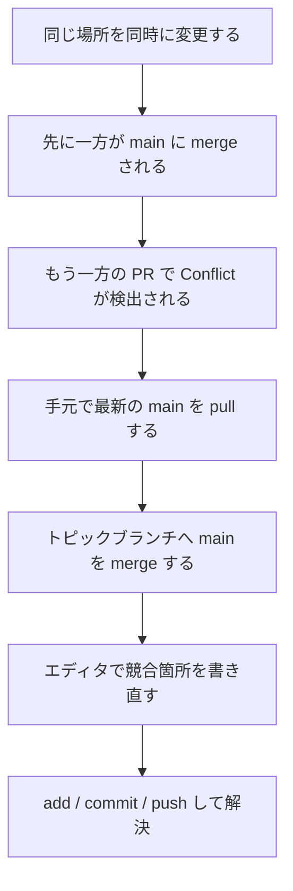
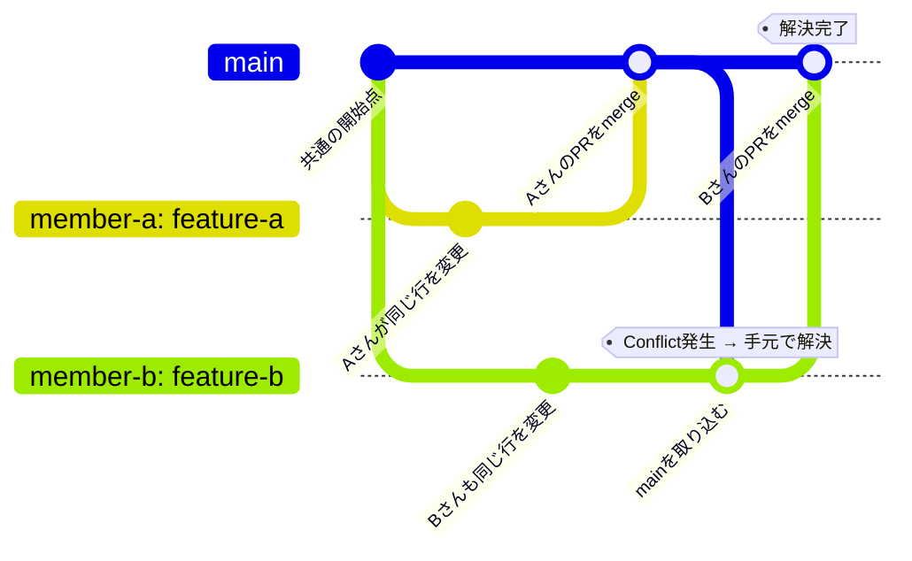
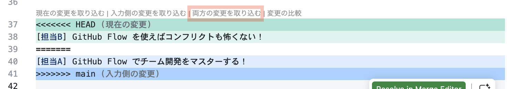

# 第8週：Stretch ── コンフリクトの解決と Git ノック

この課題は、[練習](practice.md) を終えた方向けの発展課題です。

## この練習について

Practice では、チームメンバーがお互いに順番を待って（直列で）作業したため、コードが衝突することなく安全に開発ができました。

しかし、実際の現場では、複数のメンバーが**同じファイルの同じ場所**を同時に書き換えてしまうことがあります。このときに発生するのが **コンフリクト（競合・衝突）** です。

この Stretch では、コンフリクトをわざと発生させ、それを手元で安全に解決する手順を体験します。その後、Git 操作の基本サイクルを体に覚え込ませるための「Git ノック（反復練習）」を行います。



### 衝突を解決するための「手元でのマージ」と `git merge` コマンド

GitHub上で「コンフリクト（衝突）」が発生したときは、GitHubの画面上ではなく、自分の手元の Codespace で解決するのが基本です。

そのために、以下の手順で解決します。

1. 最新の `main` ブランチを `pull` で手元に取り込む
2. 自分の作業用ブランチに切り替える
3. **`git merge main`** コマンドを実行し、最新の `main` の変更を自分のブランチに合流（マージ）させる

同じ行を変更しているため、この `git merge` コマンドを実行した瞬間に、Codespace 上でコンフリクトが発生します。

この Stretch では、実際にこの衝突を発生させ、VS Code エディタを使って解消する流れを体験します。



---

## 1. コンフリクト（競合）の解決フェーズ

チーム全員（Aさん、Bさん、Cさん）が「コンフリクトを発生させ、自分の手元の Codespace で解消して再 push・マージする」という解消役を1回ずつ体験します。

リポジトリは、**Practice で使用した代表者Aさんのリポジトリ**をそのまま使用し、全員が、代表者Aさんのリポジトリから作成した各自のCodespaceを使用して進めます。

### 準備：手元の環境を最新にする（全員）

演習を始める前に、全員の手元の Codespace（※代表者Aさんのリポジトリから起動した環境）を最新の `main` 状態に揃えます。**Aさん、Bさん、Cさん全員が実行してください。**

1. 確実に `main` ブランチに切り替えます。
   ```bash
   git switch main
   ```
2. GitHub 上の最新の変更を手元に取り込みます。
   ```bash
   git pull
   ```
   これで全員の Codespace が最新の状態で揃いました。

---

### シナリオ①：【担当B】がコンフリクトを解決する

担当Aと担当Bが同時に `README.md` の末尾の同じ位置に異なる文章を追記します。先にAがマージを完了させ、**Bがコンフリクトを解決する役割**を体験します。

#### Step 1：AとBが同時にトピックブランチを作成する
1. **担当A**: ターミナルで `main` にいることを確認し、ブランチ `conflict-a` を作成して切り替えます。
   ```bash
   git switch -c conflict-a
   ```
2. **担当B**: ターミナルで `main` にいることを確認し、ブランチ `conflict-b` を作成して切り替えます。
   ```bash
   git switch -c conflict-b
   ```

#### Step 2：AとBが同時に同じ場所を変更する
1. **担当A**: `README.md` の一番最後の行に、次のテキストを追記して保存します。
   ```markdown
   [担当A] GitHub Flow でチーム開発をマスターする！
   ```
2. **担当B**: `README.md` の一番最後の行に、次のテキストを追記して保存します。
   ```markdown
   [担当B] GitHub Flow を使えばコンフリクトも怖くない！
   ```

#### Step 3：Aが先に commit して push し、マージを完了する
1. **担当A**: 変更をコミットし、GitHub へ送信します。
   ```bash
   git add README.md
   git commit -m "READMEの末尾に担当Aの文章を追記"
   git push origin conflict-a
   ```
2. **担当A**: GitHub上でPRを作成します。

3. **全員**: 全員でレビューします。

4. **代表者（任意）**: このPRを `main` へマージします。

#### Step 4：Bが遅れて commit して push し、PR を作成する
1. **担当B**: 自分の変更をコミットし、GitHub へ送信します。
   ```bash
   git add README.md
   git commit -m "READMEの末尾に担当Bの文章を追記"
   git push origin conflict-b
   ```
2. **担当B**: GitHub上で `conflict-b` ブランチの PR を作成します。
3. **全員**: 作成された PR の画面を確認します。
   「**This branch has conflicts that must be resolved**（このブランチには解決すべき競合があります）」と表示され、マージボタンが押せなくなっていることを確認します。

#### Step 5：Bが手元の Codespace でコンフリクトを解決する
**解消役の担当B**が、自分の Codespace のターミナルで解決作業を行います。
※ 担当AとCは、Bの画面を見守りながら、手順に誤りがないかアドバイスをしてください。

1. 自分の Codespace のターミナルで `main` ブランチに戻ります。
   ```bash
   git switch main
   ```
2. GitHub 上の最新の `main`（すでにAの変更がマージされている状態）を取り込みます。
   ```bash
   git pull
   ```
3. 自分の作業用ブランチに戻ります。
   ```bash
   git switch conflict-b
   ```
4. 最新になった `main` ブランチを、自分のブランチへマージ（合流）させます。
   ```bash
   git merge main
   ```
5. ターミナルに **`Automatic merge failed; fix conflicts and then commit the result.`**（自動マージ失敗：競合を修正してコミットしてください）と表示されることを確認します。

#### Step 6：VS Code で競合を解消する
1. **担当B**: VS Code で `README.md` を開きます。
2. 競合が発生した箇所が、次のような記号で囲まれていることを確認します。
   ```markdown
   <<<<<<< HEAD
   [担当B] GitHub Flow を使えばコンフリクトも怖くない！
   =======
   [担当A] GitHub Flow でチーム開発をマスターする！
   >>>>>>> main
   ```
   - `<<<<<<< HEAD` から `=======` まで：**現在の自分のブランチ（B）の変更**
   - `=======` から `>>>>>>> main` まで：**合流させようとしたブランチ（Aのマージ済みの変更）**

   

3. 今回は、**AとBの両方のテキストを残す**ように、エディタ上で競合マーカー（`<<<<<<<`, `=======`, `>>>>>>>` などの記号）を消し、次のように綺麗に書き直して保存します。
   ```markdown
   [担当A] GitHub Flow でチーム開発をマスターする！
   [担当B] GitHub Flow を使えばコンフリクトも怖くない！
   ```

#### Step 7：解消した変更を push する
1. **担当B**: 競合の解決が、意図通りかを確認します。
   ```bash
   git status
   git diff
   ```
   コンフリクト解決中の`git diff`は、通常とは少し異なる形式で表示されます。
2. **担当B**: 競合を解決したため、ファイルをステージングエリアに追加します。
   ```bash
   git add README.md
   ```
3. マージコミット（競合を解決したという記録）を作成します。
   ```bash
   git commit -m "AとBのコンフリクトを解消"
   ```
4. 解決したブランチを GitHub へ再送信します。
   ```bash
   git push origin conflict-b
   ```
5. **全員**: GitHubの PR 画面を確認します。緑色の「**This branch has no conflicts with the base branch**（競合はありません）」に表示が変わり、マージが可能になったことを確認します。
6. **代表者（任意）**: PRを `main` へマージします。
7. **全員**: ターミナルで `main` ブランチに戻り、最新の変更を取り込みます。
   ```bash
   git switch main
   git pull
   ```
   全員がCodespaceでREADME.mdを開き、AとB両方の文章が並んでいることを確認します。

---

### シナリオ②：【担当C】がコンフリクトを解決する

担当Bと担当Cが同時に `README.md` の末尾の同じ位置に異なる文章を追記します。先にBがマージを完了させ、**Cがコンフリクトを解決する役割**を体験します。

#### Step 1：BとCが同時にトピックブランチを作成する
1. **担当B**: `main` にいることを確認し、ブランチ `conflict-b2` を作成して切り替えます。
   ```bash
   git switch -c conflict-b2
   ```
2. **担当C**: `main` にいることを確認し、ブランチ `conflict-c` を作成して切り替えます。
   ```bash
   git switch -c conflict-c
   ```

#### Step 2：BとCが同時に同じ場所を変更する
1. **担当B**: `README.md` の一番最後の行に、次のテキストを追記して保存します。
   ```markdown
   [担当B] マージは安全だ！
   ```
2. **担当C**: `README.md` の一番最後の行に、次のテキストを追記して保存します。
   ```markdown
   [担当C] マージは慎重に！
   ```

#### Step 3：Bが先に commit して push し、マージを完了する
1. **担当B**: コミットして push します。
   ```bash
   git add README.md
   git commit -m "READMEの末尾に担当Bの文章を追加"
   git push origin conflict-b2
   ```
2. **担当B**: GitHub上でPRを作成します。

3. **全員**: 全員でレビューします。

4. **代表者（任意）**: このPRを `main` へマージします。

#### Step 4：Cが遅れて commit して push し、PR を作成する
1. **担当C**: コミットして push し、PR を作成します。
   ```bash
   git add README.md
   git commit -m "READMEの末尾に担当Cの文章を追加"
   git push origin conflict-c
   ```
2. **全員**: GitHubの PR 画面でコンフリクトが発生し、マージボタンがロックされたことを確認します。

#### Step 5：Cが手元の Codespace でコンフリクトを解決する
**解消役の担当C**が、自分の Codespace のターミナルで解決作業を行います。
※ 担当AとBは、Cの画面を見守りながら、アドバイスをしてください。

1. ターミナルで `main` に戻り、最新の `main` を pull します。
   ```bash
   git switch main
   git pull
   ```
2. 自分の作業ブランチに戻り、`main` をマージします。
   ```bash
   git switch conflict-c
   git merge main
   ```
   競合のエラーが発生することを確認します。

#### Step 6：VS Code で競合を解消する
1. VS Code で `README.md` を開き、競合マーカーに囲まれたBとCの変更を確認します。
2. 競合マーカーを削除し、BとCの変更が両方とも綺麗に並ぶように書き換えて保存します。
   ```markdown
   [担当B] マージは安全だ！
   [担当C] マージは慎重に！
   ```

#### Step 7：解消した変更を push する
1. **担当C**: 競合の解決が、意図通りかを確認します。
   ```bash
   git status
   git diff
   ```
   コンフリクト解決中の`git diff`は、通常とは少し異なる形式で表示されます。
2. 変更を add し、マージコミットを作成して push します。
   ```bash
   git add README.md
   git commit -m "BとCのコンフリクトを解消"
   git push origin conflict-c
   ```
3. GitHub の PR 画面で競合が解消されたことを確認し、**代表者（任意）**がマージを実行します。
4. **全員**: ターミナルで `main` に戻り、最新の `main` を pull します。
   ```bash
   git switch main
   git pull
   ```
   全員がCodespaceでREADME.mdを開き、BとC両方の文章が並んでいることを確認します。

---

### シナリオ③：【担当A】がコンフリクトを解決する

担当Cと担当Aが同時に `README.md` の末尾の同じ位置に異なる文章を追記します。先にCがマージを完了させ、**Aがコンフリクトを解決する役割**を体験します。

#### Step 1：CとAが同時にトピックブランチを作成する
1. **担当C**: `main` にいることを確認し、ブランチ `conflict-c2` を作成して切り替えます。
   ```bash
   git switch -c conflict-c2
   ```
2. **担当A**: `main` にいることを確認し、ブランチ `conflict-a2` を作成して切り替えます。
   ```bash
   git switch -c conflict-a2
   ```

#### Step 2：CとAが同時に同じ場所を変更する
1. **担当C**: `README.md` の一番最後の行に、次のテキストを追記して保存します。
   ```markdown
   [担当C] レビューは大切だ！
   ```
2. **担当A**: `README.md` の一番最後の行に、次のテキストを追記して保存します。
   ```markdown
   [担当A] レビューで成長する！
   ```

#### Step 3：Cが先に commit して push し、マージを完了する
1. **担当C**: コミットして push します。
   ```bash
   git add README.md
   git commit -m "READMEの末尾に担当Cの文章を追記"
   git push origin conflict-c2
   ```
2. **担当C**: GitHub上でPRを作成します。

3. **全員**: 全員でレビューします。

4. **代表者（任意）**: このPRを `main` へマージします。

#### Step 4：Aが遅れて commit して push し、PR を作成する
1. **担当A**: コミットして push し、PR を作成します。
   ```bash
   git add README.md
   git commit -m "READMEの末尾に担当Aの文章を追記"
   git push origin conflict-a2
   ```
2. **全員**: GitHubの PR 画面でコンフリクトが発生したことを確認します。

#### Step 5：Aが手元の Codespace でコンフリクトを解決する
**解消役の担当A**が、自分の Codespace のターミナルで解決作業を行います。
※ 担当BとCは、Aの画面を見守りながら、アドバイスをしてください。

1. ターミナルで `main` に戻り、最新の `main` を pull します。
   ```bash
   git switch main
   git pull
   ```
2. 自分の作業ブランチに戻り、`main` をマージします。
   ```bash
   git switch conflict-a2
   git merge main
   ```
   競合のエラーが発生することを確認します。

#### Step 6：VS Code で競合を解消する
1. VS Code で `README.md` を開き、CとAの変更を確認します。
2. 競合マーカーを削除し、CとAの変更が綺麗に並ぶように書き換えて保存します。
   ```markdown
   [担当C] レビューは大切だ！
   [担当A] レビューで成長する！
   ```

#### Step 7：解消した変更を push する
1. **担当A**: 競合の解決が、意図通りかを確認します。
   ```bash
   git status
   git diff
   ```
   コンフリクト解決中の`git diff`は、通常とは少し異なる形式で表示されます。
2. 変更を add し、マージコミットを作成して push します。
   ```bash
   git add README.md
   git commit -m "CとAのコンフリクトを解消"
   git push origin conflict-a2
   ```
3. GitHub の PR 画面で競合が解消されたことを確認し、**代表者（任意）**がマージを実行します。
4. **全員**: ターミナルで `main` に戻り、最新の `main` を pull します。
   ```bash
   git switch main
   git pull
   ```
   全員がCodespaceでREADME.mdを開き、CとA両方の文章が並んでいることを確認します。

全員が手元での競合の発生から、解消、再送信、合流までの流れを無事に体験できたら、コンフリクト解決フェーズは終了です。

---

## 2. Gitノック（反復練習）フェーズ

チーム開発における Git の基本サイクル（トピックブランチ作成 -> 変更 -> add / commit / push -> PR作成 -> レビュー・マージ -> switch main & pull -> ブラウザで動作確認）を素早く正確に実行できるようにするための反復練習（ノック）を行います。

コンフリクトを防ぐため、Practice 同様に **1人ずつ順番に（直列で）** 作業を進めてください。

### ノックのルールと役割交代
全員が「マージ権限を持つ代表者（リポジトリの所有者）」を体験できるよう、ノックごとにリポジトリを交代して実行します。

- **ノック1**: **代表者Aさんのリポジトリ**で全員が Codespace を起動し、課題①〜③を順番に進める。
- **ノック2**: **代表者Bさんのリポジトリ**に切り替え、全員が Codespace を起動して課題①〜③を順番に進める。
- **ノック3**: **代表者Cさんのリポジトリ**に切り替え、全員が Codespace を起動して課題①〜③を順番に進める。

---

### 各ノックで取り組む3つの課題

#### 課題①：【担当1】ヘッダーメニューのテキスト変更
担当1（トピックブランチ名: `rename-header-link`）が作業を行います。他のメンバーは作業を見守りながら、アドバイスを行ってください。

1. 現在 `main` にいることを確認し、作業用ブランチを作成して切り替えます。
   ```bash
   git branch
   ```
   ターミナルに `* main` と表示されていることを確認し、作業用ブランチを作成して切り替えます。
   ```bash
   git switch -c rename-header-link
   ```
2. **`app/views/layouts/application.html.erb`** を開き、43行目付近の次の記述を探します。
   ```erb
   <%= link_to "記事を探す", articles_path, class: "nav-link" %>
   ```
   テキストを「記事を検索」に変更します。
   ```erb
   <%= link_to "記事を検索", articles_path, class: "nav-link" %>
   ```
3. **`README.md`** を開き、末尾に次のテキストを追記します。（自動保存されます）
   ```markdown
   - [ノック] 課題①：ヘッダーリンクを「記事を検索」に変更
   ```
4. 変更ファイルと差分を確認します。
   ```bash
   git status
   git diff
   ```
   ※ `q` で戻ります。
5. 2つのファイルをスペースで区切って指定し、add してコミットします。
   ```bash
   git add app/views/layouts/application.html.erb README.md
   git commit -m "ヘッダーのリンク文言を記事を検索に変更しREADME更新"
   ```
6. コミット履歴を確認し、GitHub へ push します。
   ```bash
   git log --oneline
   git push origin rename-header-link
   ```
7. GitHubで PR を作成（タイトル:「ヘッダーリンク文言の変更」）し、全員でレビューを行った後、**代表者**がマージを実行します。
8. **全員**: ターミナルで `main` に戻り、最新の `main` を pull します。
   ```bash
   git switch main
   git pull
   ```
9. **全員**: 各自のブラウザでプレビュー画面を再読み込みし、ヘッダーのメニューが「記事を検索」に変わっていることを確認します。

---

#### 課題②：【担当2】フッターのコピーライトの年号変更
担当2（トピックブランチ名: `update-footer-year`）が作業を行います。他のメンバーは作業を見守りながら、アドバイスを行ってください。

1. 確実に `main` ブランチに切り替え、最新の `main` を pull して手元に取り込みます。その後、作業用ブランチを作成して切り替えます。
   ```bash
   git switch main
   git pull
   git switch -c update-footer-year
   ```
2. **`app/views/layouts/application.html.erb`** を開き、60行目付近の次の記述を探します。
   ```erb
   <span>CodeShelf</span>
   ```
   年号を追加して次のように変更します。
   ```erb
   <span>CodeShelf 2026-2027</span>
   ```
3. **`README.md`** を開き、末尾に次のテキストを追記します。
   ```markdown
   - [ノック] 課題②：フッターの西暦表記を2026-2027に変更
   ```
4. 変更ファイルと差分を確認します。
   ```bash
   git status
   git diff
   ```
   ※ `q` で戻ります。
5. 2つのファイルをスペースで区切って指定し、add してコミットします。
   ```bash
   git add app/views/layouts/application.html.erb README.md
   git commit -m "フッターのコピーライト年号を更新しREADME更新"
   ```
6. コミット履歴を確認し、GitHub へ push します。
   ```bash
   git log --oneline
   git push origin update-footer-year
   ```
7. GitHubで PR を作成（タイトル:「フッターコピーライト年号の変更」）し、全員でレビューを行った後、**代表者**がマージを実行します。
8. **全員**: ターミナルで `main` に戻り、最新の `main` を pull します。
   ```bash
   git switch main
   git pull
   ```
9. **全員**: 各自のブラウザでプレビュー画面を再読み込みし、画面最下部のフッターに「2026-2027」が表示されていることを確認します。

---

#### 課題③：【担当3】新規投稿フォームの本文プレースホルダーの変更
担当3（トピックブランチ名: `customize-form-placeholder`）が作業を行います。他のメンバーは作業を見守りながら、アドバイスを行ってください。

1. 確実に `main` ブランチに切り替え、最新の `main` を pull して手元に取り込みます。その後、作業用ブランチを作成して切り替えます。
   ```bash
   git switch main
   git pull
   git switch -c customize-form-placeholder
   ```
2. **`app/views/articles/_form.html.erb`** を開き、21行目付近の本文入力用の textarea の記述を探します。
   ```erb
   <%= form.textarea :body, placeholder: "学んだこと、つまずいた点、解決方法を書いてください。" %>
   ```
   プレースホルダーのテキストを次のように変更します。
   ```erb
   <%= form.textarea :body, placeholder: "あなたの新しい知識や、開発中のエラー解決の記録を宇宙に送信しましょう！" %>
   ```
3. **`README.md`** を開き、末尾に次のテキストを追記します。
   ```markdown
   - [ノック] 課題③：投稿フォームの本文プレースホルダーを変更
   ```
4. 変更ファイルと差分を確認します。
   ```bash
   git status
   git diff
   ```
   ※ `q` で戻ります。
5. 2つのファイルをスペースで区切って指定し、add してコミットします。
   ```bash
   git add app/views/articles/_form.html.erb README.md
   git commit -m "投稿フォームの本文プレースホルダーを更新しREADME更新"
   ```
6. コミット履歴を確認し、GitHub へ push します。
   ```bash
   git log --oneline
   git push origin customize-form-placeholder
   ```
7. GitHubで PR を作成（タイトル:「投稿フォーム本文のプレースホルダー変更」）し、全員でレビューを行った後、**代表者**がマージを実行します。
8. **全員**: ターミナルで `main` に戻り、最新の `main` を pull します。
   ```bash
   git switch main
   git pull
   ```
9. **全員**: 各自のブラウザでプレビュー画面を再読み込みし、「記事を書く」から新規作成画面を開いて本文入力欄のプレースホルダーが変わっていることを確認します。

---

### 次のノックへ進む

1つのノックが終了したら、次の代表者のリポジトリに全員で接続し直して、ノック2、ノック3を順番に実行してください。

3人全員が「代表者」としてマージを完了させ、手元に `pull` する基本操作を合計3周行うことで、Gitによる共同開発の流れを完璧に自分のものにすることができます。

おつかれさまでした。第8週の演習はすべて完了です。
