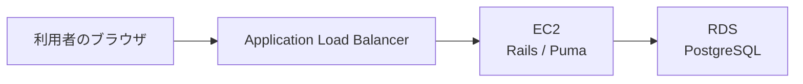
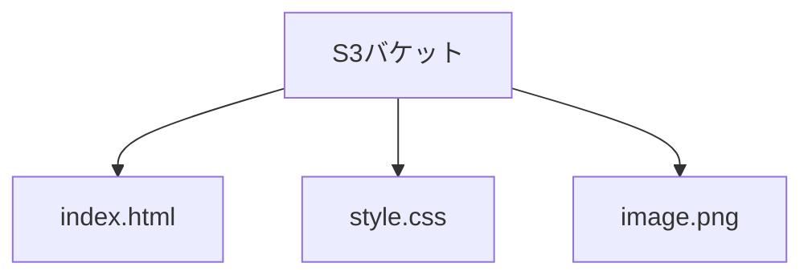
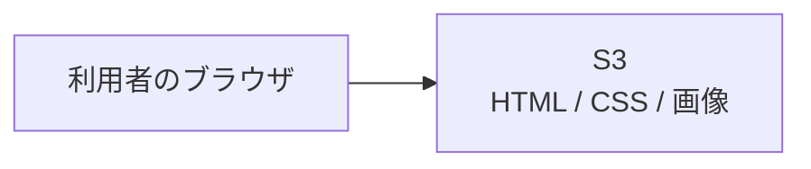
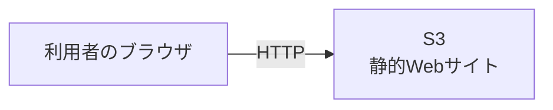

# 第9週：AWSデプロイ体験（1）── S3で静的Webサイトを公開する

## 今日のゴール

この回から、AWSを使ってWebサイトやWebアプリをインターネットへ公開する方法を学びます。

第9週のゴールは、次の3つです。

- クラウドとAWSの基本的な考え方を知る
- S3バケットを作成し、HTMLファイルを保存する
- S3の静的ウェブサイトホスティングを使い、ブラウザから表示できることを確認する

今日はRailsアプリではなく、HTMLやCSSだけで作られた静的Webサイトを公開します。

---

## 1. これから4週間で作る構成

第9週から第12週では、AWSのサービスを一つずつ追加していきます。

```text
第9週：S3
第10週：EC2
第11週：ALB + EC2
第12週：ALB + EC2 + RDS
```

最終的には、ブラウザからRailsアプリへアクセスし、入力したデータをRDSへ保存する構成を作ります。



今日は、この中で最も取り組みやすいS3から始めます。

---

## 2. クラウドとは

ここまでの授業では、Railsアプリを自分のPCやGitHub Codespaces上で動かしてきました。

しかし、自分のPCやCodespacesで動いているだけでは、他の人がいつでもアクセスできるWebサービスにはなりません。

Webサービスとして公開するためには、次のような仕組みが必要になります。

- 画像などのファイルを保存する場所
- Railsアプリを動かすサーバー
- データを保存するデータベース
- インターネットからのアクセスを受け付ける仕組み

これらを自分で用意しようとすると、サーバーを購入し、設置し、ネットワークを設定し、障害が起きたときの対応も考える必要があります。

クラウドとは、こうしたサーバー、ストレージ、データベース、ネットワークなどの仕組みを、インターネット経由で必要な分だけ利用できるサービスです。

AWSは、このようなクラウドサービスを提供しています。

### クラウドを使う利点

クラウドには、次のような利点があります。

#### 調達しやすい

自分でサーバーを購入しなくても、画面操作だけで必要な環境を作ることができます。

たとえば、画像を保存する場所が必要になった場合、AWSのS3というサービスを使えば、数分でファイルの保存先を用意できます。

#### すばやく試せる

クラウドでは、必要なときにすぐ環境を作り、不要になったら削除できます。

新しいサービスを試したいときや、一時的な検証環境を作りたいときにも向いています。

#### 必要に応じて大きくできる

Webサービスは、最初はアクセス数が少なくても、利用者が増えるにつれて負荷が高くなることがあります。

クラウドでは、アクセス数の増加に合わせて、サーバーの性能を上げたり、台数を増やしたりすることができます。

このように、必要に応じてシステムを大きくできることを、スケールするといいます。

#### 使った分だけ利用できる（従量課金）

クラウドでは、多くの場合、使った分に応じて料金が発生します。

最初から高価なサーバーを購入する必要はありません。

小さく始めて、必要に応じて大きくしていくことができます。

#### 管理の一部を任せられる

クラウドには、サーバーやデータベースなどの管理の一部をAWSに任せられるサービスがあります。

たとえば、データベースを自分でインストールして管理する代わりに、AWSのRDSというサービスを使うことができます。

このようなサービスを使うことで、アプリケーション開発に集中しやすくなります。

ただし、クラウドは簡単に作れるからこそ、不要になったリソースを削除することも大切です。

演習で作成したAWSリソースは、最後に削除するところまでをセットで行います。

> [!IMPORTANT]
> クラウドは、単に「どこかにあるコンピューター」というだけではありません。
>
> サーバー、ストレージ、データベースなどを、必要に応じて作成・変更・削除できる仕組みです。
>
> 今回は、その入口として、S3を使ってHTMLや画像などのファイルを保存し、Webページとして公開する方法を学びます。

---

## 3. S3とは

S3は、AWSが提供するストレージサービスです。

ストレージとは、データを保存する場所です。

S3には、次のようなファイルを保存できます。

- HTML
- CSS
- JavaScript
- 画像
- PDF
- バックアップファイル
- ログファイル

S3では、ファイルを**オブジェクト**と呼びます。

オブジェクトを保存する入れ物を**バケット**と呼びます。



パソコンのフォルダと似ています。ただし、S3はオブジェクトストレージであり、通常のファイルシステムとは仕組みが異なります。

今日の演習では、次のような関係になります。

```text
S3バケット
├── index.html
├── style.css
└── 画像ファイル
```

---

## 4. バケット名は世界で一意

S3のバケット名は、AWS全体で重複できません。

たとえば、誰かがすでに次の名前を使っている場合、同じ名前のバケットは作れません。

```text
my-website
```

そのため、演習では自分の名前や数字などを含め、ほかの人と重複しにくい名前を付けます。

例：

```text
rails-dojo-2026-yamauchi
```

> [!NOTE]
> バケット名には使える文字や命名規則があります。
> 実際の名前は、練習教材の指示に従って入力してください。

---

## 5. リージョンとは

AWSのサービスは、世界中の複数の地域で提供されています。

この地域を**リージョン**と呼びます。

この授業では、次のリージョンを使用します。

```text
米国東部（バージニア北部）
us-east-1
```

AWSコンソールでは、現在選択しているリージョンを必ず確認してください。

別のリージョンを選ぶと、作成したはずのリソースが見つからないように見えることがあります。

> [!IMPORTANT]
> この授業では、特別な指示がない限り `us-east-1` を使用します。

---

## 6. S3のファイルは最初から公開されない

S3へファイルをアップロードしても、最初から誰でも見られる状態にはなりません。

AWSでは、データを誤って公開しないように、最初は非公開になることが基本です。

今日の演習では、静的Webサイトとして公開するために、次の設定を行います。

- 静的ウェブサイトホスティングを有効にする
- 公開に必要な設定を行う
- バケットポリシーを設定する

### バケットポリシー

バケットポリシーは、そのS3バケットに対して、

```text
誰が
何をしてよいか
```

を定める設定です。

今回の演習では、Webサイトのファイルをインターネットから読み取れるようにします。

ただし、すべてのS3バケットを公開してよいわけではありません。

個人情報、パスワード、秘密鍵、社内資料などを保存するバケットは、公開してはいけません。

---

## 7. 静的Webサイトとは

静的Webサイトは、あらかじめ用意されたHTML、CSS、JavaScript、画像などを、そのままブラウザへ返すWebサイトです。



S3は、HTMLファイルを保存し、その内容をブラウザへ返すことができます。

一方、次のような処理はS3だけでは実行できません。

- Railsのプログラムを動かす
- データベースへ保存する
- ユーザーごとに異なる画面を作る
- ログイン処理を行う

そのような動的な処理は、第10週以降にEC2やRDSを使って実現します。

---

## 8. 今日作るもの

今日の完成状態は、次のとおりです。



演習では、次の流れを体験します。

1. AWS Academy Sandboxを開始する
2. AWSマネジメントコンソールを開く
3. `us-east-1`を選択する
4. S3バケットを作成する
5. HTML、CSS、画像をアップロードする
6. 静的ウェブサイトホスティングを有効にする
7. 公開に必要な設定を行う
8. ブラウザからWebサイトを開く
9. HTMLを変更し、表示が変わることを確認する
10. 作成したリソースを削除する

---

## 9. AWS Academy Sandboxについて

この授業では、AWS Academy Sandboxを使用します。

Sandboxは、AWSの操作を練習するための環境です。

授業では、毎回次の流れで利用します。

```text
Sandboxを開始する
↓
AWSコンソールでリソースを作る
↓
動作を確認する
↓
作成したリソースを削除する
```

Sandboxを開始しないままAWSコンソールを開こうとしても、正しく利用できません。

最初のログインやSandboxの起動で困った場合は、早めに教員へ知らせてください。

---

## 10. リソースは最後に削除する

AWSで作成したものを**リソース**と呼びます。

今日作成するS3バケットもリソースです。

演習が終わったら、作成したオブジェクトとバケットを削除します。

削除までが演習です。

> [!IMPORTANT]
> 「表示できたから終了」ではありません。
>
> 作成したリソースを確認し、不要になったものを削除するところまで行います。

---

## 今回のまとめ

今回は、AWSデプロイ単元の入口として、クラウドとS3の基本を学びます。

重要な言葉は次のとおりです。

| 用語 | 意味 |
|---|---|
| クラウド | サーバーやストレージなどをインターネット経由で利用する仕組み |
| AWS | Amazonが提供するクラウドサービス |
| リージョン | AWSのサービスを提供する地域 |
| S3 | ファイルなどのデータを保存するストレージサービス |
| バケット | S3でオブジェクトを保存する入れ物 |
| オブジェクト | S3へ保存したファイル |
| バケットポリシー | バケットに対して誰が何をできるかを定める設定 |
| 静的Webサイト | HTMLやCSSなどをそのまま配信するWebサイト |

今日のゴールは、S3へファイルを置くだけではありません。

```text
ファイルを保存する
↓
公開するための設定を行う
↓
URLからアクセスする
↓
不要になったリソースを削除する
```

この一連の流れを体験することです。

準備ができたら、[練習](practice.md)へ進みましょう。
