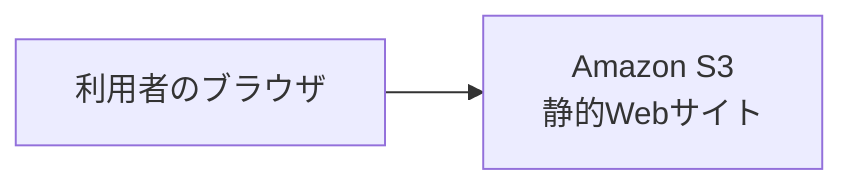

# 第9週：練習 ── S3で静的Webサイトを公開する

この練習では、Amazon S3へHTMLファイルをアップロードし、静的Webサイトとしてインターネットへ公開します。

先に、[第9週の説明](orientation.md)を読んでください。

## この練習で行うこと

- AWS Academy Sandboxを起動する
- S3バケットを作成する
- 静的ウェブサイトホスティングを有効にする
- HTMLファイルをアップロードする
- バケットポリシーを設定する
- ブラウザから公開したWebサイトを確認する
- HTMLを更新し、表示が変わることを確認する
- 作成したS3バケットを削除する

完成すると、次の構成になります。



> [!IMPORTANT]
> この練習では、Webサイトとして公開するファイルだけをS3へ保存します。
> 個人情報、パスワード、秘密鍵、社内資料などは絶対にアップロードしないでください。

---

## Step 1：AWS Academy Sandboxを起動する

1. AWS Academyへログインします。
2. 対象のコースを開きます。
3. `Learner Lab`を開きます。
4. `Start Lab`をクリックします。
5. 画面上部の表示が緑色になるまで待ちます。
6. `AWS`をクリックし、AWSマネジメントコンソールを開きます。
7. 画面右上のリージョンが、次の地域になっていることを確認します。

```text
米国東部（バージニア北部）
us-east-1
```

> [!IMPORTANT]
> この授業では、特別な指示がない限り`us-east-1`を使用します。

---

## Step 2：S3バケットを作成する

1. AWSマネジメントコンソール上部の検索欄へ、`S3`と入力します。
2. 検索結果から`S3`をクリックします。
3. `バケットを作成`をクリックします。


### バケット名を入力する

バケット名には、次の形式を使用します。

```text
awesome-cloud-challenge-好きな数字
```

例：

```text
awesome-cloud-challenge-12345
```

S3のバケット名は、AWS全体で重複できません。

エラーになった場合は、末尾の数字を変更してください。

### リージョンを確認する

リージョンが次の設定になっていることを確認します。

```text
米国東部（バージニア北部）us-east-1
```

### パブリックアクセスの設定を変更する

1. `パブリックアクセスをすべてブロック`のチェックを外します。
2. 警告文を確認します。
3. `現在の設定により、このバケットとバケット内のオブジェクトが公開される可能性があることを承認します`へチェックを入れます。
4. それ以外の項目は、デフォルト設定のままにします。
5. 画面下部の`バケットを作成`をクリックします。

> [!WARNING]
> 今回は静的Webサイトとして公開するため、パブリックアクセスを許可します。
> 通常のS3バケットで、何となくこの設定を解除してはいけません。

---

## Step 3：静的ウェブサイトホスティングを有効にする

1. 作成したバケット名をクリックします。


2. `プロパティ`タブをクリックします。


3. 画面の一番下までスクロールします。
4. `静的ウェブサイトホスティング`の`編集`をクリックします。
5. 次のように設定します。

| 項目 | 設定値 |
|---|---|
| 静的ウェブサイトホスティング | 有効にする |
| ホスティングタイプ | 静的ウェブサイトをホストする |
| インデックスドキュメント | `index.html` |
| エラードキュメント | 入力しなくてよい |

6. `変更の保存`をクリックします。

---

## Step 4：公開するHTMLファイルを準備する

次の2つのファイルをダウンロードします。

- [index.htmlをダウンロード](https://github.com/haw/aws-education-hands-on/raw/refs/heads/main/day1/5min-impact-lab/materials/index.html)
- [JumpingBallRunner-SingleFile.htmlをダウンロード](https://github.com/haw/aws-education-hands-on/raw/refs/heads/main/day1/5min-impact-lab/materials/JumpingBallRunner-SingleFile.html)

### `index.html`へ自分の目標を書く

1. ダウンロードした`index.html`をVisual Studio Codeなどで開きます。
2. 次の文字列を探します。

```text
[ここに各自の目標を記入してください]
```

3. 自分の目標へ書き換えます。

例：

```text
5年後にはフルスタックエンジニアとして世界で活躍したい！
```

4. ファイルを保存します。

思い浮かばない場合は、いったん変更せずに先へ進んでも構いません。

---

## Step 5：HTMLファイルをS3へアップロードする

1. S3のバケット画面へ戻ります。
2. `オブジェクト`タブをクリックします。
3. `アップロード`をクリックします。
4. `ファイルを追加`をクリックします。
5. 次の2ファイルを選択します。

```text
index.html
JumpingBallRunner-SingleFile.html
```

6. 画面下部の`アップロード`をクリックします。
7. `アップロードに成功しました`と表示されたことを確認します。
8. `閉じる`をクリックします。


---

## Step 6：バケットポリシーを設定する

ファイルをアップロードしただけでは、インターネットから読み取ることはできません。

バケットポリシーを設定し、公開したファイルを誰でも読み取れるようにします。

1. `アクセス許可`タブをクリックします。
2. `バケットポリシー`までスクロールします。
3. `編集`をクリックします。
4. 次のJSONをコピーして貼り付けます。

```json
{
  "Version": "2012-10-17",
  "Statement": [
    {
      "Sid": "PublicReadGetObject",
      "Effect": "Allow",
      "Principal": "*",
      "Action": "s3:GetObject",
      "Resource": "arn:aws:s3:::YOUR-BUCKET-NAME/*"
    }
  ]
}
```

5. `YOUR-BUCKET-NAME`を、自分が作成したバケット名へ書き換えます。

例：

```json
"Resource": "arn:aws:s3:::awesome-cloud-challenge-12345/*"
```

6. `変更の保存`をクリックします。


> [!IMPORTANT]
> `YOUR-BUCKET-NAME`を残したまま保存してはいけません。
> 自分のバケット名と完全に一致していることを確認してください。

### ARNとは

ARNは、AWSのリソースを識別するための名前です。

```text
ARN = Amazon Resource Name
```

今回のARNは、次の意味になります。

```text
arn:aws:s3:::バケット名/*
```

`/*`は、バケット内にあるすべてのオブジェクトを表します。

---

## Step 7：公開したWebサイトを開く

1. `プロパティ`タブをクリックします。
2. 画面の一番下までスクロールします。
3. `静的ウェブサイトホスティング`を確認します。
4. `バケットウェブサイトエンドポイント`に表示されたURLをクリックします。


5. ブラウザにWebサイトが表示されることを確認します。
6. 自分が書いた目標が表示されることを確認します。
7. ページ内のゲームへのリンクを開きます。
8. Jumping Ball Runnerが動作することを確認します。

表示できたら、公開URLをTeamsの指定された場所へ投稿してください。

---

## Step 8：HTMLを更新する

一度公開したファイルも、S3へ再アップロードすることで更新できます。

1. 手元の`index.html`を開きます。
2. 目標や文章を一部変更します。
3. ファイルを保存します。
4. S3の`オブジェクト`タブを開きます。
5. `アップロード`をクリックします。
6. 変更した`index.html`を追加します。
7. `アップロード`をクリックします。
8. 上書きに関する警告が表示された場合は、そのままアップロードを進めます。
9. 公開URLを再読み込みします。
10. 変更した内容が表示されることを確認します。

ブラウザに古い内容が表示される場合は、スーパーリロードを試してください。

Mac：

```text
Command + Shift + R
```

Windows：

```text
Ctrl + F5
```

---

## S3を公開するための二つの設定

今回の演習では、二つの設定を変更しました。

### 1. パブリックアクセスブロック

S3バケットを誤って公開しないための安全装置です。

今回の演習では、静的Webサイトとして公開するために解除しました。

### 2. バケットポリシー

誰に、どの操作を許可するかを定める設定です。

今回のポリシーでは、インターネット上の利用者に対して、オブジェクトの読み取りだけを許可しています。

```text
パブリックアクセスブロックを解除する
+
バケットポリシーで読み取りを許可する
=
ブラウザからWebサイトを閲覧できる
```

---

## トラブルシューティング

### `403 Forbidden`と表示される

バケットポリシーまたはパブリックアクセスの設定を確認します。

- `YOUR-BUCKET-NAME`を実際のバケット名へ変更したか
- バケット名の入力を間違えていないか
- `パブリックアクセスをすべてブロック`を解除したか
- バケットポリシーを保存したか

### `404 Not Found`と表示される

`index.html`を確認します。

- ファイル名が正確に`index.html`になっているか
- S3へアップロードされているか
- 静的ウェブサイトホスティングのインデックスドキュメントが`index.html`になっているか

### ウェブサイトエンドポイントが見つからない

静的ウェブサイトホスティングが有効になっているか確認します。

```text
プロパティ
→ 静的ウェブサイトホスティング
```

### ゲームが開かない

次を確認します。

- `JumpingBallRunner-SingleFile.html`をアップロードしたか
- ファイル名が変更されていないか
- バケットポリシーが正しく設定されているか

### 変更した内容が表示されない

ブラウザに古いファイルが残っている可能性があります。

スーパーリロードを行ってください。

---

## Step 9：作成したリソースを削除する

表示確認が終わったら、作成したS3バケットを削除します。

> [!IMPORTANT]
> AWSでは、作成して終わりではありません。
> 不要になったリソースを削除するところまでが演習です。

### バケットを空にする

1. S3のバケット画面を開きます。
2. `オブジェクト`タブをクリックします。
3. すべてのオブジェクトへチェックを入れます。
4. `削除`をクリックします。
5. 確認欄へ、画面に指定された文字列を入力します。
6. `オブジェクトの削除`をクリックします。
7. オブジェクトがなくなったことを確認します。

### バケットを削除する

1. S3のバケット一覧へ戻ります。
2. 作成したバケットを選択します。
3. `削除`をクリックします。
4. 確認欄へバケット名を入力します。
5. `バケットを削除`をクリックします。
6. 一覧からバケットが消えたことを確認します。

---

## 今日の確認

次の項目を確認してください。

- [ ] AWS Academy Sandboxを開始できた
- [ ] リージョンを`us-east-1`に設定した
- [ ] S3バケットを作成できた
- [ ] HTMLファイルをアップロードできた
- [ ] 静的ウェブサイトホスティングを有効にできた
- [ ] バケットポリシーを設定できた
- [ ] ブラウザからWebサイトを開けた
- [ ] HTMLを更新し、表示の変化を確認できた
- [ ] オブジェクトとS3バケットを削除できた

これで、第9週の必須練習は完了です。

さらに力をつけるため、[Stretch](stretch.md)へ進みましょう。
