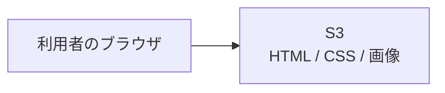
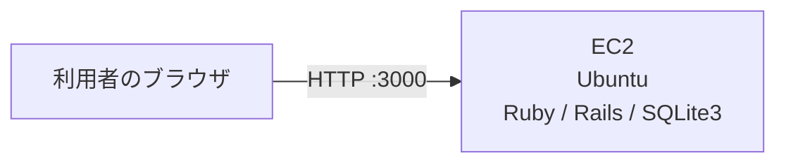
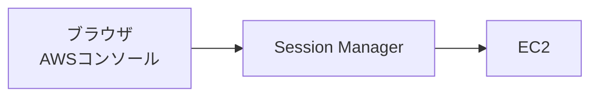
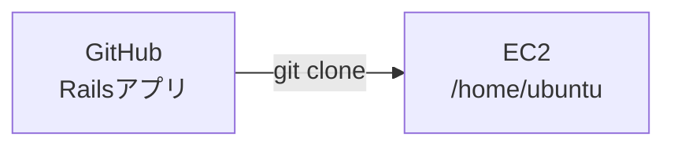
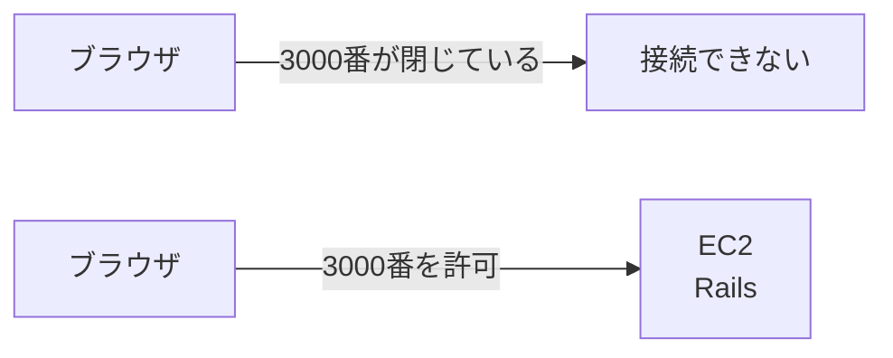

# 第10週：AWSデプロイ体験（2）── EC2でRailsアプリを動かす

## 今日のゴール

前回は、S3を使ってHTMLファイルを静的Webサイトとして公開しました。

今回は、EC2という仮想サーバーを使ってRailsアプリを動かします。

第10週のゴールは、次の4つです。

- S3とEC2の違いを説明できる
- EC2インスタンスへSession Managerで接続できる
- EC2上にRuby / Rails / SQLite3の実行環境を作れる
- EC2のパブリックIPアドレスからRailsアプリへアクセスできる

今日は、完成された本番環境を作る回ではありません。

自分でサーバーに入り、必要な道具を入れ、Railsアプリを起動し、ブラウザから見えるところまでを体験します。

---

## 1. 前回のS3と今回のEC2の違い

前回使ったS3は、HTML、CSS、画像などのファイルを保存し、そのままブラウザへ返すサービスでした。



S3は、静的なファイルを配信するのに向いています。

一方で、次のような処理はS3だけでは実行できません。

- Rubyのプログラムを動かす
- Railsアプリを起動する
- データベースへ保存する
- リクエストに応じて画面を作る
- ユーザーが入力した内容を処理する

Railsアプリを動かすには、RubyやRailsを実行できるコンピューターが必要です。

今回使うEC2は、AWS上で作成できる仮想サーバーです。

---

## 2. 今日作る構成

今日の完成状態は、次の構成です。



ブラウザから、EC2のパブリックIPアドレスとポート番号を指定してアクセスします。

```text
http://EC2のパブリックIPアドレス:3000
```

Railsは開発中によく3000番ポートで起動します。

ただし、EC2を作っただけでは、インターネットから3000番ポートへアクセスできません。

そのため、今日の演習では次の順番で確認します。

```text
Rails serverを起動する
↓
ブラウザからアクセスして、まだ接続できないことを確認する
↓
セキュリティグループで3000番を開ける
↓
もう一度アクセスして、Railsアプリが表示されることを確認する
```

最初の失敗は、間違いではありません。

セキュリティグループの役割を確認するための手順です。

---

## 3. EC2とは

EC2は、AWS上で作成できる仮想サーバーです。

自分のPCの中ではなく、AWS上にLinuxサーバーを1台作り、その中でコマンドを実行できます。

EC2で作成したサーバーのことを、**インスタンス**と呼びます。

今回の演習では、UbuntuというLinuxを使ったEC2インスタンスを作成します。

### <ruby>AMI<rt>エーエムアイ</rt></ruby>

<ruby>AMI<rt>エーエムアイ</rt></ruby>は、**Amazon Machine Image** の略です。

EC2インスタンスの元になるイメージです。

どのOSを使うか、どのような初期状態のサーバーにするかを決めるものです。

今回は次のAMIを使います。

```text
Ubuntu Server 24.04 LTS
```

### インスタンスタイプ

インスタンスタイプは、EC2インスタンスの性能を決める設定です。

CPUやメモリの大きさが変わります。

今回の授業では、次のインスタンスタイプを使います。

```text
t3.medium
```

---

## 4. Session Managerとは

EC2へ接続する方法はいくつかあります。

よく使われる方法の一つにSSHがあります。

SSHでは、秘密鍵や公開鍵を使ってサーバーへ接続します。

今回の授業では、SSHではなくSession Managerを使います。

Session Managerを使うと、AWSマネジメントコンソールの画面からEC2へ接続できます。



ターミナル画面が開いたら、その中でLinuxコマンドを実行します。

---

## 5. Linuxユーザーとubuntuユーザー

Linuxでは、誰としてログインしているかが重要です。

同じEC2インスタンスの中でも、ユーザーが違うと、ホームディレクトリや設定ファイルの場所が変わります。

Session Managerで接続した直後は、Rails作業に使いたいユーザーではない場合があります。

そのため、今回の演習では接続直後に現在のユーザーを確認し、そのあと `ubuntu` ユーザーへ切り替えます。

AWSのUbuntu AMIでは、作業用の標準ユーザーとして `ubuntu` ユーザーが用意されています。

Railsアプリのファイルやmiseの設定は、この `ubuntu` ユーザーのホームディレクトリに作ります。

ユーザーを切り替えるコマンドは次です。

```bash
sudo su - ubuntu
```

このコマンドは、管理者権限を使って、Ubuntu AMIに用意されている標準ユーザー `ubuntu` としてログインし直す操作です。

各部分の意味は次のとおりです。

| 部分 | 意味 |
|---|---|
| `sudo` | 管理者権限でコマンドを実行する |
| `su` | 別のユーザーに切り替える |
| `-` | そのユーザーでログインし直した状態にする |
| `ubuntu` | 切り替え先のユーザー名 |

切り替え後に `whoami` を実行し、`ubuntu` と表示されれば成功です。

---

## 6. miseとは

今回、Rubyのインストールには `mise` を使います。

miseは、RubyやNode.jsなど、開発に使う道具のバージョンを管理するツールです。

Railsアプリでは、Rubyのバージョンが合わないと、次のような問題が起きることがあります。

- `rails` コマンドが動かない
- `bundle install` が失敗する
- Gemが正しくインストールできない
- 自分のPCでは動くのに、別の環境では動かない

miseを使うと、EC2上に必要なRubyを入れ、どのRubyを使うかを指定できます。

今日は、EC2上で次のような確認を行います。

```bash
mise --version
```

```bash
ruby -v
```

```bash
which ruby
```

`which ruby` は、今使われている `ruby` コマンドの場所を確認するためのコマンドです。

miseで入れたRubyが使われていることを確認します。

---

## 7. Git cloneとは

今日のPracticeでは、Railsアプリを一から作るのではなく、GitHub上にあるRailsアプリをEC2へコピーして使います。

GitHub上のリポジトリを、自分の環境へコピーする操作を `git clone` と呼びます。



EC2上にRailsアプリをcloneしたあと、必要なGemをインストールし、データベースを準備して、Rails serverを起動します。

---

## 8. セキュリティグループとは

セキュリティグループは、EC2に対する通信の入口を管理する設定です。

どのポートへ、どこからアクセスしてよいかを決めます。

今回のRailsアプリは3000番ポートで起動します。

しかし、EC2を作った直後は、インターネットから3000番ポートへアクセスできません。

そのため、ブラウザからRailsアプリを見るには、セキュリティグループのインバウンドルールに3000番を追加する必要があります。



> [!WARNING]
> 今回は学習のために3000番ポートを開けます。
> 本番のWebサービスでは、Railsの開発用サーバーをそのままインターネットへ公開する構成にはしません。
> 第11週以降で、ALBを使った構成へ進みます。

---

## 9. Practiceの最後ではEC2を終了しない

前回のS3では、Practiceの最後にバケットを削除しました。

今回は、PracticeのあとにStretch 1で同じEC2インスタンスを使います。

そのため、Practiceの最後ではEC2インスタンスを終了しません。

Practiceの最後に行うのは、Rails serverを停止し、EC2インスタンスが残っていることを確認するところまでです。

EC2インスタンスの停止または終了は、Stretch 1の最後に行います。

---

## 今回のまとめ

今回の重要な言葉は次のとおりです。

| 用語 | 意味 |
|---|---|
| EC2 | AWS上に作成できる仮想サーバー |
| インスタンス | EC2で作成したサーバー |
| <ruby>AMI<rt>エーエムアイ</rt></ruby> | Amazon Machine Image。EC2インスタンスの元になるイメージ |
| Ubuntu | Linuxの種類の一つ |
| Session Manager | AWSコンソールからEC2へ接続する仕組み |
| `ubuntu` ユーザー | AWSのUbuntu AMIに用意されている標準ユーザー |
| mise | Rubyなどの開発ツールのバージョンを管理するツール |
| Git clone | GitHub上のリポジトリを手元の環境へコピーする操作 |
| セキュリティグループ | EC2への通信を許可・拒否する設定 |
| インバウンドルール | 外からEC2へ入ってくる通信のルール |
| ポート3000 | Railsの開発サーバーでよく使うポート番号 |

今日の流れは次のとおりです。

```text
EC2を作る
↓
Session Managerで接続する
↓
ubuntuユーザーへ切り替える
↓
Ruby / Railsの環境を作る
↓
GitHubからRailsアプリをcloneする
↓
Rails serverを起動する
↓
ブラウザからアクセスする
↓
セキュリティグループの役割を確認する
```

準備ができたら、[練習](practice.md)へ進みましょう。
