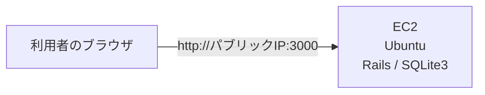
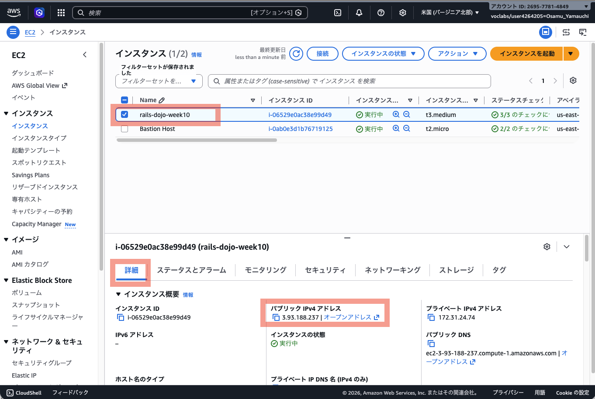

# 第10週：練習 ── EC2でRailsアプリを動かす

この練習では、EC2インスタンスを作成し、その中でRailsアプリを起動します。

先に、[第10週の説明](orientation.md)を読んでください。

## この練習で行うこと

- AWS Academy Sandboxを起動する
- Ubuntu 26.04 LTSのEC2インスタンスを作成する
- Session ManagerでEC2へ接続する
- `ubuntu` ユーザーへ切り替える
- miseを使ってRubyをインストールする
- Railsアプリで使うGemをインストールする
- GitHubからRailsアプリをcloneする
- Rails serverを起動する
- セキュリティグループで3000番ポートを開ける
- ブラウザからRailsアプリを確認する
- Rails serverを停止する
- EC2インスタンスは終了せず、Stretch 1のために残す

完成すると、次の構成になります。



> [!IMPORTANT]
> Practiceの最後では、EC2インスタンスを終了しません。
> Stretch 1で同じEC2インスタンスを使います。
> Rails serverだけを停止し、EC2は残しておきます。

---

## Step 1：AWS Academy Sandboxを起動する

1. AWS Academyへログインします。
2. 対象のコース（AWS Academy Cloud Foundations）を開きます。
3. `サンドボックス ラボ`を開きます。
4. `Start Lab`をクリックします。
5. `Lab status` が `ready` になるまで待ちます。
6. `AWS`をクリックし、AWSマネジメントコンソールを開きます。
7. 画面右上のリージョンが、次の地域になっていることを確認します。

```text
米国（バージニア北部）
us-east-1
```

> [!IMPORTANT]
> この授業では、特別な指示がない限り`us-east-1`を使用します。
> 別のリージョンを選ぶと、作成したEC2インスタンスが見つからないように見えることがあります。

---

## Step 2：EC2インスタンスを作成する

1. AWSマネジメントコンソール上部の検索欄へ、`EC2`と入力します。
2. 検索結果から`EC2`をクリックします。
3. 左メニューまたは画面中央から`インスタンス`を開きます。
4. `インスタンスを起動`をクリックします。

### 名前を入力する

名前には、次のように入力します。

```text
rails-dojo-week10
```

### AMIを選択する

AMIは、次を選択します。

```text
Ubuntu Server 26.04 LTS
```

### インスタンスタイプを選択する

インスタンスタイプは、次を選択します。

```text
t3.medium
```

### キーペア

今回はSSHではなくSession Managerで接続します。

キーペアは作成しません。

画面では、次のような項目を選択します。

```text
キーペアなしで続行
```

> [!NOTE]
> キーペアは、SSHでEC2へ接続するときに使う鍵です。
> 今回はSession Managerで接続するため、キーペアは不要です。

### ネットワーク設定

- 「ネットワーク」と「サブネット」は、デフォルトで選ばれているもののままとします
- 「パプリック IP の自動割り当て」が**有効化**されていることを確認してください

「ファイアウォール(セキュリティグループ)」は、新しく作成します。

名前は、デフォルトで次のような名前になります。

```text
launch-wizard-1
```

この時点では、3000番ポートを開けなくて構いません。

あとでRails serverを起動してから、ブラウザで接続できないことを確認し、その後で3000番を開けます。

SSHは使用しないため、「からの SSH トラフィックを許可」(※翻訳の誤り。正しくは、「SSH からのトラフィックを許可」)のチェックを外しておいてください。

### ストレージを設定

デフォルトの「8GiB」「gp3」のままにしておいてください。

### 高度な詳細

画面下部の`高度な詳細`を開きます。

`IAM インスタンスプロフィール`に、次を設定します。

```text
LabInstanceProfile
```

この設定は、Session ManagerでEC2へ接続するために必要です。

> [!IMPORTANT]
> Session Managerで接続できるかどうかは、EC2の中身だけでなく、IAMロールの設定にも関係します。
> `LabInstanceProfile` を選択してください。

### インスタンスを起動する

1. 設定を確認します。
2. `インスタンスを起動`をクリックします。
3. 起動に成功したら、`すべてのインスタンスを表示`をクリックします。
4. インスタンスの状態が`実行中`になるまで待ちます。
5. `ステータスチェック`が通るまで待ちます。（3分程度の時間がかかります)

---

## Step 3：パブリックIPアドレスを確認する

1. EC2のインスタンス一覧を開きます。
2. `rails-dojo-week10`をクリックします。
3. 詳細画面で`パブリック IPv4 アドレス`を確認します。
    
4. メモ帳などにコピーしておきます。

例：

```text
203.0.113.10
```

このあと、ブラウザで次の形式のURLを使います。

```text
http://パブリックIPアドレス:3000
```

例：

```text
http://203.0.113.10:3000
```

現時点では、何も動かしていないので、アクセスはできません。

---

## Step 4：Session ManagerでEC2へ接続する

1. EC2のインスタンス一覧を開きます。
2. `rails-dojo-week10`へチェックを入れます。
3. `接続`をクリックします。
4. `SSM Session Manager`タブを開きます。
5. `接続`をクリックします。

ブラウザ内に黒いターミナル画面が開けば成功です。

> [!NOTE]
> `接続`ボタンが押せない場合は、インスタンスの起動直後で準備が終わっていない可能性があります。
> 1〜2分待ってから、もう一度試してください。

---

## Step 5：現在のユーザーを確認する

ターミナルで次のコマンドを実行します。

```bash
whoami
```

現在のユーザー名が表示されます。

Session Managerで接続した直後は、Rails作業に使う `ubuntu` ユーザーではありません。

表示例：

```text
ssm-user
```

次のStepで、Rails作業用の `ubuntu` ユーザーへ切り替えます。

---

## Step 6：ubuntuユーザーへ切り替える

次のコマンドを実行します。

```bash
sudo su - ubuntu
```

このコマンドは、管理者権限を使って、Ubuntu AMIに用意されている標準ユーザー `ubuntu` としてログインし直す操作です。

AWSのUbuntu AMIでは、作業用の標準ユーザーとして `ubuntu` ユーザーが用意されています。

Railsアプリのファイルやmiseの設定は、`ubuntu` ユーザーのホームディレクトリに作ります。

切り替えられたか確認します。

```bash
whoami
```

次のように表示されれば成功です。

```text
ubuntu
```

ホームディレクトリも確認します。

```bash
pwd
```

次のように表示されれば成功です。

```text
/home/ubuntu
```

> [!IMPORTANT]
> このあとのコマンドは、`whoami` が `ubuntu` と表示される状態で実行します。
> `ubuntu` ではない場合は、もう一度 `sudo su - ubuntu` を実行してください。

---

## Step 7：OSを確認する

EC2の中で、どのOSが動いているか確認します。

```bash
cat /etc/os-release
```

`Ubuntu` や `26.04` という文字が表示されれば、Ubuntu 26.04 LTSのEC2に入っています。

表示例：

```text
PRETTY_NAME="Ubuntu 26.04 LTS"
NAME="Ubuntu"
```

---

## Step 8：パッケージ一覧を更新する

Ubuntuでは、ソフトウェアをインストールする前に、パッケージ一覧を更新します。

```bash
sudo apt update
```

最後のほうにエラーが出ず、プロンプトが戻ってくれば成功です。

> [!NOTE]
> `sudo` は、管理者権限でコマンドを実行するためのものです。
> ソフトウェアをインストールするときによく使います。

---

## Step 9：必要なパッケージをまとめてインストールする

Git、miseのインストールに使うcurl、Rubyのビルドに必要なライブラリ、SQLite3をまとめてインストールします。

```bash
sudo apt install -y git curl build-essential autoconf libssl-dev libyaml-dev zlib1g-dev libffi-dev libgmp-dev rustc libsqlite3-dev sqlite3 pkg-config
```

最後のほうにエラーが出ず、プロンプトが戻ってくれば成功です。

Gitが使えるか確認します。

```bash
git --version
```

表示例：

```text
git version 2.53.0
```

curlが使えるか確認します。

```bash
curl --version
```

`curl` のバージョンが表示されれば成功です。

SQLite3が使えるか確認します。

```bash
sqlite3 --version
```

バージョン番号が表示されれば成功です。

---

## Step 10：miseをインストールする

miseをインストールします。

```bash
curl https://mise.run | sh
```

インストールが終わったら、bashでmiseを使えるように設定します。

```bash
echo 'eval "$($HOME/.local/bin/mise activate bash)"' >> ~/.bashrc
```

設定を現在のターミナルに読み込みます。

```bash
source ~/.bashrc
```

miseが使えるか確認します。

```bash
mise --version
```

バージョン番号が表示されれば成功です。

> [!NOTE]
> miseは、RubyやNode.jsなど、開発に使う道具のバージョンを管理するツールです。
> 今回はRubyをインストールするために使います。

---

## Step 11：Rubyのインストール方法を設定する

miseでRubyを入れるとき、可能ならプリコンパイル済みのRubyを使うように設定します。

```bash
mise settings ruby.compile=false
```

この設定により、環境に合うRubyが用意されている場合は、ソースコードからビルドするより短い時間でインストールできます。

エラーが出ず、プロンプトが戻ってくれば成功です。

---

## Step 12：Rubyをインストールする

今回cloneするRailsアプリは、`.ruby-version` で次のRubyを使う前提になっています。

```text
ruby-4.0.5
```

また、devcontainerの設定でもRuby 4系のイメージを使っています。

そのため、EC2にもRuby 4.0.5をインストールします。

```bash
mise use -g ruby@4.0.5
```

インストールには数分かかることがあります。

途中で止まったように見えても、すぐに閉じずに待ってください。

Rubyが使えるか確認します。

```bash
ruby -v
```

`ruby 4.0.5` から始まる表示になれば成功です。

どのRubyが使われているか確認します。

```bash
which ruby
```

`/home/ubuntu` の下にあるmise関連のパスが表示されれば、miseで入れたRubyが使われています。

Gemも確認します。

```bash
gem -v
```

バージョン番号が表示されれば成功です。

---

## Step 13：Bundlerをインストールする

このアプリの `Gemfile.lock` では、Bundler 4.0.6 が使われています。

Bundlerをインストールします。

```bash
gem install bundler -v 4.0.6
```

Bundlerを確認します。

```bash
bundle -v
```

---

## Step 14：RailsアプリをGitHubからcloneする

GitHub上のRailsアプリをEC2へコピーします。

```bash
git clone https://github.com/TORIFUKUKaiou/rails-dojo-git-practice.git
```

`rails-dojo-git-practice` というディレクトリが作成されれば成功です。

作成されたディレクトリへ移動します。

```bash
cd rails-dojo-git-practice
```

現在地を確認します。

```bash
pwd
```

次のように表示されれば成功です。

```text
/home/ubuntu/rails-dojo-git-practice
```

---

## Step 15：必要なGemをインストールする

Railsアプリで使うGemをインストールします。

```bash
bundle install
```

インストールには数分かかることがあります。

最後にエラーが出ず、プロンプトが戻ってくれば成功です。

---

## Step 16：データベースを準備する

このアプリはSQLite3を使います。

データベースを作成し、migrationを実行します。

```bash
bin/rails db:prepare
```

エラーが出ず、プロンプトが戻ってくれば成功です。

---

## Step 17：Rails serverを起動する

EC2の外からアクセスできるように、`0.0.0.0` を指定してRails serverを起動します。

```bash
bin/rails server -b 0.0.0.0
```

次のような表示が出れば、Rails serverが起動しています。

```text
* Listening on http://0.0.0.0:3000
```

このターミナルはRails serverが使っているため、コマンド入力には使えません。

止めたいときは、あとで `Ctrl + C` を押します。

---

## Step 18：まだブラウザから接続できないことを確認する

ブラウザで、次の形式のURLを開きます。

```text
http://EC2のパブリックIPアドレス:3000
```

例：

```text
http://203.0.113.10:3000
```

この時点では、ページが表示されないはずです。

これは、セキュリティグループで3000番ポートをまだ開けていないためです。

> [!IMPORTANT]
> ここで接続できないことを確認するのは、今回の演習の一部です。
> Rails serverが動いていても、セキュリティグループで許可していなければ、外からアクセスできません。

---

## Step 19：セキュリティグループで3000番を開ける

AWSマネジメントコンソールで操作します。

1. EC2のインスタンス一覧を開きます。
2. `rails-dojo-week10`をクリックします。
3. 詳細画面の`セキュリティ`タブを開きます。
4. セキュリティグループ名をクリックします。
5. `インバウンドルール`タブを開きます。
6. `インバウンドルールを編集`をクリックします。
7. `ルールを追加`をクリックします。
8. 次のように設定します。

| 項目 | 設定 |
|---|---|
| タイプ | カスタムTCP |
| ポート範囲 | `3000` |
| ソース | `Anywhere-IPv4` |

9. `ルールを保存`をクリックします。

> [!WARNING]
> 今回は学習のために3000番ポートを開けます。
> 本番環境では、Railsの開発用サーバーをそのままインターネットへ公開しません。

---

## Step 20：ブラウザからRailsアプリを確認する

もう一度、ブラウザで次の形式のURLを開きます。

```text
http://EC2のパブリックIPアドレス:3000
```

`CodeShelf` が表示されれば成功です。

画面に何も記事がない場合は、`新しい記事を投稿` などのリンクから記事を作成してみます。

次の操作を確認してください。

- 記事一覧画面が表示される
- 新しい記事を作成できる
- 作成した記事の詳細画面を開ける
- 記事を編集できる
- 記事を削除できる

---

## Step 21：Rails serverを停止する

Session Managerのターミナルへ戻ります。

Rails serverが動いている画面で、次のキーを押します。

```text
Ctrl + C
```

プロンプトが戻ってくれば、Rails serverは停止しています。

---

## Step 22：EC2インスタンスが残っていることを確認する

Practiceの最後では、EC2インスタンスを終了しません。

Stretch 1で同じEC2インスタンスを使います。

AWSマネジメントコンソールで、次を確認してください。

- `rails-dojo-week10` インスタンスが残っている
- インスタンスの状態が `実行中` になっている

> [!IMPORTANT]
> Practiceが終わっても、まだEC2インスタンスを終了しません。
> 続けて [Stretch](stretch.md) の1つ目へ進みます。

---

## トラブルシューティング

### Session Managerで接続できない

次を確認します。

- インスタンスが`実行中`になっているか
- ステータスチェックが終わっているか
- 起動直後の場合、1〜2分待ったか
- `IAM インスタンスプロファイル`に`LabInstanceProfile`を設定したか

### `whoami` が `ubuntu` にならない

次のコマンドをもう一度実行します。

```bash
sudo su - ubuntu
```

その後、確認します。

```bash
whoami
```

### `ruby -v` でRuby 4.0.5が表示されない

miseの設定が読み込まれていない可能性があります。

```bash
source ~/.bashrc
```

もう一度確認します。

```bash
ruby -v
```

### ブラウザから接続できない

次を確認します。

- Rails serverが起動したままになっているか
- URLの末尾に`:3000`を付けたか
- パブリックIPアドレスを間違えていないか
- セキュリティグループで3000番を開けたか
- インバウンドルールを保存したか

### `Blocked hosts` のような画面が出る

Railsがアクセス元のホスト名を拒否している可能性があります。

今回の教材では、まず教員へ画面を見せてください。

---

## 今日の確認

次の項目を確認してください。

- [ ] AWS Academy Sandboxを開始できた
- [ ] リージョンを`us-east-1`に設定した
- [ ] Ubuntu 26.04 LTSのEC2インスタンスを作成できた
- [ ] Session ManagerでEC2へ接続できた
- [ ] `sudo su - ubuntu` で `ubuntu` ユーザーへ切り替えられた
- [ ] `pwd` で `/home/ubuntu` を確認できた
- [ ] miseをインストールできた
- [ ] Ruby 4.0.5をインストールできた
- [ ] Bundler 4.0.6をインストールできた
- [ ] Railsアプリで使うGemをインストールできた
- [ ] GitHubからRailsアプリをcloneできた
- [ ] Railsアプリを起動できた
- [ ] 3000番を開ける前に、ブラウザから接続できないことを確認した
- [ ] セキュリティグループで3000番を開けた
- [ ] ブラウザからRailsアプリを表示できた
- [ ] Rails serverを停止できた
- [ ] EC2インスタンスを終了せず、Stretch 1へ進む準備ができた

Practiceが終わったら、[Stretch](stretch.md) へ進みましょう。
