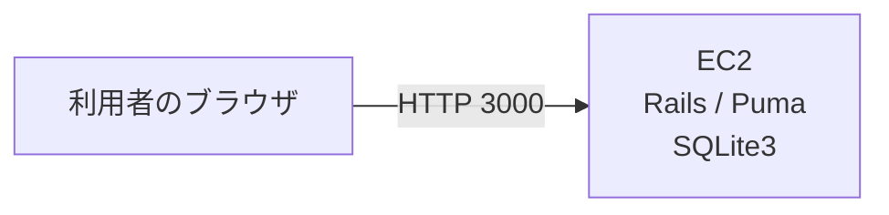
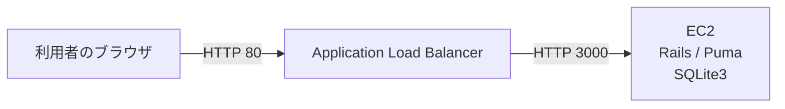
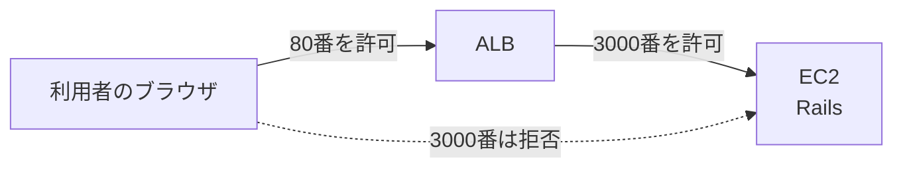
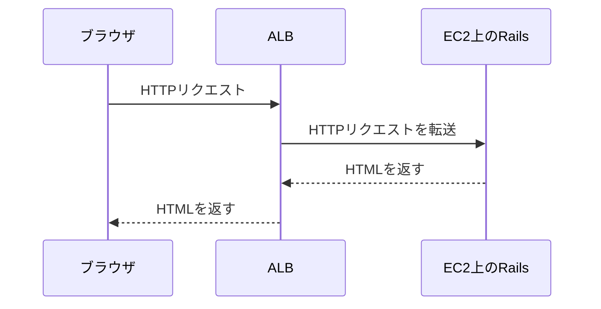
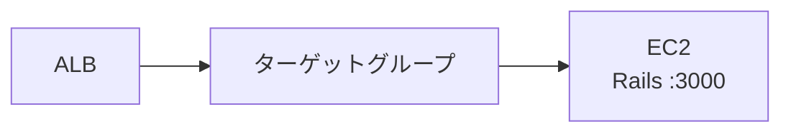
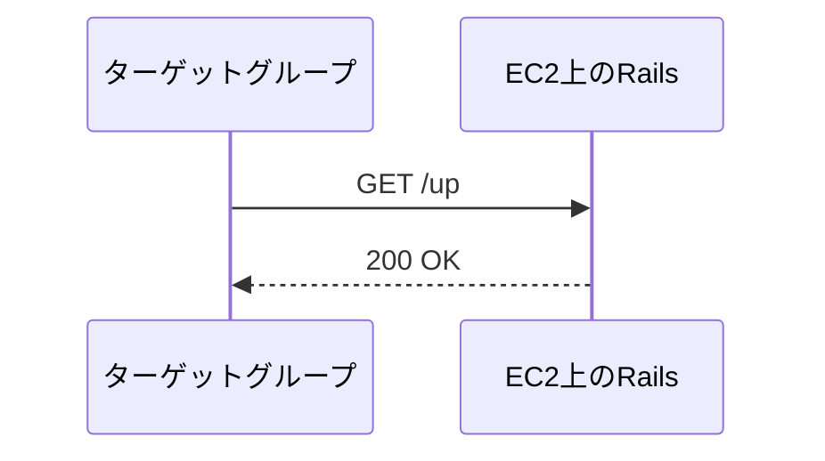
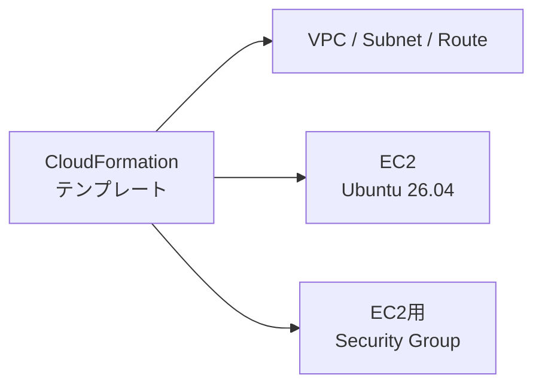

# 第11週：AWSデプロイ体験（3）── ALBを使ってRailsアプリを公開する

## 今日のゴール

前回は、EC2のパブリックIPアドレスと3000番ポートを使って、Railsアプリへ直接アクセスしました。

今回は、EC2の前にALBを置きます。

第11週のゴールは、次の5つです。

- CloudFormationでEC2までの環境を作れる
- ALBが利用者からの通信をEC2へ転送する役割を説明できる
- ターゲットグループとヘルスチェックの役割を説明できる
- ALBのDNS名からRailsアプリへアクセスできる
- EC2へ直接入る通信を止め、ALBからだけEC2へ通信できるようにする

今日は、Railsアプリの中身を作り込む回ではありません。

ブラウザからRailsアプリまで、通信がどの入口を通って届くのかを確認する回です。

---

## 1. 前回の構成

第10週では、ブラウザからEC2へ直接アクセスしました。



URLは次の形でした。

```text
http://EC2のパブリックIPアドレス:3000
```

この構成では、EC2のセキュリティグループで3000番ポートをインターネットへ開けました。

Railsが動いているEC2へ、利用者が直接アクセスしている状態です。

---

## 2. 今日作る構成

今日の完成状態は、次の構成です。



利用者はEC2のIPアドレスではなく、ALBのDNS名へアクセスします。

```text
http://ALBのDNS名
```

ALBがリクエストを受け取り、裏側のEC2へ転送します。

最後には、EC2への3000番ポートをALBからだけ許可します。



つまり、次の状態を確認します。

| アクセス方法 | 結果 |
|---|---|
| `http://ALBのDNS名` | 表示される |
| `http://EC2のパブリックIPアドレス:3000` | 表示されない |

---

## 3. ALBとは

ALBは、Application Load Balancerの略です。

Webアプリケーションへの入口になるサービスです。

利用者から見ると、ALBがWebサイトの入口になります。

ALBは受け取ったHTTPリクエストを、後ろにあるEC2へ転送します。



ALBを使うと、あとからEC2を増やしたり、ヘルスチェックで正常なサーバーだけへ通信を流したりできます。

今回の授業ではEC2は1台だけです。

まずは「入口をEC2からALBへ変える」ことに集中します。

---

## 4. ターゲットグループとは

ターゲットグループは、ALBが通信を転送する相手をまとめる場所です。

今回のターゲットは、Railsアプリが動いているEC2です。



ALBは、直接EC2を選ぶのではなく、ターゲットグループへ通信を流します。

ターゲットグループの中に登録されたEC2へ、リクエストが届きます。

---

## 5. ヘルスチェックとは

ヘルスチェックは、ターゲットが正常に応答しているかをALBが確認する仕組みです。

今回のRailsアプリには、Rails標準の確認用URLがあります。

```text
/up
```

ブラウザで次のURLへアクセスすると、Railsが起動していれば成功します。

```text
http://EC2のパブリックIPアドレス:3000/up
```

ターゲットグループでは、この `/up` を使ってEC2上のRailsが動いているか確認します。



ターゲットが `Healthy` になれば、ALBはそのEC2へ通信を流せます。

`Unhealthy` のままだと、ALBのDNS名を開いてもアプリが表示されません。

---

## 6. リスナーとは

リスナーは、ALBがどのポートで待ち受けるかを決める設定です。

今回は、利用者が普通のHTTPでアクセスできるように、ALBの80番ポートで待ち受けます。

```text
ブラウザ
↓ HTTP 80
ALBのリスナー
↓ ターゲットグループへ転送
EC2のRails :3000
```

ブラウザでURLにポート番号を書かなくてもよいのは、HTTPの標準ポートが80番だからです。

---

## 7. セキュリティグループの考え方

今日の重要ポイントは、セキュリティグループです。

第10週では、EC2の3000番ポートをインターネットへ開けました。

```text
インターネット
↓ 3000番
EC2
```

第11週の完成状態では、次のようにします。

```text
インターネット
↓ 80番
ALB
↓ 3000番
EC2
```

そのため、セキュリティグループは次のように分けます。

| 対象 | 許可する通信 |
|---|---|
| ALB用セキュリティグループ | インターネットから80番 |
| EC2用セキュリティグループ | ALB用セキュリティグループから3000番 |

EC2用セキュリティグループでは、通信元をIPアドレスではなく、ALB用セキュリティグループにします。

これにより、EC2へ直接アクセスする入口を閉じ、ALBから来た通信だけを通せます。

---

## 8. IaCとCloudFormation

IaCは、Infrastructure as Codeの略です。

インフラを、画面操作だけではなく、コードやテンプレートで管理する考え方です。

AWSでは、CloudFormationを使うと、VPC、Subnet、EC2、セキュリティグループなどをテンプレートから作成できます。

今日のPracticeでは、次の部分をCloudFormationで作ります。



CloudFormationテンプレートの書き方を覚えることは、今日の主目的ではありません。

今日の目的は、同じ環境をすばやく用意し、ALBの設定に時間を使うことです。

---

## 9. 今日の作業の流れ

今日のPracticeでは、次の順番で進めます。

```text
AWS Academy Sandboxを開始する
↓
CloudFormationでEC2までの環境を作る
↓
Session ManagerでEC2へ接続する
↓
Railsアプリをcloneして起動する
↓
EC2のIPアドレス:3000で表示する
↓
ALB用セキュリティグループを作る
↓
ターゲットグループを作る
↓
ALBとリスナーを作る
↓
ALBのDNS名から表示する
↓
EC2の3000番をALBからだけ許可する
↓
ALB経由は表示され、EC2直アクセスは表示されないことを確認する
```

---

## 今回のまとめ

今回の重要な言葉は次のとおりです。

| 用語 | 意味 |
|---|---|
| IaC | インフラをコードやテンプレートで管理する考え方 |
| CloudFormation | AWSリソースをテンプレートから作成するサービス |
| ALB | Webアプリケーションの入口になるロードバランサー |
| ターゲットグループ | ALBが通信を転送する相手をまとめる場所 |
| ヘルスチェック | ターゲットが正常か確認する仕組み |
| リスナー | ALBがどのポートで待ち受けるかを決める設定 |
| セキュリティグループ | どこからどのポートへの通信を許可するかを決める設定 |

準備ができたら、[練習](practice.md)へ進みましょう。
