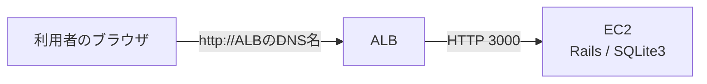
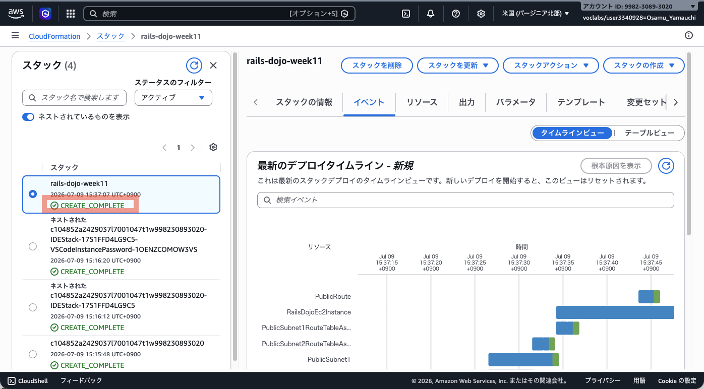
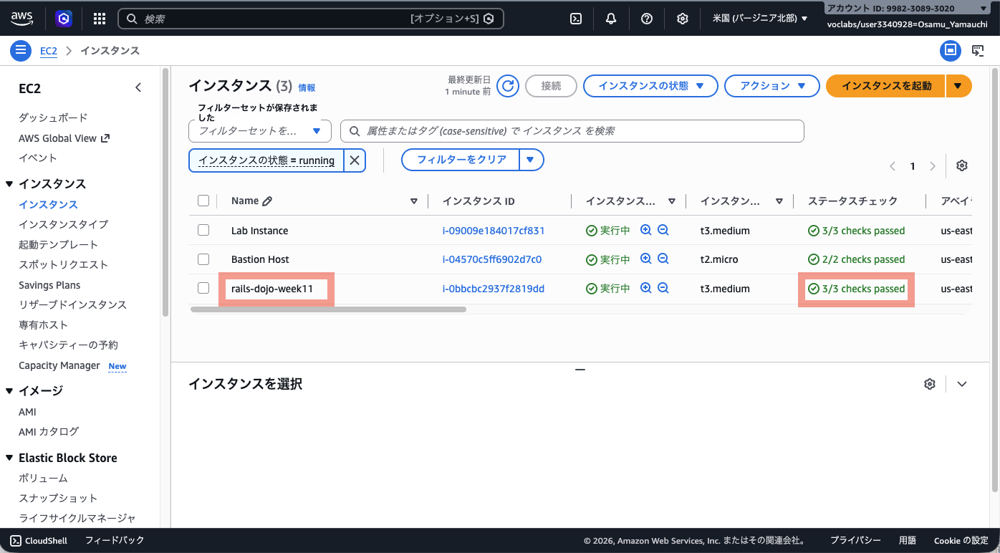
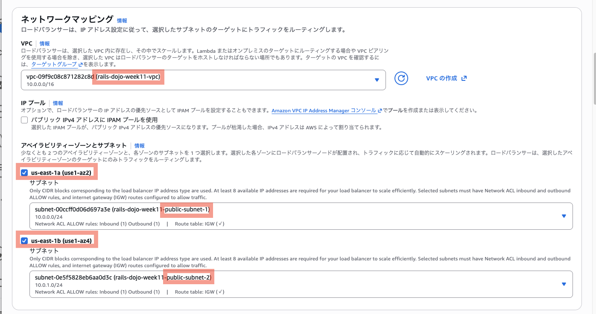
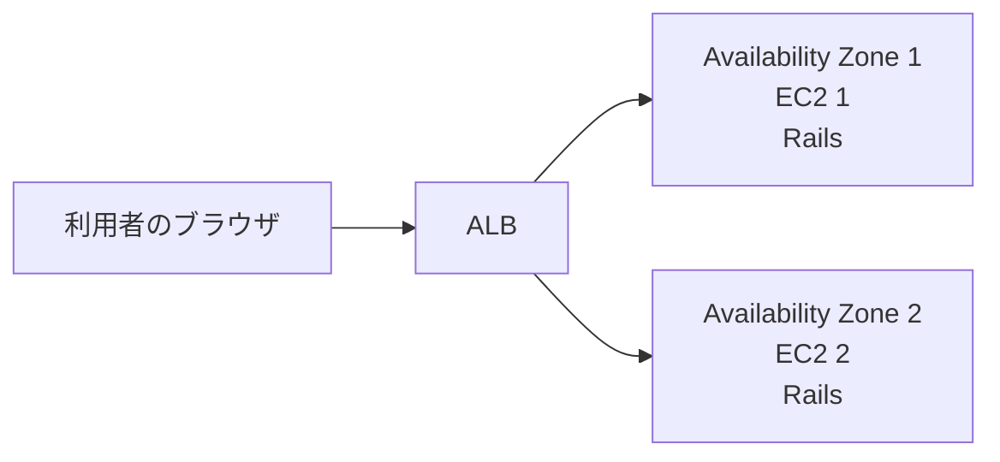
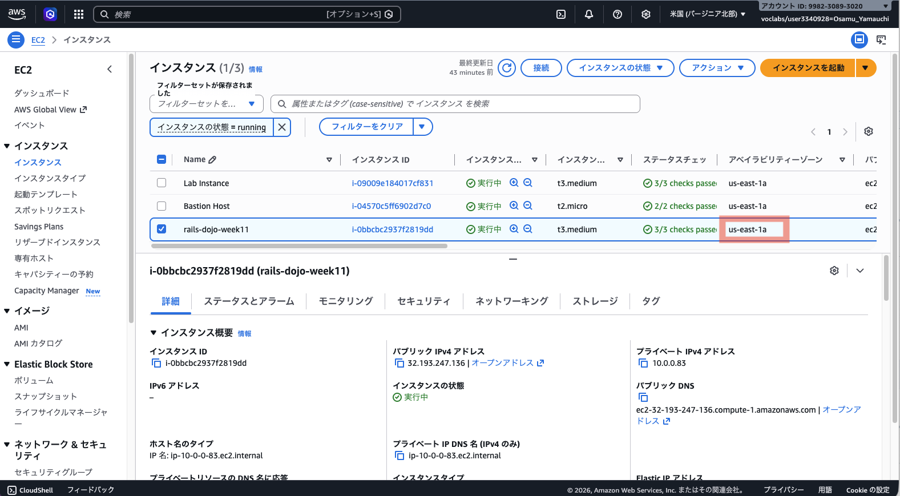

# 第11週：練習 ── ALBを使ってRailsアプリを公開する

この練習では、CloudFormationでEC2までの環境を作り、その前にALBを追加します。

先に、[第11週の説明](orientation.md)を読んでください。

## この練習で行うこと

- CloudFormationでVPC、public subnet、EC2などを作成する
- EC2へ接続し、Railsアプリを起動する
- EC2のパブリックIPアドレスからRailsアプリを表示する
- ALB、ターゲットグループ、セキュリティグループを作成する
- ALB経由だけでRailsアプリを表示できる構成にする
- 異なるAvailability ZoneへEC2をもう1台作成する
- 2台のEC2でALBの負荷分散と継続動作を確認する
- EC2ごとに記事の表示が異なる現象を観察する

完成すると、次の構成になります。



> [!IMPORTANT]
> この練習では、最初にEC2へ直接アクセスできる状態を確認します。
> そのあと、EC2への直接アクセスを閉じて、ALB経由だけで表示できる状態へ変更します。

---

## Step 1：AWS Academy Sandboxを起動する

1. AWS Academyへログインします。
2. 対象のコース（AWS Academy Cloud Foundations）を開きます。
3. `サンドボックス ラボ`を開きます。
4. `Start Lab`をクリックします。
5. `Lab status` が `ready` になるまで待ちます。
6. `AWS`をクリックし、AWSマネジメントコンソールを開きます。
7. 画面右上のリージョンが、次の地域になっていることを確認します。

```text
米国（バージニア北部）
us-east-1
```

> [!IMPORTANT]
> この授業では、特別な指示がない限り`us-east-1`を使用します。
> 別のリージョンを選ぶと、作成したリソースが見つからないように見えることがあります。

---

## Step 2：CloudFormationテンプレートを開く

次のテンプレートをダウンロードします。

[week11-baseline.yaml](infrastructure/week11-baseline.yaml)

1. 上のリンクを開きます。
2. GitHubでテンプレートの内容が表示されることを確認します。
3. 画面右上のダウンロードボタンをクリックします。


保存したファイル名が次の名前になっていることを確認します。

```text
week11-baseline.yaml
```

このテンプレートは、次のリソースを作成します。

- VPC
- public subnet 2つ
- Internet Gateway
- route table
- EC2用セキュリティグループ
- Ubuntu Server 26.04 LTSのEC2インスタンス

ALB、ターゲットグループ、リスナーは作りません。

それらは、このあと自分で作成します。

---

## Step 3：CloudFormationスタックを作成する

1. AWSマネジメントコンソール上部の検索欄へ、`CloudFormation` と入力します。
2. 検索結果から `CloudFormation` をクリックします。
3. `スタックの作成` をクリックします。
4. `新しいリソースを使用(標準)` をクリックします。

### テンプレートを指定する

テンプレートの指定では、次を選びます。

```text
テンプレートファイルのアップロード
```

`ファイルの選択` をクリックし、次のファイルを選びます。

```text
week11-baseline.yaml
```

選択できたら、`次へ` をクリックします。

### スタック名を入力する

スタック名には、次のように入力します。

```text
rails-dojo-week11
```

パラメータは変更しません。

`次へ` をクリックします。

### スタックオプションを設定する

この画面では、特に変更しません。

`次へ` をクリックします。

### 内容を確認して作成する

確認画面の下までスクロールします。

チェックボックスが表示されている場合は、内容を確認してチェックを入れます。

`送信` をクリックします。

---

## Step 4：スタックの作成完了を待つ

CloudFormationの、`rails-dojo-week11` が自動的に開かれます。

`イベント` タブを開くと、作成中のリソースが表示されます。

スタックの状態が次のようになるまで待ちます。

```text
CREATE_COMPLETE
```

数分かかることがあります。



> [!IMPORTANT]
> `CREATE_COMPLETE` になるまでは、次のStepへ進まないでください。
> EC2やネットワークの準備が終わっていない状態で進むと、Session Manager接続やALB作成で迷いやすくなります。

---

## Step 5：CloudFormationの出力を確認する

`rails-dojo-week11` スタックの `出力` タブを開きます。

次の値をメモ帳などにコピーします。

| 出力キー | 使う場面 |
|---|---|
| `VpcId` | ALB用セキュリティグループ、ターゲットグループ、ALBを作るとき |
| `PublicSubnet1` | ALBを作るとき |
| `PublicSubnet2` | ALBを作るとき |
| `EC2InstanceId` | ターゲットグループにEC2を登録するとき |
| `EC2PublicIp` | EC2へ直接アクセスするとき |
| `EC2SecurityGroupId` | EC2のインバウンドルールを変更するとき |

> [!NOTE]
> CloudFormationの出力は、あとでAWSコンソール上でも確認できます。
> ただし、ここでメモしておくと手順を進めやすくなります。

---

## Step 6：EC2インスタンスを確認する

1. AWSマネジメントコンソール上部の検索欄へ、`EC2` と入力します。
2. 検索結果から `EC2` をクリックします。
3. 左メニューまたは画面中央から `インスタンス` を開きます。
4. `rails-dojo-week11` という名前のインスタンスを探します。
5. インスタンスの状態が `実行中` になっていることを確認します。
6. `ステータスチェック` が通る(`3/3 checks passed`)まで待ちます。

ステータスチェックが通るまで、数分かかることがあります。



---

## Step 7：Session ManagerでEC2へ接続する

1. EC2のインスタンス一覧を開きます。
2. `rails-dojo-week11` へチェックを入れます。
3. `接続` をクリックします。
4. `SSM Session Manager` タブを開きます。
5. `接続` をクリックします。

ブラウザ内に黒いターミナル画面が開けば成功です。

> [!NOTE]
> `接続`ボタンが押せない場合は、インスタンスの起動直後で準備が終わっていない可能性があります。
> 1〜2分待ってから、もう一度試してください。

---

## Step 8：ubuntuユーザーへ切り替える

ターミナルで現在のユーザーを確認します。

```bash
whoami
```

Session Managerで接続した直後は、Rails作業に使う `ubuntu` ユーザーではありません。

次のコマンドを実行します。

```bash
sudo su - ubuntu
```

切り替えられたか確認します。

```bash
whoami
```

次のように表示されれば成功です。

```text
ubuntu
```

ホームディレクトリも確認します。

```bash
pwd
```

次のように表示されれば成功です。

```text
/home/ubuntu
```

---

## Step 9：OSとUser Dataの完了を確認する

EC2のOSを確認します。

```bash
cat /etc/os-release
```

`Ubuntu` や `26.04` という文字が表示されれば、Ubuntu 26.04 LTSのEC2に入っています。

表示例：

```text
PRETTY_NAME="Ubuntu 26.04 LTS"
NAME="Ubuntu"
```

cloud-initの状態を確認します。

```bash
sudo cloud-init status
```

次のように表示されれば、EC2起動時の初期処理は正常に完了しています。

```text
status: done
```

`status: running` と表示された場合は、まだ処理中です。

1〜2分待ってから、もう一度確認してください。

> [!IMPORTANT]
> `status: error` と表示された場合は、User Dataの途中でエラーが起きています。
> 次のコマンドでログを確認し、教員へ画面を見せてください。
>
> ```bash
> sudo tail -n 80 /var/log/cloud-init-output.log
> ```

User DataによるRails環境セットアップが完了しているか確認します。

```bash
ls /opt/rails-dojo/setup-complete
```

次のように表示されれば成功です。

```text
/opt/rails-dojo/setup-complete
```

> [!IMPORTANT]
> このファイルがない場合は、User Dataの処理がまだ終わっていないか、途中で失敗しています。
> 1〜2分待ってから、もう一度確認してください。

ログを確認したい場合は、次のコマンドを実行します。

```bash
sudo tail -n 80 /var/log/cloud-init-output.log
```

---

## Step 10：RubyとBundlerを確認する

User Dataで、Git、SQLite3、mise、Ruby、Bundlerはインストール済みです。

次のコマンドで確認します。

```bash
source ~/.bashrc
```

```bash
ruby -v
```

`ruby 4.0.5` から始まる表示になれば成功です。

どのRubyが使われているか確認します。

```bash
which ruby
```

`/home/ubuntu` の下にあるmise関連のパスが表示されれば、miseで入れたRubyが使われています。

Bundlerも確認します。

```bash
bundle -v
```

`Bundler version 4.0.15` のように表示されれば成功です。

GitとSQLite3も確認します。

```bash
git --version
```

```bash
sqlite3 --version
```

どちらもバージョン番号が表示されれば成功です。

---

## Step 11：RailsアプリをGitHubからcloneする

GitHub上のRailsアプリをEC2へコピーします。

```bash
git clone https://github.com/TORIFUKUKaiou/rails-dojo-git-practice.git
```

`rails-dojo-git-practice` というディレクトリが作成されれば成功です。

作成されたディレクトリへ移動します。

```bash
cd rails-dojo-git-practice
```

現在地を確認します。

```bash
pwd
```

次のように表示されれば成功です。

```text
/home/ubuntu/rails-dojo-git-practice
```

---

## Step 12：必要なGemをインストールする

Railsアプリで使うGemをインストールします。

```bash
bundle install
```

インストールには数分かかることがあります。

最後にエラーが出ず、プロンプトが戻ってくれば成功です。

---

## Step 13：データベースを準備する

このアプリはSQLite3を使います。

データベースを作成し、migrationを実行します。

```bash
bin/rails db:prepare
```

エラーが出ず、プロンプトが戻ってくれば成功です。

---

## Step 14：Rails serverを起動する

EC2の外からアクセスできるように、`0.0.0.0` と3000番ポートを指定してRails serverを起動します。

```bash
bin/rails server -b 0.0.0.0 -p 3000 -d
```

> [!NOTE]
> `-d` は、Rails serverをバックグラウンドで動かすためのオプションです。
> コマンド実行後にプロンプトが戻り、Session Managerの接続が切れてもRails serverは動き続けます。

起動できたか確認します。

```bash
curl http://localhost:3000/up
```

HTMLの応答があれば、Rails serverは起動しています。

---

## Step 15：まだブラウザから接続できないことを確認する

ブラウザで、次の形式のURLを開きます。

```text
http://EC2のパブリックIPアドレス:3000
```

`EC2のパブリックIPアドレス` には、CloudFormationの出力 `EC2PublicIp` の値を入れます。

例：

```text
http://203.0.113.10:3000
```

この時点では、ページが表示されないはずです。

これは、EC2用セキュリティグループで3000番ポートをまだ開けていないためです。

> [!IMPORTANT]
> ここで接続できないことを確認するのは、今回の演習の一部です。
> Rails serverが動いていても、セキュリティグループで許可していなければ、外からアクセスできません。

---

## Step 16：EC2のセキュリティグループで3000番を開ける

AWSマネジメントコンソールで操作します。

1. EC2のインスタンス一覧を開きます。
2. `rails-dojo-week11` をクリックします。
3. 詳細画面の `セキュリティ` タブを開きます。
4. セキュリティグループ名をクリックします。
5. `インバウンドルール` タブを開きます。
6. `インバウンドルールを編集` をクリックします。
7. `ルールを追加` をクリックします。
8. 次のように設定します。

| 項目 | 設定 |
|---|---|
| タイプ | カスタムTCP |
| ポート範囲 | `3000` |
| ソース | `Anywhere-IPv4` |

9. `ルールを保存` をクリックします。

> [!WARNING]
> ここでは学習のために、一度EC2の3000番ポートをインターネットへ開けます。
> あとで、このルールを削除し、ALBからだけ接続できるように変更します。

---

## Step 17：EC2のIPアドレスからRailsアプリを確認する

もう一度、ブラウザで次の形式のURLを開きます。

```text
http://EC2のパブリックIPアドレス:3000
```

`CodeShelf` が表示されれば成功です。

---

## Step 18：ALB用セキュリティグループを作成する

ALBへインターネットからHTTPでアクセスできるように、ALB用のセキュリティグループを作成します。

1. EC2の左メニューから `セキュリティグループ` を開きます。
2. `セキュリティグループを作成` をクリックします。
3. 次のように入力します。

| 項目 | 設定 |
|---|---|
| セキュリティグループ名 | `rails-dojo-week11-alb-sg` |
| 説明 | `Allow HTTP access to ALB` |
| VPC | CloudFormationで作成した `rails-dojo-week11-vpc` |

4. `インバウンドルール` で `ルールを追加` をクリックします。
5. 次のように設定します。

| 項目 | 設定 |
|---|---|
| タイプ | HTTP |
| ポート範囲 | `80` |
| ソース | `Anywhere-IPv4` |

6. `アウトバウンドルール` はデフォルトのままとし、**変更しません**。(タイプ: すべてのトラフィック、ポート範囲: すべて、送信先: `0.0.0.0/0`)
7. `セキュリティグループを作成` をクリックします。
8. 作成されたセキュリティグループIDをメモします。

このあと、このセキュリティグループをALBに設定します。

---

## Step 19：ターゲットグループを作成する

ALBが通信を転送する先として、ターゲットグループを作成します。

1. EC2の左メニューから `ターゲットグループ` を開きます。
2. `ターゲットグループの作成` をクリックします。
3. `ターゲットの種類` で、次を選びます。

```text
インスタンス
```

### 基本設定

次のように設定します。

| 項目 | 設定 |
|---|---|
| ターゲットグループ名 | `rails-dojo-week11-tg` |
| プロトコル | `HTTP` |
| ポート | `3000` |
| IPアドレスタイプ | `IPv4` |
| VPC | CloudFormationで作成した `rails-dojo-week11-vpc` |
| プロトコルバージョン | `HTTP1` |

### ヘルスチェック

ヘルスチェックは次のように設定します。

| 項目 | 設定 |
|---|---|
| ヘルスチェックプロトコル | `HTTP` |
| ヘルスチェックパス | `/up` |

設定できたら、`次へ` をクリックします。

### EC2を登録する

1. `rails-dojo-week11` インスタンスを選択します。
2. `保留中として以下を含める` をクリックします。
3. 画面下部の `ターゲットを確認` に、 `rails-dojo-week11` インスタンスが追加されていることを確認します。
4. `次へ`
5. `ターゲットグループの作成`

ターゲットグループが作成されれば成功です。

---

## Step 20：ALBを作成する

1. EC2の左メニューから `ロードバランサー` を開きます。
2. `ロードバランサーの作成` をクリックします。
3. `Application Load Balancer` の `作成` をクリックします。

### 基本的な設定

次のように設定します。

| 項目 | 設定 |
|---|---|
| ロードバランサー名 | `rails-dojo-week11-alb` |
| スキーム | `インターネット向け` |
| IPアドレスタイプ | `IPv4` |

### ネットワークマッピング

VPCは、CloudFormationで作成した次のVPCを選びます。

```text
rails-dojo-week11-vpc
```

アベイラビリティーゾーンとサブネットでは、2つのアベイラビリティゾーンを選び、それぞれ次のpublic subnetを選択します。

```text
rails-dojo-week11-public-subnet-1
rails-dojo-week11-public-subnet-2
```



> [!IMPORTANT]
> ALBは、少なくとも2つのアベイラビリティゾーンにまたがるサブネットを選ぶ必要があります。
> そのため、CloudFormationでpublic subnetを2つ作成しています。

### セキュリティグループ

デフォルトで選ばれているセキュリティグループがあれば外します。

Step 18で作成した次のセキュリティグループを選びます。

```text
rails-dojo-week11-alb-sg
```

### リスナーとルーティング

リスナーは次のままにします。

| 項目 | 設定 |
|---|---|
| プロトコル | `HTTP` |
| ポート | `80` |

デフォルトアクションには、Step 19で作成したターゲットグループを選びます。

```text
rails-dojo-week11-tg
```

### ロードバランサーを作成する

設定を確認し、`ロードバランサーの作成` をクリックします。

---

## Step 21：ターゲットがHealthyになることを確認する

1. EC2の左メニューから `ターゲットグループ` を開きます。
2. `rails-dojo-week11-tg` をクリックします。
3. `ターゲット` タブを開きます。
4. 登録したEC2の状態を確認します。

ヘルスステータスが、次のように表示されれば成功です。

```text
Healthy
```

`Healthy` になるまで数分かかることがあります。

> [!IMPORTANT]
> `Unhealthy` のままの場合、ALBはEC2へ通信を流せません。
> Rails serverが起動したままか、ターゲットグループのポートが3000か、ヘルスチェックパスが`/up`かを確認してください。

---

## Step 22：ALBのDNS名を確認する

1. EC2の左メニューから `ロードバランサー` を開きます。
2. `rails-dojo-week11-alb` をクリックします。
3. 詳細画面で `DNS名` を確認します。
4. DNS名をコピーします。

DNS名は、次のような形です。

```text
rails-dojo-week11-alb-1234567890.us-east-1.elb.amazonaws.com
```

ブラウザで開くときは、先頭に `http://` を付けます。

```text
http://ALBのDNS名
```

---

## Step 23：ALBのDNS名からRailsアプリを確認する

ブラウザで次の形式のURLを開きます。

```text
http://ALBのDNS名
```

`CodeShelf` が表示されれば成功です。

この時点では、次の2つのURLの両方で表示できる状態です。

```text
http://ALBのDNS名
http://EC2のパブリックIPアドレス:3000
```

次のStepで、EC2へ直接アクセスする入口を閉じます。

---

## Step 24：EC2の3000番をALBからだけ許可する

EC2用セキュリティグループを変更します。

1. EC2のインスタンス一覧を開きます。
2. `rails-dojo-week11` をクリックします。
3. 詳細画面の `セキュリティ` タブを開きます。
4. EC2用セキュリティグループをクリックします。
5. `インバウンドルール` タブを開きます。
6. `インバウンドルールを編集` をクリックします。
7. `3000 / Anywhere-IPv4` のルールを削除します。
8. `ルールを追加` をクリックします。
9. 次のように設定します。

| 項目 | 設定 |
|---|---|
| タイプ | カスタムTCP |
| ポート範囲 | `3000` |
| ソース | Step 18で作成したALB用セキュリティグループ |

10. `ルールを保存` をクリックします。

> [!IMPORTANT]
> ソースにはIPアドレスではなく、ALB用セキュリティグループを指定します。
> これにより、ALBから来た通信だけがEC2の3000番へ届くようになります。

---

## Step 25：ALB経由では表示されることを確認する

ブラウザで、もう一度ALBのURLを開きます。

```text
http://ALBのDNS名
```

ブラウザをリロードします。

`CodeShelf` が表示されれば成功です。

これは、次の通信が許可されているためです。

```text
ブラウザ
↓ 80番
ALB
↓ 3000番
EC2
```

`新しい記事を投稿` などのリンクから記事を作成してみます。

次の操作を確認してください。

- 記事一覧画面が表示される
- 新しい記事を作成できる
  - title例: "ALBから作成した記事"
  - body例: "2台のEC2で表示を確認します"

> [!IMPORTANT]
> 必ず記事を1件以上作成しておいてください。

---

## Step 26：EC2への直接アクセスができないことを確認する

ブラウザで、次のURLを開きます。

```text
http://EC2のパブリックIPアドレス:3000
```

ブラウザをリロードします。
今度はページが表示されないはずです。

これは、EC2用セキュリティグループで、インターネットからの3000番ポートを許可していないためです。

> [!IMPORTANT]
> ここで表示されないことは、成功です。
> 第11週の完成状態では、利用者はALBからRailsアプリへアクセスします。

---

## EC2を2台に増やしてALBの動きを観察する

ここからは、これまでに作成したVPC、ALB、ターゲットグループをそのまま使います。

異なるAvailability ZoneへEC2をもう1台作り、2台のRailsへ通信が振り分けられる様子を観察します。



> [!IMPORTANT]
> ここまでに作成したリソースを削除せず、1台目のRails serverを起動したまま進めます。

---

## Step 27：1台目のAvailability Zoneを確認する

1. AWSマネジメントコンソールでEC2の `インスタンス` を開きます。
2. `rails-dojo-week11` を選択します。
3. 詳細画面の `Availability Zone` を確認します。
4. 表示された値をメモします。

表示例：

```text
us-east-1a
```



2台目は、この値とは異なるAvailability Zoneへ作成します。

---

## Step 28：2台目のEC2インスタンスを作成する

EC2のインスタンス一覧で、`インスタンスを起動` をクリックします。

基本設定は次のようにします。

| 項目 | 設定 |
|---|---|
| 名前 | `rails-dojo-week11-2` |
| AMI | `Ubuntu Server 26.04 LTS` |
| インスタンスタイプ | `t3.medium` |
| キーペア | `キーペアなしで続行` |

`ネットワーク設定` の `編集` をクリックし、次のように設定します。

| 項目 | 設定 |
|---|---|
| VPC | `rails-dojo-week11-vpc` |
| サブネット | 1台目とは異なるAvailability Zoneの `rails-dojo-week11-public-subnet` |
| パブリックIPの自動割り当て | `有効化` |
| ファイアウォール | `既存のセキュリティグループを選択する` |
| セキュリティグループ | `rails-dojo-week11-RailsDojoEc2SecurityGroup-xxxxx` (`xxxxx` は読み替え) |

> [!IMPORTANT]
> デフォルトVPCは選びません。
> PracticeでCloudFormationが作成したVPCと、1台目とは異なるAvailability Zoneのpublic subnetを選びます。

`高度な詳細` を開き、IAMインスタンスプロフィールに次を設定します。

```text
LabInstanceProfile
```

`インスタンスを起動` をクリックします。

インスタンスが `実行中` になり、ステータスチェックが通るまで待ちます。

---

## Step 29：2台が異なるAvailability Zoneにあることを確認する

インスタンス一覧で、2台の `Availability Zone` を比べます。

次のように末尾が異なっていれば成功です。

```text
rails-dojo-week11     us-east-1a
rails-dojo-week11-2   us-east-1b
```

実際に表示されるAvailability Zoneは、上の例と異なる場合があります。

---

## Step 30：2台目へSession Managerで接続する

1. `rails-dojo-week11-2` を選択します。
2. `接続` をクリックします。
3. `SSM Session Manager` タブを開きます。
4. `接続` をクリックします。

接続できたら、`ubuntu` ユーザーへ切り替えます。

```bash
sudo su - ubuntu
```

確認します。

```bash
whoami
```

次のように表示されれば成功です。

```text
ubuntu
```

---

## Step 31：2台目へRailsの実行環境を準備する

パッケージ一覧を更新します。

```bash
sudo apt update
```

必要なパッケージをインストールします。

```bash
sudo apt install -y git \
curl \
build-essential \
autoconf \
libssl-dev \
libyaml-dev \
zlib1g-dev \
libffi-dev \
libgmp-dev \
libreadline-dev \
rustc \
libsqlite3-dev \
sqlite3 \
pkg-config
```

miseをインストールします。

```bash
curl https://mise.run | sh
```

bashでmiseを使えるようにします。

```bash
echo 'eval "$($HOME/.local/bin/mise activate bash)"' >> ~/.bashrc
```

設定を読み込みます。

```bash
source ~/.bashrc
```

Rubyをインストールします。

```bash
mise settings ruby.compile=false
```

```bash
mise use -g ruby@4.0.5
```

Bundlerをインストールします。

```bash
gem install bundler -v 4.0.15
```

バージョンを確認します。

```bash
ruby -v
```

```bash
bundle -v
```

Ruby 4.0.5とBundler 4.0.15のバージョンが表示されれば成功です。

---

## Step 32：2台目でRailsアプリを起動する

Railsアプリをcloneします。

```bash
git clone https://github.com/TORIFUKUKaiou/rails-dojo-git-practice.git
```

ディレクトリへ移動します。

```bash
cd rails-dojo-git-practice
```

Gemをインストールします。

```bash
bundle install
```

データベースを準備します。

```bash
bin/rails db:prepare
```

Rails serverを起動します。

```bash
bin/rails server -b 0.0.0.0 -p 3000 -d
```

起動できたか確認します。

```bash
curl http://localhost:3000/up
```

HTMLの応答があれば、Rails serverは起動しています。

---

## Step 33：2台目を同じターゲットグループへ登録する

1. EC2の左メニューから `ターゲットグループ` を開きます。
2. Practiceで作成した `rails-dojo-week11-tg` を開きます。
3. `ターゲット` タブを開きます。
4. `ターゲットを登録` をクリックします。
5. `rails-dojo-week11-2` を選択します。
6. ポートが `3000` であることを確認します。
7. `保留中として以下を含める` をクリックします。
8. `保留中のターゲットを登録` をクリックします。

2台目が追加されれば登録完了です。

---

## Step 34：2台ともHealthyになることを確認する

ターゲットグループの `ターゲット` タブで、2台のヘルスステータスを確認します。

```text
rails-dojo-week11     Healthy
rails-dojo-week11-2   Healthy
```

2台とも `Healthy` になるまで数分かかることがあります。

> [!IMPORTANT]
> 2台とも `Healthy` になるまでは、次へ進まないでください。

---

## Step 35：ALBから何度もアクセスして表示を観察する

ブラウザでPracticeのALBのURLを開きます。

```text
http://ALBのDNS名
```

記事一覧で、ブラウザを10回程度リロードします。

次の点を観察し、ノートへ記録してください。

- 作成した記事が表示されることがあるか
- 作成した記事が表示されないことがあるか
- リロードするたびに表示が変わるか
- 何度リロードしても同じ表示になるか

> [!IMPORTANT]
> 表示がすぐに変わらない場合もあります。
> 20回程度リロードして観察してください。

> [!NOTE]
> ALBがどちらのEC2へ通信を送ったかは、画面だけでは分かりません。
> また、通信が必ず交互に送られるわけではありません。

---

## Step 36：別の記事を作成して変化を観察する

ブラウザからは、記事を正常に登録できない場合があるので、2台目のEC2インスタンスのターミナルから登録します。  
Railsコンソールを使います。

```bash
rails c
```

```ruby
Article.create(title: "もう一方で作成した記事", body: "表示の違いを調べます")
```


記事一覧で、再び何度もリロードします。

2件の記事について、次のどの表示になったか観察してください。

- 1件目だけが表示された
- 2件目だけが表示された
- 2件とも表示された
- どちらも表示されなかった

観察した結果は、環境やALBの通信先によって異なる場合があります。

---

## Step 37：表示が変わる理由を考える（考察問題・実行しない）

> [!IMPORTANT]
> この課題は考察問題です。ファイルを変更したり、コマンドを実行したりしません。
> ノートに答えを書いてください。

次の問いについて考えてください。

1. 同じALBのURLを開いているのに、記事の表示が変わるのはなぜでしょうか。
2. 記事を作成したリクエストと、記事一覧を表示したリクエストは、同じEC2へ届くでしょうか。
3. 2台のRailsアプリは、記事のデータをどこへ保存しているでしょうか。
4. どちらのEC2へ通信が届いても同じ記事を表示するには、どのような構成が必要でしょうか。

考えを書いてから、模範解答を開いてください。

<details>
<summary>模範解答</summary>

1. ALBが2台のEC2へ通信を振り分けており、2台が同じデータを使っていないためです。
2. 同じEC2へ届くとは限りません。ALBには、同じ利用者からの通信を同じEC2へ送り続ける「スティッキーセッション」という設定があります。今回はこの設定を使っていないため、リクエストごとに異なるEC2へ届く可能性があります。
3. それぞれのEC2内にあるSQLiteのデータベースファイルへ保存しています。1台目で保存した記事は、自動的には2台目へ入りません。
4. 2台のRailsアプリが、共通のデータベースへ接続する構成が必要です。AWSには、データベースを提供するRDS（Relational Database Service）があります。次回は2台のRailsから同じRDSへ接続し、同じデータを利用できる構成を作ります。

</details>

---

## Step 38：片方のEC2を停止して高可用性を確認する

記事を保存したあと、EC2のインスタンス一覧を開きます。

1. `rails-dojo-week11-2` を選択します。
2. `インスタンスの状態` をクリックします。
3. `インスタンスを停止` をクリックします。
4. 確認画面で停止を実行します。

> [!IMPORTANT]
> `終了` ではなく `停止` を選びます。

ターゲットグループの画面を開き、2台目が `Unused` になるまで待ちます。

その後、ALBのURLを何度かリロードします。

次を確認してください。

- Railsアプリの画面を引き続き表示できる
- 画面が安定して表示される
- 停止したEC2側に保存されていた記事は表示されない

ALBはヘルスチェックに成功している1台目だけへ通信を送るため、片方のEC2が停止してもアプリの利用を続けられます。

一方で、停止したEC2だけが持っていた記事は、動いているEC2からは表示できません。

---

## Step 39：高可用性とデータについて考える（考察問題・実行しない）

> [!IMPORTANT]
> この課題は考察問題です。ファイルを変更したり、コマンドを実行したりしません。
> ノートに答えを書いてください。

次の問いについて考えてください。

1. EC2を1台停止しても、Railsアプリを表示できたのはなぜでしょうか。
2. Railsアプリを表示できても、一部の記事が見えなくなるのはなぜでしょうか。
3. 「Webアプリが動き続けること」と「保存したデータを同じように読めること」は、同じ問題でしょうか。

<details>
<summary>模範解答</summary>

1. ALBがヘルスチェックを行い、正常なEC2だけへ通信を送ったためです。異なるAvailability Zoneに正常なEC2が残っているので、片方を停止しても利用を続けられます。
2. 記事は各EC2のSQLiteへ別々に保存されています。停止したEC2だけにある記事は、もう一方のEC2から読めません。
3. 同じ問題ではありません。EC2を複数のAvailability Zoneへ配置すると、Railsを動かし続けやすくなります。しかし、複数のRailsから同じデータを利用するための構成も別に必要です。

</details>

---

## Step 40：2台目を再起動する

1. EC2のインスタンス一覧で `rails-dojo-week11-2` を選択します。
2. `インスタンスの状態` をクリックします。
3. `インスタンスを開始` をクリックします。
4. インスタンスが `実行中` になるまで待ちます。
5. Session Managerで2台目へ接続します。
6. `ubuntu` ユーザーへ切り替えます。

```bash
sudo su - ubuntu
```

Railsアプリのディレクトリへ移動します。

```bash
cd ~/rails-dojo-git-practice
```

Rails serverを起動します。

```bash
bin/rails server -b 0.0.0.0 -p 3000 -d
```

ターゲットグループで、2台とも `Healthy` に戻れば成功です。

---

## トラブルシューティング

### CloudFormationスタック作成が失敗する

次を確認します。

- リージョンが`us-east-1`になっているか
- テンプレートファイルを正しく選んだか
- AWS Academy SandboxのLab statusが`ready`になっているか
- エラー内容が `Events` タブに表示されていないか

### Session Managerで接続できない

次を確認します。

- インスタンスが`実行中`になっているか
- ステータスチェックが終わっているか
- 起動直後の場合、1〜2分待ったか
- CloudFormationテンプレートで`LabInstanceProfile`が設定されているか

### `/opt/rails-dojo/setup-complete` がない

User Dataがまだ終わっていないか、途中で失敗しています。

まずcloud-initの状態を確認します。

```bash
sudo cloud-init status
```

`status: running` の場合は、1〜2分待ってからもう一度確認します。

`status: error` の場合は、User Dataの途中でエラーが起きています。

ログを確認します。

```bash
sudo tail -n 80 /var/log/cloud-init-output.log
```

`apt`、`mise`、`ruby` などのエラーが表示されている場合は、教員へ画面を見せてください。

### EC2のIPアドレスで接続できない

次を確認します。

- Rails serverが起動したままになっているか
- URLの末尾に`:3000`を付けたか
- パブリックIPアドレスを間違えていないか
- EC2用セキュリティグループで3000番を開けたか

### ターゲットがHealthyにならない

次を確認します。

- Rails serverが起動したままになっているか
- ターゲットグループのポートが`3000`になっているか
- ヘルスチェックパスが`/up`になっているか
- EC2用セキュリティグループで3000番を許可しているか

### ALBのDNS名で表示されない

次を確認します。

- ターゲットグループの状態が`Healthy`になっているか
- ALBのリスナーがHTTP 80になっているか
- リスナーの転送先が`rails-dojo-week11-tg`になっているか
- ALB用セキュリティグループでHTTP 80を許可しているか

---

Practiceが終わったら、[Stretch](stretch.md) へ進みましょう。
