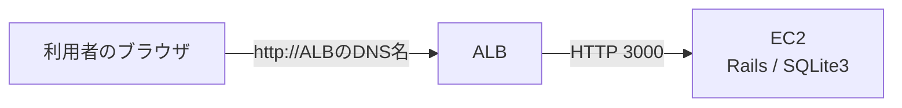
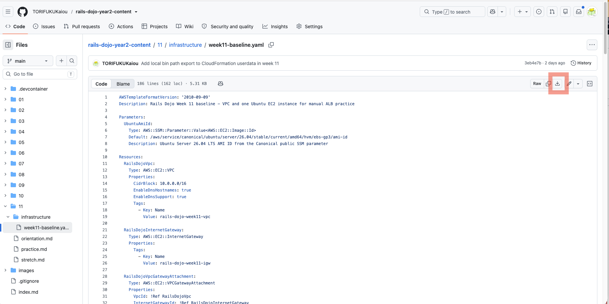

# 第11週：練習 ── ALBを使ってRailsアプリを公開する

この練習では、CloudFormationでEC2までの環境を作り、その前にALBを追加します。

先に、[第11週の説明](orientation.md)を読んでください。

## この練習で行うこと

- AWS Academy Sandboxを起動する
- CloudFormationでVPC、public subnet、EC2、EC2用セキュリティグループを作成する
- Session ManagerでEC2へ接続する
- User Dataのセットアップ完了を確認する
- GitHubからRailsアプリをcloneする
- Railsアプリを起動する
- EC2のパブリックIPアドレスと3000番ポートで表示する
- ALB用セキュリティグループを作成する
- ターゲットグループを作成する
- ALBとHTTPリスナーを作成する
- ALBのDNS名からRailsアプリを表示する
- EC2の3000番ポートをALBからだけ許可する
- EC2のIPアドレス直アクセスができなくなることを確認する
- 作成したリソースを削除する

完成すると、次の構成になります。



> [!IMPORTANT]
> この練習では、最初にEC2へ直接アクセスできる状態を確認します。
> そのあと、EC2への直接アクセスを閉じて、ALB経由だけで表示できる状態へ変更します。

---

## Step 1：AWS Academy Sandboxを起動する

1. AWS Academyへログインします。
2. 対象のコース（AWS Academy Cloud Foundations）を開きます。
3. `サンドボックス ラボ`を開きます。
4. `Start Lab`をクリックします。
5. `Lab status` が `ready` になるまで待ちます。
6. `AWS`をクリックし、AWSマネジメントコンソールを開きます。
7. 画面右上のリージョンが、次の地域になっていることを確認します。

```text
米国（バージニア北部）
us-east-1
```

> [!IMPORTANT]
> この授業では、特別な指示がない限り`us-east-1`を使用します。
> 別のリージョンを選ぶと、作成したリソースが見つからないように見えることがあります。

---

## Step 2：CloudFormationテンプレートを開く

この教材のCloudFormationテンプレートを開きます。

[week11-baseline.yaml](infrastructure/week11-baseline.yaml)

右クリックして別タブで開き、ダウンロードしてください。



保存したファイル名が次の名前になっていることを確認します。

```text
week11-baseline.yaml
```

このテンプレートは、次のリソースを作成します。

- VPC
- public subnet 2つ
- Internet Gateway
- route table
- EC2用セキュリティグループ
- Ubuntu Server 26.04 LTSのEC2インスタンス

ALB、ターゲットグループ、リスナーは作りません。

それらは、このあと自分で作成します。

---

## Step 3：CloudFormationスタックを作成する

1. AWSマネジメントコンソール上部の検索欄へ、`CloudFormation` と入力します。
2. 検索結果から `CloudFormation` をクリックします。
3. 左メニューまたは画面中央から `スタック` を開きます。
4. `スタックの作成` をクリックします。
5. `既存のテンプレートを選択` をクリックします。

### テンプレートを指定する

テンプレートの指定では、次を選びます。

```text
テンプレートファイルのアップロード
```

`ファイルの選択` をクリックし、次のファイルを選びます。

```text
week11-baseline.yaml
```

選択できたら、`次へ` をクリックします。

### スタック名を入力する

スタック名には、次のように入力します。

```text
rails-dojo-week11
```

パラメータは変更しません。

`次へ` をクリックします。

### スタックオプションを設定する

この画面では、特に変更しません。

`次へ` をクリックします。

### 内容を確認して作成する

確認画面の下までスクロールします。

チェックボックスが表示されている場合は、内容を確認してチェックを入れます。

`送信` をクリックします。

---

## Step 4：スタックの作成完了を待つ

CloudFormationのスタック一覧で、`rails-dojo-week11` を開きます。

`イベント` タブを開くと、作成中のリソースが表示されます。

スタックの状態が次のようになるまで待ちます。

```text
CREATE_COMPLETE
```

数分かかることがあります。

> [!IMPORTANT]
> `CREATE_COMPLETE` になるまでは、次のStepへ進まないでください。
> EC2やネットワークの準備が終わっていない状態で進むと、Session Manager接続やALB作成で迷いやすくなります。

---

## Step 5：CloudFormationの出力を確認する

`rails-dojo-week11` スタックの `出力` タブを開きます。

次の値をメモ帳などにコピーします。

| 出力キー | 使う場面 |
|---|---|
| `VpcId` | ALB用セキュリティグループ、ターゲットグループ、ALBを作るとき |
| `PublicSubnet1` | ALBを作るとき |
| `PublicSubnet2` | ALBを作るとき |
| `EC2InstanceId` | ターゲットグループにEC2を登録するとき |
| `EC2PublicIp` | EC2へ直接アクセスするとき |
| `EC2SecurityGroupId` | EC2のインバウンドルールを変更するとき |

> [!NOTE]
> CloudFormationの出力は、あとでAWSコンソール上でも確認できます。
> ただし、ここでメモしておくと手順を進めやすくなります。

---

## Step 6：EC2インスタンスを確認する

1. AWSマネジメントコンソール上部の検索欄へ、`EC2` と入力します。
2. 検索結果から `EC2` をクリックします。
3. 左メニューまたは画面中央から `インスタンス` を開きます。
4. `rails-dojo-week11` という名前のインスタンスを探します。
5. インスタンスの状態が `実行中` になっていることを確認します。
6. `ステータスチェック` が通るまで待ちます。

ステータスチェックが通るまで、数分かかることがあります。

---

## Step 7：Session ManagerでEC2へ接続する

1. EC2のインスタンス一覧を開きます。
2. `rails-dojo-week11` へチェックを入れます。
3. `接続` をクリックします。
4. `SSM Session Manager` タブを開きます。
5. `接続` をクリックします。

ブラウザ内に黒いターミナル画面が開けば成功です。

> [!NOTE]
> `接続`ボタンが押せない場合は、インスタンスの起動直後で準備が終わっていない可能性があります。
> 1〜2分待ってから、もう一度試してください。

---

## Step 8：ubuntuユーザーへ切り替える

ターミナルで現在のユーザーを確認します。

```bash
whoami
```

Session Managerで接続した直後は、Rails作業に使う `ubuntu` ユーザーではありません。

次のコマンドを実行します。

```bash
sudo su - ubuntu
```

切り替えられたか確認します。

```bash
whoami
```

次のように表示されれば成功です。

```text
ubuntu
```

ホームディレクトリも確認します。

```bash
pwd
```

次のように表示されれば成功です。

```text
/home/ubuntu
```

---

## Step 9：OSとUser Dataの完了を確認する

EC2のOSを確認します。

```bash
cat /etc/os-release
```

`Ubuntu` や `26.04` という文字が表示されれば、Ubuntu 26.04 LTSのEC2に入っています。

表示例：

```text
PRETTY_NAME="Ubuntu 26.04 LTS"
NAME="Ubuntu"
```

cloud-initの状態を確認します。

```bash
sudo cloud-init status
```

次のように表示されれば、EC2起動時の初期処理は正常に完了しています。

```text
status: done
```

`status: running` と表示された場合は、まだ処理中です。

1〜2分待ってから、もう一度確認してください。

```bash
sudo cloud-init status
```

> [!IMPORTANT]
> `status: error` と表示された場合は、User Dataの途中でエラーが起きています。
> 次のコマンドでログを確認し、教員へ画面を見せてください。
>
> ```bash
> sudo tail -n 80 /var/log/cloud-init-output.log
> ```

User DataによるRails環境セットアップが完了しているか確認します。

```bash
ls /opt/rails-dojo/setup-complete
```

次のように表示されれば成功です。

```text
/opt/rails-dojo/setup-complete
```

> [!IMPORTANT]
> このファイルがない場合は、User Dataの処理がまだ終わっていないか、途中で失敗しています。
> 1〜2分待ってから、もう一度確認してください。

ログを確認したい場合は、次のコマンドを実行します。

```bash
sudo tail -n 80 /var/log/cloud-init-output.log
```

---

## Step 10：RubyとBundlerを確認する

User Dataで、Git、SQLite3、mise、Ruby、Bundlerはインストール済みです。

次のコマンドで確認します。

```bash
source ~/.bashrc
```

```bash
ruby -v
```

`ruby 4.0.2` から始まる表示になれば成功です。

どのRubyが使われているか確認します。

```bash
which ruby
```

`/home/ubuntu` の下にあるmise関連のパスが表示されれば、miseで入れたRubyが使われています。

Bundlerも確認します。

```bash
bundle -v
```

`Bundler version 4.0.6` のように表示されれば成功です。

GitとSQLite3も確認します。

```bash
git --version
```

```bash
sqlite3 --version
```

どちらもバージョン番号が表示されれば成功です。

---

## Step 11：RailsアプリをGitHubからcloneする

GitHub上のRailsアプリをEC2へコピーします。

```bash
git clone https://github.com/TORIFUKUKaiou/rails-dojo-git-practice.git
```

`rails-dojo-git-practice` というディレクトリが作成されれば成功です。

作成されたディレクトリへ移動します。

```bash
cd rails-dojo-git-practice
```

現在地を確認します。

```bash
pwd
```

次のように表示されれば成功です。

```text
/home/ubuntu/rails-dojo-git-practice
```

---

## Step 12：必要なGemをインストールする

Railsアプリで使うGemをインストールします。

```bash
bundle install
```

インストールには数分かかることがあります。

最後にエラーが出ず、プロンプトが戻ってくれば成功です。

---

## Step 13：データベースを準備する

このアプリはSQLite3を使います。

データベースを作成し、migrationを実行します。

```bash
bin/rails db:prepare
```

エラーが出ず、プロンプトが戻ってくれば成功です。

---

## Step 14：Rails serverを起動する

EC2の外からアクセスできるように、`0.0.0.0` と3000番ポートを指定してRails serverを起動します。

```bash
bin/rails server -b 0.0.0.0 -p 3000
```

次のような表示が出れば、Rails serverが起動しています。

```text
* Listening on http://0.0.0.0:3000
```

このターミナルはRails serverが使っているため、コマンド入力には使えません。

Rails serverは起動したままにして、次のStepへ進みます。

---

## Step 15：まだブラウザから接続できないことを確認する

ブラウザで、次の形式のURLを開きます。

```text
http://EC2のパブリックIPアドレス:3000
```

`EC2のパブリックIPアドレス` には、CloudFormationの出力 `EC2PublicIp` の値を入れます。

例：

```text
http://203.0.113.10:3000
```

この時点では、ページが表示されないはずです。

これは、EC2用セキュリティグループで3000番ポートをまだ開けていないためです。

> [!IMPORTANT]
> ここで接続できないことを確認するのは、今回の演習の一部です。
> Rails serverが動いていても、セキュリティグループで許可していなければ、外からアクセスできません。

---

## Step 16：EC2のセキュリティグループで3000番を開ける

AWSマネジメントコンソールで操作します。

1. EC2のインスタンス一覧を開きます。
2. `rails-dojo-week11` をクリックします。
3. 詳細画面の `セキュリティ` タブを開きます。
4. セキュリティグループ名をクリックします。
5. `インバウンドルール` タブを開きます。
6. `インバウンドルールを編集` をクリックします。
7. `ルールを追加` をクリックします。
8. 次のように設定します。

| 項目 | 設定 |
|---|---|
| タイプ | カスタムTCP |
| ポート範囲 | `3000` |
| ソース | `Anywhere-IPv4` |

9. `ルールを保存` をクリックします。

> [!WARNING]
> ここでは学習のために、一度EC2の3000番ポートをインターネットへ開けます。
> あとで、このルールを削除し、ALBからだけ接続できるように変更します。

---

## Step 17：EC2のIPアドレスからRailsアプリを確認する

もう一度、ブラウザで次の形式のURLを開きます。

```text
http://EC2のパブリックIPアドレス:3000
```

`CodeShelf` が表示されれば成功です。

画面に何も記事がない場合は、`新しい記事を投稿` などのリンクから記事を作成してみます。

次の操作を確認してください。

- 記事一覧画面が表示される
- 新しい記事を作成できる
- 作成した記事の詳細画面を開ける
- 記事を編集できる
- 記事を削除できる

確認できたら、Rails serverは起動したまま次へ進みます。

---

## Step 18：ALB用セキュリティグループを作成する

ALBへインターネットからHTTPでアクセスできるように、ALB用のセキュリティグループを作成します。

1. EC2の左メニューから `セキュリティグループ` を開きます。
2. `セキュリティグループを作成` をクリックします。
3. 次のように入力します。

| 項目 | 設定 |
|---|---|
| セキュリティグループ名 | `rails-dojo-week11-alb-sg` |
| 説明 | `Allow HTTP access to ALB` |
| VPC | CloudFormationで作成した `rails-dojo-week11-vpc` |

4. `インバウンドルール` で `ルールを追加` をクリックします。
5. 次のように設定します。

| 項目 | 設定 |
|---|---|
| タイプ | HTTP |
| ポート範囲 | `80` |
| ソース | `Anywhere-IPv4` |

6. `アウトバウンドルール` はデフォルトのままとし、**変更しません**。(タイプ: すべてのトラフィック、ポート範囲: すべて、送信先: `0.0.0.0/0`)
7. `セキュリティグループを作成` をクリックします。
8. 作成されたセキュリティグループIDをメモします。

このあと、このセキュリティグループをALBに設定します。

---

## Step 19：ターゲットグループを作成する

ALBが通信を転送する先として、ターゲットグループを作成します。

1. EC2の左メニューから `ターゲットグループ` を開きます。
2. `ターゲットグループの作成` をクリックします。
3. `ターゲットの種類` で、次を選びます。

```text
インスタンス
```

### 基本設定

次のように設定します。

| 項目 | 設定 |
|---|---|
| ターゲットグループ名 | `rails-dojo-week11-tg` |
| プロトコル | `HTTP` |
| ポート | `3000` |
| IPアドレスタイプ | `IPv4` |
| VPC | CloudFormationで作成した `rails-dojo-week11-vpc` |
| プロトコルバージョン | `HTTP1` |

### ヘルスチェック

ヘルスチェックは次のように設定します。

| 項目 | 設定 |
|---|---|
| ヘルスチェックプロトコル | `HTTP` |
| ヘルスチェックパス | `/up` |

設定できたら、`次へ` をクリックします。

### EC2を登録する

1. `rails-dojo-week11` インスタンスを選択します。
2. `保留中として以下を含める` をクリックします。
3. 画面下部の `ターゲットを確認` に、 `rails-dojo-week11` インスタンスが追加されていることを確認します。
4. `次へ`
5. `ターゲットグループの作成`

ターゲットグループが作成されれば成功です。

---

## Step 20：ALBを作成する

1. EC2の左メニューから `ロードバランサー` を開きます。
2. `ロードバランサーの作成` をクリックします。
3. `Application Load Balancer` の `作成` をクリックします。

### 基本的な設定

次のように設定します。

| 項目 | 設定 |
|---|---|
| ロードバランサー名 | `rails-dojo-week11-alb` |
| スキーム | `インターネット向け` |
| IPアドレスタイプ | `IPv4` |

### ネットワークマッピング

VPCは、CloudFormationで作成した次のVPCを選びます。

```text
rails-dojo-week11-vpc
```

マッピングでは、2つのアベイラビリティゾーンを選び、それぞれ次のpublic subnetを選択します。

```text
rails-dojo-week11-public-subnet-1
rails-dojo-week11-public-subnet-2
```

> [!IMPORTANT]
> ALBは、少なくとも2つのアベイラビリティゾーンにまたがるサブネットを選ぶ必要があります。
> そのため、CloudFormationでpublic subnetを2つ作成しています。

### セキュリティグループ

デフォルトで選ばれているセキュリティグループがあれば外します。

Step 18で作成した次のセキュリティグループを選びます。

```text
rails-dojo-week11-alb-sg
```

### リスナーとルーティング

リスナーは次のままにします。

| 項目 | 設定 |
|---|---|
| プロトコル | `HTTP` |
| ポート | `80` |

デフォルトアクションには、Step 19で作成したターゲットグループを選びます。

```text
rails-dojo-week11-tg
```

### ロードバランサーを作成する

設定を確認し、`ロードバランサーの作成` をクリックします。

---

## Step 21：ターゲットがHealthyになることを確認する

1. EC2の左メニューから `ターゲットグループ` を開きます。
2. `rails-dojo-week11-tg` をクリックします。
3. `ターゲット` タブを開きます。
4. 登録したEC2の状態を確認します。

ヘルスステータスが、次のように表示されれば成功です。

```text
Healthy
```

`Healthy` になるまで数分かかることがあります。

> [!IMPORTANT]
> `Unhealthy` のままの場合、ALBはEC2へ通信を流せません。
> Rails serverが起動したままか、ターゲットグループのポートが3000か、ヘルスチェックパスが`/up`かを確認してください。

---

## Step 22：ALBのDNS名を確認する

1. EC2の左メニューから `ロードバランサー` を開きます。
2. `rails-dojo-week11-alb` をクリックします。
3. 詳細画面で `DNS名` を確認します。
4. DNS名をコピーします。

DNS名は、次のような形です。

```text
rails-dojo-week11-alb-1234567890.us-east-1.elb.amazonaws.com
```

ブラウザで開くときは、先頭に `http://` を付けます。

```text
http://ALBのDNS名
```

---

## Step 23：ALBのDNS名からRailsアプリを確認する

ブラウザで次の形式のURLを開きます。

```text
http://ALBのDNS名
```

`CodeShelf` が表示されれば成功です。

この時点では、次の2つのURLの両方で表示できる状態です。

```text
http://ALBのDNS名
http://EC2のパブリックIPアドレス:3000
```

次のStepで、EC2へ直接アクセスする入口を閉じます。

---

## Step 24：EC2の3000番をALBからだけ許可する

EC2用セキュリティグループを変更します。

1. EC2のインスタンス一覧を開きます。
2. `rails-dojo-week11` をクリックします。
3. 詳細画面の `セキュリティ` タブを開きます。
4. EC2用セキュリティグループをクリックします。
5. `インバウンドルール` タブを開きます。
6. `インバウンドルールを編集` をクリックします。
7. `3000 / Anywhere-IPv4` のルールを削除します。
8. `ルールを追加` をクリックします。
9. 次のように設定します。

| 項目 | 設定 |
|---|---|
| タイプ | カスタムTCP |
| ポート範囲 | `3000` |
| ソース | Step 18で作成したALB用セキュリティグループ |

10. `ルールを保存` をクリックします。

> [!IMPORTANT]
> ソースにはIPアドレスではなく、ALB用セキュリティグループを指定します。
> これにより、ALBから来た通信だけがEC2の3000番へ届くようになります。

---

## Step 25：ALB経由では表示されることを確認する

ブラウザで、もう一度ALBのURLを開きます。

```text
http://ALBのDNS名
```

ブラウザをリロードします。

`CodeShelf` が表示されれば成功です。

これは、次の通信が許可されているためです。

```text
ブラウザ
↓ 80番
ALB
↓ 3000番
EC2
```

---

## Step 26：EC2への直接アクセスができないことを確認する

ブラウザで、次のURLを開きます。

```text
http://EC2のパブリックIPアドレス:3000
```

ブラウザをリロードします。
今度はページが表示されないはずです。

これは、EC2用セキュリティグループで、インターネットからの3000番ポートを許可していないためです。

> [!IMPORTANT]
> ここで表示されないことは、成功です。
> 第11週の完成状態では、利用者はALBからRailsアプリへアクセスします。

---

## Step 27：Rails serverを停止する

Session Managerのターミナルへ戻ります。

Rails serverが動いている画面で、次のキーを押します。

```text
Ctrl + C
```

プロンプトが戻ってくれば、Rails serverは停止しています。

---

## Step 28：ALBを削除する

最後に、作成したAWSリソースを削除します。

まずALBを削除します。

1. EC2の左メニューから `ロードバランサー` を開きます。
2. `rails-dojo-week11-alb` にチェックを入れます。
3. `アクション` をクリックします。
4. `ロードバランサーの削除` をクリックします。
5. 確認画面の指示に従って削除します。

削除が始まれば成功です。

---

## Step 29：ターゲットグループを削除する

ALBの削除が完了してから、ターゲットグループを削除します。

1. EC2の左メニューから `ターゲットグループ` を開きます。
2. `rails-dojo-week11-tg` にチェックを入れます。
3. `アクション` をクリックします。
4. `削除` をクリックします。
5. 確認画面の指示に従って削除します。

> [!NOTE]
> ALBがまだ削除中の場合、ターゲットグループを削除できないことがあります。
> その場合は、1〜2分待ってからもう一度削除してください。

---

## Step 30：EC2用セキュリティグループのインバウンドルールを削除する

1. EC2の左メニューから `セキュリティグループ` を開きます。
2. Step 5でメモした `EC2SecurityGroupId` と同じセキュリティグループにチェックを入れます。
3. `インバウンドルール` タブを開きます
4. `インバウンドのルールを編集` をクリックします。
5. インバウンドルールを `削除` します。
6. `ルールを保存` をクリックします。

EC2用セキュリティグループのインバウンドルールを削除できれば成功です。

---

## Step 31：ALB用セキュリティグループを削除する

1. EC2の左メニューから `セキュリティグループ` を開きます。
2. `rails-dojo-week11-alb-sg` にチェックを入れます。
3. `アクション` をクリックします。
4. `セキュリティグループを削除` をクリックします。
5. 確認画面の指示に従って削除します。

削除できれば成功です。

---

## Step 32：CloudFormationスタックを削除する

最後に、CloudFormationで作成したリソースをまとめて削除します。

1. AWSマネジメントコンソール上部の検索欄へ、`CloudFormation` と入力します。
2. `CloudFormation` を開きます。
3. `rails-dojo-week11` スタックにチェックを入れます。
4. `スタックを削除` をクリックします。
5. 確認画面の指示に従って削除します。

スタックの状態が次のようになれば削除完了です。

```text
DELETE_COMPLETE
```

スタック一覧から消える場合もあります。

> [!IMPORTANT]
> AWSでは、作成して終わりではありません。
> 不要になったリソースを削除するところまでが演習です。

---

## トラブルシューティング

### CloudFormationスタック作成が失敗する

次を確認します。

- リージョンが`us-east-1`になっているか
- テンプレートファイルを正しく選んだか
- AWS Academy SandboxのLab statusが`ready`になっているか
- エラー内容が `Events` タブに表示されていないか

### Session Managerで接続できない

次を確認します。

- インスタンスが`実行中`になっているか
- ステータスチェックが終わっているか
- 起動直後の場合、1〜2分待ったか
- CloudFormationテンプレートで`LabInstanceProfile`が設定されているか

### `/opt/rails-dojo/setup-complete` がない

User Dataがまだ終わっていないか、途中で失敗しています。

まずcloud-initの状態を確認します。

```bash
sudo cloud-init status
```

`status: running` の場合は、1〜2分待ってからもう一度確認します。

`status: error` の場合は、User Dataの途中でエラーが起きています。

ログを確認します。

```bash
sudo tail -n 80 /var/log/cloud-init-output.log
```

`apt`、`mise`、`ruby` などのエラーが表示されている場合は、教員へ画面を見せてください。

### EC2のIPアドレスで接続できない

次を確認します。

- Rails serverが起動したままになっているか
- URLの末尾に`:3000`を付けたか
- パブリックIPアドレスを間違えていないか
- EC2用セキュリティグループで3000番を開けたか

### ターゲットがHealthyにならない

次を確認します。

- Rails serverが起動したままになっているか
- ターゲットグループのポートが`3000`になっているか
- ヘルスチェックパスが`/up`になっているか
- EC2用セキュリティグループで3000番を許可しているか

### ALBのDNS名で表示されない

次を確認します。

- ターゲットグループの状態が`Healthy`になっているか
- ALBのリスナーがHTTP 80になっているか
- リスナーの転送先が`rails-dojo-week11-tg`になっているか
- ALB用セキュリティグループでHTTP 80を許可しているか

---

## 今日の確認

次の項目を確認してください。

- [ ] AWS Academy Sandboxを開始できた
- [ ] リージョンを`us-east-1`に設定した
- [ ] CloudFormationスタックを作成できた
- [ ] CloudFormationの出力を確認できた
- [ ] Ubuntu 26.04 LTSのEC2インスタンスへSession Managerで接続できた
- [ ] `sudo cloud-init status` で `status: done` を確認できた
- [ ] `/opt/rails-dojo/setup-complete` を確認できた
- [ ] Ruby 4.0.2を確認できた
- [ ] Bundler 4.0.6を確認できた
- [ ] GitHubからRailsアプリをcloneできた
- [ ] `bundle install` を実行できた
- [ ] `bin/rails db:prepare` を実行できた
- [ ] Rails serverを起動できた
- [ ] EC2のIPアドレス`:3000`でRailsアプリを表示できた
- [ ] ALB用セキュリティグループを作成できた
- [ ] ターゲットグループを作成できた
- [ ] ALBを作成できた
- [ ] ターゲットがHealthyになることを確認できた
- [ ] ALBのDNS名からRailsアプリを表示できた
- [ ] EC2の3000番をALBからだけ許可する設定へ変更できた
- [ ] ALB経由では表示され、EC2直アクセスでは表示されないことを確認できた
- [ ] Rails serverを停止できた
- [ ] ALB、ターゲットグループ、ALB用セキュリティグループ、CloudFormationスタックを削除できた

Practiceが終わったら、[Stretch](stretch.md) へ進みましょう。
