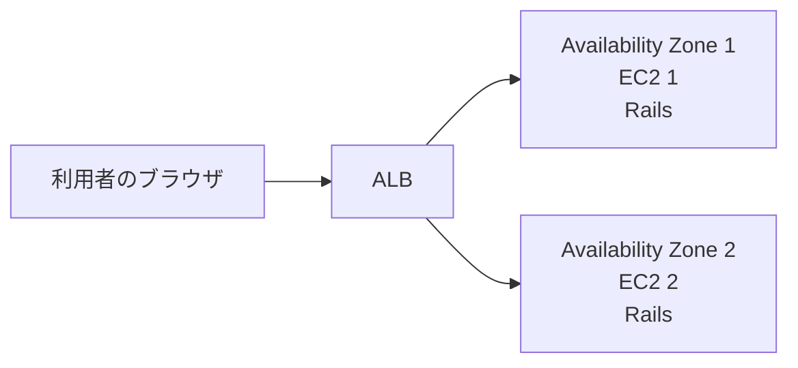

# Stretch：EC2を2台に増やしてALBの動きを観察する

Practiceでは、EC2を1台だけ使ってRailsアプリを公開しました。

Stretchでは、Practiceで作成したVPC、ALB、ターゲットグループをそのまま使います。異なるAvailability ZoneへEC2をもう1台作り、2台のRailsへ通信が振り分けられる様子を観察します。



> [!IMPORTANT]
> Practiceで作成したリソースを削除せず、1台目のRails serverを起動したまま進めます。
> ターゲットグループのスティッキーセッションは有効にしません。

---

## Step 1：1台目のAvailability Zoneを確認する

1. AWSマネジメントコンソールでEC2の `インスタンス` を開きます。
2. `rails-dojo-week11` を選択します。
3. 詳細画面の `Availability Zone` を確認します。
4. 表示された値をメモします。

表示例：

```text
us-east-1a
```

2台目は、この値とは異なるAvailability Zoneへ作成します。

---

## Step 2：2台目のEC2インスタンスを作成する

EC2のインスタンス一覧で、`インスタンスを起動` をクリックします。

基本設定は次のようにします。

| 項目 | 設定 |
|---|---|
| 名前 | `rails-dojo-week11-2` |
| AMI | `Ubuntu Server 26.04 LTS` |
| インスタンスタイプ | `t3.medium` |
| キーペア | `キーペアなしで続行` |

`ネットワーク設定` の `編集` をクリックし、次のように設定します。

| 項目 | 設定 |
|---|---|
| VPC | `rails-dojo-week11-vpc` |
| サブネット | 1台目とは異なるAvailability Zoneの `rails-dojo-week11-public-subnet` |
| パブリックIPの自動割り当て | `有効化` |
| ファイアウォール | `既存のセキュリティグループを選択する` |
| セキュリティグループ | `rails-dojo-week11-ec2-sg` |

> [!IMPORTANT]
> デフォルトVPCは選びません。
> PracticeでCloudFormationが作成したVPCと、1台目とは異なるAvailability Zoneのpublic subnetを選びます。

`高度な詳細` を開き、IAMインスタンスプロフィールに次を設定します。

```text
LabInstanceProfile
```

`インスタンスを起動` をクリックします。

インスタンスが `実行中` になり、ステータスチェックが通るまで待ちます。

---

## Step 3：2台が異なるAvailability Zoneにあることを確認する

インスタンス一覧で、2台の `Availability Zone` を比べます。

次のように末尾が異なっていれば成功です。

```text
rails-dojo-week11     us-east-1a
rails-dojo-week11-2   us-east-1b
```

実際に表示されるAvailability Zoneは、上の例と異なる場合があります。

---

## Step 4：2台目へSession Managerで接続する

1. `rails-dojo-week11-2` を選択します。
2. `接続` をクリックします。
3. `SSM Session Manager` タブを開きます。
4. `接続` をクリックします。

接続できたら、`ubuntu` ユーザーへ切り替えます。

```bash
sudo su - ubuntu
```

確認します。

```bash
whoami
```

次のように表示されれば成功です。

```text
ubuntu
```

---

## Step 5：2台目へRailsの実行環境を準備する

パッケージ一覧を更新します。

```bash
sudo apt update
```

必要なパッケージをインストールします。

```bash
sudo apt install -y git curl build-essential autoconf libssl-dev libyaml-dev zlib1g-dev libffi-dev libgmp-dev libreadline-dev rustc libsqlite3-dev sqlite3 pkg-config
```

miseをインストールします。

```bash
curl https://mise.run | sh
```

bashでmiseを使えるようにします。

```bash
echo 'eval "$($HOME/.local/bin/mise activate bash)"' >> ~/.bashrc
```

設定を読み込みます。

```bash
source ~/.bashrc
```

Rubyをインストールします。

```bash
mise settings ruby.compile=false
```

```bash
mise use -g ruby@4.0.5
```

Bundlerをインストールします。

```bash
gem install bundler -v 4.0.6
```

バージョンを確認します。

```bash
ruby -v
```

```bash
bundle -v
```

Ruby 4.0.5とBundler 4.0.6のバージョンが表示されれば成功です。

---

## Step 6：2台目でRailsアプリを起動する

Railsアプリをcloneします。

```bash
git clone https://github.com/TORIFUKUKaiou/rails-dojo-git-practice.git
```

ディレクトリへ移動します。

```bash
cd rails-dojo-git-practice
```

Gemをインストールします。

```bash
bundle install
```

データベースを準備します。

```bash
bin/rails db:prepare
```

Rails serverを起動します。

```bash
bin/rails server -b 0.0.0.0 -p 3000
```

次のような表示が出れば、Rails serverが起動しています。

```text
* Listening on http://0.0.0.0:3000
```

このターミナルではRails serverを起動したままにします。

---

## Step 7：2台目を同じターゲットグループへ登録する

1. EC2の左メニューから `ターゲットグループ` を開きます。
2. Practiceで作成した `rails-dojo-week11-tg` を開きます。
3. `ターゲット` タブを開きます。
4. `ターゲットを登録` をクリックします。
5. `rails-dojo-week11-2` を選択します。
6. ポートが `3000` であることを確認します。
7. `保留中として以下を含める` をクリックします。
8. `保留中のターゲットを登録` をクリックします。

2台目が追加されれば登録完了です。

---

## Step 8：2台ともHealthyになることを確認する

ターゲットグループの `ターゲット` タブで、2台のヘルスステータスを確認します。

```text
rails-dojo-week11     Healthy
rails-dojo-week11-2   Healthy
```

2台とも `Healthy` になるまで数分かかることがあります。

> [!IMPORTANT]
> 2台とも `Healthy` になるまでは、次へ進まないでください。

---

## Step 9：ALBから何度もアクセスする

ブラウザでPracticeのALBのURLを開きます。

```text
http://ALBのDNS名
```

同じページを10回程度リロードします。

この時点では、表示が同じなら問題ありません。

> [!NOTE]
> ALBがどちらのEC2へ通信を送ったかは、画面だけでは分かりません。
> また、通信が必ず交互に送られるわけではありません。

---

## Step 10：記事を作成して表示を観察する

ALBのURLから、新しい記事を1件作成します。

例：

```text
タイトル：ALBから作成した記事
本文：2台のEC2で表示を確認します
```

記事一覧へ戻り、ブラウザを何度もリロードします。

次の点を観察し、ノートへ記録してください。

- 作成した記事が表示されることがあるか
- 作成した記事が表示されないことがあるか
- リロードするたびに表示が変わるか
- 何度リロードしても同じ表示になるか

> [!IMPORTANT]
> 表示がすぐに変わらない場合もあります。
> スティッキーセッションは有効にせず、20回程度リロードして観察してください。

---

## Step 11：別の記事を作成して変化を観察する

記事が表示されていない状態になったとき、新しい記事をもう1件作成します。

例：

```text
タイトル：もう一方で作成した記事
本文：表示の違いを調べます
```

記事一覧へ戻り、再び何度もリロードします。

2件の記事について、次のどの表示になったか記録してください。

- 1件目だけが表示された
- 2件目だけが表示された
- 2件とも表示された
- どちらも表示されなかった

観察した結果は、環境やALBの通信先によって異なる場合があります。

---

## Step 12：表示が変わる理由を考える（考察問題・実行しない）

> [!IMPORTANT]
> この課題は考察問題です。ファイルを変更したり、コマンドを実行したりしません。
> ノートまたは指定されたファイルに答えを書いてください。

次の問いについて考えてください。

1. 同じALBのURLを開いているのに、記事の表示が変わるのはなぜでしょうか。
2. 記事を作成したリクエストと、記事一覧を表示したリクエストは、同じEC2へ届くでしょうか。
3. 2台のRailsアプリは、記事のデータをどこへ保存しているでしょうか。
4. どちらのEC2へ通信が届いても同じ記事を表示するには、どのような構成が必要でしょうか。

考えを書いてから、模範解答を開いてください。

<details>
<summary>模範解答</summary>

1. ALBが2台のEC2へ通信を振り分けており、2台が同じデータを使っていないためです。
2. 同じEC2へ届くとは限りません。スティッキーセッションを有効にしていないため、リクエストごとに異なるEC2へ届く可能性があります。
3. それぞれのEC2内にあるSQLiteのデータベースファイルへ保存しています。1台目で保存した記事は、自動的には2台目へ入りません。
4. 2台のRailsアプリが、共通のデータベースへ接続する構成が必要です。次回は、2台から同じデータを利用できる構成を作ります。

</details>

---

## Step 13：片方のEC2を停止して高可用性を確認する

記事を保存したあと、EC2のインスタンス一覧を開きます。

1. `rails-dojo-week11-2` を選択します。
2. `インスタンスの状態` をクリックします。
3. `インスタンスを停止` をクリックします。
4. 確認画面で停止を実行します。

> [!IMPORTANT]
> `終了` ではなく `停止` を選びます。

ターゲットグループの画面を開き、2台目が `Unhealthy` になるまで待ちます。

その後、ALBのURLを何度かリロードします。

次を確認してください。

- Railsアプリの画面を引き続き表示できる
- 画面が安定して表示される
- 停止したEC2側に保存されていた記事は表示されない場合がある

ALBはヘルスチェックに成功している1台目だけへ通信を送るため、片方のEC2が停止してもアプリの利用を続けられます。

一方で、停止したEC2だけが持っていた記事は、動いているEC2からは表示できません。

---

## Step 14：高可用性とデータについて考える（考察問題・実行しない）

> [!IMPORTANT]
> この課題は考察問題です。ファイルを変更したり、コマンドを実行したりしません。
> ノートまたは指定されたファイルに答えを書いてください。

次の問いについて考えてください。

1. EC2を1台停止しても、Railsアプリを表示できたのはなぜでしょうか。
2. Railsアプリを表示できても、一部の記事が見えなくなる可能性があるのはなぜでしょうか。
3. 「Webアプリが動き続けること」と「保存したデータを同じように読めること」は、同じ問題でしょうか。

<details>
<summary>模範解答</summary>

1. ALBがヘルスチェックを行い、正常なEC2だけへ通信を送ったためです。異なるAvailability Zoneに正常なEC2が残っているので、片方を停止しても利用を続けられます。
2. 記事は各EC2のSQLiteへ別々に保存されています。停止したEC2だけにある記事は、もう一方のEC2から読めません。
3. 同じ問題ではありません。EC2を複数のAvailability Zoneへ配置すると、Railsを動かし続けやすくなります。しかし、複数のRailsから同じデータを利用するための構成も別に必要です。

</details>

---

## Step 15：2台目を再起動する

1. EC2のインスタンス一覧で `rails-dojo-week11-2` を選択します。
2. `インスタンスの状態` をクリックします。
3. `インスタンスを開始` をクリックします。
4. インスタンスが `実行中` になるまで待ちます。
5. Session Managerで2台目へ接続します。
6. `ubuntu` ユーザーへ切り替えます。

```bash
sudo su - ubuntu
```

Railsアプリのディレクトリへ移動します。

```bash
cd ~/rails-dojo-git-practice
```

Rails serverを起動します。

```bash
bin/rails server -b 0.0.0.0 -p 3000
```

ターゲットグループで、2台とも `Healthy` に戻れば成功です。

---

## Stretchの確認

- [ ] PracticeのVPC、ALB、ターゲットグループをそのまま使った
- [ ] 2台目を1台目とは異なるAvailability Zoneへ作成した
- [ ] 2台目へ1台目と同じEC2用セキュリティグループを設定した
- [ ] 2台目でRailsアプリを起動した
- [ ] 2台を同じターゲットグループへ登録した
- [ ] 2台とも `Healthy` になることを確認した
- [ ] スティッキーセッションを有効にせず、記事表示の変化を観察した
- [ ] EC2ごとに記事の表示が異なる理由を考えた
- [ ] 片方のEC2を停止しても、ALB経由でアプリを利用できることを確認した
- [ ] 停止したEC2にある記事が見えなくなる場合があることを確認した
- [ ] 2台目を再起動し、2台とも `Healthy` に戻した
