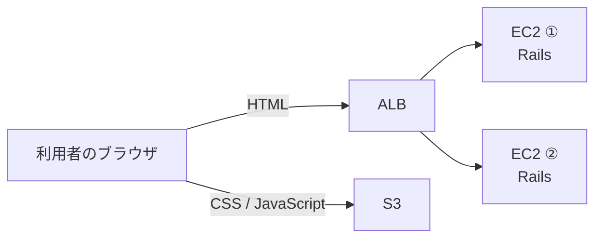

# Stretch：S3を使った発展演習

## Stretch 1：RailsのアセットをS3から配信する

Practiceでは、HTML、CSS、JavaScriptをEC2上のRailsから配信しました。

この課題では、HTMLはRailsから返し、CSSやJavaScriptなどのアセットはS3から配信します。



Practiceの最後に2台とも`Healthy`へ戻した構成を使います。

---

### Step 1：S3バケットを作成する

AWSマネジメントコンソールでS3を開き、アセット配信用のバケットを作成します。

バケット名はAWS全体で重複しない名前にします。

例：

```text
rails-dojo-assets-学籍番号
```

バケット名には、ピリオド`.`を使わないでください。

`パブリックアクセスをすべてブロック`のチェックを外し、バケットを作成します。

---

### Step 2：バケットポリシーを設定する

作成したバケットの`アクセス許可`タブを開きます。

`バケットポリシー`へ次を入力します。

`作成したバケット名`は、自分のバケット名へ置き換えます。

```json
{
  "Version": "2012-10-17",
  "Statement": [
    {
      "Effect": "Allow",
      "Principal": "*",
      "Action": "s3:GetObject",
      "Resource": "arn:aws:s3:::作成したバケット名/assets/*"
    }
  ]
}
```

保存できれば、`assets`の中へアップロードするファイルをブラウザから読み取れるようになります。

---

### Step 3：CORSを設定する

同じ`アクセス許可`タブにある`Cross-Origin Resource Sharing（CORS）`を編集します。

次を入力して保存します。

```json
[
  {
    "AllowedHeaders": ["*"],
    "AllowedMethods": ["GET", "HEAD"],
    "AllowedOrigins": ["*"],
    "ExposeHeaders": []
  }
]
```

これにより、ALBから表示したHTMLが、別の接続先であるS3からJavaScriptなどを読み込めます。

---

### Step 4：EC2 ①へ接続する

Session Managerで`rails-dojo-week12-1`へ接続し、`ubuntu`ユーザーへ切り替えます。

```bash
sudo su - ubuntu
```

Railsアプリのディレクトリへ移動します。

```bash
cd ~/rails-dojo-git-practice
```

AWS CLIを確認します。

```bash
aws --version
```

`command not found`と表示された場合は、次を実行します。

```bash
sudo snap install aws-cli --classic
```

もう一度確認します。

```bash
aws --version
```

バージョンが表示されれば準備完了です。

---

### Step 5：アセットをS3へアップロードする

Practiceで作成した`public/assets`の内容を確認します。

```bash
ls public/assets
```

ファイル名が表示されることを確認します。

次の`作成したバケット名`を自分のバケット名へ置き換えて実行します。

```bash
aws s3 sync public/assets s3://作成したバケット名/assets
```

アップロードされたファイル名が表示され、エラーが出なければ成功です。

S3の`オブジェクト`タブを開き、`assets`フォルダの中にファイルがあることも確認します。

---

### Step 6：Railsの設定を確認する

教材用アプリには、`RAILS_ASSET_HOST`の値をアセットの接続先として使う設定が入っています。

EC2 ①で確認します。

```bash
grep RAILS_ASSET_HOST config/environments/production.rb
```

次のように表示されれば確認完了です。

```ruby
config.asset_host = ENV["RAILS_ASSET_HOST"] if ENV["RAILS_ASSET_HOST"].present?
```

---

### Step 7：RAILS_ASSET_HOSTを設定する

`作成したバケット名`を自分のバケット名へ置き換えます。

```bash
export RAILS_ASSET_HOST='https://作成したバケット名.s3.amazonaws.com'
```

Practiceで設定した環境変数も残っていることを確認します。

```bash
env | grep -E '^(DATABASE_URL|RAILS_ENV|SECRET_KEY_BASE|RAILS_ASSET_HOST)=' | cut -d= -f1
```

次の4つが表示されれば成功です。

```text
DATABASE_URL
RAILS_ENV
SECRET_KEY_BASE
RAILS_ASSET_HOST
```

表示されない変数がある場合は、PracticeのStep 16を見て、同じ値をもう一度設定します。

---

### Step 8：EC2 ①のRails serverを再起動する

現在動いているRails serverを停止します。

```bash
pkill -9 -f 'puma.*rails-dojo-git-practice'
```

Rails serverを起動します。

```bash
bin/rails server -b 0.0.0.0 -p 3000 -d
```

起動を確認します。

```bash
curl http://localhost:3000/up
```

HTMLが表示されれば、EC2 ①の設定は完了です。

---

### Step 9：EC2 ②へ接続する

ALBはEC2 ①とEC2 ②のどちらへも通信を送ります。

EC2 ②にも同じS3を設定しないと、通信先によってアセットの配信元が変わります。

Session Managerで`rails-dojo-week12-2`へ接続し、`ubuntu`ユーザーへ切り替えます。

```bash
sudo su - ubuntu
```

Railsアプリのディレクトリへ移動します。

```bash
cd ~/rails-dojo-git-practice
```

`作成したバケット名`を自分のバケット名へ置き換えて設定します。

```bash
export RAILS_ASSET_HOST='https://作成したバケット名.s3.amazonaws.com'
```

環境変数を確認します。

```bash
env | grep -E '^(DATABASE_URL|RAILS_ENV|SECRET_KEY_BASE|RAILS_ASSET_HOST)=' | cut -d= -f1
```

表示されない変数がある場合は、PracticeのStep 17を見て、同じ値をもう一度設定します。

Rails serverを再起動します。

```bash
pkill -9 -f 'puma.*rails-dojo-git-practice'
```

```bash
bin/rails server -b 0.0.0.0 -p 3000 -d
```

```bash
curl http://localhost:3000/up
```

HTMLが表示されれば、EC2 ②の設定も完了です。

---

### Step 10：S3から配信されていることを確認する

ターゲットグループを開き、EC2 ①とEC2 ②が`Healthy`になるまで待ちます。

ALBのURLをブラウザで開きます。

```text
http://ALBのDNS名
```

`CodeShelf`が通常どおり表示されることを確認します。

ページのHTMLを確認し、CSSやJavaScriptのURLに次のS3バケット名が含まれていることを探します。

```text
作成したバケット名.s3.amazonaws.com
```

HTMLはEC2上のRailsから、CSSやJavaScriptはS3から配信されていれば成功です。

---

## Stretch 2：Kiro CLIで自己紹介サイトをS3へ公開する

Practiceでは、EC2、ALB、RDSを組み合わせ、Railsアプリをproductionモードで公開しました。

Stretchでは、生成AIを使った開発にも挑戦します。

Kiro CLIを使って静的な自己紹介サイトを作成し、S3へデプロイしてください。

次の記事を開き、書かれている手順を進めます。

[Kiro CLIで体験するVibe Coding - 自己紹介サイトをS3にデプロイ](https://qiita.com/torifukukaiou/items/29e217d5f7483d4218aa)

> [!IMPORTANT]
> 記事に書かれているプロンプトを、そのままコピーして使わないでください。
> 自分が作りたいサイトに合わせて、プロンプトを自分で考えて変更してください。

例えば、次の内容を組み合わせて指示できます。

- 自分の好きなものや趣味
- 得意になりたい技術
- 将来作ってみたいアプリ
- 好きな色、形、雰囲気
- 画面に入れたい動き
- 授業で作ったRailsアプリやAWS構成
- 見た人に押してほしいボタンや試してほしい操作

単に名前を表示するだけでなく、自分らしい工夫を一つ以上入れてください。

面白いものができたら、S3の公開URLを先生に見せてください。

> [!NOTE]
> この課題には、Orientationで扱っていない操作も含まれます。
> 分からないところは、検索したり、生成AIへ相談したりしながら進めて構いません。
