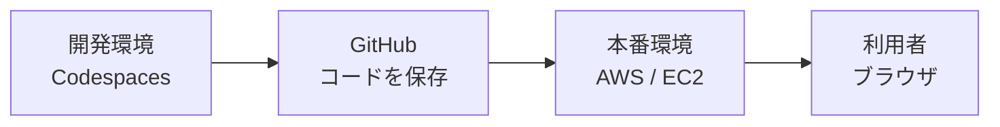
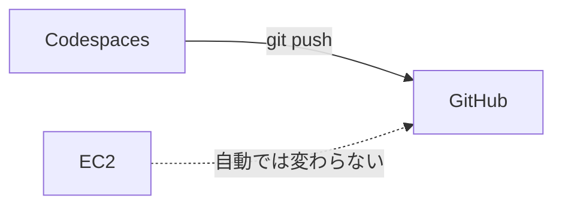
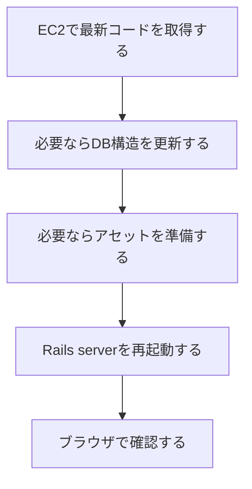
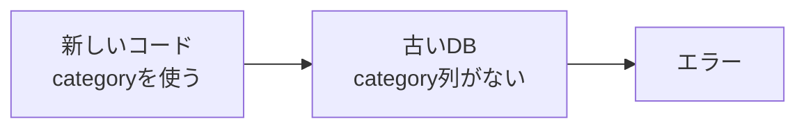
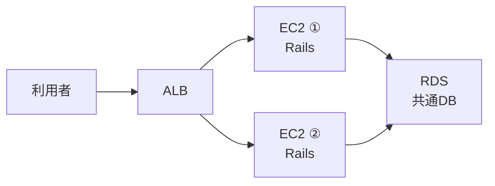
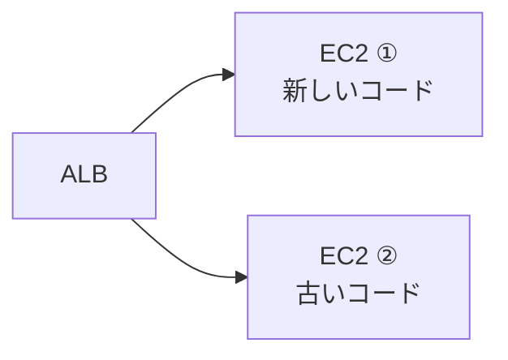
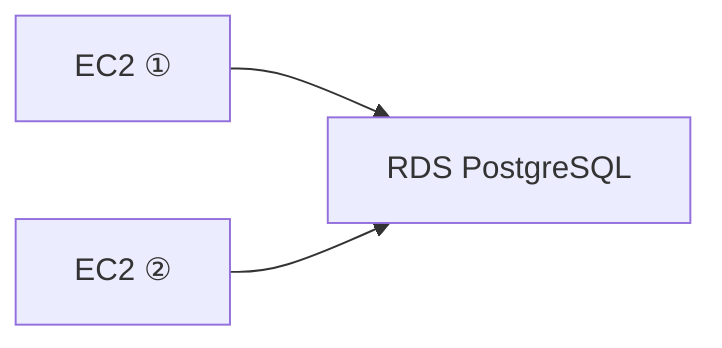
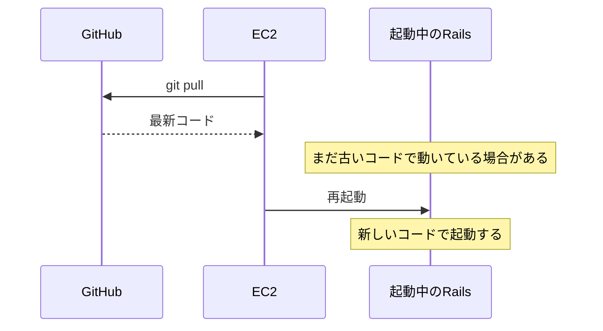

# 第13週：DevOps体験 ── 開発した変更を本番環境へ届ける

## 今日のゴール

第12週では、2台のRailsアプリから同じRDS PostgreSQLを使う構成を作りました。

今回は、その環境へ自分が開発した変更を反映します。

ただRailsアプリを起動するだけではなく、次の流れを何度も繰り返します。

- Codespacesで変更する
- GitHubへpushする
- AWS上のEC2へ反映する
- ALB経由で本番環境の表示を確認する

今日のゴールは、次のことを説明できるようになることです。

- `git push` だけでは、AWS上のEC2は変わらない
- 本番環境へ反映するには、EC2側でも作業が必要になる
- 変更の種類によって、deploy時に必要な作業が変わる
- 2台構成では、2台のEC2へ同じコードを反映する必要がある
- 共通RDSを使う場合、migrationは共通DBに対して実行する
- 手動deployの大変さが、CI/CDを学ぶ理由になる

---

## 1. DevOpsとは

DevOpsは、開発と運用を分けて考えすぎず、作った変更を利用者へ届け続けるための考え方です。

開発では、コードを書いて終わりではありません。

実際のWebアプリでは、次のような流れが必要になります。

Codespacesで画面が動いても、それは開発環境で動いているだけです。

利用者が見るAWS上のRailsアプリへ反映しなければ、本番環境は古いままです。

---

## 2. `git push`で変わる場所

`git push` は、手元のcommitをGitHubへ送るコマンドです。

GitHubは更新されます。

しかし、EC2の中にあるRailsアプリのファイルは、自動では更新されません。

EC2側で `git pull` を実行して、GitHub上の最新commitを取り込む必要があります。

この違いを理解していないと、次のような状態になります。

| 場所 | 状態 |
|---|---|
| Codespaces | 新しいコード |
| GitHub | 新しいコード |
| EC2 | 古いコード |
| ALBから見える画面 | 古い画面 |

「GitHubにはpushしたのに本番が変わらない」という現象は、EC2がまだ古いコードを使っているために起きます。

---

## 3. 手動deployで行うこと

deployは、開発した変更を本番環境へ反映する作業です。

今日のPracticeでは、deployを自動化せず、手で行います。

手動deployでは、主に次の作業が必要になります。

毎回すべての作業が必要とは限りません。

画面の文章を少し変えただけなら、DB構造は変わりません。

一方で、テーブルに列を追加した場合は、コードだけでなくデータベースの構造も変える必要があります。

---

## 4. 変更には種類がある

Webアプリの変更は、すべて同じ重さではありません。

### 画面だけの変更

HTMLやERBの表示文言を変える変更です。

データベースの構造は変わりません。

この場合、本番環境では主に次の確認が必要です。

- EC2へ最新コードが反映されているか
- Rails serverを再起動したか
- ALB経由で新しい表示になっているか

### DB構造を変える変更

テーブルに列を追加したり、削除したりする変更です。

Railsでは、このような変更をmigrationで表します。

コードだけを反映しても、DB構造が古いままだとエラーになることがあります。

DB構造を変える変更では、本番環境でもmigrationを実行する必要があります。

### CRUD一式を増やす変更

新しいモデル、controller、view、routeをまとめて追加する変更です。

Railsのscaffoldを使うと、CRUDに必要なファイルが一度に増えます。

便利ですが、変更範囲は広くなります。

本番環境では、コード反映、migration、再起動、画面確認を落ち着いて順番に行う必要があります。

---

## 5. 2台構成で気をつけること

今回のAWS環境には、Railsを動かすEC2が2台あります。

ALBは、2台のEC2へ通信を振り分けます。

そのため、片方のEC2だけを更新すると、利用者には古い画面と新しい画面が混ざって見えることがあります。

この状態では、リロードするたびに表示が変わることがあります。

2台構成では、同じcommitを2台へ反映することが重要です。

---

## 6. migrationは何回実行するのか

2台のEC2は、同じRDSを使います。

コードは2台のEC2にあります。

しかし、データベースは共通です。

そのため、DB構造を変えるmigrationは、同じRDSに対して1回実行すれば十分です。

2台のEC2で同じmigrationを続けて実行すると、2回目は「すでに実行済み」と判断されるか、状況によっては混乱の原因になります。

今日のPracticeでは、migrationが必要な変更では、どちらのEC2でmigrationを実行するかを明確に決めて進めます。

---

## 7. 再起動が必要な理由

EC2で `git pull` をしても、起動中のRails serverがすぐに新しいコードへ切り替わるとは限りません。

production環境では、安定して動かすために、起動時に読み込んだコードをそのまま使い続けることがあります。

そのため、コードを反映したあとはRails serverを再起動します。

再起動後は、必ず `/up` やALB経由の画面で確認します。

---

## 8. 手動deployの大変さ

手動deployでは、人が順番を覚えて操作します。

最初は、この手順を自分で行うことが重要です。

なぜなら、自動化された仕組みの中で何が起きているかを理解するためには、手動の流れを一度体験する必要があるからです。

ただし、手動deployには弱点があります。

- 2台のうち片方だけ更新し忘れる
- migrationを実行し忘れる
- 再起動を忘れる
- 古いcommitのまま確認してしまう
- 誰が、いつ、どの変更を反映したか分かりにくい

このような問題を減らすために、実務ではCI/CDを使います。

CI/CDは、テスト、ビルド、deployなどを自動化し、同じ手順で安全に変更を届けるための仕組みです。

今日のPracticeは、CI/CDを使う前に、その中で自動化される作業を手で体験する回です。

---

## 今回のまとめ

- DevOpsは、開発した変更を本番環境へ届け続けるための考え方
- `git push` はGitHubを更新するだけで、EC2は自動では変わらない
- 本番反映では、EC2で `git pull`、必要ならmigration、Rails再起動、確認を行う
- DB構造を変える変更では、本番DBにもmigrationが必要
- 2台構成では、コードは2台へ反映し、migrationは共通RDSに対して1回実行する
- 手動deployの大変さを知ることで、CI/CDの必要性が理解しやすくなる
