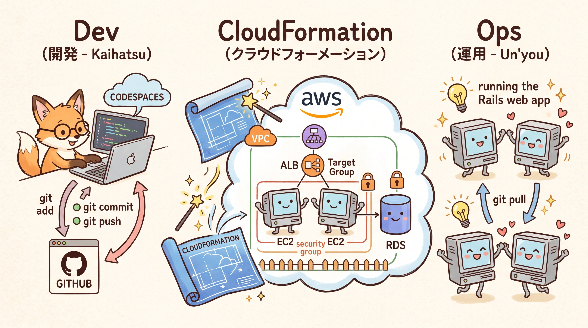
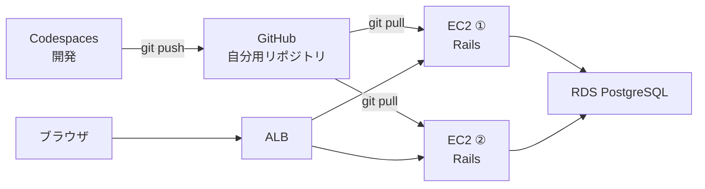
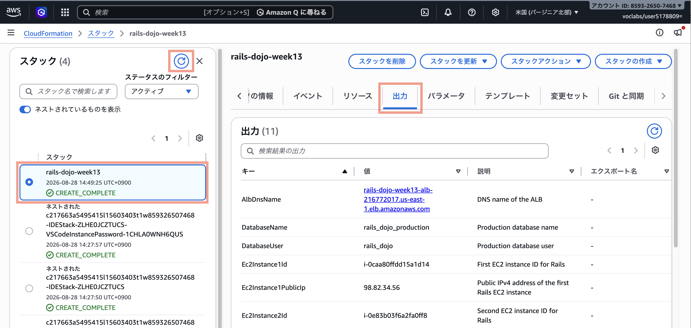
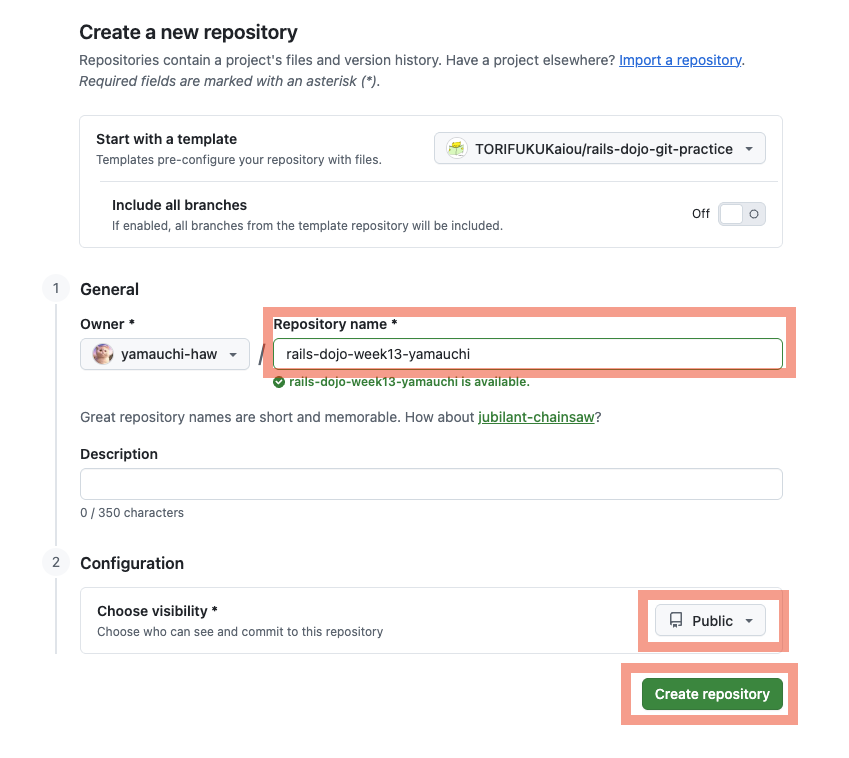
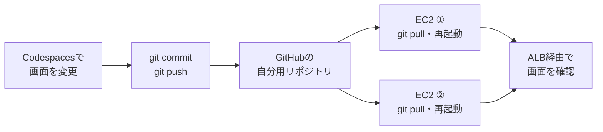

# 第13週：練習 ── 手動deployを3周体験する



この練習では、自分のGitHubリポジトリでCodeShelfを変更し、AWS上の2台のEC2へ手動でdeployします。

先に、[第13週の説明](orientation.md)を読んでください。

## この練習で行うこと

- CloudFormationでVPC、EC2 2台、ALB、RDS PostgreSQLを作成する
- GitHubで自分用のCodeShelfリポジトリを作成する
- 変更前のCodeShelfをAWS上で動かす
- 1周目：画面だけを変更してdeployする
- 2周目：`Article`に`category`を追加し、migrationを含むdeployを行う
- 3周目：`Author` scaffoldを追加し、CRUD追加を含むdeployを行う

完成すると、次の構成で3回deployを行います。



> [!IMPORTANT]
> この練習では、同じdeploy手順を3周します。
> 最初のas-is起動と1周目では、手順の意味と確認結果を丁寧に確認します。
> 2周目・3周目では、1周目で確認した基本のdeploy手順を使い、変更の種類によって何が増えるかを確認してください。

---

## Step 1：AWS Academy Sandboxを起動する

1. AWS Academyへログインします。
2. 対象コースの`サンドボックス ラボ`を開きます。
3. `Start Lab`をクリックします。
4. `Lab status`が`ready`になるまで待ちます。
5. `AWS`をクリックし、AWSマネジメントコンソールを開きます。
6. 画面右上のリージョンを確認します。

使用するリージョンは次です。

```text
米国（バージニア北部）
us-east-1
```

---

## Step 2：CloudFormationテンプレートを開く

次のテンプレートをダウンロードします。

[week13-baseline.yaml](infrastructure/week13-baseline.yaml)

1. 上のリンクを開きます。
2. GitHubでテンプレートの内容が表示されることを確認します。
3. 画面右上のダウンロードボタンをクリックします。

保存したファイル名が次の名前になっていることを確認します。

```text
week13-baseline.yaml
```

このテンプレートは、次のリソースを作成します。

- VPC
- public subnet 2つ
- private subnet 2つ
- EC2 2台
- ALB
- ターゲットグループ
- RDS PostgreSQL
- ALB用、EC2用、RDS用セキュリティグループ

---

## Step 3：CloudFormationスタックを作成する

1. AWSマネジメントコンソールで`CloudFormation`を開きます。
2. `スタックの作成`から`新しいリソースを使用`を選びます。
3. `テンプレートファイルのアップロード`を選びます。
4. `week13-baseline.yaml`を指定します。
5. `次へ`をクリックします。

スタック名は次にします。

```text
rails-dojo-week13
```

パラメータは変更しません。

最後の確認画面まで進み、`送信`または`スタックの作成`をクリックします。

---

## Step 4：スタックの作成完了と出力を確認する

スタックの状態が次になるまで待ちます。

```text
CREATE_COMPLETE
```

`出力`タブを開き、次の値をメモ帳などへ控えます。

| 出力キー | 使う場所 |
|---|---|
| `Ec2Instance1Id` | EC2 ①へ接続するとき |
| `Ec2Instance2Id` | EC2 ②へ接続するとき |
| `AlbDnsName` | ブラウザで本番環境を確認するとき |
| `RdsEndpoint` | RDSコンソールで確認したendpointと照らし合わせるとき |
| `RdsPort` | `DATABASE_URL`のポート番号を確認するとき |
| `DatabaseName` | `DATABASE_URL`のデータベース名を確認するとき |
| `DatabaseUser` | `DATABASE_URL`のユーザー名を確認するとき |

> [!IMPORTANT]
> CloudFormationの出力は、後の手順でRDSコンソールから確認するendpointと照らし合わせるために控えます。
> endpointの正本は、RDSコンソールの対象データベースに表示される値です。

<!-- スクリーンショット差し込み予定：CloudFormationの「出力」タブで、Ec2Instance1Id、Ec2Instance2Id、AlbDnsName、RdsEndpoint、DatabaseName、DatabaseUserを確認する画面 -->


> [!NOTE]
> この時点ではRails serverが起動していないため、ターゲットグループの2台は`Unhealthy`になります。
> これは想定どおりです。

---

## Step 5：GitHubで自分用リポジトリを作る

ブラウザで次のリポジトリを開きます。

[TORIFUKUKaiou/rails-dojo-git-practice](https://github.com/TORIFUKUKaiou/rails-dojo-git-practice)

`Use this template` > `Create a new repository`から、自分用リポジトリを作成します。

リポジトリ名は次のようにします。

```text
rails-dojo-week13-自分の名前
```

例：

```text
rails-dojo-week13-yamada
```

`Public`を選びます。

---



---

作成できたら、自分用リポジトリのURLを確認します。

```text
https://github.com/自分のユーザー名/rails-dojo-week13-自分の名前
```

> [!IMPORTANT]
> ここから先は、必ず自分用リポジトリで作業します。
> `TORIFUKUKaiou/rails-dojo-git-practice`を直接編集しないでください。

---

## Step 6：Codespacesでas-isを確認する

自分用リポジトリで、`Code` → `Codespaces` → `Create codespace on main`をクリックします。

VS Codeの画面が開き、ターミナルの準備が終わるまで待ちます。（3分〜5分程度）

作業場所を確認します。

```bash
pwd
```

次のように表示されれば、Railsアプリの場所にいます。

```text
/home/vscode/app
```

データベースを準備します。

```bash
bin/rails db:prepare
```

Rails serverを起動します。

```bash
bin/rails server
```

ポート`3000`をブラウザで開き、`CodeShelf`が表示されることを確認します。

> [!IMPORTANT]
> Rails serverを起動したターミナルは、そのまま動かしておきます。
> GitコマンドやRails generateを実行するときは、新しいターミナルを開いてください。

---

## Step 7：EC2 ①へ接続する

AWSマネジメントコンソールでEC2を開きます。

`rails-dojo-week13-1`を選び、`接続`からSession Managerで接続します。

`ubuntu`ユーザーへ切り替えます。

```bash
sudo su - ubuntu
```

現在のユーザーと場所を確認します。

```bash
whoami
```

```bash
pwd
```

次のように表示されれば成功です。

```text
ubuntu
/home/ubuntu
```

User Dataの完了を確認します。

```bash
sudo cloud-init status --wait
```

次の表示になれば完了です。

```text
status: done
```

設定を読み込みます。

```bash
source ~/.bashrc
```

---

## Step 8：EC2 ①へ自分用リポジトリをcloneする

EC2 ①のターミナルで実行します。

`自分のリポジトリURL`は、Step 5で作成した自分用リポジトリのURLへ置き換えます。

```bash
git clone 自分のリポジトリURL
```

例: `git clone https://github.com/yamauchi-haw/rails-dojo-week13-yamauchi.git`

cloneしたディレクトリへ移動します。

```bash
cd rails-dojo-week13-自分の名前
```

Gemをインストールします。

```bash
bundle install
```

エラーが出ず、プロンプトへ戻れば成功です。

---

## Step 9：RDSコンソールでendpointを確認し、EC2 ①から接続する

このStepでは、RDSコンソールで接続先を確認してから、EC2 ①からRDSへ直接接続します。

ここで接続できれば、RDSの接続先・ユーザー名・パスワード・ネットワーク設定は正しい状態です。
この確認が成功してから、次のStepでRails用の`DATABASE_URL`を作ります。

### RDSコンソールでendpointを確認する

1. AWSマネジメントコンソールで`RDS`を開きます。
2. 左側のメニューから`データベース`を開きます。
3. 次のデータベースをクリックします。

```text
rails-dojo-week13-db
```

4. ステータスが次になっていることを確認します。

```text
利用可能（Available）
```

5. `接続とセキュリティ`を開き、`エンドポイント`と`ポート`を確認します。

ポートは次になっていることを確認します。

```text
5432
```

`エンドポイント`の値だけをコピーします。画面にポート番号も表示されている場合は、endpointの名前だけをコピーし、`:5432`はコピーしません。

> [!IMPORTANT]
> コピーしたendpointが、Step 4で控えた`RdsEndpoint`と完全に同じであることを確認します。
> `http://`や`https://`は付けません。

<!-- スクリーンショット差し込み予定：RDSコンソールのrails-dojo-week13-dbで、ステータスが利用可能（Available）、接続とセキュリティにendpointとポート5432が表示される画面 -->

### EC2 ①からRDSへ直接接続する

`RDSのendpoint`を、RDSコンソールでコピーした値へ置き換えます。

```bash
psql -h <RDSのendpoint> -U rails_dojo -d rails_dojo_production
```

例: `psql -h rails-dojo-week13-db.cixstnczuqiy.us-east-1.rds.amazonaws.com -U rails_dojo -d rails_dojo_production`

パスワードを求められたら、次を入力します。入力中の文字は画面に表示されません。

```text
RailsDojo2026Db
```

次のプロンプトが表示されれば、RDSへ接続できています。

```text
rails_dojo_production=>
```

接続先を確認します。

```sql
\conninfo
```

表示された接続先のhostが、RDSコンソールでコピーしたendpointおよびStep 4の`RdsEndpoint`と同じであることを確認します。

<!-- スクリーンショット差し込み予定：psqlでrails_dojo_production=>が表示され、\conninfoでRDSへの接続先を確認できる画面 -->

psqlを終了します。

```sql
\q
```

---

## Step 10：EC2 ①で環境変数ファイルを作る

Railsアプリのディレクトリにいることを確認します。

```bash
pwd
```

例: `/home/ubuntu/rails-dojo-week13-yamauchi`

### `DATABASE_URL`を組み立てる

`DATABASE_URL`は、Railsへ「どのデータベースへ、どの情報で接続するか」を伝える文字列です。
長い文字列を暗記する必要はありません。次の部品を順番につないでいます。

```text
postgresql://rails_dojo:RailsDojo2026Db@<RDSのendpoint>:5432/rails_dojo_production
```

| 部品 | 意味 | 自分で変更するか |
|---|---|---|
| `postgresql://` | PostgreSQLを使う印 | 変更しない |
| `rails_dojo` | データベースのユーザー名 | 変更しない |
| `RailsDojo2026Db` | Step 9で入力したパスワード | 変更しない |
| `<RDSのendpoint>` | RDSコンソールの`rails-dojo-week13-db`で確認したendpoint | **ここだけ置き換える** |
| `5432` | PostgreSQLのポート番号 | 変更しない |
| `rails_dojo_production` | データベース名 | 変更しない |

> [!IMPORTANT]
> `<RDSのendpoint>`だけを、RDSコンソールで確認したendpointへ置き換えます。
> Step 4のCloudFormation出力`RdsEndpoint`と同じ値になっていることも確認します。
> 置き換えた後の行には、`<`、`>`、`http://`、`https://`を残しません。

`SECRET_KEY_BASE`を作成します。

```bash
bin/rails secret
```

表示された長い文字列をメモ帳などへコピーします。

> [!WARNING]
> `SECRET_KEY_BASE`は秘密値です。
> GitHub、README、チャットへ貼り付けないでください。

環境変数ファイルを作成します。

```bash
nano ~/rails-dojo-week13.env
```

次の3行を入力します。

`RDSのendpoint`と`コピーしたSECRET_KEY_BASE`は、自分の値へ置き換えます。

```bash
export DATABASE_URL='postgresql://rails_dojo:RailsDojo2026Db@<RDSのendpoint>:5432/rails_dojo_production'
export RAILS_ENV=production
export SECRET_KEY_BASE='コピーしたSECRET_KEY_BASE'
```

保存して閉じます。

- 保存：`Ctrl + O`、Enterキー
- nanoエディタを閉じる：`Ctrl + X`

設定を読み込みます。

```bash
source ~/rails-dojo-week13.env
```

今作成した`DATABASE_URL`を使って、もう一度RDSへ接続します。

```bash
psql "$DATABASE_URL" -c '\conninfo'
```

次のように、`rails_dojo_production`、`rails_dojo`、RDSのhost名を含む表示になれば成功です。

```text
You are connected to database "rails_dojo_production" as user "rails_dojo" on host "..." (port "5432")
```

> [!IMPORTANT]
> この確認でエラーが出た場合は、次のStepへ進みません。
> `nano ~/rails-dojo-week13.env`をもう一度開き、`RDSのendpoint`だけをRDSコンソールとStep 4のCloudFormation出力に照らし合わせて確認します。

<!-- スクリーンショット差し込み予定：psql "$DATABASE_URL" -c '\conninfo' が成功した画面。DATABASE_URLやSECRET_KEY_BASEの文字列そのものは写さない -->

---

## Step 11：EC2 ①でas-isを起動する

EC2 ①のターミナルで実行します。

> [!IMPORTANT]
> Step 10の`psql "$DATABASE_URL" -c '\conninfo'`が成功していることを確認してから実行します。

```bash
bin/rails db:prepare
```

エラーが出ず、何も表示されずにプロンプトへ戻れば成功です。

> [!IMPORTANT]
> エラーが出た場合は、アセットの準備へ進まず、教員へ画面を見せてください。
> まずはStep 10の接続確認をもう一度実行します。

production用のアセットを準備します。

```bash
SECRET_KEY_BASE_DUMMY=1 RAILS_ENV=production bin/rails assets:precompile
```

Rails serverを起動します。

```bash
bin/rails server -b 0.0.0.0 -p 3000 -d
```

起動を確認します。

```bash
curl http://localhost:3000/up
```

HTMLが表示されれば、EC2 ①のRails serverは起動しています。

`<!DOCTYPE html><html><body style="background-color: green"></body></html>`

<!-- スクリーンショット差し込み予定：EC2 ①でcurl http://localhost:3000/up を実行し、緑色のHTMLが返る画面 -->

---

## Step 12：EC2 ②でもas-isを起動する

AWSマネジメントコンソールでEC2を開きます。

`rails-dojo-week13-2`を選び、Session Managerで接続します。

`ubuntu`ユーザーへ切り替えます。

```bash
sudo su - ubuntu
```

設定を読み込みます。

```bash
source ~/.bashrc
```

User Dataの完了を確認します。

```bash
sudo cloud-init status --wait
```

次の表示になれば完了です。

```text
status: done
```

自分用リポジトリをcloneします。

```bash
git clone 自分のリポジトリURL
```

例: `git clone https://github.com/yamauchi-haw/rails-dojo-week13-yamauchi.git`

cloneしたディレクトリへ移動します。

```bash
cd rails-dojo-week13-自分の名前
```

Gemをインストールします。

```bash
bundle install
```

EC2 ①と同じ内容で環境変数ファイルを作成します。

EC2 ①とEC2 ②は別のコンピューターです。EC2 ①で作ったファイルはEC2 ②にはありません。
Step 10を開き、同じ3行をEC2 ②にも入力します。`DATABASE_URL`、`RAILS_ENV`、`SECRET_KEY_BASE`はEC2 ①と**まったく同じ値**です。

```bash
nano ~/rails-dojo-week13.env
```

保存して閉じます。

操作は、次のように行います。

- 保存：`Ctrl + O`、Enterキー
- nanoエディタを閉じる：`Ctrl + X`

設定を読み込みます。

```bash
source ~/rails-dojo-week13.env
```

EC2 ②でも、今作成した`DATABASE_URL`でRDSへ接続できることを確認します。

```bash
psql "$DATABASE_URL" -c '\conninfo'
```

エラーが出た場合は、Step 10の表を見ながら環境変数ファイルを確認します。

EC2 ②では、`bin/rails db:prepare`は実行しません。

EC2 ①で同じRDSに対して実行済みだからです。

アセットを準備します。

```bash
SECRET_KEY_BASE_DUMMY=1 RAILS_ENV=production bin/rails assets:precompile
```

Rails serverを起動します。

```bash
bin/rails server -b 0.0.0.0 -p 3000 -d
```

起動を確認します。

```bash
curl http://localhost:3000/up
```

HTMLが表示されれば、EC2 ②のRails serverも起動しています。

`<!DOCTYPE html><html><body style="background-color: green"></body></html>`

---

## Step 13：ALBでas-isを確認する

CloudFormationの出力`AlbDnsName`を使い、ブラウザで次を開きます。

```text
http://ALBのDNS名
```

`CodeShelf`が表示されれば成功です。

ターゲットグループも確認します。

1. EC2の左メニューから`ターゲットグループ`を開きます。
2. `rails-dojo-week13-tg`を開きます。
3. `ターゲット`タブを開きます。

2台とも次の状態になれば成功です。

```text
Healthy
```

<!-- スクリーンショット差し込み予定：ターゲットグループのターゲットタブで、EC2 2台がHealthyと表示される画面 -->

※ 30秒間隔のヘルスチェックに連続5回成功で、`Healthy`となります。 `Unhealthy` の場合は、3分程度待つ必要があります。

---

# 1周目：画面だけを変更してdeployする

1周目では、データベースを変更しません。

<b><font color="red">Codespaces</font></b> で画面を変更し、GitHubへpushし、EC2 2台で `git pull` して反映します。

1周目では、次のdeployの流れを1つずつ確認します。



> [!NOTE]
> 1周目ではデータベースの構造を変更しないため、`bin/rails db:migrate`は実行しません。

## Step 14：【Codespaces】トップ画面の説明を追加する

Codespacesの新しいターミナルで作業します。

Rails serverを起動しているターミナルではなく、別のターミナルを使います。

次のファイルを開きます。

```text
app/views/articles/index.html.erb
```

次の部分を探します。

```erb
<p class="hero-lead">Ruby と Rails の知識を記事にして発信する、技術記事共有スペース。</p>
```

次のように変更します。

```erb
<p class="hero-lead">Ruby と Rails の知識を記事にして発信する、技術記事共有スペース。</p>
<p class="hero-lead">授業で学んだエラー、Git、AWSの気づきを記事として残していきましょう。</p>
```

ブラウザのCodespacesプレビューを再読み込みし、追加した文章が表示されることを確認します。

---

## Step 15：【Codespaces】1周目をcommitしてpushする

変更状態を確認します。

```bash
git status
```

`app/views/articles/index.html.erb`が変更されていることを確認します。

差分を確認します。

```bash
git diff
```

追加した行が`+`付きで表示されることを確認します。

commitに含めます。

```bash
git add app/views/articles/index.html.erb
```

`git add`した直後に、commitへ含める変更がそろっているか確認します。

```bash
git status
```

`Changes to be committed`に`app/views/articles/index.html.erb`が表示され、`Changes not staged for commit`や`Untracked files`が表示されないことを確認します。

commitします。

```bash
git commit -m "トップ画面に授業用の説明を追加"
```

commit後にも、変更が残っていないか確認します。

```bash
git status
```

次のように表示されれば成功です。

```text
nothing to commit, working tree clean
```

GitHubへpushします。

```bash
git push origin main
```

GitHubの自分用リポジトリを開き、commitが増えていることを確認します。

---

## Step 16：【EC2 ①】1周目をdeployする

EC2 ①のターミナルで実行します。

Railsアプリのディレクトリへ移動します。

```bash
cd ~/rails-dojo-week13-自分の名前
```

最新コードを取得します。

```bash
git pull
```

`Updating ...`と表示され、`app/views/articles/index.html.erb`の変更を取得できれば成功です。

> [!IMPORTANT]
> `Already up to date.`と表示され、まだ今回の変更を取得できていない場合は、EC2へ新しい変更が届いていません。
> EC2の再起動へ進まず、Codespacesで`git push origin main`を実行したか、GitHubの自分用リポジトリにcommitがあるかを確認します。

commit hashを確認します。

```bash
git log --oneline -1
```

環境変数を読み込みます。

```bash
source ~/rails-dojo-week13.env
```

Rails serverを停止します。

```bash
ps aux | grep puma
```

実行すると、たとえば次のように表示されます。

```text
ubuntu      5954  0.1  4.0 1276136 157736 ?      Ssl  00:58   0:01 puma 8.0.2 (tcp://0.0.0.0:3000) [rails-dojo-week13-yamauchi]
ubuntu      6192  0.0  0.0   7144  2352 pts/3    S+   01:14   0:00 grep --color=auto puma
```

`puma` と表示されている行の、左から2番目の数字がPIDです。

この例では `5954` です。

```bash
kill -9 5954
```

これでPumaを停止できます。

**注意:** `5954` は毎回同じとは限りません。必ず自分の環境で `ps aux | grep puma` を実行してPIDを確認してください。

停止できたことを確認するには、もう一度実行します。

```bash
ps aux | grep puma
```

`grep --color=auto puma` の行しか表示されなければ、Pumaは停止しています。


Rails serverを起動します。

```bash
bin/rails server -b 0.0.0.0 -p 3000 -d
```

起動を確認します。

```bash
curl http://localhost:3000/up
```

---

## Step 17：【EC2 ②】1周目をdeployする

EC2 ②でも、EC2 ①と同じ作業を行います。

```bash
cd ~/rails-dojo-week13-自分の名前
```

```bash
git pull
```

EC2 ①で確認したcommit hashと同じ新しいcommitを取得できることを確認します。

```bash
git log --oneline -1
```

```bash
source ~/rails-dojo-week13.env
```

Rails serverを停止します。

```bash
ps aux | grep puma
```

実行すると、たとえば次のように表示されます。

```text
ubuntu      5954  0.1  4.0 1276136 157736 ?      Ssl  00:58   0:01 puma 8.0.2 (tcp://0.0.0.0:3000) [rails-dojo-week13-yamauchi]
ubuntu      6192  0.0  0.0   7144  2352 pts/3    S+   01:14   0:00 grep --color=auto puma
```

`puma` と表示されている行の、左から2番目の数字がPIDです。

この例では `5954` です。

```bash
kill -9 5954
```

これでPumaを停止できます。

**注意:** `5954` は毎回同じとは限りません。必ず自分の環境で `ps aux | grep puma` を実行してPIDを確認してください。

停止できたことを確認するには、もう一度実行します。

```bash
ps aux | grep puma
```

`grep --color=auto puma` の行しか表示されなければ、Pumaは停止しています。

```bash
bin/rails server -b 0.0.0.0 -p 3000 -d
```

```bash
curl http://localhost:3000/up
```

EC2 ①とEC2 ②で、`git log --oneline -1`のcommit hashが同じことを確認します。

---

## Step 18：【ブラウザ】1周目の反映をALBで確認する

ALBのURLを開きます。

```text
http://ALBのDNS名
```

トップ画面に、追加した次の文章が表示されることを確認します。

```text
授業で学んだエラー、Git、AWSの気づきを記事として残していきましょう。
```

何度かリロードしても同じ文章が表示されれば、2台とも反映できています。

<!-- スクリーンショット差し込み予定：ALBのURLで、1周目に追加した文章が表示されるCodeShelfの画面 -->

---

# 2周目：Articleにcategoryを追加してdeployする

2周目では、`articles`テーブルに列を追加します。

この周では、deploy時にRDSへmigrationを実行します。

## Step 19：【Codespaces】category列を追加するmigrationを作る

<b><font color="red">Codespaces</font></b> のターミナルで実行します。

```bash
bin/rails generate migration AddCategoryToArticles category:string
```

※ もしエラーがでた場合は、ターミナルを新しく立ち上げてください。

migrationファイルが作成されたことを確認します。

```bash
ls db/migrate
```

development環境のDBへmigrationを実行します。

```bash
bin/rails db:migrate
```

エラーが出ず、プロンプトへ戻れば成功です。

---

## Step 20：【Codespaces】strong parametersへcategoryを追加する

次のファイルを開きます。

```text
app/controllers/articles_controller.rb
```

`article_params`を探します。

変更前：

```ruby
params.expect(article: [ :title, :body ])
```

変更後：

```ruby
params.expect(article: [ :title, :body, :category ])
```

保存します。  

※ Codespacesの設定で自動で保存されるようになっています。

---

## Step 21：【Codespaces】記事フォームへcategoryを追加する

次のファイルを開きます。

```text
app/views/articles/_form.html.erb
```

`title`の入力欄と`body`の入力欄の間に、次を追加します。

```erb
<div class="field">
  <%= form.label :category, "カテゴリ" %>
  <%= form.text_field :category, placeholder: "Rails / Git / AWS など" %>
</div>
```

保存します。

---

## Step 22：【Codespaces】記事一覧と詳細にcategoryを表示する

次のファイルを開きます。

```text
app/views/articles/_article.html.erb
```

タイトルや本文を表示している場所の近くに、次を追加します。

```erb
<% if article.category.present? %>
  <p class="article-category">カテゴリ：<%= article.category %></p>
<% end %>
```

次のファイルも開きます。

```text
app/views/articles/show.html.erb
```

詳細画面の`detail-meta`の中に、次を追加します。

```erb
<% if @article.category.present? %>
  <span>カテゴリ：<%= @article.category %></span>
<% end %>
```

保存します。

---

## Step 23：【Codespaces】カテゴリ付き記事を作成して確認する

Codespacesのブラウザプレビューで記事作成画面を開きます。

次の記事を作成します。

```text
タイトル：migrationを含むdeploy
カテゴリ：AWS
本文：本番環境でもdb:migrateが必要になることを確認しました。
```

記事一覧または詳細画面に、カテゴリ`AWS`が表示されることを確認します。

※ 失敗する場合は、 <b><font color="red">Codespaces</font></b> 上のRailsを再起動してください。(`Ctrl + C` で停めて、 `bin/rails server` です。)

---

## Step 24：【Codespaces】2周目をcommitしてpushする

変更状態を確認します。

```bash
git status
```

差分を確認します。

```bash
git diff
```

migration、controller、viewの変更が含まれていることを確認します。

変更をcommitに含めます。

```bash
git add db/migrate app/controllers/articles_controller.rb app/views/articles/_form.html.erb app/views/articles/_article.html.erb app/views/articles/show.html.erb db/schema.rb
```

`git add`した直後に、commitへ含める変更がそろっているか確認します。

```bash
git status
```

`Changes to be committed`にmigration、controller、view、`db/schema.rb`が表示され、`Changes not staged for commit`や`Untracked files`が表示されないことを確認します。

commitします。

```bash
git commit -m "記事にカテゴリを追加"
```

commit後にも、変更が残っていないか確認します。

```bash
git status
```

次のように表示されれば成功です。

```text
nothing to commit, working tree clean
```

GitHubへpushします。

```bash
git push origin main
```

---

## Step 25：【EC2 ①】2周目をdeployし、RDSへmigrationする

EC2 ①のターミナルで実行します。基本のdeploy手順は1周目のStep 16と同じです。

Railsアプリのディレクトリへ移動します。

```bash
cd ~/rails-dojo-week13-自分の名前
```

最新コードを取得します。

```bash
git pull
```

環境変数を読み込みます。

```bash
source ~/rails-dojo-week13.env
```

RDSへmigrationを実行します。

```bash
bin/rails db:migrate
```

エラーが出ず、プロンプトへ戻れば成功です。

> [!IMPORTANT]
> RDSはEC2 ①とEC2 ②で共通です。migrationはこのEC2 ①で**1回だけ**実行します。

1周目のStep 16と同じように、Pumaを停止してからRails serverを再起動します。

```bash
curl http://localhost:3000/up
```

---

## Step 26：【EC2 ②】2周目をdeployする

EC2 ②のターミナルで実行します。基本のdeploy手順は1周目のStep 17と同じです。

Railsアプリのディレクトリへ移動します。

```bash
cd ~/rails-dojo-week13-自分の名前
```

```bash
git pull
```

```bash
source ~/rails-dojo-week13.env
```

EC2 ②では、`bin/rails db:migrate`を実行しません。

RDSはEC2 ①と共通で、Step 25でmigration済みだからです。

1周目のStep 17と同じように、Pumaを停止してからRails serverを再起動します。

```bash
curl http://localhost:3000/up
```

EC2 ①とEC2 ②で、commit hashが同じことを確認します。

```bash
git log --oneline -1
```

---

## Step 27：【ブラウザ】カテゴリ付き記事をALBで確認する

ALBのURLを開きます。

```text
http://ALBのDNS名
```

記事作成画面から、次の記事を作成します。

```text
タイトル：本番DBへmigrationしました
カテゴリ：RDS
本文：EC2 ①でdb:migrateを実行し、EC2 ②からも同じ記事を表示できます。
```

記事一覧または詳細画面に、カテゴリ`RDS`が表示されることを確認します。

ALBのURLを何度かリロードします。

カテゴリが毎回表示されれば、2台とも新しいコードで動いています。

---

## Step 28：【EC2 ①】RDSにcategory列があることを確認する

EC2 ①のターミナルで実行します。

```bash
bin/rails runner 'puts Article.column_names'
```

表示の中に次が含まれていれば成功です。

```text
category
```

---

# 3周目：Author scaffoldを追加してdeployする

3周目では、記事を書いた人のプロフィールを管理するCRUDを追加します。

この周では、scaffoldによってmodel、controller、view、route、migrationがまとめて追加されます。

## Step 29：【Codespaces】Author scaffoldを作る

<b><font color="red">Codespaces</font></b> のターミナルで実行します。

```bash
bin/rails generate scaffold Author name:string role:string bio:text
```

development環境のDBへmigrationを実行します。

```bash
bin/rails db:migrate
```

routesを確認します。

```bash
bin/rails routes | grep authors
```

`authors`に関するrouteが表示されれば成功です。

---

## Step 30：【Codespaces】ナビゲーションにAuthorsリンクを追加する

次のファイルを開きます。

```text
app/views/layouts/application.html.erb
```

ナビゲーション部分を探します。

```erb
<%= link_to "記事を探す", articles_path, class: "nav-link" %>
<%= link_to "記事を書く", new_article_path, class: "button button-primary" %>
```

次のように、Authorsへのリンクを追加します。

```erb
<%= link_to "記事を探す", articles_path, class: "nav-link" %>
<%= link_to "著者を見る", authors_path, class: "nav-link" %>
<%= link_to "記事を書く", new_article_path, class: "button button-primary" %>
```

保存します。

※ Codespacesの設定で自動で保存されるようになっています。

---

## Step 31：【Codespaces】Author CRUDを確認する

Codespacesのブラウザプレビューで次を開きます。

```text
/authors
```

`New author`リンクから、  
Authorを1件作成します。

```text
Name：山田 太郎
Role：Rails学習者
Bio：GitとAWSを使ってCodeShelfを育てています。
```

次を確認します。

- 一覧にAuthorが表示される
- 詳細画面を開ける
- 編集できる
- 削除できる

---

## Step 32：【Codespaces】3周目をcommitしてpushする

変更状態を確認します。

```bash
git status
```

scaffoldで追加されたファイルが多く表示されます。

差分を確認します。

```bash
git diff
```

新規ファイルも含めて確認します。

```bash
git status --short
```

変更をcommitに含めます。

```bash
git add app db config test
```

`git add`した直後に、commitへ含める変更がそろっているか確認します。

```bash
git status
```

scaffoldで追加・変更されたファイルが`Changes to be committed`に表示され、`Changes not staged for commit`や`Untracked files`が表示されないことを確認します。

commitします。

```bash
git commit -m "著者プロフィール機能を追加"
```

commit後にも、変更が残っていないか確認します。

```bash
git status
```

次のように表示されれば成功です。

```text
nothing to commit, working tree clean
```

GitHubへpushします。

```bash
git push origin main
```

---

## Step 33：【EC2 ①】3周目をdeployし、RDSへmigrationする

EC2 ①のターミナルで実行します。基本のdeploy手順は1周目のStep 16と同じです。

Railsアプリのディレクトリへ移動します。

```bash
cd ~/rails-dojo-week13-自分の名前
```

```bash
git pull
```

```bash
source ~/rails-dojo-week13.env
```

RDSへmigrationを実行します。

```bash
bin/rails db:migrate
```

エラーが出ず、プロンプトへ戻れば成功です。

> [!IMPORTANT]
> RDSはEC2 ①とEC2 ②で共通です。migrationはこのEC2 ①で**1回だけ**実行します。

1周目のStep 16と同じように、Pumaを停止してからRails serverを再起動します。

```bash
curl http://localhost:3000/up
```

---

## Step 34：【EC2 ②】3周目をdeployする

EC2 ②のターミナルで実行します。基本のdeploy手順は1周目のStep 17と同じです。

Railsアプリのディレクトリへ移動します。

```bash
cd ~/rails-dojo-week13-自分の名前
```

```bash
git pull
```

```bash
source ~/rails-dojo-week13.env
```

EC2 ②では、`bin/rails db:migrate`を実行しません。

RDSはEC2 ①と共通で、Step 33でmigration済みだからです。

1周目のStep 17と同じように、Pumaを停止してからRails serverを再起動します。

```bash
curl http://localhost:3000/up
```

EC2 ①とEC2 ②で、commit hashが同じことを確認します。

```bash
git log --oneline -1
```

---

## Step 35：【ブラウザ】Author CRUDをALBで確認する

ALBのURLを開きます。

```text
http://ALBのDNS名
```

ナビゲーションの`著者を見る`をクリックします。

Authorを1件作成します。

```text
Name：佐藤 花子
Role：AWS担当
Bio：ALBとRDSを使ったdeployを練習しました。
```

次を確認します。

- `/authors`をALB経由で開ける
- Authorを作成できる
- 一覧に表示される
- 詳細を開ける
- 編集できる
- 削除できる

ALBのURLを何度かリロードし、同じAuthorが表示されることを確認します。

---

## Step 36：2台とも同じcommitで動いていることを確認する

EC2 ①で実行します。

```bash
cd ~/rails-dojo-week13-自分の名前
```

```bash
git log --oneline -1
```

EC2 ②でも同じコマンドを実行します。

```bash
cd ~/rails-dojo-week13-自分の名前
```

```bash
git log --oneline -1
```

2台で同じcommit hashが表示されれば成功です。

ターゲットグループも確認します。

```text
rails-dojo-week13-tg
```

2台とも次の状態であることを確認します。

```text
Healthy
```

---

## Step 37：3周の違いを確認する

今回の3周を振り返ります。

| 周 | 変更内容 | 本番DBのmigration | EC2 2台の再起動 |
|---|---|---|---|
| 1周目 | view変更 | 不要 | 必要 |
| 2周目 | `Article`に列追加 | 必要 | 必要 |
| 3周目 | `Author` scaffold追加 | 必要 | 必要 |

同じdeployでも、変更内容によって必要な作業が変わります。

最後に、ALBのURLで次を確認します。

- トップ画面に1周目の説明文が表示される
- 記事にカテゴリを付けられる
- `/authors`で著者プロフィールCRUDを使える

---

## トラブルシューティング

### `git pull`しても本番画面が変わらない

- Rails serverを再起動したか確認します。
- EC2 ①とEC2 ②の両方で`git pull`したか確認します。
- ALBのURLを何度かリロードし、古い表示が混ざっていないか確認します。

### `bin/rails db:migrate`で失敗する

- `source ~/rails-dojo-week13.env`を実行したか確認します。
- `DATABASE_URL`のRDS endpointが正しいか確認します。
- RDSが`Available`になっているか確認します。

### ALBのターゲットが`Unhealthy`になる

対象のEC2で確認します。

```bash
curl http://localhost:3000/up
```

Rails serverが動いていない場合は、環境変数を読み込み、再起動します。

```bash
source ~/rails-dojo-week13.env
```

```bash
bin/rails server -b 0.0.0.0 -p 3000 -d
```

### `kill`でエラーになる

Rails serverがすでに停止している場合があります。

PIDファイルを削除してから起動します。

```bash
rm -f tmp/pids/server.pid
```

```bash
bin/rails server -b 0.0.0.0 -p 3000 -d
```

### 片方のEC2だけ古い画面になる

EC2 ①とEC2 ②でcommit hashを確認します。

```bash
git log --oneline -1
```

違うcommitが表示された場合は、古い方のEC2で`git pull`し、Rails serverを再起動します。

---

Practiceが終わったら、[Stretch](stretch.md)へ進みましょう。
