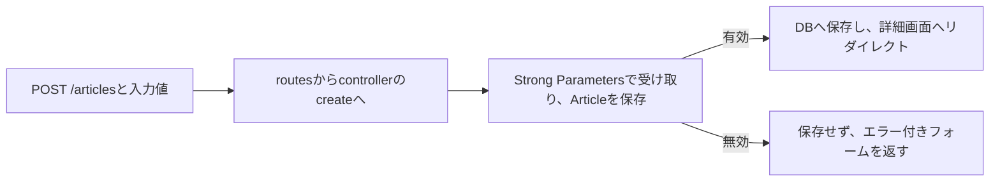

# 第17週：RSpec入門（2）記事の登録処理を確かめる

## 今日のゴール

今回は、**テストの基本を振り返り、記事の登録処理を自動テストで確かめる**練習へ進みます。

- RSpecの書式と成功・失敗の読み方を説明できる
- モデルの入力ルールと、記事の登録処理を分けて確認できる
- 正常な登録で、記事が保存され、詳細画面へ移動することをテストできる
- 無効な入力で、記事が保存されず、入力エラーが返ることをテストできる

> [!NOTE]
> このページは、授業冒頭の説明用です。コード例を読み、何を確認するかを考えます。
> アプリの起動やファイルの変更は、このあとのPracticeの手順で行います。
> 第16週のCodespaceや解答ファイルは必要ありません。

[PDF資料](https://drive.google.com/file/d/1MYlTaS89r1WbrjH8cne6K5LW_HIxuvom/view?usp=drive_link)

---

## 今回使うアプリ

[rails-dojo-rspec-starter](https://github.com/TORIFUKUKaiou/rails-dojo-rspec-starter)から、新しいCodespaceで始めます。Article CRUD・RSpecの設定・タイトルを確認する初期テスト1件が準備されています。最初は、タイトルや本文が空欄でも登録できる状態です。

作業場所は `/home/vscode/rspec_starter` です。このページの `app/models/article.rb` や `spec/requests/articles_spec.rb` は、そのフォルダからの相対パスです。Codespacesのポート3000から開くための設定も、スターターに入っています。

---

## 1. テストとは、期待した動作になっているかを確かめること

記事を登録し、タイトルや本文が表示されるかをブラウザで確かめるのは、人が操作して判断する**手動テスト**です。

**自動テスト**では、確認する条件と期待する結果をコードに書き、コンピューターに判定してもらいます。<ruby>RSpec<rt>アールスペック</rt></ruby>は、そのための道具です。

スターターの `spec/models/article_spec.rb` には、次の1件が入っています。以下はファイル全体です。

```ruby
require "rails_helper"

RSpec.describe Article, type: :model do
  it "指定したタイトルを持つ" do
    article = Article.new(title: "はじめてのRSpec", body: "テストを練習します")

    expect(article.title).to eq("はじめてのRSpec")
  end
end
```

| 部分 | 役割 |
|---|---|
| `require "rails_helper"` | Railsのテスト用設定を読み込む |
| `RSpec.describe Article, type: :model do` | Articleモデルについてのテストをまとめる |
| `it "指定したタイトルを持つ" do` | 確認する内容を1件のテストとして書く |
| `Article.new(...)` | 確認に使う記事を準備する |
| `expect(article.title).to eq(...)` | 実際のタイトルと期待するタイトルを比べる |

`puts` で表示するだけなら、人が正しいかを判断します。RSpecでは期待値も書くので、同じ確認を繰り返し実行し、成功・失敗を判定できます。

アプリのフォルダで、このファイルを指定して実行します。

```bash
bundle exec rspec spec/models/article_spec.rb
```

配布時点の結果は `1 example, 0 failures` です。1件実行し、失敗は0件です。`0 examples` なら、確認したかったテストが実行されていません。ファイル名・保存状態・`it` の有無を確認します。

### 失敗の読み方

> [!IMPORTANT]
> 次は、失敗の表示を説明するために、意図的に期待値を変える例です。
> 記事の仕様を変更する場面ではありません。

確認部分だけを `expect(article.title).to eq("別のタイトル")` に変えると、次のように失敗します。表示の抜粋です。

```text
Failure/Error: expect(article.title).to eq("別のタイトル")

  expected: "別のタイトル"
       got: "はじめてのRSpec"

1 example, 1 failure
```

`Failure/Error` は失敗した確認、`expected` は期待値、`got` は実際の値です。ファイルと行番号も表示されます。

期待する結果の根拠は、**仕様**です。仕様とは「どんな条件で、どう動くべきか」というアプリの約束です。この例では指定したタイトルが正しいので、期待値を元に戻し、再実行して成功を確認します。仕様どおりの期待値なのにアプリが間違った結果を返す場合は、アプリを修正します。

---

## 2. モデルの入力ルールを確認する

今回は、次の入力ルールを使います。

| 項目 | 入力ルール |
|---|---|
| タイトル | 必須。10文字以内 |
| 本文 | 必須 |

入力ルールを調べるRailsの仕組みを、**バリデーション**と呼びます。

対象ファイル：`app/models/article.rb`

この仕様を設定した状態のファイル全体です。スターターにはまだ、この2行の `validates` はありません。

```ruby
class Article < ApplicationRecord
  validates :title, presence: true, length: { maximum: 10 }
  validates :body, presence: true
end
```

`presence: true` は、空文字の `""`、空白だけの文字列、値がない `nil` を認めません。`length: { maximum: 10 }` は、10文字までは認め、11文字以上を無効にします。

| 操作 | 起きること |
|---|---|
| `Article.new(...)` | 記事のオブジェクトを作る。保存も、有効・無効の判定もまだ行わない |
| `article.valid?` | 入力ルールを調べ、有効なら `true`、無効なら `false` を返す。保存はしない |
| `article.save` | 入力ルールを調べ、有効なら保存する。無効なら保存せず `false` を返す |

RSpecでは、次のように判定を確かめます。

| 書き方 | 確認すること |
|---|---|
| `expect(article).to be_valid` | `article.valid?` の結果が `true` である |
| `expect(article).not_to be_valid` | `article.valid?` の結果が `false` である |

たとえば、タイトルだけが空欄の条件を確認する `it` は、次の形です。`spec/models/article_spec.rb` の外側の `RSpec.describe ... do` と最後の `end` の間に置く例です。

```ruby
it "タイトルが空欄の記事は無効である" do
  article = Article.new(title: "", body: "本文は入力されています")

  expect(article).not_to be_valid
end
```

本文を入力するのは、タイトルのルールだけを調べるためです。両方を空欄にすると、本文のルールだけで無効になり、タイトルのルールの不具合を見逃す場合があります。

**モデルが有効と判定されても、登録リクエストを送って記事が保存されるかまでは確認できていません。** ここから、登録処理のテストへ進みます。

---

## 3. request specで、リクエストから結果までを確認する

ブラウザで登録ボタンを押すと、入力した値がRailsへ送られます。前期に学んだroutes・controller・modelがつながって動きます。



**request spec（リクエストスペック）**では、テストからRailsへリクエストを送り、保存されたデータや返ってきた応答を確認します。モデルを直接作って判定するテストより、確認する処理が広がります。

| ブラウザでの操作 | request specで対応する処理 |
|---|---|
| 記事一覧を開く | `get articles_path` |
| 新規登録フォームを開く | `get new_article_path` |
| 入力して登録ボタンを押す | `post articles_path, params: ...` |

`articles_path` は `/articles`、`new_article_path` は `/articles/new` を表すRailsのメソッドです。`get` はページを取得するリクエスト、`post` は今回は記事を登録するリクエストを送ります。

request specは**ブラウザを起動したりボタンをクリックしたりするテストではありません**。HTMLの応答は確認できますが、JavaScriptの動作や画面の見た目は確認できません。

---

## 4. 正常な登録をテストする

対象ファイル：`spec/requests/articles_spec.rb`（Practiceで新しく作るファイル）

以下は、一覧表示と正常な登録を確認する場合のファイル全体です。**第2節のバリデーションを設定した状態**を使います。

```ruby
require "rails_helper"

RSpec.describe "記事の登録", type: :request do
  it "記事一覧を取得できる" do
    get articles_path

    expect(response).to have_http_status(200)
    expect(response.body).to include("Articles")
  end

  context "タイトルと本文が入力されている場合" do
    it "記事を保存し、詳細画面へリダイレクトする" do
      count_before = Article.count

      post articles_path, params: {
        article: { title: "Railsの練習", body: "登録処理をテストします" }
      }

      expect(Article.count).to eq(count_before + 1)
      article = Article.last
      expect(article.title).to eq("Railsの練習")
      expect(article.body).to eq("登録処理をテストします")
      expect(response).to have_http_status(302)
      expect(response).to redirect_to(article_path(article))
    end
  end
end
```

`type: :request` は、リクエストを送るテストであることを示します。テストの基本の `describe`・`it`・`expect` は同じです。

`context` は「どんな条件の場合か」でテストをまとめます。`it` は、その条件で「どうなるか」を書きます。各 `it` の中に準備と確認を明示し、別のテストの実行結果には依存させません。

### 登録のテストを順に読む

| 部分 | 確認のためにしていること |
|---|---|
| `count_before = Article.count` | 登録前の記事数を記録する |
| `post articles_path, params: ...` | `/articles` へタイトルと本文を送る |
| `expect(Article.count).to eq(count_before + 1)` | 登録後に記事が1件増えたか確認する |
| `article = Article.last` | このテストで登録した記事を取り出す |
| タイトルと本文の `eq` | 入力した内容がDBに保存されたか確認する |
| `have_http_status(302)` | 移動先を知らせる応答が返ったか確認する |
| `redirect_to(article_path(article))` | 保存した記事の詳細画面が移動先になっているか確認する |

`params` は送る入力値です。外側の `article:` の中に `title:` と `body:` を入れる形は、記事フォームから送られる値に合わせています。controllerはStrong Parametersで、この中の許可された項目を受け取ります。

`response` は、リクエストに対してRailsが返した応答です。`response.body` はその本文で、この例ではHTMLです。`include` は指定した文字列を含むかを確認します。200は正常な応答、302はリダイレクトの応答を表します。

この2件だけのrequest specを実行するコマンドです。

```bash
bundle exec rspec spec/requests/articles_spec.rb
```

結果は `2 examples, 0 failures` です。一つの `it` に複数の `expect` があっても、テスト件数は1件です。

---

## 5. 無効な入力で、保存されないことも確認する

同じ `spec/requests/articles_spec.rb` の、外側の `RSpec.describe ... do` と最後の `end` の間に、次の `context` を追加する例です。既存の `it` の中には入れません。

```ruby
context "タイトルが空欄の場合" do
  it "記事を保存せず、エラー付きフォームを返す" do
    count_before = Article.count

    post articles_path, params: {
      article: { title: "", body: "本文は入力されています" }
    }

    expect(Article.count).to eq(count_before)
    expect(response).to have_http_status(422)
    expect(response.body).to include("New article")
    expect(response.body).to include("prohibited this article from being saved")
  end
end
```

422は、この例では入力がルールに合わず、登録を受け付けられなかったことを表します。`New article` は入力フォームの見出し、`prohibited this article from being saved` はスターターのフォームにある入力エラーの見出しの一部です。

正常な登録との違いを読みます。

| 確認すること | 正常な入力 | タイトルが空欄 |
|---|---|---|
| 記事数 | 1件増える | 変わらない |
| 応答 | 302。詳細画面へリダイレクト | 422。エラー付きフォームを返す |

この1件を追加すると、request specは `3 examples, 0 failures` です。**応答だけでなく、保存の有無も確認する**ことが大切です。

---

## 6. テストが不具合を見つける範囲を考える

モデルのテストが成功していても、controllerが本文を受け取らなければ、登録は失敗します。

> [!IMPORTANT]
> 次は、Strong Parametersに意図的に不具合を入れる例です。
> Practiceでは失敗を確認したあと、変更前へ戻し、成功するまで再実行します。

対象ファイル：`app/controllers/articles_controller.rb` の `article_params` メソッド内の1行

変更前：

```ruby
params.expect(article: [ :title, :body ])
```

変更後：

```ruby
params.expect(article: [ :title ])
```

本文が受け取られず、本文の必須ルールによって保存できなくなります。モデルを直接 `Article.new(title: ..., body: ...)` で作るテストは、この受け取り方の不具合を調べていません。正常な登録のrequest specでは、記事数が増えないことで不具合を検出できます。

失敗したら、仕様と入力値を確認し、routes・controller・modelのどこで期待した結果にならなくなったかを調べます。成功させるためだけに、期待値を「記事数は変わらない」に変えてはいけません。

### 境界と仕様変更も、登録処理で確かめる

10文字以内という仕様では、9文字・10文字のタイトルは登録でき、11文字は登録できないことを確認します。`"あ" * 10` は「あ」を10回並べた文字列で、この例では10文字です。

上限が20文字へ変わるなら、11文字も有効になります。モデルと関連するテストを新しい仕様に合わせ、新しい境界の19文字・20文字・21文字を確認します。変わらない必須入力のテストも残して再実行します。

**不具合の修正では仕様を保ち、仕様変更では新しい約束に合わせる**、という違いを意識してください。

---

## 7. ブラウザ・モデルテスト・request specを使い分ける

| 確認方法 | 今回確認すること |
|---|---|
| モデルテスト | 入力ルールによる有効・無効の判定 |
| request spec | リクエストを送った結果のDBへの保存・ステータス・移動先・返されるHTML |
| 手動のブラウザ操作 | 実際の入力・登録・更新・削除、画面の表示や操作 |

**モデルテストもrequest specも、Railsサーバーの起動は不要です。** ブラウザでの確認では、次のコマンドを使います。

```bash
cd /home/vscode/rspec_starter
bin/rails server -b 0.0.0.0
```

サーバー用ターミナルは起動したままにして、VS Codeの **Ports** タブからポート3000をブラウザで開きます。RSpecは**別のターミナル**で実行します。新しいターミナルでは、最初に `cd /home/vscode/rspec_starter` を実行してください。画面確認が終わり、サーバーを止めるときは、サーバー用ターミナルで **Ctrl+C** を押します。

ブラウザで登録した記事は開発用DBに入り、テストではテスト用DBを使います。今回のRSpec設定では各テストのDB変更は終了時に戻されます。別の `it` で作った記事や、ブラウザで登録した記事があることを前提にしません。

変更後は、対象ファイルを実行したあと、全件を確認します。

```bash
bundle exec rspec spec/models/article_spec.rb
bundle exec rspec spec/requests/articles_spec.rb
bundle exec rspec
```

失敗が0件であることに加え、必要なテストが実行されているか、件数を確認します。初期のモデルテスト1件と、第4〜5節のrequest spec3件だけなら、全件実行は `4 examples, 0 failures` です。入力ルールのモデルテストを追加すれば、その分だけ件数が増えます。

## Practiceで手を動かそう

Practiceでは、新しいCodespaceで基本を復習し、入力ルールを追加したあと、記事の登録処理を確かめます。正常な登録と無効な入力をブラウザとテストで見比べ、不具合修正や仕様変更のあとも再確認します。

Practiceを終えたら、Stretchで更新・削除などのテストへ進みます。

---

参考：[Rails 8.0のバリデーション](https://guides.rubyonrails.org/v8.0/active_record_validations.html)・[RSpec Railsのrequest spec](https://rspec.info/features/8-0/rspec-rails/request-specs/request-spec/)
